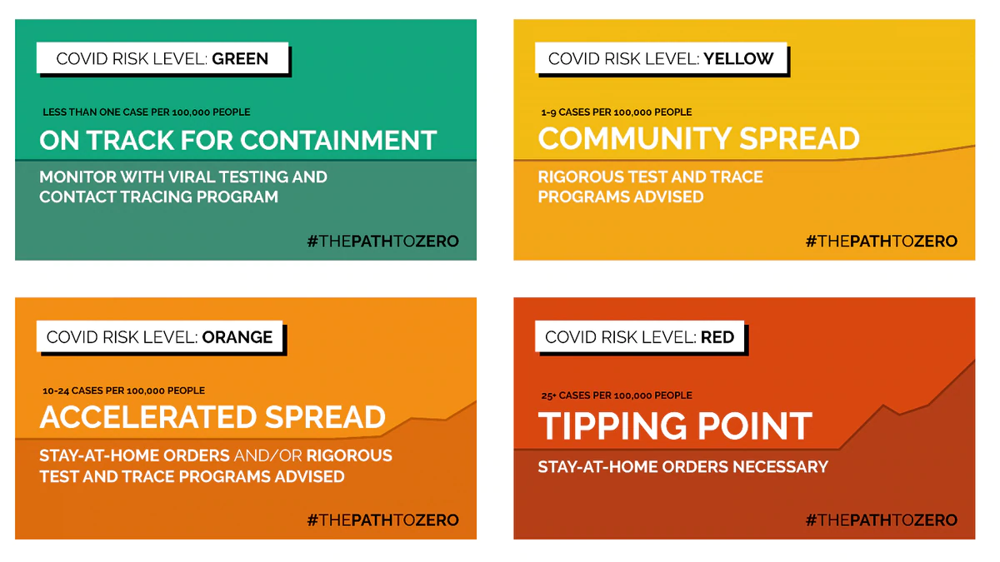

# Introduction


<br>

This code collates data via the [NY Times COVID-19](https://www.nytimes.com/interactive/2020/us/coronavirus-us-cases.html) tracking project by relevant counties.  Results are updated every day at 4:00 PM EST.

Use the table of contents on the left to navigate to your state.  Then, click the appropriate tab to select your county.

Risk assessments for each county are set according to [Harvard Global Health Institute](https://globalepidemics.org/wp-content/uploads/2020/06/key_metrics_and_indicators_v4.pdf) parameters.  For reference and comparison, you can view their tool at https://globalepidemics.org/key-metrics-for-covid-suppression/.

<center>

</center>

<br>

***


```r
library(readr)
library(tidyverse)
library(usmap)
library(viridis)
library(scales)
library(sf)
library(plotly)
library(patchwork)
library(kableExtra)

#Get past and today's COVID data
todayDataURL = 'https://raw.githubusercontent.com/nytimes/covid-19-data/master/live/us-counties.csv'
today_covid_data = read_csv(url(todayDataURL))
pastDataURL = 'https://raw.githubusercontent.com/nytimes/covid-19-data/master/us-counties.csv'
past_covid_data = read_csv(url(pastDataURL))

cum_covid_data = rbind(past_covid_data, select(today_covid_data, c("date", "county", "state", "fips", "cases", "deaths")))
cum_covid_data = cum_covid_data[with(cum_covid_data, order(date, state, county)),]
# cum_covid_data = cum_covid_data %>%
#   filter(date > as.Date("2020-04-30"))

# NYT data lumps NYC boroughs together, so need to manually create those counties to plot.  For simplicity's sake, I'm just assigning the total NY count to all boroughs
NYCdata = cum_covid_data %>%
  filter(county == "New York City")

Manhattan = NYCdata
Manhattan$fips = 36061
Manhattan$county = "Manhattan"

Bronx = NYCdata
Bronx$fips = 36005
Bronx$county = "Bronx"

Queens = NYCdata
Queens$fips = 36081
Queens$county = "Queens"

Brooklyn = NYCdata
Brooklyn$fips = 36047
Brooklyn$county = "Brooklyn"

Staten_Island = NYCdata
Staten_Island$fips = 36085
Staten_Island$county = "Staten Island"

cum_covid_data = rbind(cum_covid_data, Manhattan, Bronx, Queens, Brooklyn, Staten_Island)

cum_covid_data = cum_covid_data[with(cum_covid_data, order(date, state, county)),]

#Get dates
today_date = cum_covid_data$date[nrow(cum_covid_data)]-1 #CHECK THIS!! yes, it appears that current data lags behind a day
today_date_MDY = format(today_date, format="%B %d %Y")

yesterday_date = cum_covid_data$date[nrow(cum_covid_data)]-7#-2 #CHECK THIS!!
yesterday_date_MDY = format(yesterday_date, format="%B %d %Y")

#Compute today's new cases
yesterday_covid_data = filter(cum_covid_data, date == today_date-7)#-2)
today_covid_data2 = filter(cum_covid_data, date == today_date-1) #today's data with modified NYC data
#today (6/22/2020), the NYC data for today and yesterday are the same....sooo check that.  As of right now I'm using -2 and -1 days 

#Merge Dataframes
new_case_data = merge(yesterday_covid_data, today_covid_data2, by = "fips")
data(countypop) # Using 2015 census estimates provided by usmap package.  It's just easier.
new_case_data = merge(new_case_data, countypop, by = "fips")
new_case_data = new_case_data %>%
  mutate(new_cases = ((cases.y - cases.x)/7)/pop_2015*100000) #Taking 7 day average here)
```


# **Full US Map**

```r
# Create USA MAP: TOTAL CASES
states <- plot_usmap("states", color = "black", fill = alpha(0.01), size = 1)

counties_total <- plot_usmap(data = today_covid_data2, values = "cases", color = "black", size = 0.5)

USA_map_total = ggplot() +
  counties_total$layers[[1]] + #counties needs to be on top of states for this to work
  states$layers[[1]] +
  counties_total$theme + 
  coord_equal()+
  scale_fill_viridis(limits = c(0, 3000), oob = squish, breaks = c(0, 1000, 2000, 3000), labels = c("0", "1000", "2000", ">3000"))+
  labs(fill = "Total cases")+
  theme(legend.position = "right",
        plot.title = element_text(hjust = 0.5, size = 14))+
  ggtitle(paste('Total Cases:', today_date_MDY))


# Create USA MAP: NEW CASES
counties_new <- plot_usmap(data = new_case_data, values = "new_cases", color = "black", size = 0.5)

USA_map_new = ggplot() +
  counties_new$layers[[1]] + #counties needs to be on top of states for this to work
  states$layers[[1]] +
  counties_new$theme + 
  coord_equal()+
  scale_fill_viridis(limits = c(0, 25), oob = squish, breaks = c(0, 5, 10, 15, 20, 25), labels = c("0", "5", "10", "15", "20",  ">25"))+
  labs(fill = "New cases (per 100k)")+
  theme(legend.position = "right",
        plot.title = element_text(hjust = 0.5, size = 14))+
  ggtitle(paste('New Cases per 100,000 residents: ', yesterday_date_MDY, "-", today_date_MDY, sep = ""))


USA_map_total
```


```r
USA_map_new
```


<br>

***

# **Massachusetts** {.tabset .tabset-fade .tabset-pills}

```r
MA_map = plot.state("MA")
MA_map
```


<br>

## Essex County

```r
MA_Essex = info.county("Massachusetts", "Essex", 25009)
risk_level = MA_Essex[[6]] # for some reason text_spec() doesn't like list objects, so need to assign these to their own variables.
risk_color = MA_Essex[[7]]
```

**ESSEX COUNTY SUMMARY:**

* Essex county reported **50** new case(s) on July 30 2020.
* Over the past seven days, the average number of new cases per day is **44.7**, or **5.8** cases per 100,000 residents.
* Currently, the level of risk is **<span style="     border-radius: 4px; padding-right: 4px; padding-left: 4px; background-color: yellow !important;font-size: 16px;" >MODERATE</span>**.


```r
MA_Essex[[4]]
```

<div class="figure" style="text-align: center">
<!--html_preserve--><div id="htmlwidget-fd5bf88ed5fefadcb537" style="width:768px;height:480px;" class="plotly html-widget"></div>
<script type="application/json" data-for="htmlwidget-fd5bf88ed5fefadcb537">{"x":{"data":[{"orientation":"v","width":[0.900000000001455,0.900000000001455,0.900000000001455,0.900000000001455,0.900000000001455,0.900000000001455,0.900000000001455,0.900000000001455,0.900000000001455,0.900000000001455,0.900000000001455,0.900000000001455,0.900000000001455,0.900000000001455,0.900000000001455,0.900000000001455,0.900000000001455,0.900000000001455,0.900000000001455,0.900000000001455,0.900000000001455,0.900000000001455,0.900000000001455,0.900000000001455,0.900000000001455,0.900000000001455,0.900000000001455,0.900000000001455,0.900000000001455,0.900000000001455,0.900000000001455,0.900000000001455,0.900000000001455,0.900000000001455,0.900000000001455,0.900000000001455,0.900000000001455,0.900000000001455,0.900000000001455,0.900000000001455,0.900000000001455,0.900000000001455,0.900000000001455,0.900000000001455,0.900000000001455,0.900000000001455,0.900000000001455,0.900000000001455,0.900000000001455,0.900000000001455,0.900000000001455,0.900000000001455,0.900000000001455,0.900000000001455,0.900000000001455,0.900000000001455,0.900000000001455,0.900000000001455,0.900000000001455,0.900000000001455,0.900000000001455,0.900000000001455,0.900000000001455,0.900000000001455,0.900000000001455,0.900000000001455,0.900000000001455,0.900000000001455,0.900000000001455,0.900000000001455,0.900000000001455,0.900000000001455,0.900000000001455,0.900000000001455,0.900000000001455,0.900000000001455,0.900000000001455,0.900000000001455,0.900000000001455,0.900000000001455,0.900000000001455,0.900000000001455,0.900000000001455,0.900000000001455,0.900000000001455,0.900000000001455,0.900000000001455,0.900000000001455,0.900000000001455,0.900000000001455,0.900000000001455,0.900000000001455,0.900000000001455,0.900000000001455,0.900000000001455,0.900000000001455,0.900000000001455,0.900000000001455,0.900000000001455,0.900000000001455,0.900000000001455,0.900000000001455,0.900000000001455,0.900000000001455,0.900000000001455,0.900000000001455,0.900000000001455,0.900000000001455,0.900000000001455,0.900000000001455,0.900000000001455,0.900000000001455,0.900000000001455,0.900000000001455,0.900000000001455,0.900000000001455,0.900000000001455,0.900000000001455,0.900000000001455,0.900000000001455,0.900000000001455,0.900000000001455,0.900000000001455,0.900000000001455,0.900000000001455,0.900000000001455,0.900000000001455,0.900000000001455,0.900000000001455,0.900000000001455,0.900000000001455,0.900000000001455,0.900000000001455,0.900000000001455,0.900000000001455,0.900000000001455,0.900000000001455,0.900000000001455,0.900000000001455,0.900000000001455,0.900000000001455,0.900000000001455,0.900000000001455,0.900000000001455],"base":[0,0,0,0,0,0,0,0,0,0,0,0,0,0,0,0,0,0,0,0,0,0,0,0,0,0,0,0,0,0,0,0,0,0,0,0,0,0,0,0,0,0,0,0,0,0,0,0,0,0,0,0,0,0,0,0,0,0,0,0,0,0,0,0,0,0,0,0,0,0,0,0,0,0,0,0,0,0,0,0,0,0,0,0,0,0,0,0,0,0,0,0,0,0,0,0,0,0,0,0,0,0,0,0,0,0,0,0,0,0,0,0,0,0,0,0,0,0,0,0,0,0,0,0,0,0,0,0,0,0,0,0,0,0,0,0,0,0,0,0,0,0,0,0],"x":[18331,18332,18333,18334,18335,18336,18337,18338,18339,18340,18341,18342,18343,18344,18345,18346,18347,18348,18349,18350,18351,18352,18353,18354,18355,18356,18357,18358,18359,18360,18361,18362,18363,18364,18365,18366,18367,18368,18369,18370,18371,18372,18373,18374,18375,18376,18377,18378,18379,18380,18381,18382,18383,18384,18385,18386,18387,18388,18389,18390,18391,18392,18393,18394,18395,18396,18397,18398,18399,18400,18401,18402,18403,18404,18405,18406,18407,18408,18409,18410,18411,18412,18413,18414,18415,18416,18417,18418,18419,18420,18421,18422,18423,18424,18425,18426,18427,18428,18429,18430,18431,18432,18433,18434,18435,18436,18437,18438,18439,18440,18441,18442,18443,18444,18445,18446,18447,18448,18449,18450,18451,18452,18453,18454,18455,18456,18457,18458,18459,18460,18461,18462,18463,18464,18465,18466,18467,18468,18469,18470,18471,18472,18473,18474],"y":[0,0,0.128858839007632,0,0.386576517022897,0.128858839007632,0.128858839007632,0.128858839007632,0.773153034045794,0.644294195038162,1.28858839007632,1.54630606809159,2.44831794114501,1.67516490709922,5.79864775534345,7.60267150145031,9.02011873053426,13.2724604177861,15.7207783589311,12.628166222748,10.6952836376335,16.8805079099998,13.0147427397709,19.8442612071754,25.6429089625188,20.8751319192364,13.659036934809,18.9422493341219,24.2254617334349,33.7610158199997,30.0241094887783,43.0388522285492,29.1220976157249,35.3073218880913,31.3126978788547,23.3234498603814,38.6576517022897,45.2294524916789,43.6831464235874,42.5234168725187,30.7972625228241,18.4268139780914,28.9932387767173,33.7610158199997,56.1824538073277,80.1501978627473,47.8066292718316,35.6938984051142,28.2200857426715,34.0187334980149,52.574406315114,37.7556398292363,45.7448878477095,43.0388522285492,23.1945910213738,29.7663918107631,26.5449208355723,47.0334762377858,34.2764511760302,49.6106530179384,27.8335092256486,18.2979551390838,10.179848281603,18.0402374610685,16.8805079099998,31.8281332348852,23.3234498603814,23.5811675383967,19.0711081731296,16.107354875954,20.7462730802288,22.1637203093128,18.4268139780914,20.3596965632059,14.5610488078625,15.8496371979388,15.2053430029006,12.2415897057251,13.9167546128243,15.5919195199235,12.2415897057251,13.5301780958014,16.2362137149617,63.9139841477856,9.53555408656479,7.9892480184732,14.4321899688548,12.2415897057251,13.659036934809,6.05636543335872,2.44831794114501,4.51005936526713,12.1127308667174,12.8858839007632,6.82951846740451,7.08723614541978,3.9946240092366,2.96375329717554,5.15435356030529,4.63891820427476,4.63891820427476,5.02549472129766,5.02549472129766,1.54630606809159,2.83489445816791,4.3812005262595,4.51005936526713,4.12348284824423,2.96375329717554,6.82951846740451,3.22147097519081,2.06174142412212,2.44831794114501,4.3812005262595,6.95837730641215,4.3812005262595,3.22147097519081,2.44831794114501,3.73690633122134,4.51005936526713,3.09261213618318,4.7677770432824,4.51005936526713,4.89663588229003,2.19060026312975,2.06174142412212,5.79864775534345,4.3812005262595,4.12348284824423,4.63891820427476,10.0509894425953,2.96375329717554,3.09261213618318,3.47918865320607,3.9946240092366,5.28321239931292,3.47918865320607,4.12348284824423,4.7677770432824,4.89663588229003,5.54093007732819,11.0818601546564,6.44294195038162,0],"text":["date: 2020-03-10<br />newcases100k:  0.0000000","date: 2020-03-11<br />newcases100k:  0.0000000","date: 2020-03-12<br />newcases100k:  0.1288588","date: 2020-03-13<br />newcases100k:  0.0000000","date: 2020-03-14<br />newcases100k:  0.3865765","date: 2020-03-15<br />newcases100k:  0.1288588","date: 2020-03-16<br />newcases100k:  0.1288588","date: 2020-03-17<br />newcases100k:  0.1288588","date: 2020-03-18<br />newcases100k:  0.7731530","date: 2020-03-19<br />newcases100k:  0.6442942","date: 2020-03-20<br />newcases100k:  1.2885884","date: 2020-03-21<br />newcases100k:  1.5463061","date: 2020-03-22<br />newcases100k:  2.4483179","date: 2020-03-23<br />newcases100k:  1.6751649","date: 2020-03-24<br />newcases100k:  5.7986478","date: 2020-03-25<br />newcases100k:  7.6026715","date: 2020-03-26<br />newcases100k:  9.0201187","date: 2020-03-27<br />newcases100k: 13.2724604","date: 2020-03-28<br />newcases100k: 15.7207784","date: 2020-03-29<br />newcases100k: 12.6281662","date: 2020-03-30<br />newcases100k: 10.6952836","date: 2020-03-31<br />newcases100k: 16.8805079","date: 2020-04-01<br />newcases100k: 13.0147427","date: 2020-04-02<br />newcases100k: 19.8442612","date: 2020-04-03<br />newcases100k: 25.6429090","date: 2020-04-04<br />newcases100k: 20.8751319","date: 2020-04-05<br />newcases100k: 13.6590369","date: 2020-04-06<br />newcases100k: 18.9422493","date: 2020-04-07<br />newcases100k: 24.2254617","date: 2020-04-08<br />newcases100k: 33.7610158","date: 2020-04-09<br />newcases100k: 30.0241095","date: 2020-04-10<br />newcases100k: 43.0388522","date: 2020-04-11<br />newcases100k: 29.1220976","date: 2020-04-12<br />newcases100k: 35.3073219","date: 2020-04-13<br />newcases100k: 31.3126979","date: 2020-04-14<br />newcases100k: 23.3234499","date: 2020-04-15<br />newcases100k: 38.6576517","date: 2020-04-16<br />newcases100k: 45.2294525","date: 2020-04-17<br />newcases100k: 43.6831464","date: 2020-04-18<br />newcases100k: 42.5234169","date: 2020-04-19<br />newcases100k: 30.7972625","date: 2020-04-20<br />newcases100k: 18.4268140","date: 2020-04-21<br />newcases100k: 28.9932388","date: 2020-04-22<br />newcases100k: 33.7610158","date: 2020-04-23<br />newcases100k: 56.1824538","date: 2020-04-24<br />newcases100k: 80.1501979","date: 2020-04-25<br />newcases100k: 47.8066293","date: 2020-04-26<br />newcases100k: 35.6938984","date: 2020-04-27<br />newcases100k: 28.2200857","date: 2020-04-28<br />newcases100k: 34.0187335","date: 2020-04-29<br />newcases100k: 52.5744063","date: 2020-04-30<br />newcases100k: 37.7556398","date: 2020-05-01<br />newcases100k: 45.7448878","date: 2020-05-02<br />newcases100k: 43.0388522","date: 2020-05-03<br />newcases100k: 23.1945910","date: 2020-05-04<br />newcases100k: 29.7663918","date: 2020-05-05<br />newcases100k: 26.5449208","date: 2020-05-06<br />newcases100k: 47.0334762","date: 2020-05-07<br />newcases100k: 34.2764512","date: 2020-05-08<br />newcases100k: 49.6106530","date: 2020-05-09<br />newcases100k: 27.8335092","date: 2020-05-10<br />newcases100k: 18.2979551","date: 2020-05-11<br />newcases100k: 10.1798483","date: 2020-05-12<br />newcases100k: 18.0402375","date: 2020-05-13<br />newcases100k: 16.8805079","date: 2020-05-14<br />newcases100k: 31.8281332","date: 2020-05-15<br />newcases100k: 23.3234499","date: 2020-05-16<br />newcases100k: 23.5811675","date: 2020-05-17<br />newcases100k: 19.0711082","date: 2020-05-18<br />newcases100k: 16.1073549","date: 2020-05-19<br />newcases100k: 20.7462731","date: 2020-05-20<br />newcases100k: 22.1637203","date: 2020-05-21<br />newcases100k: 18.4268140","date: 2020-05-22<br />newcases100k: 20.3596966","date: 2020-05-23<br />newcases100k: 14.5610488","date: 2020-05-24<br />newcases100k: 15.8496372","date: 2020-05-25<br />newcases100k: 15.2053430","date: 2020-05-26<br />newcases100k: 12.2415897","date: 2020-05-27<br />newcases100k: 13.9167546","date: 2020-05-28<br />newcases100k: 15.5919195","date: 2020-05-29<br />newcases100k: 12.2415897","date: 2020-05-30<br />newcases100k: 13.5301781","date: 2020-05-31<br />newcases100k: 16.2362137","date: 2020-06-01<br />newcases100k: 63.9139841","date: 2020-06-02<br />newcases100k:  9.5355541","date: 2020-06-03<br />newcases100k:  7.9892480","date: 2020-06-04<br />newcases100k: 14.4321900","date: 2020-06-05<br />newcases100k: 12.2415897","date: 2020-06-06<br />newcases100k: 13.6590369","date: 2020-06-07<br />newcases100k:  6.0563654","date: 2020-06-08<br />newcases100k:  2.4483179","date: 2020-06-09<br />newcases100k:  4.5100594","date: 2020-06-10<br />newcases100k: 12.1127309","date: 2020-06-11<br />newcases100k: 12.8858839","date: 2020-06-12<br />newcases100k:  6.8295185","date: 2020-06-13<br />newcases100k:  7.0872361","date: 2020-06-14<br />newcases100k:  3.9946240","date: 2020-06-15<br />newcases100k:  2.9637533","date: 2020-06-16<br />newcases100k:  5.1543536","date: 2020-06-17<br />newcases100k:  4.6389182","date: 2020-06-18<br />newcases100k:  4.6389182","date: 2020-06-19<br />newcases100k:  5.0254947","date: 2020-06-20<br />newcases100k:  5.0254947","date: 2020-06-21<br />newcases100k:  1.5463061","date: 2020-06-22<br />newcases100k:  2.8348945","date: 2020-06-23<br />newcases100k:  4.3812005","date: 2020-06-24<br />newcases100k:  4.5100594","date: 2020-06-25<br />newcases100k:  4.1234828","date: 2020-06-26<br />newcases100k:  2.9637533","date: 2020-06-27<br />newcases100k:  6.8295185","date: 2020-06-28<br />newcases100k:  3.2214710","date: 2020-06-29<br />newcases100k:  2.0617414","date: 2020-06-30<br />newcases100k:  2.4483179","date: 2020-07-01<br />newcases100k:  4.3812005","date: 2020-07-02<br />newcases100k:  6.9583773","date: 2020-07-03<br />newcases100k:  4.3812005","date: 2020-07-04<br />newcases100k:  3.2214710","date: 2020-07-05<br />newcases100k:  2.4483179","date: 2020-07-06<br />newcases100k:  3.7369063","date: 2020-07-07<br />newcases100k:  4.5100594","date: 2020-07-08<br />newcases100k:  3.0926121","date: 2020-07-09<br />newcases100k:  4.7677770","date: 2020-07-10<br />newcases100k:  4.5100594","date: 2020-07-11<br />newcases100k:  4.8966359","date: 2020-07-12<br />newcases100k:  2.1906003","date: 2020-07-13<br />newcases100k:  2.0617414","date: 2020-07-14<br />newcases100k:  5.7986478","date: 2020-07-15<br />newcases100k:  4.3812005","date: 2020-07-16<br />newcases100k:  4.1234828","date: 2020-07-17<br />newcases100k:  4.6389182","date: 2020-07-18<br />newcases100k: 10.0509894","date: 2020-07-19<br />newcases100k:  2.9637533","date: 2020-07-20<br />newcases100k:  3.0926121","date: 2020-07-21<br />newcases100k:  3.4791887","date: 2020-07-22<br />newcases100k:  3.9946240","date: 2020-07-23<br />newcases100k:  5.2832124","date: 2020-07-24<br />newcases100k:  3.4791887","date: 2020-07-25<br />newcases100k:  4.1234828","date: 2020-07-26<br />newcases100k:  4.7677770","date: 2020-07-27<br />newcases100k:  4.8966359","date: 2020-07-28<br />newcases100k:  5.5409301","date: 2020-07-29<br />newcases100k: 11.0818602","date: 2020-07-30<br />newcases100k:  6.4429420","date: 2020-07-31<br />newcases100k:  0.0000000"],"type":"bar","marker":{"autocolorscale":false,"color":"rgba(105,177,224,1)","line":{"width":1.88976377952756,"color":"rgba(0,0,0,1)"}},"showlegend":false,"xaxis":"x","yaxis":"y","hoverinfo":"text","mode":"","frame":null},{"x":[18331,18332,18333,18334,18335,18336,18337,18338,18339,18340,18341,18342,18343,18344,18345,18346,18347,18348,18349,18350,18351,18352,18353,18354,18355,18356,18357,18358,18359,18360,18361,18362,18363,18364,18365,18366,18367,18368,18369,18370,18371,18372,18373,18374,18375,18376,18377,18378,18379,18380,18381,18382,18383,18384,18385,18386,18387,18388,18389,18390,18391,18392,18393,18394,18395,18396,18397,18398,18399,18400,18401,18402,18403,18404,18405,18406,18407,18408,18409,18410,18411,18412,18413,18414,18415,18416,18417,18418,18419,18420,18421,18422,18423,18424,18425,18426,18427,18428,18429,18430,18431,18432,18433,18434,18435,18436,18437,18438,18439,18440,18441,18442,18443,18444,18445,18446,18447,18448,18449,18450,18451,18452,18453,18454,18455,18456,18457,18458,18459,18460,18461,18462,18463,18464,18465,18466,18467,18468,18469,18470,18471,18472,18473,18474],"y":[0,0,0,0,0,0,0.110450433435113,0.128858839007632,0.239309272442746,0.312942894732821,0.49702695045801,0.66270260061068,0.994053900916021,1.21495476778625,2.02492461297708,3.00057010832058,4.19711647053431,5.90909818877857,7.93402280175565,9.38828684198464,10.676875232061,12.2599981112976,13.0331511453434,14.579457213435,16.3466641483968,17.0830003712975,17.2302676158777,18.4084055725189,19.4576846901525,22.421437987328,23.875702027557,26.3608367798471,27.5389747364883,30.6315868726715,32.3987938076333,32.2699349686256,32.9694543803814,35.1416462379386,35.2336882658012,37.1481624453431,36.503868250305,34.6630276930531,35.4729975382439,34.7734781264882,36.3381926001523,41.5477713771752,42.3025160056484,43.0020354174042,44.4010742409156,45.1190020582438,47.8066292718316,45.1742272749614,40.2591829870988,39.5780719809156,37.7924566403813,38.0133575072515,36.9456699840454,36.1541085444271,35.6570815939691,36.2093337611447,34.0371419035874,33.3376224918317,30.5395448448089,29.3245900770226,25.0170231730532,24.6672634671753,20.9119487303815,20.3044713464883,20.4149217799235,21.2617084362593,21.6482849532822,22.4030295817555,20.4885554022135,20.0651620740456,18.7765736839693,18.3163635446563,18.1875047056487,16.9725499378624,15.7944119812212,15.3894270586258,14.2296975075571,14.082430262977,14.1376554796945,21.0960327861067,20.7094562690838,19.8626696127479,19.6969939625952,19.6969939625952,19.7154023681677,18.2611383279388,9.48032886984723,8.762401052519,9.3514700308396,9.13056916396938,8.35741612992358,7.41858744572512,7.12405295656482,7.19768657885489,7.28972860671749,6.22204108351139,5.04390312687018,4.78618544885491,4.49165095969461,4.14189125381675,4.12348284824423,4.01303241480912,3.9946240092366,3.92099038694653,3.62645589778622,3.88417357580149,4.12348284824423,4.01303241480912,3.73690633122134,3.71849792564882,4.12348284824423,4.32597530954194,3.81053995351141,3.7000895200763,3.93939879251904,4.23393328167935,4.04984922595416,3.73690633122134,3.75531473679386,3.9946240092366,3.95780719809156,3.71849792564882,3.90258198137401,4.0866660370992,3.9946240092366,4.01303241480912,4.74936863770988,4.85981907114499,5.00708631572514,4.6757350154198,4.62050979870224,4.78618544885491,4.62050979870224,3.77372314236638,4.03144082038164,4.2891584983969,4.58369298755721,5.59615529404575,5.76183094419842,5.26480399374041],"text":["date: 2020-03-10<br />SevenDayAvg100k:  0.0000000","date: 2020-03-11<br />SevenDayAvg100k:  0.0000000","date: 2020-03-12<br />SevenDayAvg100k:  0.0000000","date: 2020-03-13<br />SevenDayAvg100k:  0.0000000","date: 2020-03-14<br />SevenDayAvg100k:  0.0000000","date: 2020-03-15<br />SevenDayAvg100k:  0.0000000","date: 2020-03-16<br />SevenDayAvg100k:  0.1104504","date: 2020-03-17<br />SevenDayAvg100k:  0.1288588","date: 2020-03-18<br />SevenDayAvg100k:  0.2393093","date: 2020-03-19<br />SevenDayAvg100k:  0.3129429","date: 2020-03-20<br />SevenDayAvg100k:  0.4970270","date: 2020-03-21<br />SevenDayAvg100k:  0.6627026","date: 2020-03-22<br />SevenDayAvg100k:  0.9940539","date: 2020-03-23<br />SevenDayAvg100k:  1.2149548","date: 2020-03-24<br />SevenDayAvg100k:  2.0249246","date: 2020-03-25<br />SevenDayAvg100k:  3.0005701","date: 2020-03-26<br />SevenDayAvg100k:  4.1971165","date: 2020-03-27<br />SevenDayAvg100k:  5.9090982","date: 2020-03-28<br />SevenDayAvg100k:  7.9340228","date: 2020-03-29<br />SevenDayAvg100k:  9.3882868","date: 2020-03-30<br />SevenDayAvg100k: 10.6768752","date: 2020-03-31<br />SevenDayAvg100k: 12.2599981","date: 2020-04-01<br />SevenDayAvg100k: 13.0331511","date: 2020-04-02<br />SevenDayAvg100k: 14.5794572","date: 2020-04-03<br />SevenDayAvg100k: 16.3466641","date: 2020-04-04<br />SevenDayAvg100k: 17.0830004","date: 2020-04-05<br />SevenDayAvg100k: 17.2302676","date: 2020-04-06<br />SevenDayAvg100k: 18.4084056","date: 2020-04-07<br />SevenDayAvg100k: 19.4576847","date: 2020-04-08<br />SevenDayAvg100k: 22.4214380","date: 2020-04-09<br />SevenDayAvg100k: 23.8757020","date: 2020-04-10<br />SevenDayAvg100k: 26.3608368","date: 2020-04-11<br />SevenDayAvg100k: 27.5389747","date: 2020-04-12<br />SevenDayAvg100k: 30.6315869","date: 2020-04-13<br />SevenDayAvg100k: 32.3987938","date: 2020-04-14<br />SevenDayAvg100k: 32.2699350","date: 2020-04-15<br />SevenDayAvg100k: 32.9694544","date: 2020-04-16<br />SevenDayAvg100k: 35.1416462","date: 2020-04-17<br />SevenDayAvg100k: 35.2336883","date: 2020-04-18<br />SevenDayAvg100k: 37.1481624","date: 2020-04-19<br />SevenDayAvg100k: 36.5038683","date: 2020-04-20<br />SevenDayAvg100k: 34.6630277","date: 2020-04-21<br />SevenDayAvg100k: 35.4729975","date: 2020-04-22<br />SevenDayAvg100k: 34.7734781","date: 2020-04-23<br />SevenDayAvg100k: 36.3381926","date: 2020-04-24<br />SevenDayAvg100k: 41.5477714","date: 2020-04-25<br />SevenDayAvg100k: 42.3025160","date: 2020-04-26<br />SevenDayAvg100k: 43.0020354","date: 2020-04-27<br />SevenDayAvg100k: 44.4010742","date: 2020-04-28<br />SevenDayAvg100k: 45.1190021","date: 2020-04-29<br />SevenDayAvg100k: 47.8066293","date: 2020-04-30<br />SevenDayAvg100k: 45.1742273","date: 2020-05-01<br />SevenDayAvg100k: 40.2591830","date: 2020-05-02<br />SevenDayAvg100k: 39.5780720","date: 2020-05-03<br />SevenDayAvg100k: 37.7924566","date: 2020-05-04<br />SevenDayAvg100k: 38.0133575","date: 2020-05-05<br />SevenDayAvg100k: 36.9456700","date: 2020-05-06<br />SevenDayAvg100k: 36.1541085","date: 2020-05-07<br />SevenDayAvg100k: 35.6570816","date: 2020-05-08<br />SevenDayAvg100k: 36.2093338","date: 2020-05-09<br />SevenDayAvg100k: 34.0371419","date: 2020-05-10<br />SevenDayAvg100k: 33.3376225","date: 2020-05-11<br />SevenDayAvg100k: 30.5395448","date: 2020-05-12<br />SevenDayAvg100k: 29.3245901","date: 2020-05-13<br />SevenDayAvg100k: 25.0170232","date: 2020-05-14<br />SevenDayAvg100k: 24.6672635","date: 2020-05-15<br />SevenDayAvg100k: 20.9119487","date: 2020-05-16<br />SevenDayAvg100k: 20.3044713","date: 2020-05-17<br />SevenDayAvg100k: 20.4149218","date: 2020-05-18<br />SevenDayAvg100k: 21.2617084","date: 2020-05-19<br />SevenDayAvg100k: 21.6482850","date: 2020-05-20<br />SevenDayAvg100k: 22.4030296","date: 2020-05-21<br />SevenDayAvg100k: 20.4885554","date: 2020-05-22<br />SevenDayAvg100k: 20.0651621","date: 2020-05-23<br />SevenDayAvg100k: 18.7765737","date: 2020-05-24<br />SevenDayAvg100k: 18.3163635","date: 2020-05-25<br />SevenDayAvg100k: 18.1875047","date: 2020-05-26<br />SevenDayAvg100k: 16.9725499","date: 2020-05-27<br />SevenDayAvg100k: 15.7944120","date: 2020-05-28<br />SevenDayAvg100k: 15.3894271","date: 2020-05-29<br />SevenDayAvg100k: 14.2296975","date: 2020-05-30<br />SevenDayAvg100k: 14.0824303","date: 2020-05-31<br />SevenDayAvg100k: 14.1376555","date: 2020-06-01<br />SevenDayAvg100k: 21.0960328","date: 2020-06-02<br />SevenDayAvg100k: 20.7094563","date: 2020-06-03<br />SevenDayAvg100k: 19.8626696","date: 2020-06-04<br />SevenDayAvg100k: 19.6969940","date: 2020-06-05<br />SevenDayAvg100k: 19.6969940","date: 2020-06-06<br />SevenDayAvg100k: 19.7154024","date: 2020-06-07<br />SevenDayAvg100k: 18.2611383","date: 2020-06-08<br />SevenDayAvg100k:  9.4803289","date: 2020-06-09<br />SevenDayAvg100k:  8.7624011","date: 2020-06-10<br />SevenDayAvg100k:  9.3514700","date: 2020-06-11<br />SevenDayAvg100k:  9.1305692","date: 2020-06-12<br />SevenDayAvg100k:  8.3574161","date: 2020-06-13<br />SevenDayAvg100k:  7.4185874","date: 2020-06-14<br />SevenDayAvg100k:  7.1240530","date: 2020-06-15<br />SevenDayAvg100k:  7.1976866","date: 2020-06-16<br />SevenDayAvg100k:  7.2897286","date: 2020-06-17<br />SevenDayAvg100k:  6.2220411","date: 2020-06-18<br />SevenDayAvg100k:  5.0439031","date: 2020-06-19<br />SevenDayAvg100k:  4.7861854","date: 2020-06-20<br />SevenDayAvg100k:  4.4916510","date: 2020-06-21<br />SevenDayAvg100k:  4.1418913","date: 2020-06-22<br />SevenDayAvg100k:  4.1234828","date: 2020-06-23<br />SevenDayAvg100k:  4.0130324","date: 2020-06-24<br />SevenDayAvg100k:  3.9946240","date: 2020-06-25<br />SevenDayAvg100k:  3.9209904","date: 2020-06-26<br />SevenDayAvg100k:  3.6264559","date: 2020-06-27<br />SevenDayAvg100k:  3.8841736","date: 2020-06-28<br />SevenDayAvg100k:  4.1234828","date: 2020-06-29<br />SevenDayAvg100k:  4.0130324","date: 2020-06-30<br />SevenDayAvg100k:  3.7369063","date: 2020-07-01<br />SevenDayAvg100k:  3.7184979","date: 2020-07-02<br />SevenDayAvg100k:  4.1234828","date: 2020-07-03<br />SevenDayAvg100k:  4.3259753","date: 2020-07-04<br />SevenDayAvg100k:  3.8105400","date: 2020-07-05<br />SevenDayAvg100k:  3.7000895","date: 2020-07-06<br />SevenDayAvg100k:  3.9393988","date: 2020-07-07<br />SevenDayAvg100k:  4.2339333","date: 2020-07-08<br />SevenDayAvg100k:  4.0498492","date: 2020-07-09<br />SevenDayAvg100k:  3.7369063","date: 2020-07-10<br />SevenDayAvg100k:  3.7553147","date: 2020-07-11<br />SevenDayAvg100k:  3.9946240","date: 2020-07-12<br />SevenDayAvg100k:  3.9578072","date: 2020-07-13<br />SevenDayAvg100k:  3.7184979","date: 2020-07-14<br />SevenDayAvg100k:  3.9025820","date: 2020-07-15<br />SevenDayAvg100k:  4.0866660","date: 2020-07-16<br />SevenDayAvg100k:  3.9946240","date: 2020-07-17<br />SevenDayAvg100k:  4.0130324","date: 2020-07-18<br />SevenDayAvg100k:  4.7493686","date: 2020-07-19<br />SevenDayAvg100k:  4.8598191","date: 2020-07-20<br />SevenDayAvg100k:  5.0070863","date: 2020-07-21<br />SevenDayAvg100k:  4.6757350","date: 2020-07-22<br />SevenDayAvg100k:  4.6205098","date: 2020-07-23<br />SevenDayAvg100k:  4.7861854","date: 2020-07-24<br />SevenDayAvg100k:  4.6205098","date: 2020-07-25<br />SevenDayAvg100k:  3.7737231","date: 2020-07-26<br />SevenDayAvg100k:  4.0314408","date: 2020-07-27<br />SevenDayAvg100k:  4.2891585","date: 2020-07-28<br />SevenDayAvg100k:  4.5836930","date: 2020-07-29<br />SevenDayAvg100k:  5.5961553","date: 2020-07-30<br />SevenDayAvg100k:  5.7618309","date: 2020-07-31<br />SevenDayAvg100k:  5.2648040"],"type":"scatter","mode":"lines+markers","line":{"width":7.55905511811024,"color":"rgba(50,68,168,1)","dash":"solid"},"hoveron":"points","showlegend":false,"xaxis":"x","yaxis":"y","hoverinfo":"text","marker":{"autocolorscale":false,"color":"rgba(50,68,168,1)","opacity":1,"size":11.3385826771654,"symbol":"circle","line":{"width":1.88976377952756,"color":"rgba(0,0,0,1)"}},"frame":null}],"layout":{"margin":{"t":52.7953507679535,"r":7.30593607305936,"b":45.7617268576173,"l":48.1527604815276},"plot_bgcolor":"rgba(255,255,255,1)","paper_bgcolor":"rgba(255,255,255,1)","font":{"color":"rgba(0,0,0,1)","family":"","size":14.6118721461187},"title":{"text":"Essex  County, MA: since start of pandemic","font":{"color":"rgba(0,0,0,1)","family":"","size":26.5670402656704},"x":0.5,"xref":"paper"},"xaxis":{"domain":[0,1],"automargin":true,"type":"linear","autorange":false,"range":[18323.355,18481.645],"tickmode":"array","ticktext":["April 01","May 01","June 01","July 01","August 01"],"tickvals":[18353,18383,18414,18444,18475],"categoryorder":"array","categoryarray":["April 01","May 01","June 01","July 01","August 01"],"nticks":null,"ticks":"outside","tickcolor":"rgba(51,51,51,1)","ticklen":3.65296803652968,"tickwidth":0.66417600664176,"showticklabels":true,"tickfont":{"color":"rgba(0,0,0,1)","family":"","size":13.2835201328352},"tickangle":-60,"showline":false,"linecolor":null,"linewidth":0,"showgrid":true,"gridcolor":"rgba(235,235,235,1)","gridwidth":0.66417600664176,"zeroline":false,"anchor":"y","title":{"text":"Date","font":{"color":"rgba(0,0,0,1)","family":"","size":18.5969281859693}},"hoverformat":".2f"},"yaxis":{"domain":[0,1],"automargin":true,"type":"linear","autorange":false,"range":[-4.00750989313736,84.1577077558847],"tickmode":"array","ticktext":["0","20","40","60","80"],"tickvals":[0,20,40,60,80],"categoryorder":"array","categoryarray":["0","20","40","60","80"],"nticks":null,"ticks":"outside","tickcolor":"rgba(51,51,51,1)","ticklen":3.65296803652968,"tickwidth":0.66417600664176,"showticklabels":true,"tickfont":{"color":"rgba(0,0,0,1)","family":"","size":18.5969281859693},"tickangle":-0,"showline":false,"linecolor":null,"linewidth":0,"showgrid":true,"gridcolor":"rgba(235,235,235,1)","gridwidth":0.66417600664176,"zeroline":false,"anchor":"x","title":{"text":"New cases per 100,000 residents","font":{"color":"rgba(0,0,0,1)","family":"","size":18.5969281859693}},"hoverformat":".2f"},"shapes":[{"type":"rect","fillcolor":"transparent","line":{"color":"rgba(51,51,51,1)","width":0.66417600664176,"linetype":"solid"},"yref":"paper","xref":"paper","x0":0,"x1":1,"y0":0,"y1":1}],"showlegend":false,"legend":{"bgcolor":"rgba(255,255,255,1)","bordercolor":"transparent","borderwidth":1.88976377952756,"font":{"color":"rgba(0,0,0,1)","family":"","size":11.689497716895}},"hovermode":"closest","barmode":"relative"},"config":{"doubleClick":"reset","showSendToCloud":false},"source":"A","attrs":{"15d46ed928a1":{"x":{},"y":{},"type":"bar"},"15d427016b43":{"x":{},"y":{}},"15d4a74646":{"x":{},"y":{}}},"cur_data":"15d46ed928a1","visdat":{"15d46ed928a1":["function (y) ","x"],"15d427016b43":["function (y) ","x"],"15d4a74646":["function (y) ","x"]},"highlight":{"on":"plotly_click","persistent":false,"dynamic":false,"selectize":false,"opacityDim":0.2,"selected":{"opacity":1},"debounce":0},"shinyEvents":["plotly_hover","plotly_click","plotly_selected","plotly_relayout","plotly_brushed","plotly_brushing","plotly_clickannotation","plotly_doubleclick","plotly_deselect","plotly_afterplot"],"base_url":"https://plot.ly"},"evals":[],"jsHooks":[]}</script><!--/html_preserve-->
<p class="caption">New cases since beginning of pandemic.  Bars represent new cases each day.  Line represents the 7-day moving average</p>
</div>


```r
MA_Essex[[5]]
```

<div class="figure" style="text-align: center">
<!--html_preserve--><div id="htmlwidget-8bddbe0a870d50c837c8" style="width:768px;height:480px;" class="plotly html-widget"></div>
<script type="application/json" data-for="htmlwidget-8bddbe0a870d50c837c8">{"x":{"data":[{"orientation":"v","width":[0.900000000001455,0.900000000001455,0.900000000001455,0.900000000001455,0.900000000001455,0.900000000001455,0.900000000001455,0.900000000001455,0.900000000001455,0.900000000001455,0.900000000001455,0.900000000001455,0.900000000001455,0.900000000001455,0.900000000001455,0.900000000001455,0.900000000001455,0.900000000001455,0.900000000001455,0.900000000001455,0.900000000001455,0.900000000001455,0.900000000001455,0.900000000001455,0.900000000001455,0.900000000001455,0.900000000001455,0.900000000001455,0.900000000001455,0.900000000001455,0.900000000001455],"base":[0,0,0,0,0,0,0,0,0,0,0,0,0,0,0,0,0,0,0,0,0,0,0,0,0,0,0,0,0,0,0],"x":[18443,18444,18445,18446,18447,18448,18449,18450,18451,18452,18453,18454,18455,18456,18457,18458,18459,18460,18461,18462,18463,18464,18465,18466,18467,18468,18469,18470,18471,18472,18473],"y":[2.44831794114501,4.3812005262595,6.95837730641215,4.3812005262595,3.22147097519081,2.44831794114501,3.73690633122134,4.51005936526713,3.09261213618318,4.7677770432824,4.51005936526713,4.89663588229003,2.19060026312975,2.06174142412212,5.79864775534345,4.3812005262595,4.12348284824423,4.63891820427476,10.0509894425953,2.96375329717554,3.09261213618318,3.47918865320607,3.9946240092366,5.28321239931292,3.47918865320607,4.12348284824423,4.7677770432824,4.89663588229003,5.54093007732819,11.0818601546564,6.44294195038162],"text":["date: 2020-06-30<br />newcases100k:  2.448318","date: 2020-07-01<br />newcases100k:  4.381201","date: 2020-07-02<br />newcases100k:  6.958377","date: 2020-07-03<br />newcases100k:  4.381201","date: 2020-07-04<br />newcases100k:  3.221471","date: 2020-07-05<br />newcases100k:  2.448318","date: 2020-07-06<br />newcases100k:  3.736906","date: 2020-07-07<br />newcases100k:  4.510059","date: 2020-07-08<br />newcases100k:  3.092612","date: 2020-07-09<br />newcases100k:  4.767777","date: 2020-07-10<br />newcases100k:  4.510059","date: 2020-07-11<br />newcases100k:  4.896636","date: 2020-07-12<br />newcases100k:  2.190600","date: 2020-07-13<br />newcases100k:  2.061741","date: 2020-07-14<br />newcases100k:  5.798648","date: 2020-07-15<br />newcases100k:  4.381201","date: 2020-07-16<br />newcases100k:  4.123483","date: 2020-07-17<br />newcases100k:  4.638918","date: 2020-07-18<br />newcases100k: 10.050989","date: 2020-07-19<br />newcases100k:  2.963753","date: 2020-07-20<br />newcases100k:  3.092612","date: 2020-07-21<br />newcases100k:  3.479189","date: 2020-07-22<br />newcases100k:  3.994624","date: 2020-07-23<br />newcases100k:  5.283212","date: 2020-07-24<br />newcases100k:  3.479189","date: 2020-07-25<br />newcases100k:  4.123483","date: 2020-07-26<br />newcases100k:  4.767777","date: 2020-07-27<br />newcases100k:  4.896636","date: 2020-07-28<br />newcases100k:  5.540930","date: 2020-07-29<br />newcases100k: 11.081860","date: 2020-07-30<br />newcases100k:  6.442942"],"type":"bar","marker":{"autocolorscale":false,"color":"rgba(105,177,224,1)","line":{"width":1.88976377952756,"color":"rgba(0,0,0,1)"}},"showlegend":false,"xaxis":"x","yaxis":"y","hoverinfo":"text","mode":"","frame":null},{"x":[18443,18444,18445,18446,18447,18448,18449,18450,18451,18452,18453,18454,18455,18456,18457,18458,18459,18460,18461,18462,18463,18464,18465,18466,18467,18468,18469,18470,18471,18472,18473],"y":[3.73690633122134,3.71849792564882,4.12348284824423,4.32597530954194,3.81053995351141,3.7000895200763,3.93939879251904,4.23393328167935,4.04984922595416,3.73690633122134,3.75531473679386,3.9946240092366,3.95780719809156,3.71849792564882,3.90258198137401,4.0866660370992,3.9946240092366,4.01303241480912,4.74936863770988,4.85981907114499,5.00708631572514,4.6757350154198,4.62050979870224,4.78618544885491,4.62050979870224,3.77372314236638,4.03144082038164,4.2891584983969,4.58369298755721,5.59615529404575,5.76183094419842],"text":["date: 2020-06-30<br />SevenDayAvg100k: 3.736906","date: 2020-07-01<br />SevenDayAvg100k: 3.718498","date: 2020-07-02<br />SevenDayAvg100k: 4.123483","date: 2020-07-03<br />SevenDayAvg100k: 4.325975","date: 2020-07-04<br />SevenDayAvg100k: 3.810540","date: 2020-07-05<br />SevenDayAvg100k: 3.700090","date: 2020-07-06<br />SevenDayAvg100k: 3.939399","date: 2020-07-07<br />SevenDayAvg100k: 4.233933","date: 2020-07-08<br />SevenDayAvg100k: 4.049849","date: 2020-07-09<br />SevenDayAvg100k: 3.736906","date: 2020-07-10<br />SevenDayAvg100k: 3.755315","date: 2020-07-11<br />SevenDayAvg100k: 3.994624","date: 2020-07-12<br />SevenDayAvg100k: 3.957807","date: 2020-07-13<br />SevenDayAvg100k: 3.718498","date: 2020-07-14<br />SevenDayAvg100k: 3.902582","date: 2020-07-15<br />SevenDayAvg100k: 4.086666","date: 2020-07-16<br />SevenDayAvg100k: 3.994624","date: 2020-07-17<br />SevenDayAvg100k: 4.013032","date: 2020-07-18<br />SevenDayAvg100k: 4.749369","date: 2020-07-19<br />SevenDayAvg100k: 4.859819","date: 2020-07-20<br />SevenDayAvg100k: 5.007086","date: 2020-07-21<br />SevenDayAvg100k: 4.675735","date: 2020-07-22<br />SevenDayAvg100k: 4.620510","date: 2020-07-23<br />SevenDayAvg100k: 4.786185","date: 2020-07-24<br />SevenDayAvg100k: 4.620510","date: 2020-07-25<br />SevenDayAvg100k: 3.773723","date: 2020-07-26<br />SevenDayAvg100k: 4.031441","date: 2020-07-27<br />SevenDayAvg100k: 4.289158","date: 2020-07-28<br />SevenDayAvg100k: 4.583693","date: 2020-07-29<br />SevenDayAvg100k: 5.596155","date: 2020-07-30<br />SevenDayAvg100k: 5.761831"],"type":"scatter","mode":"lines+markers","line":{"width":7.55905511811024,"color":"rgba(50,68,168,1)","dash":"solid"},"hoveron":"points","showlegend":false,"xaxis":"x","yaxis":"y","hoverinfo":"text","marker":{"autocolorscale":false,"color":"rgba(50,68,168,1)","opacity":1,"size":11.3385826771654,"symbol":"circle","line":{"width":1.88976377952756,"color":"rgba(0,0,0,1)"}},"frame":null}],"layout":{"margin":{"t":52.7953507679535,"r":7.30593607305936,"b":45.7617268576173,"l":38.854296388543},"plot_bgcolor":"rgba(255,255,255,1)","paper_bgcolor":"rgba(255,255,255,1)","font":{"color":"rgba(0,0,0,1)","family":"","size":14.6118721461187},"title":{"text":"Essex  County, MA: New cases past 30 days","font":{"color":"rgba(0,0,0,1)","family":"","size":26.5670402656704},"x":0.5,"xref":"paper"},"xaxis":{"domain":[0,1],"automargin":true,"type":"linear","autorange":false,"range":[18441.005,18474.995],"tickmode":"array","ticktext":["June 30","July 01","July 02","July 03","July 04","July 05","July 06","July 07","July 08","July 09","July 10","July 11","July 12","July 13","July 14","July 15","July 16","July 17","July 18","July 19","July 20","July 21","July 22","July 23","July 24","July 25","July 26","July 27","July 28","July 29","July 30"],"tickvals":[18443,18444,18445,18446,18447,18448,18449,18450,18451,18452,18453,18454,18455,18456,18457,18458,18459,18460,18461,18462,18463,18464,18465,18466,18467,18468,18469,18470,18471,18472,18473],"categoryorder":"array","categoryarray":["June 30","July 01","July 02","July 03","July 04","July 05","July 06","July 07","July 08","July 09","July 10","July 11","July 12","July 13","July 14","July 15","July 16","July 17","July 18","July 19","July 20","July 21","July 22","July 23","July 24","July 25","July 26","July 27","July 28","July 29","July 30"],"nticks":null,"ticks":"outside","tickcolor":"rgba(51,51,51,1)","ticklen":3.65296803652968,"tickwidth":0.66417600664176,"showticklabels":true,"tickfont":{"color":"rgba(0,0,0,1)","family":"","size":13.2835201328352},"tickangle":-60,"showline":false,"linecolor":null,"linewidth":0,"showgrid":true,"gridcolor":"rgba(235,235,235,1)","gridwidth":0.66417600664176,"zeroline":false,"anchor":"y","title":{"text":"Date","font":{"color":"rgba(0,0,0,1)","family":"","size":18.5969281859693}},"hoverformat":".2f"},"yaxis":{"domain":[0,1],"automargin":true,"type":"linear","autorange":false,"range":[-0.554093007732819,11.6359531623892],"tickmode":"array","ticktext":["0","3","6","9"],"tickvals":[0,3,6,9],"categoryorder":"array","categoryarray":["0","3","6","9"],"nticks":null,"ticks":"outside","tickcolor":"rgba(51,51,51,1)","ticklen":3.65296803652968,"tickwidth":0.66417600664176,"showticklabels":true,"tickfont":{"color":"rgba(0,0,0,1)","family":"","size":18.5969281859693},"tickangle":-0,"showline":false,"linecolor":null,"linewidth":0,"showgrid":true,"gridcolor":"rgba(235,235,235,1)","gridwidth":0.66417600664176,"zeroline":false,"anchor":"x","title":{"text":"New cases per 100,000 residents","font":{"color":"rgba(0,0,0,1)","family":"","size":18.5969281859693}},"hoverformat":".2f"},"shapes":[{"type":"rect","fillcolor":"transparent","line":{"color":"rgba(51,51,51,1)","width":0.66417600664176,"linetype":"solid"},"yref":"paper","xref":"paper","x0":0,"x1":1,"y0":0,"y1":1}],"showlegend":false,"legend":{"bgcolor":"rgba(255,255,255,1)","bordercolor":"transparent","borderwidth":1.88976377952756,"font":{"color":"rgba(0,0,0,1)","family":"","size":11.689497716895}},"hovermode":"closest","barmode":"relative"},"config":{"doubleClick":"reset","showSendToCloud":false},"source":"A","attrs":{"15d47bba7b35":{"x":{},"y":{},"type":"bar"},"15d46640296d":{"x":{},"y":{}},"15d448c22f2":{"x":{},"y":{}}},"cur_data":"15d47bba7b35","visdat":{"15d47bba7b35":["function (y) ","x"],"15d46640296d":["function (y) ","x"],"15d448c22f2":["function (y) ","x"]},"highlight":{"on":"plotly_click","persistent":false,"dynamic":false,"selectize":false,"opacityDim":0.2,"selected":{"opacity":1},"debounce":0},"shinyEvents":["plotly_hover","plotly_click","plotly_selected","plotly_relayout","plotly_brushed","plotly_brushing","plotly_clickannotation","plotly_doubleclick","plotly_deselect","plotly_afterplot"],"base_url":"https://plot.ly"},"evals":[],"jsHooks":[]}</script><!--/html_preserve-->
<p class="caption">New cases in past 30 days.  Bars represent new cases each day.  Line represents the 7-day moving average</p>
</div>

## Suffolk County

```r
MA_Suffolk = info.county("Massachusetts", "Suffolk", 25025)
risk_level = MA_Suffolk[[6]] # for some reason text_spec() doesn't like list objects, so need to assign these to their own variables.
risk_color = MA_Suffolk[[7]]
```

**SUFFOLK COUNTY SUMMARY:**

* Suffolk county reported **83** new case(s) on July 30 2020.
* Over the past seven days, the average number of new cases per day is **54.4**, or **7** cases per 100,000 residents.
* Currently, the level of risk is **<span style="     border-radius: 4px; padding-right: 4px; padding-left: 4px; background-color: yellow !important;font-size: 16px;" >MODERATE</span>**.


```r
MA_Suffolk[[4]]
```

<div class="figure" style="text-align: center">
<!--html_preserve--><div id="htmlwidget-4794c399de270ebdfbcc" style="width:768px;height:480px;" class="plotly html-widget"></div>
<script type="application/json" data-for="htmlwidget-4794c399de270ebdfbcc">{"x":{"data":[{"orientation":"v","width":[0.900000000001455,0.900000000001455,0.900000000001455,0.900000000001455,0.900000000001455,0.900000000001455,0.900000000001455,0.900000000001455,0.900000000001455,0.900000000001455,0.900000000001455,0.900000000001455,0.900000000001455,0.900000000001455,0.900000000001455,0.900000000001455,0.900000000001455,0.900000000001455,0.900000000001455,0.900000000001455,0.900000000001455,0.900000000001455,0.900000000001455,0.900000000001455,0.900000000001455,0.900000000001455,0.900000000001455,0.900000000001455,0.900000000001455,0.900000000001455,0.900000000001455,0.900000000001455,0.900000000001455,0.900000000001455,0.900000000001455,0.900000000001455,0.900000000001455,0.900000000001455,0.900000000001455,0.900000000001455,0.900000000001455,0.900000000001455,0.900000000001455,0.900000000001455,0.900000000001455,0.900000000001455,0.900000000001455,0.900000000001455,0.900000000001455,0.900000000001455,0.900000000001455,0.900000000001455,0.900000000001455,0.900000000001455,0.900000000001455,0.900000000001455,0.900000000001455,0.900000000001455,0.900000000001455,0.900000000001455,0.900000000001455,0.900000000001455,0.900000000001455,0.900000000001455,0.900000000001455,0.900000000001455,0.900000000001455,0.900000000001455,0.900000000001455,0.900000000001455,0.900000000001455,0.900000000001455,0.900000000001455,0.900000000001455,0.900000000001455,0.900000000001455,0.900000000001455,0.900000000001455,0.900000000001455,0.900000000001455,0.900000000001455,0.900000000001455,0.900000000001455,0.900000000001455,0.900000000001455,0.900000000001455,0.900000000001455,0.900000000001455,0.900000000001455,0.900000000001455,0.900000000001455,0.900000000001455,0.900000000001455,0.900000000001455,0.900000000001455,0.900000000001455,0.900000000001455,0.900000000001455,0.900000000001455,0.900000000001455,0.900000000001455,0.900000000001455,0.900000000001455,0.900000000001455,0.900000000001455,0.900000000001455,0.900000000001455,0.900000000001455,0.900000000001455,0.900000000001455,0.900000000001455,0.900000000001455,0.900000000001455,0.900000000001455,0.900000000001455,0.900000000001455,0.900000000001455,0.900000000001455,0.900000000001455,0.900000000001455,0.900000000001455,0.900000000001455,0.900000000001455,0.900000000001455,0.900000000001455,0.900000000001455,0.900000000001455,0.900000000001455,0.900000000001455,0.900000000001455,0.900000000001455,0.900000000001455,0.900000000001455,0.900000000001455,0.900000000001455,0.900000000001455,0.900000000001455,0.900000000001455,0.900000000001455,0.900000000001455,0.900000000001455,0.900000000001455,0.900000000001455,0.900000000001455,0.900000000001455,0.900000000001455,0.900000000001455,0.900000000001455,0.900000000001455,0.900000000001455,0.900000000001455,0.900000000001455,0.900000000001455,0.900000000001455,0.900000000001455,0.900000000001455,0.900000000001455,0.900000000001455,0.900000000001455,0.900000000001455,0.900000000001455,0.900000000001455,0.900000000001455,0.900000000001455,0.900000000001455,0.900000000001455,0.900000000001455,0.900000000001455,0.900000000001455,0.900000000001455,0.900000000001455,0.900000000001455,0.900000000001455,0.900000000001455,0.900000000001455,0.900000000001455,0.900000000001455,0.900000000001455,0.900000000001455,0.900000000001455,0.900000000001455,0.900000000001455],"base":[0,0,0,0,0,0,0,0,0,0,0,0,0,0,0,0,0,0,0,0,0,0,0,0,0,0,0,0,0,0,0,0,0,0,0,0,0,0,0,0,0,0,0,0,0,0,0,0,0,0,0,0,0,0,0,0,0,0,0,0,0,0,0,0,0,0,0,0,0,0,0,0,0,0,0,0,0,0,0,0,0,0,0,0,0,0,0,0,0,0,0,0,0,0,0,0,0,0,0,0,0,0,0,0,0,0,0,0,0,0,0,0,0,0,0,0,0,0,0,0,0,0,0,0,0,0,0,0,0,0,0,0,0,0,0,-0.128514716862802,0,0,0,0,0,0,0,0,0,0,0,0,0,0,0,0,0,0,0,0,0,0,0,0,0,0,0,0,0,0,0,0,0,0,0,0,0,0,0,0,0,0,0,0,0,0],"x":[18293,18294,18295,18296,18297,18298,18299,18300,18301,18302,18303,18304,18305,18306,18307,18308,18309,18310,18311,18312,18313,18314,18315,18316,18317,18318,18319,18320,18321,18322,18323,18324,18325,18326,18327,18328,18329,18330,18331,18332,18333,18334,18335,18336,18337,18338,18339,18340,18341,18342,18343,18344,18345,18346,18347,18348,18349,18350,18351,18352,18353,18354,18355,18356,18357,18358,18359,18360,18361,18362,18363,18364,18365,18366,18367,18368,18369,18370,18371,18372,18373,18374,18375,18376,18377,18378,18379,18380,18381,18382,18383,18384,18385,18386,18387,18388,18389,18390,18391,18392,18393,18394,18395,18396,18397,18398,18399,18400,18401,18402,18403,18404,18405,18406,18407,18408,18409,18410,18411,18412,18413,18414,18415,18416,18417,18418,18419,18420,18421,18422,18423,18424,18425,18426,18427,18428,18429,18430,18431,18432,18433,18434,18435,18436,18437,18438,18439,18440,18441,18442,18443,18444,18445,18446,18447,18448,18449,18450,18451,18452,18453,18454,18455,18456,18457,18458,18459,18460,18461,18462,18463,18464,18465,18466,18467,18468,18469,18470,18471,18472,18473,18474],"y":[0,0,0,0,0,0,0,0,0,0,0,0,0,0,0,0,0,0,0,0,0,0,0,0,0,0,0,0,0,0,0,0,0,0,0.385544150588405,0,0.642573584314008,0.128514716862802,1.28514716862802,0,0.257029433725603,0.514058867451206,0.128514716862802,0.514058867451206,1.41366188549082,0,1.15663245176521,2.69880905411883,1.92772075294202,2.69880905411883,2.31326490353043,3.59841207215844,10.2811773490241,13.8795894211826,13.622559987457,23.5181931858927,27.2451199749139,12.4659275356917,22.4900754509903,33.1567969506028,32.2571939325632,34.956002986682,36.883723739624,31.6146203482492,29.4298701615816,34.8274882698192,40.6106505286453,45.6227244862946,56.6749901364955,63.3577554133612,50.3777690102182,55.6468724015931,28.2732377098163,37.6548120408009,52.3054897631602,69.5264618227756,58.0886520219863,54.4902399498279,48.578562974139,30.8435320470724,45.6227244862946,50.2492542933554,87.2614927498422,126.58699610986,63.486270130224,41.7672829804105,43.6950037333525,33.02828223374,51.2773720282578,45.1086656188433,52.0484603294346,39.9680769443313,21.9760165835391,21.0764135654995,29.81541431217,38.9399592094289,32.8997675168772,27.2451199749139,22.4900754509903,20.5623546980482,9.89563319843572,12.5944422525546,17.0924573427526,37.7833267576637,14.7791924392222,44.9801509019805,17.0924573427526,24.6748256376579,19.7912663968714,17.6065162102038,16.3213690415758,11.6948392345149,14.265133571771,16.192854324713,8.0964271623565,6.81127999372848,8.0964271623565,13.1085011200058,11.3092950839265,11.1807803670637,8.0964271623565,82.891992376507,7.06830942745409,12.4659275356917,7.32533886117969,8.7390007466705,12.4659275356917,5.91167697568887,3.46989735529564,5.01207395764926,4.11247093960965,12.3374128188289,6.93979471059128,6.42573584314008,4.62652980706086,0.128514716862802,4.24098565647245,8.6104860298077,5.52613282510047,2.05623546980482,4.49801509019805,2.95583848784444,2.05623546980482,4.36950037333525,3.46989735529564,4.62652980706086,5.52613282510047,7.32533886117969,3.98395622274685,0,3.08435320470724,4.36950037333525,5.01207395764926,5.65464754196327,4.62652980706086,1.67069131921642,3.72692678902124,4.36950037333525,9.25305961412171,6.68276527686568,7.19682414431689,5.65464754196327,3.72692678902124,5.26910339137486,5.65464754196327,3.21286792157004,4.36950037333525,6.93979471059128,7.19682414431689,5.91167697568887,2.57029433725603,3.72692678902124,3.59841207215844,6.93979471059128,7.83939772863089,4.36950037333525,8.86751546353331,2.31326490353043,5.91167697568887,8.99603018039611,10.6667214996125,0],"text":["date: 2020-02-01<br />newcases100k:   0.0000000","date: 2020-02-02<br />newcases100k:   0.0000000","date: 2020-02-03<br />newcases100k:   0.0000000","date: 2020-02-04<br />newcases100k:   0.0000000","date: 2020-02-05<br />newcases100k:   0.0000000","date: 2020-02-06<br />newcases100k:   0.0000000","date: 2020-02-07<br />newcases100k:   0.0000000","date: 2020-02-08<br />newcases100k:   0.0000000","date: 2020-02-09<br />newcases100k:   0.0000000","date: 2020-02-10<br />newcases100k:   0.0000000","date: 2020-02-11<br />newcases100k:   0.0000000","date: 2020-02-12<br />newcases100k:   0.0000000","date: 2020-02-13<br />newcases100k:   0.0000000","date: 2020-02-14<br />newcases100k:   0.0000000","date: 2020-02-15<br />newcases100k:   0.0000000","date: 2020-02-16<br />newcases100k:   0.0000000","date: 2020-02-17<br />newcases100k:   0.0000000","date: 2020-02-18<br />newcases100k:   0.0000000","date: 2020-02-19<br />newcases100k:   0.0000000","date: 2020-02-20<br />newcases100k:   0.0000000","date: 2020-02-21<br />newcases100k:   0.0000000","date: 2020-02-22<br />newcases100k:   0.0000000","date: 2020-02-23<br />newcases100k:   0.0000000","date: 2020-02-24<br />newcases100k:   0.0000000","date: 2020-02-25<br />newcases100k:   0.0000000","date: 2020-02-26<br />newcases100k:   0.0000000","date: 2020-02-27<br />newcases100k:   0.0000000","date: 2020-02-28<br />newcases100k:   0.0000000","date: 2020-02-29<br />newcases100k:   0.0000000","date: 2020-03-01<br />newcases100k:   0.0000000","date: 2020-03-02<br />newcases100k:   0.0000000","date: 2020-03-03<br />newcases100k:   0.0000000","date: 2020-03-04<br />newcases100k:   0.0000000","date: 2020-03-05<br />newcases100k:   0.0000000","date: 2020-03-06<br />newcases100k:   0.3855442","date: 2020-03-07<br />newcases100k:   0.0000000","date: 2020-03-08<br />newcases100k:   0.6425736","date: 2020-03-09<br />newcases100k:   0.1285147","date: 2020-03-10<br />newcases100k:   1.2851472","date: 2020-03-11<br />newcases100k:   0.0000000","date: 2020-03-12<br />newcases100k:   0.2570294","date: 2020-03-13<br />newcases100k:   0.5140589","date: 2020-03-14<br />newcases100k:   0.1285147","date: 2020-03-15<br />newcases100k:   0.5140589","date: 2020-03-16<br />newcases100k:   1.4136619","date: 2020-03-17<br />newcases100k:   0.0000000","date: 2020-03-18<br />newcases100k:   1.1566325","date: 2020-03-19<br />newcases100k:   2.6988091","date: 2020-03-20<br />newcases100k:   1.9277208","date: 2020-03-21<br />newcases100k:   2.6988091","date: 2020-03-22<br />newcases100k:   2.3132649","date: 2020-03-23<br />newcases100k:   3.5984121","date: 2020-03-24<br />newcases100k:  10.2811773","date: 2020-03-25<br />newcases100k:  13.8795894","date: 2020-03-26<br />newcases100k:  13.6225600","date: 2020-03-27<br />newcases100k:  23.5181932","date: 2020-03-28<br />newcases100k:  27.2451200","date: 2020-03-29<br />newcases100k:  12.4659275","date: 2020-03-30<br />newcases100k:  22.4900755","date: 2020-03-31<br />newcases100k:  33.1567970","date: 2020-04-01<br />newcases100k:  32.2571939","date: 2020-04-02<br />newcases100k:  34.9560030","date: 2020-04-03<br />newcases100k:  36.8837237","date: 2020-04-04<br />newcases100k:  31.6146203","date: 2020-04-05<br />newcases100k:  29.4298702","date: 2020-04-06<br />newcases100k:  34.8274883","date: 2020-04-07<br />newcases100k:  40.6106505","date: 2020-04-08<br />newcases100k:  45.6227245","date: 2020-04-09<br />newcases100k:  56.6749901","date: 2020-04-10<br />newcases100k:  63.3577554","date: 2020-04-11<br />newcases100k:  50.3777690","date: 2020-04-12<br />newcases100k:  55.6468724","date: 2020-04-13<br />newcases100k:  28.2732377","date: 2020-04-14<br />newcases100k:  37.6548120","date: 2020-04-15<br />newcases100k:  52.3054898","date: 2020-04-16<br />newcases100k:  69.5264618","date: 2020-04-17<br />newcases100k:  58.0886520","date: 2020-04-18<br />newcases100k:  54.4902399","date: 2020-04-19<br />newcases100k:  48.5785630","date: 2020-04-20<br />newcases100k:  30.8435320","date: 2020-04-21<br />newcases100k:  45.6227245","date: 2020-04-22<br />newcases100k:  50.2492543","date: 2020-04-23<br />newcases100k:  87.2614927","date: 2020-04-24<br />newcases100k: 126.5869961","date: 2020-04-25<br />newcases100k:  63.4862701","date: 2020-04-26<br />newcases100k:  41.7672830","date: 2020-04-27<br />newcases100k:  43.6950037","date: 2020-04-28<br />newcases100k:  33.0282822","date: 2020-04-29<br />newcases100k:  51.2773720","date: 2020-04-30<br />newcases100k:  45.1086656","date: 2020-05-01<br />newcases100k:  52.0484603","date: 2020-05-02<br />newcases100k:  39.9680769","date: 2020-05-03<br />newcases100k:  21.9760166","date: 2020-05-04<br />newcases100k:  21.0764136","date: 2020-05-05<br />newcases100k:  29.8154143","date: 2020-05-06<br />newcases100k:  38.9399592","date: 2020-05-07<br />newcases100k:  32.8997675","date: 2020-05-08<br />newcases100k:  27.2451200","date: 2020-05-09<br />newcases100k:  22.4900755","date: 2020-05-10<br />newcases100k:  20.5623547","date: 2020-05-11<br />newcases100k:   9.8956332","date: 2020-05-12<br />newcases100k:  12.5944423","date: 2020-05-13<br />newcases100k:  17.0924573","date: 2020-05-14<br />newcases100k:  37.7833268","date: 2020-05-15<br />newcases100k:  14.7791924","date: 2020-05-16<br />newcases100k:  44.9801509","date: 2020-05-17<br />newcases100k:  17.0924573","date: 2020-05-18<br />newcases100k:  24.6748256","date: 2020-05-19<br />newcases100k:  19.7912664","date: 2020-05-20<br />newcases100k:  17.6065162","date: 2020-05-21<br />newcases100k:  16.3213690","date: 2020-05-22<br />newcases100k:  11.6948392","date: 2020-05-23<br />newcases100k:  14.2651336","date: 2020-05-24<br />newcases100k:  16.1928543","date: 2020-05-25<br />newcases100k:   8.0964272","date: 2020-05-26<br />newcases100k:   6.8112800","date: 2020-05-27<br />newcases100k:   8.0964272","date: 2020-05-28<br />newcases100k:  13.1085011","date: 2020-05-29<br />newcases100k:  11.3092951","date: 2020-05-30<br />newcases100k:  11.1807804","date: 2020-05-31<br />newcases100k:   8.0964272","date: 2020-06-01<br />newcases100k:  82.8919924","date: 2020-06-02<br />newcases100k:   7.0683094","date: 2020-06-03<br />newcases100k:  12.4659275","date: 2020-06-04<br />newcases100k:   7.3253389","date: 2020-06-05<br />newcases100k:   8.7390007","date: 2020-06-06<br />newcases100k:  12.4659275","date: 2020-06-07<br />newcases100k:   5.9116770","date: 2020-06-08<br />newcases100k:   3.4698974","date: 2020-06-09<br />newcases100k:   5.0120740","date: 2020-06-10<br />newcases100k:   4.1124709","date: 2020-06-11<br />newcases100k:  12.3374128","date: 2020-06-12<br />newcases100k:   6.9397947","date: 2020-06-13<br />newcases100k:   6.4257358","date: 2020-06-14<br />newcases100k:   4.6265298","date: 2020-06-15<br />newcases100k:   0.1285147","date: 2020-06-16<br />newcases100k:   4.2409857","date: 2020-06-17<br />newcases100k:   8.6104860","date: 2020-06-18<br />newcases100k:   5.5261328","date: 2020-06-19<br />newcases100k:   2.0562355","date: 2020-06-20<br />newcases100k:   4.4980151","date: 2020-06-21<br />newcases100k:   2.9558385","date: 2020-06-22<br />newcases100k:   2.0562355","date: 2020-06-23<br />newcases100k:   4.3695004","date: 2020-06-24<br />newcases100k:   3.4698974","date: 2020-06-25<br />newcases100k:   4.6265298","date: 2020-06-26<br />newcases100k:   5.5261328","date: 2020-06-27<br />newcases100k:   7.3253389","date: 2020-06-28<br />newcases100k:   3.9839562","date: 2020-06-29<br />newcases100k:   0.0000000","date: 2020-06-30<br />newcases100k:   3.0843532","date: 2020-07-01<br />newcases100k:   4.3695004","date: 2020-07-02<br />newcases100k:   5.0120740","date: 2020-07-03<br />newcases100k:   5.6546475","date: 2020-07-04<br />newcases100k:   4.6265298","date: 2020-07-05<br />newcases100k:   1.6706913","date: 2020-07-06<br />newcases100k:   3.7269268","date: 2020-07-07<br />newcases100k:   4.3695004","date: 2020-07-08<br />newcases100k:   9.2530596","date: 2020-07-09<br />newcases100k:   6.6827653","date: 2020-07-10<br />newcases100k:   7.1968241","date: 2020-07-11<br />newcases100k:   5.6546475","date: 2020-07-12<br />newcases100k:   3.7269268","date: 2020-07-13<br />newcases100k:   5.2691034","date: 2020-07-14<br />newcases100k:   5.6546475","date: 2020-07-15<br />newcases100k:   3.2128679","date: 2020-07-16<br />newcases100k:   4.3695004","date: 2020-07-17<br />newcases100k:   6.9397947","date: 2020-07-18<br />newcases100k:   7.1968241","date: 2020-07-19<br />newcases100k:   5.9116770","date: 2020-07-20<br />newcases100k:   2.5702943","date: 2020-07-21<br />newcases100k:   3.7269268","date: 2020-07-22<br />newcases100k:   3.5984121","date: 2020-07-23<br />newcases100k:   6.9397947","date: 2020-07-24<br />newcases100k:   7.8393977","date: 2020-07-25<br />newcases100k:   4.3695004","date: 2020-07-26<br />newcases100k:   8.8675155","date: 2020-07-27<br />newcases100k:   2.3132649","date: 2020-07-28<br />newcases100k:   5.9116770","date: 2020-07-29<br />newcases100k:   8.9960302","date: 2020-07-30<br />newcases100k:  10.6667215","date: 2020-07-31<br />newcases100k:   0.0000000"],"type":"bar","marker":{"autocolorscale":false,"color":"rgba(105,177,224,1)","line":{"width":1.88976377952756,"color":"rgba(0,0,0,1)"}},"showlegend":false,"xaxis":"x","yaxis":"y","hoverinfo":"text","mode":"","frame":null},{"x":[18293,18294,18295,18296,18297,18298,18299,18300,18301,18302,18303,18304,18305,18306,18307,18308,18309,18310,18311,18312,18313,18314,18315,18316,18317,18318,18319,18320,18321,18322,18323,18324,18325,18326,18327,18328,18329,18330,18331,18332,18333,18334,18335,18336,18337,18338,18339,18340,18341,18342,18343,18344,18345,18346,18347,18348,18349,18350,18351,18352,18353,18354,18355,18356,18357,18358,18359,18360,18361,18362,18363,18364,18365,18366,18367,18368,18369,18370,18371,18372,18373,18374,18375,18376,18377,18378,18379,18380,18381,18382,18383,18384,18385,18386,18387,18388,18389,18390,18391,18392,18393,18394,18395,18396,18397,18398,18399,18400,18401,18402,18403,18404,18405,18406,18407,18408,18409,18410,18411,18412,18413,18414,18415,18416,18417,18418,18419,18420,18421,18422,18423,18424,18425,18426,18427,18428,18429,18430,18431,18432,18433,18434,18435,18436,18437,18438,18439,18440,18441,18442,18443,18444,18445,18446,18447,18448,18449,18450,18451,18452,18453,18454,18455,18456,18457,18458,18459,18460,18461,18462,18463,18464,18465,18466,18467,18468,18469,18470,18471,18472,18473,18474],"y":[0,0,0,0,0,0,0,0,0,0,0,0,0,0,0,0,0,0,0,0,0,0,0,0,0,0,0,0,0,0,0,0,0,0,0.0550777357983435,0.0550777357983435,0.146873962128916,0.165233207395031,0.348825660056176,0.348825660056176,0.385544150588405,0.403903395854519,0.422262641120634,0.403903395854519,0.587495848515664,0.403903395854519,0.56913660324955,0.917962263305725,1.11991396123298,1.48709886655528,1.74412830028088,2.05623546980482,3.52497509109399,5.34254037243932,6.90307622005905,9.98742942476629,13.4940452705942,14.9444256466172,17.643234700736,20.9111803581044,23.5365524311588,26.5841871453338,28.4935486530097,29.1177629920576,31.5411833671847,33.3036709127317,34.3685071381664,36.2778686458423,39.3805810958156,43.1625856206352,45.8430354294879,49.5883214637753,48.6519999552034,48.2297373140828,49.1844180679208,51.0203425945322,50.2676135386215,50.8551093871372,49.8453508975009,50.2125358028232,51.3508090093223,51.0570610850644,53.5906369317882,63.3761146586273,64.6612618272553,63.6882218281512,65.5241463547627,63.7249403186835,63.8718142808124,57.8499818335268,47.2016195791804,43.8418776954814,41.0145539244998,37.7833267576637,37.3243456260108,35.5618580804638,33.8177297801829,30.2743954438228,27.7775380876312,27.575586389704,25.978332051552,23.5181931858927,20.3971214906532,21.0947728107656,19.3139260199525,22.5267939415225,22.0310943193374,24.1424075249406,25.170525259843,25.2439622409074,22.1779682814663,21.7373463950796,17.3494867764782,17.2209720596154,14.8526294202866,12.9983456484091,11.6397614987166,11.1807803670637,11.1257026312654,10.6850807448786,9.52844829311343,20.2135290379921,20.2502475285243,20.8744618675722,20.048295830597,19.6811109252748,19.8647033779359,19.5525962084119,8.20658263395318,7.91283470969535,6.71948376739791,7.43549433277637,7.17846489905077,6.31558037154339,6.13198791888225,5.61792905143104,5.50777357983435,6.15034716414836,5.17730716504429,4.47965584493194,4.20426716594022,3.96559697748073,4.27770414700468,4.29606339227079,3.56169358162621,3.43317886476341,3.9288784869485,4.33278188280302,4.47965584493194,4.18590792067411,4.00231546801296,4.13083018487576,4.18590792067411,4.20426716594022,3.81872301535182,3.48825660056176,4.02067471327908,4.20426716594022,4.90191848605257,5.14058867451206,5.36089961770544,5.50777357983435,5.80152150409218,6.02183244728556,6.2054248999467,5.34254037243932,5.01207395764926,4.97535546711703,5.19566641031041,5.50777357983435,5.12222942924595,4.84684075025423,4.90191848605257,5.26910339137486,5.39761810823766,4.99371471238315,5.41597735350378,5.37925886297155,5.6913660324955,6.46245433367231,6.99487244638963,5.87495848515664],"text":["date: 2020-02-01<br />SevenDayAvg100k:  0.00000000","date: 2020-02-02<br />SevenDayAvg100k:  0.00000000","date: 2020-02-03<br />SevenDayAvg100k:  0.00000000","date: 2020-02-04<br />SevenDayAvg100k:  0.00000000","date: 2020-02-05<br />SevenDayAvg100k:  0.00000000","date: 2020-02-06<br />SevenDayAvg100k:  0.00000000","date: 2020-02-07<br />SevenDayAvg100k:  0.00000000","date: 2020-02-08<br />SevenDayAvg100k:  0.00000000","date: 2020-02-09<br />SevenDayAvg100k:  0.00000000","date: 2020-02-10<br />SevenDayAvg100k:  0.00000000","date: 2020-02-11<br />SevenDayAvg100k:  0.00000000","date: 2020-02-12<br />SevenDayAvg100k:  0.00000000","date: 2020-02-13<br />SevenDayAvg100k:  0.00000000","date: 2020-02-14<br />SevenDayAvg100k:  0.00000000","date: 2020-02-15<br />SevenDayAvg100k:  0.00000000","date: 2020-02-16<br />SevenDayAvg100k:  0.00000000","date: 2020-02-17<br />SevenDayAvg100k:  0.00000000","date: 2020-02-18<br />SevenDayAvg100k:  0.00000000","date: 2020-02-19<br />SevenDayAvg100k:  0.00000000","date: 2020-02-20<br />SevenDayAvg100k:  0.00000000","date: 2020-02-21<br />SevenDayAvg100k:  0.00000000","date: 2020-02-22<br />SevenDayAvg100k:  0.00000000","date: 2020-02-23<br />SevenDayAvg100k:  0.00000000","date: 2020-02-24<br />SevenDayAvg100k:  0.00000000","date: 2020-02-25<br />SevenDayAvg100k:  0.00000000","date: 2020-02-26<br />SevenDayAvg100k:  0.00000000","date: 2020-02-27<br />SevenDayAvg100k:  0.00000000","date: 2020-02-28<br />SevenDayAvg100k:  0.00000000","date: 2020-02-29<br />SevenDayAvg100k:  0.00000000","date: 2020-03-01<br />SevenDayAvg100k:  0.00000000","date: 2020-03-02<br />SevenDayAvg100k:  0.00000000","date: 2020-03-03<br />SevenDayAvg100k:  0.00000000","date: 2020-03-04<br />SevenDayAvg100k:  0.00000000","date: 2020-03-05<br />SevenDayAvg100k:  0.00000000","date: 2020-03-06<br />SevenDayAvg100k:  0.05507774","date: 2020-03-07<br />SevenDayAvg100k:  0.05507774","date: 2020-03-08<br />SevenDayAvg100k:  0.14687396","date: 2020-03-09<br />SevenDayAvg100k:  0.16523321","date: 2020-03-10<br />SevenDayAvg100k:  0.34882566","date: 2020-03-11<br />SevenDayAvg100k:  0.34882566","date: 2020-03-12<br />SevenDayAvg100k:  0.38554415","date: 2020-03-13<br />SevenDayAvg100k:  0.40390340","date: 2020-03-14<br />SevenDayAvg100k:  0.42226264","date: 2020-03-15<br />SevenDayAvg100k:  0.40390340","date: 2020-03-16<br />SevenDayAvg100k:  0.58749585","date: 2020-03-17<br />SevenDayAvg100k:  0.40390340","date: 2020-03-18<br />SevenDayAvg100k:  0.56913660","date: 2020-03-19<br />SevenDayAvg100k:  0.91796226","date: 2020-03-20<br />SevenDayAvg100k:  1.11991396","date: 2020-03-21<br />SevenDayAvg100k:  1.48709887","date: 2020-03-22<br />SevenDayAvg100k:  1.74412830","date: 2020-03-23<br />SevenDayAvg100k:  2.05623547","date: 2020-03-24<br />SevenDayAvg100k:  3.52497509","date: 2020-03-25<br />SevenDayAvg100k:  5.34254037","date: 2020-03-26<br />SevenDayAvg100k:  6.90307622","date: 2020-03-27<br />SevenDayAvg100k:  9.98742942","date: 2020-03-28<br />SevenDayAvg100k: 13.49404527","date: 2020-03-29<br />SevenDayAvg100k: 14.94442565","date: 2020-03-30<br />SevenDayAvg100k: 17.64323470","date: 2020-03-31<br />SevenDayAvg100k: 20.91118036","date: 2020-04-01<br />SevenDayAvg100k: 23.53655243","date: 2020-04-02<br />SevenDayAvg100k: 26.58418715","date: 2020-04-03<br />SevenDayAvg100k: 28.49354865","date: 2020-04-04<br />SevenDayAvg100k: 29.11776299","date: 2020-04-05<br />SevenDayAvg100k: 31.54118337","date: 2020-04-06<br />SevenDayAvg100k: 33.30367091","date: 2020-04-07<br />SevenDayAvg100k: 34.36850714","date: 2020-04-08<br />SevenDayAvg100k: 36.27786865","date: 2020-04-09<br />SevenDayAvg100k: 39.38058110","date: 2020-04-10<br />SevenDayAvg100k: 43.16258562","date: 2020-04-11<br />SevenDayAvg100k: 45.84303543","date: 2020-04-12<br />SevenDayAvg100k: 49.58832146","date: 2020-04-13<br />SevenDayAvg100k: 48.65199996","date: 2020-04-14<br />SevenDayAvg100k: 48.22973731","date: 2020-04-15<br />SevenDayAvg100k: 49.18441807","date: 2020-04-16<br />SevenDayAvg100k: 51.02034259","date: 2020-04-17<br />SevenDayAvg100k: 50.26761354","date: 2020-04-18<br />SevenDayAvg100k: 50.85510939","date: 2020-04-19<br />SevenDayAvg100k: 49.84535090","date: 2020-04-20<br />SevenDayAvg100k: 50.21253580","date: 2020-04-21<br />SevenDayAvg100k: 51.35080901","date: 2020-04-22<br />SevenDayAvg100k: 51.05706109","date: 2020-04-23<br />SevenDayAvg100k: 53.59063693","date: 2020-04-24<br />SevenDayAvg100k: 63.37611466","date: 2020-04-25<br />SevenDayAvg100k: 64.66126183","date: 2020-04-26<br />SevenDayAvg100k: 63.68822183","date: 2020-04-27<br />SevenDayAvg100k: 65.52414635","date: 2020-04-28<br />SevenDayAvg100k: 63.72494032","date: 2020-04-29<br />SevenDayAvg100k: 63.87181428","date: 2020-04-30<br />SevenDayAvg100k: 57.84998183","date: 2020-05-01<br />SevenDayAvg100k: 47.20161958","date: 2020-05-02<br />SevenDayAvg100k: 43.84187770","date: 2020-05-03<br />SevenDayAvg100k: 41.01455392","date: 2020-05-04<br />SevenDayAvg100k: 37.78332676","date: 2020-05-05<br />SevenDayAvg100k: 37.32434563","date: 2020-05-06<br />SevenDayAvg100k: 35.56185808","date: 2020-05-07<br />SevenDayAvg100k: 33.81772978","date: 2020-05-08<br />SevenDayAvg100k: 30.27439544","date: 2020-05-09<br />SevenDayAvg100k: 27.77753809","date: 2020-05-10<br />SevenDayAvg100k: 27.57558639","date: 2020-05-11<br />SevenDayAvg100k: 25.97833205","date: 2020-05-12<br />SevenDayAvg100k: 23.51819319","date: 2020-05-13<br />SevenDayAvg100k: 20.39712149","date: 2020-05-14<br />SevenDayAvg100k: 21.09477281","date: 2020-05-15<br />SevenDayAvg100k: 19.31392602","date: 2020-05-16<br />SevenDayAvg100k: 22.52679394","date: 2020-05-17<br />SevenDayAvg100k: 22.03109432","date: 2020-05-18<br />SevenDayAvg100k: 24.14240752","date: 2020-05-19<br />SevenDayAvg100k: 25.17052526","date: 2020-05-20<br />SevenDayAvg100k: 25.24396224","date: 2020-05-21<br />SevenDayAvg100k: 22.17796828","date: 2020-05-22<br />SevenDayAvg100k: 21.73734640","date: 2020-05-23<br />SevenDayAvg100k: 17.34948678","date: 2020-05-24<br />SevenDayAvg100k: 17.22097206","date: 2020-05-25<br />SevenDayAvg100k: 14.85262942","date: 2020-05-26<br />SevenDayAvg100k: 12.99834565","date: 2020-05-27<br />SevenDayAvg100k: 11.63976150","date: 2020-05-28<br />SevenDayAvg100k: 11.18078037","date: 2020-05-29<br />SevenDayAvg100k: 11.12570263","date: 2020-05-30<br />SevenDayAvg100k: 10.68508074","date: 2020-05-31<br />SevenDayAvg100k:  9.52844829","date: 2020-06-01<br />SevenDayAvg100k: 20.21352904","date: 2020-06-02<br />SevenDayAvg100k: 20.25024753","date: 2020-06-03<br />SevenDayAvg100k: 20.87446187","date: 2020-06-04<br />SevenDayAvg100k: 20.04829583","date: 2020-06-05<br />SevenDayAvg100k: 19.68111093","date: 2020-06-06<br />SevenDayAvg100k: 19.86470338","date: 2020-06-07<br />SevenDayAvg100k: 19.55259621","date: 2020-06-08<br />SevenDayAvg100k:  8.20658263","date: 2020-06-09<br />SevenDayAvg100k:  7.91283471","date: 2020-06-10<br />SevenDayAvg100k:  6.71948377","date: 2020-06-11<br />SevenDayAvg100k:  7.43549433","date: 2020-06-12<br />SevenDayAvg100k:  7.17846490","date: 2020-06-13<br />SevenDayAvg100k:  6.31558037","date: 2020-06-14<br />SevenDayAvg100k:  6.13198792","date: 2020-06-15<br />SevenDayAvg100k:  5.61792905","date: 2020-06-16<br />SevenDayAvg100k:  5.50777358","date: 2020-06-17<br />SevenDayAvg100k:  6.15034716","date: 2020-06-18<br />SevenDayAvg100k:  5.17730717","date: 2020-06-19<br />SevenDayAvg100k:  4.47965584","date: 2020-06-20<br />SevenDayAvg100k:  4.20426717","date: 2020-06-21<br />SevenDayAvg100k:  3.96559698","date: 2020-06-22<br />SevenDayAvg100k:  4.27770415","date: 2020-06-23<br />SevenDayAvg100k:  4.29606339","date: 2020-06-24<br />SevenDayAvg100k:  3.56169358","date: 2020-06-25<br />SevenDayAvg100k:  3.43317886","date: 2020-06-26<br />SevenDayAvg100k:  3.92887849","date: 2020-06-27<br />SevenDayAvg100k:  4.33278188","date: 2020-06-28<br />SevenDayAvg100k:  4.47965584","date: 2020-06-29<br />SevenDayAvg100k:  4.18590792","date: 2020-06-30<br />SevenDayAvg100k:  4.00231547","date: 2020-07-01<br />SevenDayAvg100k:  4.13083018","date: 2020-07-02<br />SevenDayAvg100k:  4.18590792","date: 2020-07-03<br />SevenDayAvg100k:  4.20426717","date: 2020-07-04<br />SevenDayAvg100k:  3.81872302","date: 2020-07-05<br />SevenDayAvg100k:  3.48825660","date: 2020-07-06<br />SevenDayAvg100k:  4.02067471","date: 2020-07-07<br />SevenDayAvg100k:  4.20426717","date: 2020-07-08<br />SevenDayAvg100k:  4.90191849","date: 2020-07-09<br />SevenDayAvg100k:  5.14058867","date: 2020-07-10<br />SevenDayAvg100k:  5.36089962","date: 2020-07-11<br />SevenDayAvg100k:  5.50777358","date: 2020-07-12<br />SevenDayAvg100k:  5.80152150","date: 2020-07-13<br />SevenDayAvg100k:  6.02183245","date: 2020-07-14<br />SevenDayAvg100k:  6.20542490","date: 2020-07-15<br />SevenDayAvg100k:  5.34254037","date: 2020-07-16<br />SevenDayAvg100k:  5.01207396","date: 2020-07-17<br />SevenDayAvg100k:  4.97535547","date: 2020-07-18<br />SevenDayAvg100k:  5.19566641","date: 2020-07-19<br />SevenDayAvg100k:  5.50777358","date: 2020-07-20<br />SevenDayAvg100k:  5.12222943","date: 2020-07-21<br />SevenDayAvg100k:  4.84684075","date: 2020-07-22<br />SevenDayAvg100k:  4.90191849","date: 2020-07-23<br />SevenDayAvg100k:  5.26910339","date: 2020-07-24<br />SevenDayAvg100k:  5.39761811","date: 2020-07-25<br />SevenDayAvg100k:  4.99371471","date: 2020-07-26<br />SevenDayAvg100k:  5.41597735","date: 2020-07-27<br />SevenDayAvg100k:  5.37925886","date: 2020-07-28<br />SevenDayAvg100k:  5.69136603","date: 2020-07-29<br />SevenDayAvg100k:  6.46245433","date: 2020-07-30<br />SevenDayAvg100k:  6.99487245","date: 2020-07-31<br />SevenDayAvg100k:  5.87495849"],"type":"scatter","mode":"lines+markers","line":{"width":7.55905511811024,"color":"rgba(50,68,168,1)","dash":"solid"},"hoveron":"points","showlegend":false,"xaxis":"x","yaxis":"y","hoverinfo":"text","marker":{"autocolorscale":false,"color":"rgba(50,68,168,1)","opacity":1,"size":11.3385826771654,"symbol":"circle","line":{"width":1.88976377952756,"color":"rgba(0,0,0,1)"}},"frame":null}],"layout":{"margin":{"t":52.7953507679535,"r":7.30593607305936,"b":45.7617268576173,"l":57.4512245745122},"plot_bgcolor":"rgba(255,255,255,1)","paper_bgcolor":"rgba(255,255,255,1)","font":{"color":"rgba(0,0,0,1)","family":"","size":14.6118721461187},"title":{"text":"Suffolk  County, MA: since start of pandemic","font":{"color":"rgba(0,0,0,1)","family":"","size":26.5670402656704},"x":0.5,"xref":"paper"},"xaxis":{"domain":[0,1],"automargin":true,"type":"linear","autorange":false,"range":[18283.455,18483.545],"tickmode":"array","ticktext":["April 01","July 01"],"tickvals":[18353,18444],"categoryorder":"array","categoryarray":["April 01","July 01"],"nticks":null,"ticks":"outside","tickcolor":"rgba(51,51,51,1)","ticklen":3.65296803652968,"tickwidth":0.66417600664176,"showticklabels":true,"tickfont":{"color":"rgba(0,0,0,1)","family":"","size":13.2835201328352},"tickangle":-60,"showline":false,"linecolor":null,"linewidth":0,"showgrid":true,"gridcolor":"rgba(235,235,235,1)","gridwidth":0.66417600664176,"zeroline":false,"anchor":"y","title":{"text":"Date","font":{"color":"rgba(0,0,0,1)","family":"","size":18.5969281859693}},"hoverformat":".2f"},"yaxis":{"domain":[0,1],"automargin":true,"type":"linear","autorange":false,"range":[-6.46429025819892,132.922771651196],"tickmode":"array","ticktext":["0","50","100"],"tickvals":[0,50,100],"categoryorder":"array","categoryarray":["0","50","100"],"nticks":null,"ticks":"outside","tickcolor":"rgba(51,51,51,1)","ticklen":3.65296803652968,"tickwidth":0.66417600664176,"showticklabels":true,"tickfont":{"color":"rgba(0,0,0,1)","family":"","size":18.5969281859693},"tickangle":-0,"showline":false,"linecolor":null,"linewidth":0,"showgrid":true,"gridcolor":"rgba(235,235,235,1)","gridwidth":0.66417600664176,"zeroline":false,"anchor":"x","title":{"text":"New cases per 100,000 residents","font":{"color":"rgba(0,0,0,1)","family":"","size":18.5969281859693}},"hoverformat":".2f"},"shapes":[{"type":"rect","fillcolor":"transparent","line":{"color":"rgba(51,51,51,1)","width":0.66417600664176,"linetype":"solid"},"yref":"paper","xref":"paper","x0":0,"x1":1,"y0":0,"y1":1}],"showlegend":false,"legend":{"bgcolor":"rgba(255,255,255,1)","bordercolor":"transparent","borderwidth":1.88976377952756,"font":{"color":"rgba(0,0,0,1)","family":"","size":11.689497716895}},"hovermode":"closest","barmode":"relative"},"config":{"doubleClick":"reset","showSendToCloud":false},"source":"A","attrs":{"15d442da3d77":{"x":{},"y":{},"type":"bar"},"15d410c16c1d":{"x":{},"y":{}},"15d443841b7d":{"x":{},"y":{}}},"cur_data":"15d442da3d77","visdat":{"15d442da3d77":["function (y) ","x"],"15d410c16c1d":["function (y) ","x"],"15d443841b7d":["function (y) ","x"]},"highlight":{"on":"plotly_click","persistent":false,"dynamic":false,"selectize":false,"opacityDim":0.2,"selected":{"opacity":1},"debounce":0},"shinyEvents":["plotly_hover","plotly_click","plotly_selected","plotly_relayout","plotly_brushed","plotly_brushing","plotly_clickannotation","plotly_doubleclick","plotly_deselect","plotly_afterplot"],"base_url":"https://plot.ly"},"evals":[],"jsHooks":[]}</script><!--/html_preserve-->
<p class="caption">New cases since beginning of pandemic.  Bars represent new cases each day.  Line represents the 7-day moving average</p>
</div>


```r
MA_Suffolk[[5]]
```

<div class="figure" style="text-align: center">
<!--html_preserve--><div id="htmlwidget-f1fea318d4d96cec9adb" style="width:768px;height:480px;" class="plotly html-widget"></div>
<script type="application/json" data-for="htmlwidget-f1fea318d4d96cec9adb">{"x":{"data":[{"orientation":"v","width":[0.900000000001455,0.900000000001455,0.900000000001455,0.900000000001455,0.900000000001455,0.900000000001455,0.900000000001455,0.900000000001455,0.900000000001455,0.900000000001455,0.900000000001455,0.900000000001455,0.900000000001455,0.900000000001455,0.900000000001455,0.900000000001455,0.900000000001455,0.900000000001455,0.900000000001455,0.900000000001455,0.900000000001455,0.900000000001455,0.900000000001455,0.900000000001455,0.900000000001455,0.900000000001455,0.900000000001455,0.900000000001455,0.900000000001455,0.900000000001455,0.900000000001455],"base":[0,0,0,0,0,0,0,0,0,0,0,0,0,0,0,0,0,0,0,0,0,0,0,0,0,0,0,0,0,0,0],"x":[18443,18444,18445,18446,18447,18448,18449,18450,18451,18452,18453,18454,18455,18456,18457,18458,18459,18460,18461,18462,18463,18464,18465,18466,18467,18468,18469,18470,18471,18472,18473],"y":[3.08435320470724,4.36950037333525,5.01207395764926,5.65464754196327,4.62652980706086,1.67069131921642,3.72692678902124,4.36950037333525,9.25305961412171,6.68276527686568,7.19682414431689,5.65464754196327,3.72692678902124,5.26910339137486,5.65464754196327,3.21286792157004,4.36950037333525,6.93979471059128,7.19682414431689,5.91167697568887,2.57029433725603,3.72692678902124,3.59841207215844,6.93979471059128,7.83939772863089,4.36950037333525,8.86751546353331,2.31326490353043,5.91167697568887,8.99603018039611,10.6667214996125],"text":["date: 2020-06-30<br />newcases100k:  3.084353","date: 2020-07-01<br />newcases100k:  4.369500","date: 2020-07-02<br />newcases100k:  5.012074","date: 2020-07-03<br />newcases100k:  5.654648","date: 2020-07-04<br />newcases100k:  4.626530","date: 2020-07-05<br />newcases100k:  1.670691","date: 2020-07-06<br />newcases100k:  3.726927","date: 2020-07-07<br />newcases100k:  4.369500","date: 2020-07-08<br />newcases100k:  9.253060","date: 2020-07-09<br />newcases100k:  6.682765","date: 2020-07-10<br />newcases100k:  7.196824","date: 2020-07-11<br />newcases100k:  5.654648","date: 2020-07-12<br />newcases100k:  3.726927","date: 2020-07-13<br />newcases100k:  5.269103","date: 2020-07-14<br />newcases100k:  5.654648","date: 2020-07-15<br />newcases100k:  3.212868","date: 2020-07-16<br />newcases100k:  4.369500","date: 2020-07-17<br />newcases100k:  6.939795","date: 2020-07-18<br />newcases100k:  7.196824","date: 2020-07-19<br />newcases100k:  5.911677","date: 2020-07-20<br />newcases100k:  2.570294","date: 2020-07-21<br />newcases100k:  3.726927","date: 2020-07-22<br />newcases100k:  3.598412","date: 2020-07-23<br />newcases100k:  6.939795","date: 2020-07-24<br />newcases100k:  7.839398","date: 2020-07-25<br />newcases100k:  4.369500","date: 2020-07-26<br />newcases100k:  8.867515","date: 2020-07-27<br />newcases100k:  2.313265","date: 2020-07-28<br />newcases100k:  5.911677","date: 2020-07-29<br />newcases100k:  8.996030","date: 2020-07-30<br />newcases100k: 10.666721"],"type":"bar","marker":{"autocolorscale":false,"color":"rgba(105,177,224,1)","line":{"width":1.88976377952756,"color":"rgba(0,0,0,1)"}},"showlegend":false,"xaxis":"x","yaxis":"y","hoverinfo":"text","mode":"","frame":null},{"x":[18443,18444,18445,18446,18447,18448,18449,18450,18451,18452,18453,18454,18455,18456,18457,18458,18459,18460,18461,18462,18463,18464,18465,18466,18467,18468,18469,18470,18471,18472,18473],"y":[4.00231546801296,4.13083018487576,4.18590792067411,4.20426716594022,3.81872301535182,3.48825660056176,4.02067471327908,4.20426716594022,4.90191848605257,5.14058867451206,5.36089961770544,5.50777357983435,5.80152150409218,6.02183244728556,6.2054248999467,5.34254037243932,5.01207395764926,4.97535546711703,5.19566641031041,5.50777357983435,5.12222942924595,4.84684075025423,4.90191848605257,5.26910339137486,5.39761810823766,4.99371471238315,5.41597735350378,5.37925886297155,5.6913660324955,6.46245433367231,6.99487244638963],"text":["date: 2020-06-30<br />SevenDayAvg100k: 4.002315","date: 2020-07-01<br />SevenDayAvg100k: 4.130830","date: 2020-07-02<br />SevenDayAvg100k: 4.185908","date: 2020-07-03<br />SevenDayAvg100k: 4.204267","date: 2020-07-04<br />SevenDayAvg100k: 3.818723","date: 2020-07-05<br />SevenDayAvg100k: 3.488257","date: 2020-07-06<br />SevenDayAvg100k: 4.020675","date: 2020-07-07<br />SevenDayAvg100k: 4.204267","date: 2020-07-08<br />SevenDayAvg100k: 4.901918","date: 2020-07-09<br />SevenDayAvg100k: 5.140589","date: 2020-07-10<br />SevenDayAvg100k: 5.360900","date: 2020-07-11<br />SevenDayAvg100k: 5.507774","date: 2020-07-12<br />SevenDayAvg100k: 5.801522","date: 2020-07-13<br />SevenDayAvg100k: 6.021832","date: 2020-07-14<br />SevenDayAvg100k: 6.205425","date: 2020-07-15<br />SevenDayAvg100k: 5.342540","date: 2020-07-16<br />SevenDayAvg100k: 5.012074","date: 2020-07-17<br />SevenDayAvg100k: 4.975355","date: 2020-07-18<br />SevenDayAvg100k: 5.195666","date: 2020-07-19<br />SevenDayAvg100k: 5.507774","date: 2020-07-20<br />SevenDayAvg100k: 5.122229","date: 2020-07-21<br />SevenDayAvg100k: 4.846841","date: 2020-07-22<br />SevenDayAvg100k: 4.901918","date: 2020-07-23<br />SevenDayAvg100k: 5.269103","date: 2020-07-24<br />SevenDayAvg100k: 5.397618","date: 2020-07-25<br />SevenDayAvg100k: 4.993715","date: 2020-07-26<br />SevenDayAvg100k: 5.415977","date: 2020-07-27<br />SevenDayAvg100k: 5.379259","date: 2020-07-28<br />SevenDayAvg100k: 5.691366","date: 2020-07-29<br />SevenDayAvg100k: 6.462454","date: 2020-07-30<br />SevenDayAvg100k: 6.994872"],"type":"scatter","mode":"lines+markers","line":{"width":7.55905511811024,"color":"rgba(50,68,168,1)","dash":"solid"},"hoveron":"points","showlegend":false,"xaxis":"x","yaxis":"y","hoverinfo":"text","marker":{"autocolorscale":false,"color":"rgba(50,68,168,1)","opacity":1,"size":11.3385826771654,"symbol":"circle","line":{"width":1.88976377952756,"color":"rgba(0,0,0,1)"}},"frame":null}],"layout":{"margin":{"t":52.7953507679535,"r":7.30593607305936,"b":45.7617268576173,"l":38.854296388543},"plot_bgcolor":"rgba(255,255,255,1)","paper_bgcolor":"rgba(255,255,255,1)","font":{"color":"rgba(0,0,0,1)","family":"","size":14.6118721461187},"title":{"text":"Suffolk  County, MA: New cases past 30 days","font":{"color":"rgba(0,0,0,1)","family":"","size":26.5670402656704},"x":0.5,"xref":"paper"},"xaxis":{"domain":[0,1],"automargin":true,"type":"linear","autorange":false,"range":[18441.005,18474.995],"tickmode":"array","ticktext":["June 30","July 01","July 02","July 03","July 04","July 05","July 06","July 07","July 08","July 09","July 10","July 11","July 12","July 13","July 14","July 15","July 16","July 17","July 18","July 19","July 20","July 21","July 22","July 23","July 24","July 25","July 26","July 27","July 28","July 29","July 30"],"tickvals":[18443,18444,18445,18446,18447,18448,18449,18450,18451,18452,18453,18454,18455,18456,18457,18458,18459,18460,18461,18462,18463,18464,18465,18466,18467,18468,18469,18470,18471,18472,18473],"categoryorder":"array","categoryarray":["June 30","July 01","July 02","July 03","July 04","July 05","July 06","July 07","July 08","July 09","July 10","July 11","July 12","July 13","July 14","July 15","July 16","July 17","July 18","July 19","July 20","July 21","July 22","July 23","July 24","July 25","July 26","July 27","July 28","July 29","July 30"],"nticks":null,"ticks":"outside","tickcolor":"rgba(51,51,51,1)","ticklen":3.65296803652968,"tickwidth":0.66417600664176,"showticklabels":true,"tickfont":{"color":"rgba(0,0,0,1)","family":"","size":13.2835201328352},"tickangle":-60,"showline":false,"linecolor":null,"linewidth":0,"showgrid":true,"gridcolor":"rgba(235,235,235,1)","gridwidth":0.66417600664176,"zeroline":false,"anchor":"y","title":{"text":"Date","font":{"color":"rgba(0,0,0,1)","family":"","size":18.5969281859693}},"hoverformat":".2f"},"yaxis":{"domain":[0,1],"automargin":true,"type":"linear","autorange":false,"range":[-0.533336074980626,11.2000575745932],"tickmode":"array","ticktext":["0","3","6","9"],"tickvals":[0,3,6,9],"categoryorder":"array","categoryarray":["0","3","6","9"],"nticks":null,"ticks":"outside","tickcolor":"rgba(51,51,51,1)","ticklen":3.65296803652968,"tickwidth":0.66417600664176,"showticklabels":true,"tickfont":{"color":"rgba(0,0,0,1)","family":"","size":18.5969281859693},"tickangle":-0,"showline":false,"linecolor":null,"linewidth":0,"showgrid":true,"gridcolor":"rgba(235,235,235,1)","gridwidth":0.66417600664176,"zeroline":false,"anchor":"x","title":{"text":"New cases per 100,000 residents","font":{"color":"rgba(0,0,0,1)","family":"","size":18.5969281859693}},"hoverformat":".2f"},"shapes":[{"type":"rect","fillcolor":"transparent","line":{"color":"rgba(51,51,51,1)","width":0.66417600664176,"linetype":"solid"},"yref":"paper","xref":"paper","x0":0,"x1":1,"y0":0,"y1":1}],"showlegend":false,"legend":{"bgcolor":"rgba(255,255,255,1)","bordercolor":"transparent","borderwidth":1.88976377952756,"font":{"color":"rgba(0,0,0,1)","family":"","size":11.689497716895}},"hovermode":"closest","barmode":"relative"},"config":{"doubleClick":"reset","showSendToCloud":false},"source":"A","attrs":{"15d421d47e9d":{"x":{},"y":{},"type":"bar"},"15d4487158e":{"x":{},"y":{}},"15d4213f7305":{"x":{},"y":{}}},"cur_data":"15d421d47e9d","visdat":{"15d421d47e9d":["function (y) ","x"],"15d4487158e":["function (y) ","x"],"15d4213f7305":["function (y) ","x"]},"highlight":{"on":"plotly_click","persistent":false,"dynamic":false,"selectize":false,"opacityDim":0.2,"selected":{"opacity":1},"debounce":0},"shinyEvents":["plotly_hover","plotly_click","plotly_selected","plotly_relayout","plotly_brushed","plotly_brushing","plotly_clickannotation","plotly_doubleclick","plotly_deselect","plotly_afterplot"],"base_url":"https://plot.ly"},"evals":[],"jsHooks":[]}</script><!--/html_preserve-->
<p class="caption">New cases in past 30 days.  Bars represent new cases each day.  Line represents the 7-day moving average</p>
</div>


## Middlesex County


```r
MA_Middlesex = info.county("Massachusetts", "Middlesex", 25017)
risk_level = MA_Middlesex[[6]] # for some reason text_spec() doesn't like list objects, so need to assign these to their own variables.
risk_color = MA_Middlesex[[7]]
```

**MIDDLESEX COUNTY SUMMARY:**

* Middlesex county reported **82** new case(s) on July 30 2020.
* Over the past seven days, the average number of new cases per day is **70.6**, or **4.5** cases per 100,000 residents.
* Currently, the level of risk is **<span style="     border-radius: 4px; padding-right: 4px; padding-left: 4px; background-color: yellow !important;font-size: 16px;" >MODERATE</span>**.


```r
MA_Middlesex[[4]]
```

<div class="figure" style="text-align: center">
<!--html_preserve--><div id="htmlwidget-b0b842c577379fbb77b4" style="width:768px;height:480px;" class="plotly html-widget"></div>
<script type="application/json" data-for="htmlwidget-b0b842c577379fbb77b4">{"x":{"data":[{"orientation":"v","width":[0.900000000001455,0.900000000001455,0.900000000001455,0.900000000001455,0.900000000001455,0.900000000001455,0.900000000001455,0.900000000001455,0.900000000001455,0.900000000001455,0.900000000001455,0.900000000001455,0.900000000001455,0.900000000001455,0.900000000001455,0.900000000001455,0.900000000001455,0.900000000001455,0.900000000001455,0.900000000001455,0.900000000001455,0.900000000001455,0.900000000001455,0.900000000001455,0.900000000001455,0.900000000001455,0.900000000001455,0.900000000001455,0.900000000001455,0.900000000001455,0.900000000001455,0.900000000001455,0.900000000001455,0.900000000001455,0.900000000001455,0.900000000001455,0.900000000001455,0.900000000001455,0.900000000001455,0.900000000001455,0.900000000001455,0.900000000001455,0.900000000001455,0.900000000001455,0.900000000001455,0.900000000001455,0.900000000001455,0.900000000001455,0.900000000001455,0.900000000001455,0.900000000001455,0.900000000001455,0.900000000001455,0.900000000001455,0.900000000001455,0.900000000001455,0.900000000001455,0.900000000001455,0.900000000001455,0.900000000001455,0.900000000001455,0.900000000001455,0.900000000001455,0.900000000001455,0.900000000001455,0.900000000001455,0.900000000001455,0.900000000001455,0.900000000001455,0.900000000001455,0.900000000001455,0.900000000001455,0.900000000001455,0.900000000001455,0.900000000001455,0.900000000001455,0.900000000001455,0.900000000001455,0.900000000001455,0.900000000001455,0.900000000001455,0.900000000001455,0.900000000001455,0.900000000001455,0.900000000001455,0.900000000001455,0.900000000001455,0.900000000001455,0.900000000001455,0.900000000001455,0.900000000001455,0.900000000001455,0.900000000001455,0.900000000001455,0.900000000001455,0.900000000001455,0.900000000001455,0.900000000001455,0.900000000001455,0.900000000001455,0.900000000001455,0.900000000001455,0.900000000001455,0.900000000001455,0.900000000001455,0.900000000001455,0.900000000001455,0.900000000001455,0.900000000001455,0.900000000001455,0.900000000001455,0.900000000001455,0.900000000001455,0.900000000001455,0.900000000001455,0.900000000001455,0.900000000001455,0.900000000001455,0.900000000001455,0.900000000001455,0.900000000001455,0.900000000001455,0.900000000001455,0.900000000001455,0.900000000001455,0.900000000001455,0.900000000001455,0.900000000001455,0.900000000001455,0.900000000001455,0.900000000001455,0.900000000001455,0.900000000001455,0.900000000001455,0.900000000001455,0.900000000001455,0.900000000001455,0.900000000001455,0.900000000001455,0.900000000001455,0.900000000001455,0.900000000001455,0.900000000001455,0.900000000001455,0.900000000001455,0.900000000001455,0.900000000001455,0.900000000001455,0.900000000001455],"base":[0,0,0,0,0,0,0,0,0,0,0,0,0,0,0,0,0,0,0,0,0,0,0,0,0,0,0,0,0,0,0,0,0,0,0,0,0,0,0,0,0,0,0,0,0,0,0,0,0,0,0,0,0,0,0,0,0,0,0,0,0,0,0,0,0,0,0,0,0,0,0,0,0,0,0,0,0,0,0,0,0,0,0,0,0,0,0,0,0,0,0,0,0,0,0,0,0,0,0,0,0,0,0,0,0,0,0,0,0,0,0,0,0,0,0,0,0,0,0,0,0,0,0,0,0,0,0,0,0,0,0,0,0,0,0,0,0,0,0,0,0,0,0,0,0,0,0,0,0],"x":[18326,18327,18328,18329,18330,18331,18332,18333,18334,18335,18336,18337,18338,18339,18340,18341,18342,18343,18344,18345,18346,18347,18348,18349,18350,18351,18352,18353,18354,18355,18356,18357,18358,18359,18360,18361,18362,18363,18364,18365,18366,18367,18368,18369,18370,18371,18372,18373,18374,18375,18376,18377,18378,18379,18380,18381,18382,18383,18384,18385,18386,18387,18388,18389,18390,18391,18392,18393,18394,18395,18396,18397,18398,18399,18400,18401,18402,18403,18404,18405,18406,18407,18408,18409,18410,18411,18412,18413,18414,18415,18416,18417,18418,18419,18420,18421,18422,18423,18424,18425,18426,18427,18428,18429,18430,18431,18432,18433,18434,18435,18436,18437,18438,18439,18440,18441,18442,18443,18444,18445,18446,18447,18448,18449,18450,18451,18452,18453,18454,18455,18456,18457,18458,18459,18460,18461,18462,18463,18464,18465,18466,18467,18468,18469,18470,18471,18472,18473,18474],"y":[0,0,0.252343800764476,0.315429750955594,0.315429750955594,1.64023470496909,0,0.504687601528951,0.693945452102308,0.315429750955594,0.630859501911189,0.504687601528951,0.378515701146713,0.693945452102308,1.19863305363126,1.57714875477797,2.08183635630692,1.38789090420462,2.08183635630692,4.54218841376056,8.95820492713888,5.80390741758294,9.27363467809448,9.90449418000567,8.76894707656552,10.093752030579,12.5541040880327,15.2667999462508,18.1687536550422,20.9445354634515,16.7808627508376,10.3460958313435,20.0613321607758,14.9513701952952,22.5847701684206,31.5429750955594,25.3605519768298,26.8115288312255,49.7117287506017,20.3767619117314,17.0962925017932,26.9377007316078,33.1201238503374,33.940241202822,34.8865304556887,27.7578180840923,32.5523502986173,23.2156296703318,29.8396544403992,39.7441486204049,60.3732543329008,36.08516350932,24.918950325492,19.2412148082913,29.2718808886792,24.0988329730074,25.8021536281676,25.1712941262564,27.8209040342834,20.3136759615403,24.414262723963,14.0681668926195,21.8908247163183,22.0169966167005,21.3230511645982,18.4841834059978,17.7902379538955,11.670900785357,11.2923850842103,15.6453156473975,11.3554710344014,19.0519569577179,12.6171900382238,15.5191437470152,13.6265652412817,10.0306660803879,12.8695338389883,14.0050809424284,9.77832227962343,9.27363467809448,12.9326197891794,6.43476691949413,3.91132891184937,6.62402477006748,9.52597847885895,7.25488427197867,9.58906442905007,10.2830098811524,59.1115353290784,4.54218841376056,6.75019667044972,5.17304791567175,6.18242311872965,6.49785286968525,4.28984461299608,3.65898511108489,2.08183635630692,2.77578180840923,6.75019667044972,4.98379006509839,5.10996196548063,2.46035205745364,2.0187504061158,2.64960990802699,4.85761816471615,3.84824296165825,3.59589916089378,5.04687601528951,1.89257850573357,2.20800825668916,2.39726610726252,3.15429750955594,2.77578180840923,2.83886775860035,4.60527436395168,3.53281321070266,1.95566445592469,1.0093752030579,2.27109420688028,2.58652395783587,2.77578180840923,2.0187504061158,2.39726610726252,2.52343800764476,3.15429750955594,3.59589916089378,3.02812560917371,1.82949255554245,3.72207106127601,2.96503965898259,3.3435553601293,4.03750081223161,3.28046940993818,2.08183635630692,3.3435553601293,4.47910246356944,4.85761816471615,4.54218841376056,3.3435553601293,4.60527436395168,2.46035205745364,4.22675866280496,3.78515701146713,5.23613386586287,3.97441486204049,2.08183635630692,6.6871107202586,5.17304791567175,0],"text":["date: 2020-03-05<br />newcases100k:  0.0000000","date: 2020-03-06<br />newcases100k:  0.0000000","date: 2020-03-07<br />newcases100k:  0.2523438","date: 2020-03-08<br />newcases100k:  0.3154298","date: 2020-03-09<br />newcases100k:  0.3154298","date: 2020-03-10<br />newcases100k:  1.6402347","date: 2020-03-11<br />newcases100k:  0.0000000","date: 2020-03-12<br />newcases100k:  0.5046876","date: 2020-03-13<br />newcases100k:  0.6939455","date: 2020-03-14<br />newcases100k:  0.3154298","date: 2020-03-15<br />newcases100k:  0.6308595","date: 2020-03-16<br />newcases100k:  0.5046876","date: 2020-03-17<br />newcases100k:  0.3785157","date: 2020-03-18<br />newcases100k:  0.6939455","date: 2020-03-19<br />newcases100k:  1.1986331","date: 2020-03-20<br />newcases100k:  1.5771488","date: 2020-03-21<br />newcases100k:  2.0818364","date: 2020-03-22<br />newcases100k:  1.3878909","date: 2020-03-23<br />newcases100k:  2.0818364","date: 2020-03-24<br />newcases100k:  4.5421884","date: 2020-03-25<br />newcases100k:  8.9582049","date: 2020-03-26<br />newcases100k:  5.8039074","date: 2020-03-27<br />newcases100k:  9.2736347","date: 2020-03-28<br />newcases100k:  9.9044942","date: 2020-03-29<br />newcases100k:  8.7689471","date: 2020-03-30<br />newcases100k: 10.0937520","date: 2020-03-31<br />newcases100k: 12.5541041","date: 2020-04-01<br />newcases100k: 15.2667999","date: 2020-04-02<br />newcases100k: 18.1687537","date: 2020-04-03<br />newcases100k: 20.9445355","date: 2020-04-04<br />newcases100k: 16.7808628","date: 2020-04-05<br />newcases100k: 10.3460958","date: 2020-04-06<br />newcases100k: 20.0613322","date: 2020-04-07<br />newcases100k: 14.9513702","date: 2020-04-08<br />newcases100k: 22.5847702","date: 2020-04-09<br />newcases100k: 31.5429751","date: 2020-04-10<br />newcases100k: 25.3605520","date: 2020-04-11<br />newcases100k: 26.8115288","date: 2020-04-12<br />newcases100k: 49.7117288","date: 2020-04-13<br />newcases100k: 20.3767619","date: 2020-04-14<br />newcases100k: 17.0962925","date: 2020-04-15<br />newcases100k: 26.9377007","date: 2020-04-16<br />newcases100k: 33.1201239","date: 2020-04-17<br />newcases100k: 33.9402412","date: 2020-04-18<br />newcases100k: 34.8865305","date: 2020-04-19<br />newcases100k: 27.7578181","date: 2020-04-20<br />newcases100k: 32.5523503","date: 2020-04-21<br />newcases100k: 23.2156297","date: 2020-04-22<br />newcases100k: 29.8396544","date: 2020-04-23<br />newcases100k: 39.7441486","date: 2020-04-24<br />newcases100k: 60.3732543","date: 2020-04-25<br />newcases100k: 36.0851635","date: 2020-04-26<br />newcases100k: 24.9189503","date: 2020-04-27<br />newcases100k: 19.2412148","date: 2020-04-28<br />newcases100k: 29.2718809","date: 2020-04-29<br />newcases100k: 24.0988330","date: 2020-04-30<br />newcases100k: 25.8021536","date: 2020-05-01<br />newcases100k: 25.1712941","date: 2020-05-02<br />newcases100k: 27.8209040","date: 2020-05-03<br />newcases100k: 20.3136760","date: 2020-05-04<br />newcases100k: 24.4142627","date: 2020-05-05<br />newcases100k: 14.0681669","date: 2020-05-06<br />newcases100k: 21.8908247","date: 2020-05-07<br />newcases100k: 22.0169966","date: 2020-05-08<br />newcases100k: 21.3230512","date: 2020-05-09<br />newcases100k: 18.4841834","date: 2020-05-10<br />newcases100k: 17.7902380","date: 2020-05-11<br />newcases100k: 11.6709008","date: 2020-05-12<br />newcases100k: 11.2923851","date: 2020-05-13<br />newcases100k: 15.6453156","date: 2020-05-14<br />newcases100k: 11.3554710","date: 2020-05-15<br />newcases100k: 19.0519570","date: 2020-05-16<br />newcases100k: 12.6171900","date: 2020-05-17<br />newcases100k: 15.5191437","date: 2020-05-18<br />newcases100k: 13.6265652","date: 2020-05-19<br />newcases100k: 10.0306661","date: 2020-05-20<br />newcases100k: 12.8695338","date: 2020-05-21<br />newcases100k: 14.0050809","date: 2020-05-22<br />newcases100k:  9.7783223","date: 2020-05-23<br />newcases100k:  9.2736347","date: 2020-05-24<br />newcases100k: 12.9326198","date: 2020-05-25<br />newcases100k:  6.4347669","date: 2020-05-26<br />newcases100k:  3.9113289","date: 2020-05-27<br />newcases100k:  6.6240248","date: 2020-05-28<br />newcases100k:  9.5259785","date: 2020-05-29<br />newcases100k:  7.2548843","date: 2020-05-30<br />newcases100k:  9.5890644","date: 2020-05-31<br />newcases100k: 10.2830099","date: 2020-06-01<br />newcases100k: 59.1115353","date: 2020-06-02<br />newcases100k:  4.5421884","date: 2020-06-03<br />newcases100k:  6.7501967","date: 2020-06-04<br />newcases100k:  5.1730479","date: 2020-06-05<br />newcases100k:  6.1824231","date: 2020-06-06<br />newcases100k:  6.4978529","date: 2020-06-07<br />newcases100k:  4.2898446","date: 2020-06-08<br />newcases100k:  3.6589851","date: 2020-06-09<br />newcases100k:  2.0818364","date: 2020-06-10<br />newcases100k:  2.7757818","date: 2020-06-11<br />newcases100k:  6.7501967","date: 2020-06-12<br />newcases100k:  4.9837901","date: 2020-06-13<br />newcases100k:  5.1099620","date: 2020-06-14<br />newcases100k:  2.4603521","date: 2020-06-15<br />newcases100k:  2.0187504","date: 2020-06-16<br />newcases100k:  2.6496099","date: 2020-06-17<br />newcases100k:  4.8576182","date: 2020-06-18<br />newcases100k:  3.8482430","date: 2020-06-19<br />newcases100k:  3.5958992","date: 2020-06-20<br />newcases100k:  5.0468760","date: 2020-06-21<br />newcases100k:  1.8925785","date: 2020-06-22<br />newcases100k:  2.2080083","date: 2020-06-23<br />newcases100k:  2.3972661","date: 2020-06-24<br />newcases100k:  3.1542975","date: 2020-06-25<br />newcases100k:  2.7757818","date: 2020-06-26<br />newcases100k:  2.8388678","date: 2020-06-27<br />newcases100k:  4.6052744","date: 2020-06-28<br />newcases100k:  3.5328132","date: 2020-06-29<br />newcases100k:  1.9556645","date: 2020-06-30<br />newcases100k:  1.0093752","date: 2020-07-01<br />newcases100k:  2.2710942","date: 2020-07-02<br />newcases100k:  2.5865240","date: 2020-07-03<br />newcases100k:  2.7757818","date: 2020-07-04<br />newcases100k:  2.0187504","date: 2020-07-05<br />newcases100k:  2.3972661","date: 2020-07-06<br />newcases100k:  2.5234380","date: 2020-07-07<br />newcases100k:  3.1542975","date: 2020-07-08<br />newcases100k:  3.5958992","date: 2020-07-09<br />newcases100k:  3.0281256","date: 2020-07-10<br />newcases100k:  1.8294926","date: 2020-07-11<br />newcases100k:  3.7220711","date: 2020-07-12<br />newcases100k:  2.9650397","date: 2020-07-13<br />newcases100k:  3.3435554","date: 2020-07-14<br />newcases100k:  4.0375008","date: 2020-07-15<br />newcases100k:  3.2804694","date: 2020-07-16<br />newcases100k:  2.0818364","date: 2020-07-17<br />newcases100k:  3.3435554","date: 2020-07-18<br />newcases100k:  4.4791025","date: 2020-07-19<br />newcases100k:  4.8576182","date: 2020-07-20<br />newcases100k:  4.5421884","date: 2020-07-21<br />newcases100k:  3.3435554","date: 2020-07-22<br />newcases100k:  4.6052744","date: 2020-07-23<br />newcases100k:  2.4603521","date: 2020-07-24<br />newcases100k:  4.2267587","date: 2020-07-25<br />newcases100k:  3.7851570","date: 2020-07-26<br />newcases100k:  5.2361339","date: 2020-07-27<br />newcases100k:  3.9744149","date: 2020-07-28<br />newcases100k:  2.0818364","date: 2020-07-29<br />newcases100k:  6.6871107","date: 2020-07-30<br />newcases100k:  5.1730479","date: 2020-07-31<br />newcases100k:  0.0000000"],"type":"bar","marker":{"autocolorscale":false,"color":"rgba(105,177,224,1)","line":{"width":1.88976377952756,"color":"rgba(0,0,0,1)"}},"showlegend":false,"xaxis":"x","yaxis":"y","hoverinfo":"text","mode":"","frame":null},{"x":[18326,18327,18328,18329,18330,18331,18332,18333,18334,18335,18336,18337,18338,18339,18340,18341,18342,18343,18344,18345,18346,18347,18348,18349,18350,18351,18352,18353,18354,18355,18356,18357,18358,18359,18360,18361,18362,18363,18364,18365,18366,18367,18368,18369,18370,18371,18372,18373,18374,18375,18376,18377,18378,18379,18380,18381,18382,18383,18384,18385,18386,18387,18388,18389,18390,18391,18392,18393,18394,18395,18396,18397,18398,18399,18400,18401,18402,18403,18404,18405,18406,18407,18408,18409,18410,18411,18412,18413,18414,18415,18416,18417,18418,18419,18420,18421,18422,18423,18424,18425,18426,18427,18428,18429,18430,18431,18432,18433,18434,18435,18436,18437,18438,18439,18440,18441,18442,18443,18444,18445,18446,18447,18448,18449,18450,18451,18452,18453,18454,18455,18456,18457,18458,18459,18460,18461,18462,18463,18464,18465,18466,18467,18468,18469,18470,18471,18472,18473,18474],"y":[0,0,0,0,0,0,0.360491143949251,0.432589372739101,0.531724437325145,0.540736715923876,0.585798108917532,0.612834944713726,0.432589372739101,0.531724437325145,0.630859501911189,0.757031402293427,1.0093752030579,1.11752254624268,1.34282951121096,1.93763989872722,3.11824839516102,3.7761447328684,4.87564272191362,5.99316526815629,7.04760186420785,8.19216124624672,9.3367206282856,10.2379484881587,12.0043550935101,13.6716266342753,14.653965001537,14.8792719665053,16.3032119851049,16.6456785718567,17.6911028893095,19.6017059522405,20.2325654541517,21.66551775135,27.2891795969583,27.3342409899519,27.6406584623088,28.2625056856213,28.4878126505895,29.713482540017,30.8670542006546,27.7307812482961,29.4701510178513,30.3443420419282,30.7589068574698,31.7051961103366,35.481340843205,35.6525741365809,35.247021599638,33.3454308153057,34.2106095607839,33.3904922082993,31.3987786379797,26.3699271798877,25.1893186834539,24.5314223457465,25.2704291908425,23.0984700485482,22.7830402975926,22.2423035816688,21.6925545871462,20.3587373545339,19.9982462105847,18.177765933641,17.7812256752968,16.8890100940224,15.3659350108368,15.0414929812825,14.2033510716005,13.8789090420462,14.1582896786068,13.9780441066322,13.581503848288,13.9600195494347,12.6352145954212,12.1575638296885,11.7880604071405,10.7606606468851,9.8864696228082,8.99425404153381,8.35438226102389,7.99389111707464,8.03895251006829,7.66043680892158,15.1856894388622,15.2758122248495,15.293836782047,14.6719895587345,14.5187808225561,14.0771791712182,13.2210127043388,5.29921981605399,4.94774095070347,4.3799673989834,4.60527436395168,4.43404107057578,4.2357709414037,3.97441486204049,3.74009561847348,3.82120612586206,4.11861131962019,3.70404650407855,3.50577637490646,3.49676409630773,3.41565358891915,3.44269042471534,3.40664131032042,3.16330978815468,3.01010105197624,2.90195370879147,2.83886775860035,3.07318700216736,3.03713788777244,2.83886775860035,2.71269585821811,2.68565902242192,2.67664674382319,2.30714332127521,2.14492230649804,2.22603281388662,2.53245028624349,2.72170813681684,2.78479408700796,2.64960990802699,2.89294143019274,2.97405193758132,3.09121155936483,3.21738345974706,3.17232206675341,3.03713788777244,3.25343257414199,3.36157991732676,3.6319482752887,3.8031815686646,3.70404650407855,3.89330435465191,3.9473780262443,4.07354992662653,3.97441486204049,4.02848853363288,3.9473780262443,3.76713245426967,4.0645376480278,4.45206562777325,3.84824296165825],"text":["date: 2020-03-05<br />SevenDayAvg100k:  0.0000000","date: 2020-03-06<br />SevenDayAvg100k:  0.0000000","date: 2020-03-07<br />SevenDayAvg100k:  0.0000000","date: 2020-03-08<br />SevenDayAvg100k:  0.0000000","date: 2020-03-09<br />SevenDayAvg100k:  0.0000000","date: 2020-03-10<br />SevenDayAvg100k:  0.0000000","date: 2020-03-11<br />SevenDayAvg100k:  0.3604911","date: 2020-03-12<br />SevenDayAvg100k:  0.4325894","date: 2020-03-13<br />SevenDayAvg100k:  0.5317244","date: 2020-03-14<br />SevenDayAvg100k:  0.5407367","date: 2020-03-15<br />SevenDayAvg100k:  0.5857981","date: 2020-03-16<br />SevenDayAvg100k:  0.6128349","date: 2020-03-17<br />SevenDayAvg100k:  0.4325894","date: 2020-03-18<br />SevenDayAvg100k:  0.5317244","date: 2020-03-19<br />SevenDayAvg100k:  0.6308595","date: 2020-03-20<br />SevenDayAvg100k:  0.7570314","date: 2020-03-21<br />SevenDayAvg100k:  1.0093752","date: 2020-03-22<br />SevenDayAvg100k:  1.1175225","date: 2020-03-23<br />SevenDayAvg100k:  1.3428295","date: 2020-03-24<br />SevenDayAvg100k:  1.9376399","date: 2020-03-25<br />SevenDayAvg100k:  3.1182484","date: 2020-03-26<br />SevenDayAvg100k:  3.7761447","date: 2020-03-27<br />SevenDayAvg100k:  4.8756427","date: 2020-03-28<br />SevenDayAvg100k:  5.9931653","date: 2020-03-29<br />SevenDayAvg100k:  7.0476019","date: 2020-03-30<br />SevenDayAvg100k:  8.1921612","date: 2020-03-31<br />SevenDayAvg100k:  9.3367206","date: 2020-04-01<br />SevenDayAvg100k: 10.2379485","date: 2020-04-02<br />SevenDayAvg100k: 12.0043551","date: 2020-04-03<br />SevenDayAvg100k: 13.6716266","date: 2020-04-04<br />SevenDayAvg100k: 14.6539650","date: 2020-04-05<br />SevenDayAvg100k: 14.8792720","date: 2020-04-06<br />SevenDayAvg100k: 16.3032120","date: 2020-04-07<br />SevenDayAvg100k: 16.6456786","date: 2020-04-08<br />SevenDayAvg100k: 17.6911029","date: 2020-04-09<br />SevenDayAvg100k: 19.6017060","date: 2020-04-10<br />SevenDayAvg100k: 20.2325655","date: 2020-04-11<br />SevenDayAvg100k: 21.6655178","date: 2020-04-12<br />SevenDayAvg100k: 27.2891796","date: 2020-04-13<br />SevenDayAvg100k: 27.3342410","date: 2020-04-14<br />SevenDayAvg100k: 27.6406585","date: 2020-04-15<br />SevenDayAvg100k: 28.2625057","date: 2020-04-16<br />SevenDayAvg100k: 28.4878127","date: 2020-04-17<br />SevenDayAvg100k: 29.7134825","date: 2020-04-18<br />SevenDayAvg100k: 30.8670542","date: 2020-04-19<br />SevenDayAvg100k: 27.7307812","date: 2020-04-20<br />SevenDayAvg100k: 29.4701510","date: 2020-04-21<br />SevenDayAvg100k: 30.3443420","date: 2020-04-22<br />SevenDayAvg100k: 30.7589069","date: 2020-04-23<br />SevenDayAvg100k: 31.7051961","date: 2020-04-24<br />SevenDayAvg100k: 35.4813408","date: 2020-04-25<br />SevenDayAvg100k: 35.6525741","date: 2020-04-26<br />SevenDayAvg100k: 35.2470216","date: 2020-04-27<br />SevenDayAvg100k: 33.3454308","date: 2020-04-28<br />SevenDayAvg100k: 34.2106096","date: 2020-04-29<br />SevenDayAvg100k: 33.3904922","date: 2020-04-30<br />SevenDayAvg100k: 31.3987786","date: 2020-05-01<br />SevenDayAvg100k: 26.3699272","date: 2020-05-02<br />SevenDayAvg100k: 25.1893187","date: 2020-05-03<br />SevenDayAvg100k: 24.5314223","date: 2020-05-04<br />SevenDayAvg100k: 25.2704292","date: 2020-05-05<br />SevenDayAvg100k: 23.0984700","date: 2020-05-06<br />SevenDayAvg100k: 22.7830403","date: 2020-05-07<br />SevenDayAvg100k: 22.2423036","date: 2020-05-08<br />SevenDayAvg100k: 21.6925546","date: 2020-05-09<br />SevenDayAvg100k: 20.3587374","date: 2020-05-10<br />SevenDayAvg100k: 19.9982462","date: 2020-05-11<br />SevenDayAvg100k: 18.1777659","date: 2020-05-12<br />SevenDayAvg100k: 17.7812257","date: 2020-05-13<br />SevenDayAvg100k: 16.8890101","date: 2020-05-14<br />SevenDayAvg100k: 15.3659350","date: 2020-05-15<br />SevenDayAvg100k: 15.0414930","date: 2020-05-16<br />SevenDayAvg100k: 14.2033511","date: 2020-05-17<br />SevenDayAvg100k: 13.8789090","date: 2020-05-18<br />SevenDayAvg100k: 14.1582897","date: 2020-05-19<br />SevenDayAvg100k: 13.9780441","date: 2020-05-20<br />SevenDayAvg100k: 13.5815038","date: 2020-05-21<br />SevenDayAvg100k: 13.9600195","date: 2020-05-22<br />SevenDayAvg100k: 12.6352146","date: 2020-05-23<br />SevenDayAvg100k: 12.1575638","date: 2020-05-24<br />SevenDayAvg100k: 11.7880604","date: 2020-05-25<br />SevenDayAvg100k: 10.7606606","date: 2020-05-26<br />SevenDayAvg100k:  9.8864696","date: 2020-05-27<br />SevenDayAvg100k:  8.9942540","date: 2020-05-28<br />SevenDayAvg100k:  8.3543823","date: 2020-05-29<br />SevenDayAvg100k:  7.9938911","date: 2020-05-30<br />SevenDayAvg100k:  8.0389525","date: 2020-05-31<br />SevenDayAvg100k:  7.6604368","date: 2020-06-01<br />SevenDayAvg100k: 15.1856894","date: 2020-06-02<br />SevenDayAvg100k: 15.2758122","date: 2020-06-03<br />SevenDayAvg100k: 15.2938368","date: 2020-06-04<br />SevenDayAvg100k: 14.6719896","date: 2020-06-05<br />SevenDayAvg100k: 14.5187808","date: 2020-06-06<br />SevenDayAvg100k: 14.0771792","date: 2020-06-07<br />SevenDayAvg100k: 13.2210127","date: 2020-06-08<br />SevenDayAvg100k:  5.2992198","date: 2020-06-09<br />SevenDayAvg100k:  4.9477410","date: 2020-06-10<br />SevenDayAvg100k:  4.3799674","date: 2020-06-11<br />SevenDayAvg100k:  4.6052744","date: 2020-06-12<br />SevenDayAvg100k:  4.4340411","date: 2020-06-13<br />SevenDayAvg100k:  4.2357709","date: 2020-06-14<br />SevenDayAvg100k:  3.9744149","date: 2020-06-15<br />SevenDayAvg100k:  3.7400956","date: 2020-06-16<br />SevenDayAvg100k:  3.8212061","date: 2020-06-17<br />SevenDayAvg100k:  4.1186113","date: 2020-06-18<br />SevenDayAvg100k:  3.7040465","date: 2020-06-19<br />SevenDayAvg100k:  3.5057764","date: 2020-06-20<br />SevenDayAvg100k:  3.4967641","date: 2020-06-21<br />SevenDayAvg100k:  3.4156536","date: 2020-06-22<br />SevenDayAvg100k:  3.4426904","date: 2020-06-23<br />SevenDayAvg100k:  3.4066413","date: 2020-06-24<br />SevenDayAvg100k:  3.1633098","date: 2020-06-25<br />SevenDayAvg100k:  3.0101011","date: 2020-06-26<br />SevenDayAvg100k:  2.9019537","date: 2020-06-27<br />SevenDayAvg100k:  2.8388678","date: 2020-06-28<br />SevenDayAvg100k:  3.0731870","date: 2020-06-29<br />SevenDayAvg100k:  3.0371379","date: 2020-06-30<br />SevenDayAvg100k:  2.8388678","date: 2020-07-01<br />SevenDayAvg100k:  2.7126959","date: 2020-07-02<br />SevenDayAvg100k:  2.6856590","date: 2020-07-03<br />SevenDayAvg100k:  2.6766467","date: 2020-07-04<br />SevenDayAvg100k:  2.3071433","date: 2020-07-05<br />SevenDayAvg100k:  2.1449223","date: 2020-07-06<br />SevenDayAvg100k:  2.2260328","date: 2020-07-07<br />SevenDayAvg100k:  2.5324503","date: 2020-07-08<br />SevenDayAvg100k:  2.7217081","date: 2020-07-09<br />SevenDayAvg100k:  2.7847941","date: 2020-07-10<br />SevenDayAvg100k:  2.6496099","date: 2020-07-11<br />SevenDayAvg100k:  2.8929414","date: 2020-07-12<br />SevenDayAvg100k:  2.9740519","date: 2020-07-13<br />SevenDayAvg100k:  3.0912116","date: 2020-07-14<br />SevenDayAvg100k:  3.2173835","date: 2020-07-15<br />SevenDayAvg100k:  3.1723221","date: 2020-07-16<br />SevenDayAvg100k:  3.0371379","date: 2020-07-17<br />SevenDayAvg100k:  3.2534326","date: 2020-07-18<br />SevenDayAvg100k:  3.3615799","date: 2020-07-19<br />SevenDayAvg100k:  3.6319483","date: 2020-07-20<br />SevenDayAvg100k:  3.8031816","date: 2020-07-21<br />SevenDayAvg100k:  3.7040465","date: 2020-07-22<br />SevenDayAvg100k:  3.8933044","date: 2020-07-23<br />SevenDayAvg100k:  3.9473780","date: 2020-07-24<br />SevenDayAvg100k:  4.0735499","date: 2020-07-25<br />SevenDayAvg100k:  3.9744149","date: 2020-07-26<br />SevenDayAvg100k:  4.0284885","date: 2020-07-27<br />SevenDayAvg100k:  3.9473780","date: 2020-07-28<br />SevenDayAvg100k:  3.7671325","date: 2020-07-29<br />SevenDayAvg100k:  4.0645376","date: 2020-07-30<br />SevenDayAvg100k:  4.4520656","date: 2020-07-31<br />SevenDayAvg100k:  3.8482430"],"type":"scatter","mode":"lines+markers","line":{"width":7.55905511811024,"color":"rgba(50,68,168,1)","dash":"solid"},"hoveron":"points","showlegend":false,"xaxis":"x","yaxis":"y","hoverinfo":"text","marker":{"autocolorscale":false,"color":"rgba(50,68,168,1)","opacity":1,"size":11.3385826771654,"symbol":"circle","line":{"width":1.88976377952756,"color":"rgba(0,0,0,1)"}},"frame":null}],"layout":{"margin":{"t":52.7953507679535,"r":7.30593607305936,"b":45.7617268576173,"l":48.1527604815276},"plot_bgcolor":"rgba(255,255,255,1)","paper_bgcolor":"rgba(255,255,255,1)","font":{"color":"rgba(0,0,0,1)","family":"","size":14.6118721461187},"title":{"text":"Middlesex  County, MA: since start of pandemic","font":{"color":"rgba(0,0,0,1)","family":"","size":26.5670402656704},"x":0.5,"xref":"paper"},"xaxis":{"domain":[0,1],"automargin":true,"type":"linear","autorange":false,"range":[18318.105,18481.895],"tickmode":"array","ticktext":["March 01","April 01","May 01","June 01","July 01","August 01"],"tickvals":[18322,18353,18383,18414,18444,18475],"categoryorder":"array","categoryarray":["March 01","April 01","May 01","June 01","July 01","August 01"],"nticks":null,"ticks":"outside","tickcolor":"rgba(51,51,51,1)","ticklen":3.65296803652968,"tickwidth":0.66417600664176,"showticklabels":true,"tickfont":{"color":"rgba(0,0,0,1)","family":"","size":13.2835201328352},"tickangle":-60,"showline":false,"linecolor":null,"linewidth":0,"showgrid":true,"gridcolor":"rgba(235,235,235,1)","gridwidth":0.66417600664176,"zeroline":false,"anchor":"y","title":{"text":"Date","font":{"color":"rgba(0,0,0,1)","family":"","size":18.5969281859693}},"hoverformat":".2f"},"yaxis":{"domain":[0,1],"automargin":true,"type":"linear","autorange":false,"range":[-3.01866271664504,63.3919170495458],"tickmode":"array","ticktext":["0","20","40","60"],"tickvals":[0,20,40,60],"categoryorder":"array","categoryarray":["0","20","40","60"],"nticks":null,"ticks":"outside","tickcolor":"rgba(51,51,51,1)","ticklen":3.65296803652968,"tickwidth":0.66417600664176,"showticklabels":true,"tickfont":{"color":"rgba(0,0,0,1)","family":"","size":18.5969281859693},"tickangle":-0,"showline":false,"linecolor":null,"linewidth":0,"showgrid":true,"gridcolor":"rgba(235,235,235,1)","gridwidth":0.66417600664176,"zeroline":false,"anchor":"x","title":{"text":"New cases per 100,000 residents","font":{"color":"rgba(0,0,0,1)","family":"","size":18.5969281859693}},"hoverformat":".2f"},"shapes":[{"type":"rect","fillcolor":"transparent","line":{"color":"rgba(51,51,51,1)","width":0.66417600664176,"linetype":"solid"},"yref":"paper","xref":"paper","x0":0,"x1":1,"y0":0,"y1":1}],"showlegend":false,"legend":{"bgcolor":"rgba(255,255,255,1)","bordercolor":"transparent","borderwidth":1.88976377952756,"font":{"color":"rgba(0,0,0,1)","family":"","size":11.689497716895}},"hovermode":"closest","barmode":"relative"},"config":{"doubleClick":"reset","showSendToCloud":false},"source":"A","attrs":{"15d443ef2a87":{"x":{},"y":{},"type":"bar"},"15d452f7616f":{"x":{},"y":{}},"15d43f204ab6":{"x":{},"y":{}}},"cur_data":"15d443ef2a87","visdat":{"15d443ef2a87":["function (y) ","x"],"15d452f7616f":["function (y) ","x"],"15d43f204ab6":["function (y) ","x"]},"highlight":{"on":"plotly_click","persistent":false,"dynamic":false,"selectize":false,"opacityDim":0.2,"selected":{"opacity":1},"debounce":0},"shinyEvents":["plotly_hover","plotly_click","plotly_selected","plotly_relayout","plotly_brushed","plotly_brushing","plotly_clickannotation","plotly_doubleclick","plotly_deselect","plotly_afterplot"],"base_url":"https://plot.ly"},"evals":[],"jsHooks":[]}</script><!--/html_preserve-->
<p class="caption">New cases since beginning of pandemic.  Bars represent new cases each day.  Line represents the 7-day moving average</p>
</div>


```r
MA_Middlesex[[5]]
```

<div class="figure" style="text-align: center">
<!--html_preserve--><div id="htmlwidget-880db8c29d1b36d27b9c" style="width:768px;height:480px;" class="plotly html-widget"></div>
<script type="application/json" data-for="htmlwidget-880db8c29d1b36d27b9c">{"x":{"data":[{"orientation":"v","width":[0.900000000001455,0.900000000001455,0.900000000001455,0.900000000001455,0.900000000001455,0.900000000001455,0.900000000001455,0.900000000001455,0.900000000001455,0.900000000001455,0.900000000001455,0.900000000001455,0.900000000001455,0.900000000001455,0.900000000001455,0.900000000001455,0.900000000001455,0.900000000001455,0.900000000001455,0.900000000001455,0.900000000001455,0.900000000001455,0.900000000001455,0.900000000001455,0.900000000001455,0.900000000001455,0.900000000001455,0.900000000001455,0.900000000001455,0.900000000001455,0.900000000001455],"base":[0,0,0,0,0,0,0,0,0,0,0,0,0,0,0,0,0,0,0,0,0,0,0,0,0,0,0,0,0,0,0],"x":[18443,18444,18445,18446,18447,18448,18449,18450,18451,18452,18453,18454,18455,18456,18457,18458,18459,18460,18461,18462,18463,18464,18465,18466,18467,18468,18469,18470,18471,18472,18473],"y":[1.0093752030579,2.27109420688028,2.58652395783587,2.77578180840923,2.0187504061158,2.39726610726252,2.52343800764476,3.15429750955594,3.59589916089378,3.02812560917371,1.82949255554245,3.72207106127601,2.96503965898259,3.3435553601293,4.03750081223161,3.28046940993818,2.08183635630692,3.3435553601293,4.47910246356944,4.85761816471615,4.54218841376056,3.3435553601293,4.60527436395168,2.46035205745364,4.22675866280496,3.78515701146713,5.23613386586287,3.97441486204049,2.08183635630692,6.6871107202586,5.17304791567175],"text":["date: 2020-06-30<br />newcases100k: 1.009375","date: 2020-07-01<br />newcases100k: 2.271094","date: 2020-07-02<br />newcases100k: 2.586524","date: 2020-07-03<br />newcases100k: 2.775782","date: 2020-07-04<br />newcases100k: 2.018750","date: 2020-07-05<br />newcases100k: 2.397266","date: 2020-07-06<br />newcases100k: 2.523438","date: 2020-07-07<br />newcases100k: 3.154298","date: 2020-07-08<br />newcases100k: 3.595899","date: 2020-07-09<br />newcases100k: 3.028126","date: 2020-07-10<br />newcases100k: 1.829493","date: 2020-07-11<br />newcases100k: 3.722071","date: 2020-07-12<br />newcases100k: 2.965040","date: 2020-07-13<br />newcases100k: 3.343555","date: 2020-07-14<br />newcases100k: 4.037501","date: 2020-07-15<br />newcases100k: 3.280469","date: 2020-07-16<br />newcases100k: 2.081836","date: 2020-07-17<br />newcases100k: 3.343555","date: 2020-07-18<br />newcases100k: 4.479102","date: 2020-07-19<br />newcases100k: 4.857618","date: 2020-07-20<br />newcases100k: 4.542188","date: 2020-07-21<br />newcases100k: 3.343555","date: 2020-07-22<br />newcases100k: 4.605274","date: 2020-07-23<br />newcases100k: 2.460352","date: 2020-07-24<br />newcases100k: 4.226759","date: 2020-07-25<br />newcases100k: 3.785157","date: 2020-07-26<br />newcases100k: 5.236134","date: 2020-07-27<br />newcases100k: 3.974415","date: 2020-07-28<br />newcases100k: 2.081836","date: 2020-07-29<br />newcases100k: 6.687111","date: 2020-07-30<br />newcases100k: 5.173048"],"type":"bar","marker":{"autocolorscale":false,"color":"rgba(105,177,224,1)","line":{"width":1.88976377952756,"color":"rgba(0,0,0,1)"}},"showlegend":false,"xaxis":"x","yaxis":"y","hoverinfo":"text","mode":"","frame":null},{"x":[18443,18444,18445,18446,18447,18448,18449,18450,18451,18452,18453,18454,18455,18456,18457,18458,18459,18460,18461,18462,18463,18464,18465,18466,18467,18468,18469,18470,18471,18472,18473],"y":[2.83886775860035,2.71269585821811,2.68565902242192,2.67664674382319,2.30714332127521,2.14492230649804,2.22603281388662,2.53245028624349,2.72170813681684,2.78479408700796,2.64960990802699,2.89294143019274,2.97405193758132,3.09121155936483,3.21738345974706,3.17232206675341,3.03713788777244,3.25343257414199,3.36157991732676,3.6319482752887,3.8031815686646,3.70404650407855,3.89330435465191,3.9473780262443,4.07354992662653,3.97441486204049,4.02848853363288,3.9473780262443,3.76713245426967,4.0645376480278,4.45206562777325],"text":["date: 2020-06-30<br />SevenDayAvg100k: 2.838868","date: 2020-07-01<br />SevenDayAvg100k: 2.712696","date: 2020-07-02<br />SevenDayAvg100k: 2.685659","date: 2020-07-03<br />SevenDayAvg100k: 2.676647","date: 2020-07-04<br />SevenDayAvg100k: 2.307143","date: 2020-07-05<br />SevenDayAvg100k: 2.144922","date: 2020-07-06<br />SevenDayAvg100k: 2.226033","date: 2020-07-07<br />SevenDayAvg100k: 2.532450","date: 2020-07-08<br />SevenDayAvg100k: 2.721708","date: 2020-07-09<br />SevenDayAvg100k: 2.784794","date: 2020-07-10<br />SevenDayAvg100k: 2.649610","date: 2020-07-11<br />SevenDayAvg100k: 2.892941","date: 2020-07-12<br />SevenDayAvg100k: 2.974052","date: 2020-07-13<br />SevenDayAvg100k: 3.091212","date: 2020-07-14<br />SevenDayAvg100k: 3.217383","date: 2020-07-15<br />SevenDayAvg100k: 3.172322","date: 2020-07-16<br />SevenDayAvg100k: 3.037138","date: 2020-07-17<br />SevenDayAvg100k: 3.253433","date: 2020-07-18<br />SevenDayAvg100k: 3.361580","date: 2020-07-19<br />SevenDayAvg100k: 3.631948","date: 2020-07-20<br />SevenDayAvg100k: 3.803182","date: 2020-07-21<br />SevenDayAvg100k: 3.704047","date: 2020-07-22<br />SevenDayAvg100k: 3.893304","date: 2020-07-23<br />SevenDayAvg100k: 3.947378","date: 2020-07-24<br />SevenDayAvg100k: 4.073550","date: 2020-07-25<br />SevenDayAvg100k: 3.974415","date: 2020-07-26<br />SevenDayAvg100k: 4.028489","date: 2020-07-27<br />SevenDayAvg100k: 3.947378","date: 2020-07-28<br />SevenDayAvg100k: 3.767132","date: 2020-07-29<br />SevenDayAvg100k: 4.064538","date: 2020-07-30<br />SevenDayAvg100k: 4.452066"],"type":"scatter","mode":"lines+markers","line":{"width":7.55905511811024,"color":"rgba(50,68,168,1)","dash":"solid"},"hoveron":"points","showlegend":false,"xaxis":"x","yaxis":"y","hoverinfo":"text","marker":{"autocolorscale":false,"color":"rgba(50,68,168,1)","opacity":1,"size":11.3385826771654,"symbol":"circle","line":{"width":1.88976377952756,"color":"rgba(0,0,0,1)"}},"frame":null}],"layout":{"margin":{"t":52.7953507679535,"r":7.30593607305936,"b":45.7617268576173,"l":38.854296388543},"plot_bgcolor":"rgba(255,255,255,1)","paper_bgcolor":"rgba(255,255,255,1)","font":{"color":"rgba(0,0,0,1)","family":"","size":14.6118721461187},"title":{"text":"Middlesex  County, MA: New cases past 30 days","font":{"color":"rgba(0,0,0,1)","family":"","size":26.5670402656704},"x":0.5,"xref":"paper"},"xaxis":{"domain":[0,1],"automargin":true,"type":"linear","autorange":false,"range":[18441.005,18474.995],"tickmode":"array","ticktext":["June 30","July 01","July 02","July 03","July 04","July 05","July 06","July 07","July 08","July 09","July 10","July 11","July 12","July 13","July 14","July 15","July 16","July 17","July 18","July 19","July 20","July 21","July 22","July 23","July 24","July 25","July 26","July 27","July 28","July 29","July 30"],"tickvals":[18443,18444,18445,18446,18447,18448,18449,18450,18451,18452,18453,18454,18455,18456,18457,18458,18459,18460,18461,18462,18463,18464,18465,18466,18467,18468,18469,18470,18471,18472,18473],"categoryorder":"array","categoryarray":["June 30","July 01","July 02","July 03","July 04","July 05","July 06","July 07","July 08","July 09","July 10","July 11","July 12","July 13","July 14","July 15","July 16","July 17","July 18","July 19","July 20","July 21","July 22","July 23","July 24","July 25","July 26","July 27","July 28","July 29","July 30"],"nticks":null,"ticks":"outside","tickcolor":"rgba(51,51,51,1)","ticklen":3.65296803652968,"tickwidth":0.66417600664176,"showticklabels":true,"tickfont":{"color":"rgba(0,0,0,1)","family":"","size":13.2835201328352},"tickangle":-60,"showline":false,"linecolor":null,"linewidth":0,"showgrid":true,"gridcolor":"rgba(235,235,235,1)","gridwidth":0.66417600664176,"zeroline":false,"anchor":"y","title":{"text":"Date","font":{"color":"rgba(0,0,0,1)","family":"","size":18.5969281859693}},"hoverformat":".2f"},"yaxis":{"domain":[0,1],"automargin":true,"type":"linear","autorange":false,"range":[-0.33435553601293,7.02146625627153],"tickmode":"array","ticktext":["0","2","4","6"],"tickvals":[0,2,4,6],"categoryorder":"array","categoryarray":["0","2","4","6"],"nticks":null,"ticks":"outside","tickcolor":"rgba(51,51,51,1)","ticklen":3.65296803652968,"tickwidth":0.66417600664176,"showticklabels":true,"tickfont":{"color":"rgba(0,0,0,1)","family":"","size":18.5969281859693},"tickangle":-0,"showline":false,"linecolor":null,"linewidth":0,"showgrid":true,"gridcolor":"rgba(235,235,235,1)","gridwidth":0.66417600664176,"zeroline":false,"anchor":"x","title":{"text":"New cases per 100,000 residents","font":{"color":"rgba(0,0,0,1)","family":"","size":18.5969281859693}},"hoverformat":".2f"},"shapes":[{"type":"rect","fillcolor":"transparent","line":{"color":"rgba(51,51,51,1)","width":0.66417600664176,"linetype":"solid"},"yref":"paper","xref":"paper","x0":0,"x1":1,"y0":0,"y1":1}],"showlegend":false,"legend":{"bgcolor":"rgba(255,255,255,1)","bordercolor":"transparent","borderwidth":1.88976377952756,"font":{"color":"rgba(0,0,0,1)","family":"","size":11.689497716895}},"hovermode":"closest","barmode":"relative"},"config":{"doubleClick":"reset","showSendToCloud":false},"source":"A","attrs":{"15d47953cd2":{"x":{},"y":{},"type":"bar"},"15d43a9a1d19":{"x":{},"y":{}},"15d42087398c":{"x":{},"y":{}}},"cur_data":"15d47953cd2","visdat":{"15d47953cd2":["function (y) ","x"],"15d43a9a1d19":["function (y) ","x"],"15d42087398c":["function (y) ","x"]},"highlight":{"on":"plotly_click","persistent":false,"dynamic":false,"selectize":false,"opacityDim":0.2,"selected":{"opacity":1},"debounce":0},"shinyEvents":["plotly_hover","plotly_click","plotly_selected","plotly_relayout","plotly_brushed","plotly_brushing","plotly_clickannotation","plotly_doubleclick","plotly_deselect","plotly_afterplot"],"base_url":"https://plot.ly"},"evals":[],"jsHooks":[]}</script><!--/html_preserve-->
<p class="caption">New cases in past 30 days.  Bars represent new cases each day.  Line represents the 7-day moving average</p>
</div>


## Barnstable County


```r
MA_Barnstable = info.county("Massachusetts", "Barnstable", 25001)
risk_level = MA_Barnstable[[6]] # for some reason text_spec() doesn't like list objects, so need to assign these to their own variables.
risk_color = MA_Barnstable[[7]]
```

**BARNSTABLE COUNTY SUMMARY:**

* Barnstable county reported **11** new case(s) on July 30 2020.
* Over the past seven days, the average number of new cases per day is **10.6**, or **4.9** cases per 100,000 residents.
* Currently, the level of risk is **<span style="     border-radius: 4px; padding-right: 4px; padding-left: 4px; background-color: yellow !important;font-size: 16px;" >MODERATE</span>**.


```r
MA_Barnstable[[4]]
```

<div class="figure" style="text-align: center">
<!--html_preserve--><div id="htmlwidget-32261b8cc7aeb66b49d3" style="width:768px;height:480px;" class="plotly html-widget"></div>
<script type="application/json" data-for="htmlwidget-32261b8cc7aeb66b49d3">{"x":{"data":[{"orientation":"v","width":[0.900000000001455,0.900000000001455,0.900000000001455,0.900000000001455,0.900000000001455,0.900000000001455,0.900000000001455,0.900000000001455,0.900000000001455,0.900000000001455,0.900000000001455,0.900000000001455,0.900000000001455,0.900000000001455,0.900000000001455,0.900000000001455,0.900000000001455,0.900000000001455,0.900000000001455,0.900000000001455,0.900000000001455,0.900000000001455,0.900000000001455,0.900000000001455,0.900000000001455,0.900000000001455,0.900000000001455,0.900000000001455,0.900000000001455,0.900000000001455,0.900000000001455,0.900000000001455,0.900000000001455,0.900000000001455,0.900000000001455,0.900000000001455,0.900000000001455,0.900000000001455,0.900000000001455,0.900000000001455,0.900000000001455,0.900000000001455,0.900000000001455,0.900000000001455,0.900000000001455,0.900000000001455,0.900000000001455,0.900000000001455,0.900000000001455,0.900000000001455,0.900000000001455,0.900000000001455,0.900000000001455,0.900000000001455,0.900000000001455,0.900000000001455,0.900000000001455,0.900000000001455,0.900000000001455,0.900000000001455,0.900000000001455,0.900000000001455,0.900000000001455,0.900000000001455,0.900000000001455,0.900000000001455,0.900000000001455,0.900000000001455,0.900000000001455,0.900000000001455,0.900000000001455,0.900000000001455,0.900000000001455,0.900000000001455,0.900000000001455,0.900000000001455,0.900000000001455,0.900000000001455,0.900000000001455,0.900000000001455,0.900000000001455,0.900000000001455,0.900000000001455,0.900000000001455,0.900000000001455,0.900000000001455,0.900000000001455,0.900000000001455,0.900000000001455,0.900000000001455,0.900000000001455,0.900000000001455,0.900000000001455,0.900000000001455,0.900000000001455,0.900000000001455,0.900000000001455,0.900000000001455,0.900000000001455,0.900000000001455,0.900000000001455,0.900000000001455,0.900000000001455,0.900000000001455,0.900000000001455,0.900000000001455,0.900000000001455,0.900000000001455,0.900000000001455,0.900000000001455,0.900000000001455,0.900000000001455,0.900000000001455,0.900000000001455,0.900000000001455,0.900000000001455,0.900000000001455,0.900000000001455,0.900000000001455,0.900000000001455,0.900000000001455,0.900000000001455,0.900000000001455,0.900000000001455,0.900000000001455,0.900000000001455,0.900000000001455,0.900000000001455,0.900000000001455,0.900000000001455,0.900000000001455,0.900000000001455,0.900000000001455,0.900000000001455,0.900000000001455,0.900000000001455,0.900000000001455,0.900000000001455,0.900000000001455,0.900000000001455],"base":[0,0,0,0,0,0,0,0,0,0,0,0,0,0,0,0,0,0,0,0,0,0,0,0,0,0,0,0,0,0,0,0,0,0,0,0,0,0,0,0,0,0,0,0,0,0,0,0,0,0,0,0,0,0,0,0,0,0,0,0,0,0,0,0,0,0,0,0,0,0,0,0,0,0,0,0,0,0,0,0,0,0,0,0,0,0,0,0,0,0,0,0,0,0,0,0,0,0,0,0,0,0,0,0,0,0,0,0,0,0,0,0,0,0,0,0,0,0,0,0,0,0,0,0,0,0,0,0,0,0,0,0,0,0,0,0,0,0,0,0],"x":[18335,18336,18337,18338,18339,18340,18341,18342,18343,18344,18345,18346,18347,18348,18349,18350,18351,18352,18353,18354,18355,18356,18357,18358,18359,18360,18361,18362,18363,18364,18365,18366,18367,18368,18369,18370,18371,18372,18373,18374,18375,18376,18377,18378,18379,18380,18381,18382,18383,18384,18385,18386,18387,18388,18389,18390,18391,18392,18393,18394,18395,18396,18397,18398,18399,18400,18401,18402,18403,18404,18405,18406,18407,18408,18409,18410,18411,18412,18413,18414,18415,18416,18417,18418,18419,18420,18421,18422,18423,18424,18425,18426,18427,18428,18429,18430,18431,18432,18433,18434,18435,18436,18437,18438,18439,18440,18441,18442,18443,18444,18445,18446,18447,18448,18449,18450,18451,18452,18453,18454,18455,18456,18457,18458,18459,18460,18461,18462,18463,18464,18465,18466,18467,18468,18469,18470,18471,18472,18473,18474],"y":[0,0,0,0.466563711607639,0,1.39969113482292,1.86625484643055,0.933127423215277,6.0653282508993,2.79938226964583,4.66563711607639,5.13220082768402,7.46501938572222,15.3966024830521,15.3966024830521,6.99845567411458,11.664092790191,8.39814680893749,29.8600775428889,13.0637839250139,14.4634750598368,7.46501938572222,7.93158309732986,16.796293617875,10.264401655368,8.39814680893749,9.79783794376041,9.33127423215277,7.46501938572222,9.79783794376041,0.466563711607639,5.59876453929166,7.46501938572222,9.33127423215277,10.7309653669757,7.93158309732986,19.5956758875208,14.9300387714444,3.73250969286111,2.79938226964583,13.9969113482292,18.1959847526979,4.19907340446875,7.46501938572222,12.1306565017986,10.264401655368,10.264401655368,8.39814680893749,19.5956758875208,16.3297299062674,4.19907340446875,6.99845567411458,3.73250969286111,13.0637839250139,11.1975290785833,7.93158309732986,8.39814680893749,5.59876453929166,3.26594598125347,8.39814680893749,8.39814680893749,3.73250969286111,8.39814680893749,4.66563711607639,1.39969113482292,2.33281855803819,10.264401655368,9.33127423215277,2.33281855803819,25.6610041384201,3.26594598125347,2.33281855803819,3.73250969286111,1.39969113482292,2.79938226964583,4.19907340446875,3.73250969286111,0.933127423215277,3.26594598125347,52.2551357000555,2.79938226964583,2.33281855803819,3.73250969286111,1.39969113482292,1.86625484643055,2.79938226964583,0.933127423215277,1.86625484643055,2.33281855803819,3.26594598125347,2.33281855803819,3.26594598125347,0.466563711607639,0.933127423215277,2.33281855803819,1.39969113482292,2.33281855803819,2.79938226964583,2.33281855803819,0.933127423215277,0.933127423215277,2.79938226964583,0.933127423215277,0,2.33281855803819,0.466563711607639,0.466563711607639,1.39969113482292,1.39969113482292,1.86625484643055,2.33281855803819,2.79938226964583,0,1.86625484643055,1.86625484643055,0,0.933127423215277,1.39969113482292,1.86625484643055,1.86625484643055,1.86625484643055,1.86625484643055,1.86625484643055,3.26594598125347,1.39969113482292,3.26594598125347,4.19907340446875,4.66563711607639,6.0653282508993,1.86625484643055,2.33281855803819,11.1975290785833,5.59876453929166,1.86625484643055,4.19907340446875,2.33281855803819,9.33127423215277,6.0653282508993,5.13220082768402,0],"text":["date: 2020-03-14<br />newcases100k:  0.0000000","date: 2020-03-15<br />newcases100k:  0.0000000","date: 2020-03-16<br />newcases100k:  0.0000000","date: 2020-03-17<br />newcases100k:  0.4665637","date: 2020-03-18<br />newcases100k:  0.0000000","date: 2020-03-19<br />newcases100k:  1.3996911","date: 2020-03-20<br />newcases100k:  1.8662548","date: 2020-03-21<br />newcases100k:  0.9331274","date: 2020-03-22<br />newcases100k:  6.0653283","date: 2020-03-23<br />newcases100k:  2.7993823","date: 2020-03-24<br />newcases100k:  4.6656371","date: 2020-03-25<br />newcases100k:  5.1322008","date: 2020-03-26<br />newcases100k:  7.4650194","date: 2020-03-27<br />newcases100k: 15.3966025","date: 2020-03-28<br />newcases100k: 15.3966025","date: 2020-03-29<br />newcases100k:  6.9984557","date: 2020-03-30<br />newcases100k: 11.6640928","date: 2020-03-31<br />newcases100k:  8.3981468","date: 2020-04-01<br />newcases100k: 29.8600775","date: 2020-04-02<br />newcases100k: 13.0637839","date: 2020-04-03<br />newcases100k: 14.4634751","date: 2020-04-04<br />newcases100k:  7.4650194","date: 2020-04-05<br />newcases100k:  7.9315831","date: 2020-04-06<br />newcases100k: 16.7962936","date: 2020-04-07<br />newcases100k: 10.2644017","date: 2020-04-08<br />newcases100k:  8.3981468","date: 2020-04-09<br />newcases100k:  9.7978379","date: 2020-04-10<br />newcases100k:  9.3312742","date: 2020-04-11<br />newcases100k:  7.4650194","date: 2020-04-12<br />newcases100k:  9.7978379","date: 2020-04-13<br />newcases100k:  0.4665637","date: 2020-04-14<br />newcases100k:  5.5987645","date: 2020-04-15<br />newcases100k:  7.4650194","date: 2020-04-16<br />newcases100k:  9.3312742","date: 2020-04-17<br />newcases100k: 10.7309654","date: 2020-04-18<br />newcases100k:  7.9315831","date: 2020-04-19<br />newcases100k: 19.5956759","date: 2020-04-20<br />newcases100k: 14.9300388","date: 2020-04-21<br />newcases100k:  3.7325097","date: 2020-04-22<br />newcases100k:  2.7993823","date: 2020-04-23<br />newcases100k: 13.9969113","date: 2020-04-24<br />newcases100k: 18.1959848","date: 2020-04-25<br />newcases100k:  4.1990734","date: 2020-04-26<br />newcases100k:  7.4650194","date: 2020-04-27<br />newcases100k: 12.1306565","date: 2020-04-28<br />newcases100k: 10.2644017","date: 2020-04-29<br />newcases100k: 10.2644017","date: 2020-04-30<br />newcases100k:  8.3981468","date: 2020-05-01<br />newcases100k: 19.5956759","date: 2020-05-02<br />newcases100k: 16.3297299","date: 2020-05-03<br />newcases100k:  4.1990734","date: 2020-05-04<br />newcases100k:  6.9984557","date: 2020-05-05<br />newcases100k:  3.7325097","date: 2020-05-06<br />newcases100k: 13.0637839","date: 2020-05-07<br />newcases100k: 11.1975291","date: 2020-05-08<br />newcases100k:  7.9315831","date: 2020-05-09<br />newcases100k:  8.3981468","date: 2020-05-10<br />newcases100k:  5.5987645","date: 2020-05-11<br />newcases100k:  3.2659460","date: 2020-05-12<br />newcases100k:  8.3981468","date: 2020-05-13<br />newcases100k:  8.3981468","date: 2020-05-14<br />newcases100k:  3.7325097","date: 2020-05-15<br />newcases100k:  8.3981468","date: 2020-05-16<br />newcases100k:  4.6656371","date: 2020-05-17<br />newcases100k:  1.3996911","date: 2020-05-18<br />newcases100k:  2.3328186","date: 2020-05-19<br />newcases100k: 10.2644017","date: 2020-05-20<br />newcases100k:  9.3312742","date: 2020-05-21<br />newcases100k:  2.3328186","date: 2020-05-22<br />newcases100k: 25.6610041","date: 2020-05-23<br />newcases100k:  3.2659460","date: 2020-05-24<br />newcases100k:  2.3328186","date: 2020-05-25<br />newcases100k:  3.7325097","date: 2020-05-26<br />newcases100k:  1.3996911","date: 2020-05-27<br />newcases100k:  2.7993823","date: 2020-05-28<br />newcases100k:  4.1990734","date: 2020-05-29<br />newcases100k:  3.7325097","date: 2020-05-30<br />newcases100k:  0.9331274","date: 2020-05-31<br />newcases100k:  3.2659460","date: 2020-06-01<br />newcases100k: 52.2551357","date: 2020-06-02<br />newcases100k:  2.7993823","date: 2020-06-03<br />newcases100k:  2.3328186","date: 2020-06-04<br />newcases100k:  3.7325097","date: 2020-06-05<br />newcases100k:  1.3996911","date: 2020-06-06<br />newcases100k:  1.8662548","date: 2020-06-07<br />newcases100k:  2.7993823","date: 2020-06-08<br />newcases100k:  0.9331274","date: 2020-06-09<br />newcases100k:  1.8662548","date: 2020-06-10<br />newcases100k:  2.3328186","date: 2020-06-11<br />newcases100k:  3.2659460","date: 2020-06-12<br />newcases100k:  2.3328186","date: 2020-06-13<br />newcases100k:  3.2659460","date: 2020-06-14<br />newcases100k:  0.4665637","date: 2020-06-15<br />newcases100k:  0.9331274","date: 2020-06-16<br />newcases100k:  2.3328186","date: 2020-06-17<br />newcases100k:  1.3996911","date: 2020-06-18<br />newcases100k:  2.3328186","date: 2020-06-19<br />newcases100k:  2.7993823","date: 2020-06-20<br />newcases100k:  2.3328186","date: 2020-06-21<br />newcases100k:  0.9331274","date: 2020-06-22<br />newcases100k:  0.9331274","date: 2020-06-23<br />newcases100k:  2.7993823","date: 2020-06-24<br />newcases100k:  0.9331274","date: 2020-06-25<br />newcases100k:  0.0000000","date: 2020-06-26<br />newcases100k:  2.3328186","date: 2020-06-27<br />newcases100k:  0.4665637","date: 2020-06-28<br />newcases100k:  0.4665637","date: 2020-06-29<br />newcases100k:  1.3996911","date: 2020-06-30<br />newcases100k:  1.3996911","date: 2020-07-01<br />newcases100k:  1.8662548","date: 2020-07-02<br />newcases100k:  2.3328186","date: 2020-07-03<br />newcases100k:  2.7993823","date: 2020-07-04<br />newcases100k:  0.0000000","date: 2020-07-05<br />newcases100k:  1.8662548","date: 2020-07-06<br />newcases100k:  1.8662548","date: 2020-07-07<br />newcases100k:  0.0000000","date: 2020-07-08<br />newcases100k:  0.9331274","date: 2020-07-09<br />newcases100k:  1.3996911","date: 2020-07-10<br />newcases100k:  1.8662548","date: 2020-07-11<br />newcases100k:  1.8662548","date: 2020-07-12<br />newcases100k:  1.8662548","date: 2020-07-13<br />newcases100k:  1.8662548","date: 2020-07-14<br />newcases100k:  1.8662548","date: 2020-07-15<br />newcases100k:  3.2659460","date: 2020-07-16<br />newcases100k:  1.3996911","date: 2020-07-17<br />newcases100k:  3.2659460","date: 2020-07-18<br />newcases100k:  4.1990734","date: 2020-07-19<br />newcases100k:  4.6656371","date: 2020-07-20<br />newcases100k:  6.0653283","date: 2020-07-21<br />newcases100k:  1.8662548","date: 2020-07-22<br />newcases100k:  2.3328186","date: 2020-07-23<br />newcases100k: 11.1975291","date: 2020-07-24<br />newcases100k:  5.5987645","date: 2020-07-25<br />newcases100k:  1.8662548","date: 2020-07-26<br />newcases100k:  4.1990734","date: 2020-07-27<br />newcases100k:  2.3328186","date: 2020-07-28<br />newcases100k:  9.3312742","date: 2020-07-29<br />newcases100k:  6.0653283","date: 2020-07-30<br />newcases100k:  5.1322008","date: 2020-07-31<br />newcases100k:  0.0000000"],"type":"bar","marker":{"autocolorscale":false,"color":"rgba(105,177,224,1)","line":{"width":1.88976377952756,"color":"rgba(0,0,0,1)"}},"showlegend":false,"xaxis":"x","yaxis":"y","hoverinfo":"text","mode":"","frame":null},{"x":[18335,18336,18337,18338,18339,18340,18341,18342,18343,18344,18345,18346,18347,18348,18349,18350,18351,18352,18353,18354,18355,18356,18357,18358,18359,18360,18361,18362,18363,18364,18365,18366,18367,18368,18369,18370,18371,18372,18373,18374,18375,18376,18377,18378,18379,18380,18381,18382,18383,18384,18385,18386,18387,18388,18389,18390,18391,18392,18393,18394,18395,18396,18397,18398,18399,18400,18401,18402,18403,18404,18405,18406,18407,18408,18409,18410,18411,18412,18413,18414,18415,18416,18417,18418,18419,18420,18421,18422,18423,18424,18425,18426,18427,18428,18429,18430,18431,18432,18433,18434,18435,18436,18437,18438,18439,18440,18441,18442,18443,18444,18445,18446,18447,18448,18449,18450,18451,18452,18453,18454,18455,18456,18457,18458,18459,18460,18461,18462,18463,18464,18465,18466,18467,18468,18469,18470,18471,18472,18473,18474],"y":[0,0,0,0,0,0,0.53321567040873,0.666519588010912,1.5329950524251,1.93290680523165,2.53277443444147,3.26594598125347,4.13242144566766,6.0653282508993,8.13153897373313,8.26484289133531,9.53123010855604,10.0644457789648,13.5969995954226,14.3968231010357,14.2635191834335,13.130435883815,13.2637398014172,13.9969113482292,14.2635191834335,11.1975290785833,10.7309653669757,9.99779382016368,9.99779382016368,10.264401655368,7.93158309732986,7.26506350931894,7.13175959171676,7.06510763291567,7.26506350931894,7.33171546812003,8.73140660294295,10.7976173257768,10.5310094905724,9.8644899025615,10.5310094905724,11.5974408313899,11.0642251609811,9.33127423215277,8.93136247934622,9.8644899025615,10.930921243379,10.1310977377659,10.3310536141691,12.0640045429975,11.5974408313899,10.8642692845779,9.93114186136259,10.3310536141691,10.7309653669757,9.06466639694841,7.93158309732986,8.13153897373313,7.5983233033244,8.26484289133531,7.5983233033244,6.53189196250694,6.59854392130803,6.0653282508993,5.46546062168948,5.3321567040873,5.59876453929166,5.73206845689385,5.53211258049057,7.99823505613095,7.79827917972767,7.93158309732986,8.13153897373313,6.8651517565124,5.93202433329712,6.19863216850148,3.0659901048502,2.73273031084474,2.86603422844692,9.79783794376041,9.99779382016368,9.93114186136259,9.8644899025615,9.53123010855604,9.66453402615823,9.59788206735714,2.2661665992371,2.13286268163492,2.13286268163492,2.06621072283383,2.19951464043601,2.39947051683928,2.06621072283383,2.06621072283383,2.13286268163492,1.99955876403274,1.86625484643055,1.93290680523165,1.79960288762946,1.86625484643055,1.86625484643055,1.93290680523165,1.86625484643055,1.5329950524251,1.46634309362401,1.19973525841964,1.13308329961855,1.19973525841964,0.999779382016368,1.13308329961855,1.46634309362401,1.5329950524251,1.46634309362401,1.66629897002728,1.73295092882837,1.5329950524251,1.39969113482292,1.26638721722073,1.13308329961855,1.39969113482292,1.39969113482292,1.39969113482292,1.66629897002728,1.99955876403274,1.99955876403274,2.19951464043601,2.53277443444147,2.93268618724801,3.53255381645783,3.53255381645783,3.39924989885565,4.79894103367857,5.13220082768402,4.79894103367857,4.73228907487748,4.19907340446875,5.26550474528621,5.79872041569494,4.93224495128075,4.13242144566766],"text":["date: 2020-03-14<br />SevenDayAvg100k:  0.0000000","date: 2020-03-15<br />SevenDayAvg100k:  0.0000000","date: 2020-03-16<br />SevenDayAvg100k:  0.0000000","date: 2020-03-17<br />SevenDayAvg100k:  0.0000000","date: 2020-03-18<br />SevenDayAvg100k:  0.0000000","date: 2020-03-19<br />SevenDayAvg100k:  0.0000000","date: 2020-03-20<br />SevenDayAvg100k:  0.5332157","date: 2020-03-21<br />SevenDayAvg100k:  0.6665196","date: 2020-03-22<br />SevenDayAvg100k:  1.5329951","date: 2020-03-23<br />SevenDayAvg100k:  1.9329068","date: 2020-03-24<br />SevenDayAvg100k:  2.5327744","date: 2020-03-25<br />SevenDayAvg100k:  3.2659460","date: 2020-03-26<br />SevenDayAvg100k:  4.1324214","date: 2020-03-27<br />SevenDayAvg100k:  6.0653283","date: 2020-03-28<br />SevenDayAvg100k:  8.1315390","date: 2020-03-29<br />SevenDayAvg100k:  8.2648429","date: 2020-03-30<br />SevenDayAvg100k:  9.5312301","date: 2020-03-31<br />SevenDayAvg100k: 10.0644458","date: 2020-04-01<br />SevenDayAvg100k: 13.5969996","date: 2020-04-02<br />SevenDayAvg100k: 14.3968231","date: 2020-04-03<br />SevenDayAvg100k: 14.2635192","date: 2020-04-04<br />SevenDayAvg100k: 13.1304359","date: 2020-04-05<br />SevenDayAvg100k: 13.2637398","date: 2020-04-06<br />SevenDayAvg100k: 13.9969113","date: 2020-04-07<br />SevenDayAvg100k: 14.2635192","date: 2020-04-08<br />SevenDayAvg100k: 11.1975291","date: 2020-04-09<br />SevenDayAvg100k: 10.7309654","date: 2020-04-10<br />SevenDayAvg100k:  9.9977938","date: 2020-04-11<br />SevenDayAvg100k:  9.9977938","date: 2020-04-12<br />SevenDayAvg100k: 10.2644017","date: 2020-04-13<br />SevenDayAvg100k:  7.9315831","date: 2020-04-14<br />SevenDayAvg100k:  7.2650635","date: 2020-04-15<br />SevenDayAvg100k:  7.1317596","date: 2020-04-16<br />SevenDayAvg100k:  7.0651076","date: 2020-04-17<br />SevenDayAvg100k:  7.2650635","date: 2020-04-18<br />SevenDayAvg100k:  7.3317155","date: 2020-04-19<br />SevenDayAvg100k:  8.7314066","date: 2020-04-20<br />SevenDayAvg100k: 10.7976173","date: 2020-04-21<br />SevenDayAvg100k: 10.5310095","date: 2020-04-22<br />SevenDayAvg100k:  9.8644899","date: 2020-04-23<br />SevenDayAvg100k: 10.5310095","date: 2020-04-24<br />SevenDayAvg100k: 11.5974408","date: 2020-04-25<br />SevenDayAvg100k: 11.0642252","date: 2020-04-26<br />SevenDayAvg100k:  9.3312742","date: 2020-04-27<br />SevenDayAvg100k:  8.9313625","date: 2020-04-28<br />SevenDayAvg100k:  9.8644899","date: 2020-04-29<br />SevenDayAvg100k: 10.9309212","date: 2020-04-30<br />SevenDayAvg100k: 10.1310977","date: 2020-05-01<br />SevenDayAvg100k: 10.3310536","date: 2020-05-02<br />SevenDayAvg100k: 12.0640045","date: 2020-05-03<br />SevenDayAvg100k: 11.5974408","date: 2020-05-04<br />SevenDayAvg100k: 10.8642693","date: 2020-05-05<br />SevenDayAvg100k:  9.9311419","date: 2020-05-06<br />SevenDayAvg100k: 10.3310536","date: 2020-05-07<br />SevenDayAvg100k: 10.7309654","date: 2020-05-08<br />SevenDayAvg100k:  9.0646664","date: 2020-05-09<br />SevenDayAvg100k:  7.9315831","date: 2020-05-10<br />SevenDayAvg100k:  8.1315390","date: 2020-05-11<br />SevenDayAvg100k:  7.5983233","date: 2020-05-12<br />SevenDayAvg100k:  8.2648429","date: 2020-05-13<br />SevenDayAvg100k:  7.5983233","date: 2020-05-14<br />SevenDayAvg100k:  6.5318920","date: 2020-05-15<br />SevenDayAvg100k:  6.5985439","date: 2020-05-16<br />SevenDayAvg100k:  6.0653283","date: 2020-05-17<br />SevenDayAvg100k:  5.4654606","date: 2020-05-18<br />SevenDayAvg100k:  5.3321567","date: 2020-05-19<br />SevenDayAvg100k:  5.5987645","date: 2020-05-20<br />SevenDayAvg100k:  5.7320685","date: 2020-05-21<br />SevenDayAvg100k:  5.5321126","date: 2020-05-22<br />SevenDayAvg100k:  7.9982351","date: 2020-05-23<br />SevenDayAvg100k:  7.7982792","date: 2020-05-24<br />SevenDayAvg100k:  7.9315831","date: 2020-05-25<br />SevenDayAvg100k:  8.1315390","date: 2020-05-26<br />SevenDayAvg100k:  6.8651518","date: 2020-05-27<br />SevenDayAvg100k:  5.9320243","date: 2020-05-28<br />SevenDayAvg100k:  6.1986322","date: 2020-05-29<br />SevenDayAvg100k:  3.0659901","date: 2020-05-30<br />SevenDayAvg100k:  2.7327303","date: 2020-05-31<br />SevenDayAvg100k:  2.8660342","date: 2020-06-01<br />SevenDayAvg100k:  9.7978379","date: 2020-06-02<br />SevenDayAvg100k:  9.9977938","date: 2020-06-03<br />SevenDayAvg100k:  9.9311419","date: 2020-06-04<br />SevenDayAvg100k:  9.8644899","date: 2020-06-05<br />SevenDayAvg100k:  9.5312301","date: 2020-06-06<br />SevenDayAvg100k:  9.6645340","date: 2020-06-07<br />SevenDayAvg100k:  9.5978821","date: 2020-06-08<br />SevenDayAvg100k:  2.2661666","date: 2020-06-09<br />SevenDayAvg100k:  2.1328627","date: 2020-06-10<br />SevenDayAvg100k:  2.1328627","date: 2020-06-11<br />SevenDayAvg100k:  2.0662107","date: 2020-06-12<br />SevenDayAvg100k:  2.1995146","date: 2020-06-13<br />SevenDayAvg100k:  2.3994705","date: 2020-06-14<br />SevenDayAvg100k:  2.0662107","date: 2020-06-15<br />SevenDayAvg100k:  2.0662107","date: 2020-06-16<br />SevenDayAvg100k:  2.1328627","date: 2020-06-17<br />SevenDayAvg100k:  1.9995588","date: 2020-06-18<br />SevenDayAvg100k:  1.8662548","date: 2020-06-19<br />SevenDayAvg100k:  1.9329068","date: 2020-06-20<br />SevenDayAvg100k:  1.7996029","date: 2020-06-21<br />SevenDayAvg100k:  1.8662548","date: 2020-06-22<br />SevenDayAvg100k:  1.8662548","date: 2020-06-23<br />SevenDayAvg100k:  1.9329068","date: 2020-06-24<br />SevenDayAvg100k:  1.8662548","date: 2020-06-25<br />SevenDayAvg100k:  1.5329951","date: 2020-06-26<br />SevenDayAvg100k:  1.4663431","date: 2020-06-27<br />SevenDayAvg100k:  1.1997353","date: 2020-06-28<br />SevenDayAvg100k:  1.1330833","date: 2020-06-29<br />SevenDayAvg100k:  1.1997353","date: 2020-06-30<br />SevenDayAvg100k:  0.9997794","date: 2020-07-01<br />SevenDayAvg100k:  1.1330833","date: 2020-07-02<br />SevenDayAvg100k:  1.4663431","date: 2020-07-03<br />SevenDayAvg100k:  1.5329951","date: 2020-07-04<br />SevenDayAvg100k:  1.4663431","date: 2020-07-05<br />SevenDayAvg100k:  1.6662990","date: 2020-07-06<br />SevenDayAvg100k:  1.7329509","date: 2020-07-07<br />SevenDayAvg100k:  1.5329951","date: 2020-07-08<br />SevenDayAvg100k:  1.3996911","date: 2020-07-09<br />SevenDayAvg100k:  1.2663872","date: 2020-07-10<br />SevenDayAvg100k:  1.1330833","date: 2020-07-11<br />SevenDayAvg100k:  1.3996911","date: 2020-07-12<br />SevenDayAvg100k:  1.3996911","date: 2020-07-13<br />SevenDayAvg100k:  1.3996911","date: 2020-07-14<br />SevenDayAvg100k:  1.6662990","date: 2020-07-15<br />SevenDayAvg100k:  1.9995588","date: 2020-07-16<br />SevenDayAvg100k:  1.9995588","date: 2020-07-17<br />SevenDayAvg100k:  2.1995146","date: 2020-07-18<br />SevenDayAvg100k:  2.5327744","date: 2020-07-19<br />SevenDayAvg100k:  2.9326862","date: 2020-07-20<br />SevenDayAvg100k:  3.5325538","date: 2020-07-21<br />SevenDayAvg100k:  3.5325538","date: 2020-07-22<br />SevenDayAvg100k:  3.3992499","date: 2020-07-23<br />SevenDayAvg100k:  4.7989410","date: 2020-07-24<br />SevenDayAvg100k:  5.1322008","date: 2020-07-25<br />SevenDayAvg100k:  4.7989410","date: 2020-07-26<br />SevenDayAvg100k:  4.7322891","date: 2020-07-27<br />SevenDayAvg100k:  4.1990734","date: 2020-07-28<br />SevenDayAvg100k:  5.2655047","date: 2020-07-29<br />SevenDayAvg100k:  5.7987204","date: 2020-07-30<br />SevenDayAvg100k:  4.9322450","date: 2020-07-31<br />SevenDayAvg100k:  4.1324214"],"type":"scatter","mode":"lines+markers","line":{"width":7.55905511811024,"color":"rgba(50,68,168,1)","dash":"solid"},"hoveron":"points","showlegend":false,"xaxis":"x","yaxis":"y","hoverinfo":"text","marker":{"autocolorscale":false,"color":"rgba(50,68,168,1)","opacity":1,"size":11.3385826771654,"symbol":"circle","line":{"width":1.88976377952756,"color":"rgba(0,0,0,1)"}},"frame":null}],"layout":{"margin":{"t":52.7953507679535,"r":7.30593607305936,"b":45.7617268576173,"l":48.1527604815276},"plot_bgcolor":"rgba(255,255,255,1)","paper_bgcolor":"rgba(255,255,255,1)","font":{"color":"rgba(0,0,0,1)","family":"","size":14.6118721461187},"title":{"text":"Barnstable  County, MA: since start of pandemic","font":{"color":"rgba(0,0,0,1)","family":"","size":26.5670402656704},"x":0.5,"xref":"paper"},"xaxis":{"domain":[0,1],"automargin":true,"type":"linear","autorange":false,"range":[18327.555,18481.445],"tickmode":"array","ticktext":["April 01","May 01","June 01","July 01","August 01"],"tickvals":[18353,18383,18414,18444,18475],"categoryorder":"array","categoryarray":["April 01","May 01","June 01","July 01","August 01"],"nticks":null,"ticks":"outside","tickcolor":"rgba(51,51,51,1)","ticklen":3.65296803652968,"tickwidth":0.66417600664176,"showticklabels":true,"tickfont":{"color":"rgba(0,0,0,1)","family":"","size":13.2835201328352},"tickangle":-60,"showline":false,"linecolor":null,"linewidth":0,"showgrid":true,"gridcolor":"rgba(235,235,235,1)","gridwidth":0.66417600664176,"zeroline":false,"anchor":"y","title":{"text":"Date","font":{"color":"rgba(0,0,0,1)","family":"","size":18.5969281859693}},"hoverformat":".2f"},"yaxis":{"domain":[0,1],"automargin":true,"type":"linear","autorange":false,"range":[-2.61275678500278,54.8678924850583],"tickmode":"array","ticktext":["0","10","20","30","40","50"],"tickvals":[0,10,20,30,40,50],"categoryorder":"array","categoryarray":["0","10","20","30","40","50"],"nticks":null,"ticks":"outside","tickcolor":"rgba(51,51,51,1)","ticklen":3.65296803652968,"tickwidth":0.66417600664176,"showticklabels":true,"tickfont":{"color":"rgba(0,0,0,1)","family":"","size":18.5969281859693},"tickangle":-0,"showline":false,"linecolor":null,"linewidth":0,"showgrid":true,"gridcolor":"rgba(235,235,235,1)","gridwidth":0.66417600664176,"zeroline":false,"anchor":"x","title":{"text":"New cases per 100,000 residents","font":{"color":"rgba(0,0,0,1)","family":"","size":18.5969281859693}},"hoverformat":".2f"},"shapes":[{"type":"rect","fillcolor":"transparent","line":{"color":"rgba(51,51,51,1)","width":0.66417600664176,"linetype":"solid"},"yref":"paper","xref":"paper","x0":0,"x1":1,"y0":0,"y1":1}],"showlegend":false,"legend":{"bgcolor":"rgba(255,255,255,1)","bordercolor":"transparent","borderwidth":1.88976377952756,"font":{"color":"rgba(0,0,0,1)","family":"","size":11.689497716895}},"hovermode":"closest","barmode":"relative"},"config":{"doubleClick":"reset","showSendToCloud":false},"source":"A","attrs":{"15d4456e1fd7":{"x":{},"y":{},"type":"bar"},"15d4cf3f06":{"x":{},"y":{}},"15d44e8226b2":{"x":{},"y":{}}},"cur_data":"15d4456e1fd7","visdat":{"15d4456e1fd7":["function (y) ","x"],"15d4cf3f06":["function (y) ","x"],"15d44e8226b2":["function (y) ","x"]},"highlight":{"on":"plotly_click","persistent":false,"dynamic":false,"selectize":false,"opacityDim":0.2,"selected":{"opacity":1},"debounce":0},"shinyEvents":["plotly_hover","plotly_click","plotly_selected","plotly_relayout","plotly_brushed","plotly_brushing","plotly_clickannotation","plotly_doubleclick","plotly_deselect","plotly_afterplot"],"base_url":"https://plot.ly"},"evals":[],"jsHooks":[]}</script><!--/html_preserve-->
<p class="caption">New cases since beginning of pandemic.  Bars represent new cases each day.  Line represents the 7-day moving average</p>
</div>


```r
MA_Barnstable[[5]]
```

<div class="figure" style="text-align: center">
<!--html_preserve--><div id="htmlwidget-af68ca678c1092b27102" style="width:768px;height:480px;" class="plotly html-widget"></div>
<script type="application/json" data-for="htmlwidget-af68ca678c1092b27102">{"x":{"data":[{"orientation":"v","width":[0.900000000001455,0.900000000001455,0.900000000001455,0.900000000001455,0.900000000001455,0.900000000001455,0.900000000001455,0.900000000001455,0.900000000001455,0.900000000001455,0.900000000001455,0.900000000001455,0.900000000001455,0.900000000001455,0.900000000001455,0.900000000001455,0.900000000001455,0.900000000001455,0.900000000001455,0.900000000001455,0.900000000001455,0.900000000001455,0.900000000001455,0.900000000001455,0.900000000001455,0.900000000001455,0.900000000001455,0.900000000001455,0.900000000001455,0.900000000001455,0.900000000001455],"base":[0,0,0,0,0,0,0,0,0,0,0,0,0,0,0,0,0,0,0,0,0,0,0,0,0,0,0,0,0,0,0],"x":[18443,18444,18445,18446,18447,18448,18449,18450,18451,18452,18453,18454,18455,18456,18457,18458,18459,18460,18461,18462,18463,18464,18465,18466,18467,18468,18469,18470,18471,18472,18473],"y":[1.39969113482292,1.86625484643055,2.33281855803819,2.79938226964583,0,1.86625484643055,1.86625484643055,0,0.933127423215277,1.39969113482292,1.86625484643055,1.86625484643055,1.86625484643055,1.86625484643055,1.86625484643055,3.26594598125347,1.39969113482292,3.26594598125347,4.19907340446875,4.66563711607639,6.0653282508993,1.86625484643055,2.33281855803819,11.1975290785833,5.59876453929166,1.86625484643055,4.19907340446875,2.33281855803819,9.33127423215277,6.0653282508993,5.13220082768402],"text":["date: 2020-06-30<br />newcases100k:  1.3996911","date: 2020-07-01<br />newcases100k:  1.8662548","date: 2020-07-02<br />newcases100k:  2.3328186","date: 2020-07-03<br />newcases100k:  2.7993823","date: 2020-07-04<br />newcases100k:  0.0000000","date: 2020-07-05<br />newcases100k:  1.8662548","date: 2020-07-06<br />newcases100k:  1.8662548","date: 2020-07-07<br />newcases100k:  0.0000000","date: 2020-07-08<br />newcases100k:  0.9331274","date: 2020-07-09<br />newcases100k:  1.3996911","date: 2020-07-10<br />newcases100k:  1.8662548","date: 2020-07-11<br />newcases100k:  1.8662548","date: 2020-07-12<br />newcases100k:  1.8662548","date: 2020-07-13<br />newcases100k:  1.8662548","date: 2020-07-14<br />newcases100k:  1.8662548","date: 2020-07-15<br />newcases100k:  3.2659460","date: 2020-07-16<br />newcases100k:  1.3996911","date: 2020-07-17<br />newcases100k:  3.2659460","date: 2020-07-18<br />newcases100k:  4.1990734","date: 2020-07-19<br />newcases100k:  4.6656371","date: 2020-07-20<br />newcases100k:  6.0653283","date: 2020-07-21<br />newcases100k:  1.8662548","date: 2020-07-22<br />newcases100k:  2.3328186","date: 2020-07-23<br />newcases100k: 11.1975291","date: 2020-07-24<br />newcases100k:  5.5987645","date: 2020-07-25<br />newcases100k:  1.8662548","date: 2020-07-26<br />newcases100k:  4.1990734","date: 2020-07-27<br />newcases100k:  2.3328186","date: 2020-07-28<br />newcases100k:  9.3312742","date: 2020-07-29<br />newcases100k:  6.0653283","date: 2020-07-30<br />newcases100k:  5.1322008"],"type":"bar","marker":{"autocolorscale":false,"color":"rgba(105,177,224,1)","line":{"width":1.88976377952756,"color":"rgba(0,0,0,1)"}},"showlegend":false,"xaxis":"x","yaxis":"y","hoverinfo":"text","mode":"","frame":null},{"x":[18443,18444,18445,18446,18447,18448,18449,18450,18451,18452,18453,18454,18455,18456,18457,18458,18459,18460,18461,18462,18463,18464,18465,18466,18467,18468,18469,18470,18471,18472,18473],"y":[0.999779382016368,1.13308329961855,1.46634309362401,1.5329950524251,1.46634309362401,1.66629897002728,1.73295092882837,1.5329950524251,1.39969113482292,1.26638721722073,1.13308329961855,1.39969113482292,1.39969113482292,1.39969113482292,1.66629897002728,1.99955876403274,1.99955876403274,2.19951464043601,2.53277443444147,2.93268618724801,3.53255381645783,3.53255381645783,3.39924989885565,4.79894103367857,5.13220082768402,4.79894103367857,4.73228907487748,4.19907340446875,5.26550474528621,5.79872041569494,4.93224495128075],"text":["date: 2020-06-30<br />SevenDayAvg100k: 0.9997794","date: 2020-07-01<br />SevenDayAvg100k: 1.1330833","date: 2020-07-02<br />SevenDayAvg100k: 1.4663431","date: 2020-07-03<br />SevenDayAvg100k: 1.5329951","date: 2020-07-04<br />SevenDayAvg100k: 1.4663431","date: 2020-07-05<br />SevenDayAvg100k: 1.6662990","date: 2020-07-06<br />SevenDayAvg100k: 1.7329509","date: 2020-07-07<br />SevenDayAvg100k: 1.5329951","date: 2020-07-08<br />SevenDayAvg100k: 1.3996911","date: 2020-07-09<br />SevenDayAvg100k: 1.2663872","date: 2020-07-10<br />SevenDayAvg100k: 1.1330833","date: 2020-07-11<br />SevenDayAvg100k: 1.3996911","date: 2020-07-12<br />SevenDayAvg100k: 1.3996911","date: 2020-07-13<br />SevenDayAvg100k: 1.3996911","date: 2020-07-14<br />SevenDayAvg100k: 1.6662990","date: 2020-07-15<br />SevenDayAvg100k: 1.9995588","date: 2020-07-16<br />SevenDayAvg100k: 1.9995588","date: 2020-07-17<br />SevenDayAvg100k: 2.1995146","date: 2020-07-18<br />SevenDayAvg100k: 2.5327744","date: 2020-07-19<br />SevenDayAvg100k: 2.9326862","date: 2020-07-20<br />SevenDayAvg100k: 3.5325538","date: 2020-07-21<br />SevenDayAvg100k: 3.5325538","date: 2020-07-22<br />SevenDayAvg100k: 3.3992499","date: 2020-07-23<br />SevenDayAvg100k: 4.7989410","date: 2020-07-24<br />SevenDayAvg100k: 5.1322008","date: 2020-07-25<br />SevenDayAvg100k: 4.7989410","date: 2020-07-26<br />SevenDayAvg100k: 4.7322891","date: 2020-07-27<br />SevenDayAvg100k: 4.1990734","date: 2020-07-28<br />SevenDayAvg100k: 5.2655047","date: 2020-07-29<br />SevenDayAvg100k: 5.7987204","date: 2020-07-30<br />SevenDayAvg100k: 4.9322450"],"type":"scatter","mode":"lines+markers","line":{"width":7.55905511811024,"color":"rgba(50,68,168,1)","dash":"solid"},"hoveron":"points","showlegend":false,"xaxis":"x","yaxis":"y","hoverinfo":"text","marker":{"autocolorscale":false,"color":"rgba(50,68,168,1)","opacity":1,"size":11.3385826771654,"symbol":"circle","line":{"width":1.88976377952756,"color":"rgba(0,0,0,1)"}},"frame":null}],"layout":{"margin":{"t":52.7953507679535,"r":7.30593607305936,"b":45.7617268576173,"l":38.854296388543},"plot_bgcolor":"rgba(255,255,255,1)","paper_bgcolor":"rgba(255,255,255,1)","font":{"color":"rgba(0,0,0,1)","family":"","size":14.6118721461187},"title":{"text":"Barnstable  County, MA: New cases past 30 days","font":{"color":"rgba(0,0,0,1)","family":"","size":26.5670402656704},"x":0.5,"xref":"paper"},"xaxis":{"domain":[0,1],"automargin":true,"type":"linear","autorange":false,"range":[18441.005,18474.995],"tickmode":"array","ticktext":["June 30","July 01","July 02","July 03","July 04","July 05","July 06","July 07","July 08","July 09","July 10","July 11","July 12","July 13","July 14","July 15","July 16","July 17","July 18","July 19","July 20","July 21","July 22","July 23","July 24","July 25","July 26","July 27","July 28","July 29","July 30"],"tickvals":[18443,18444,18445,18446,18447,18448,18449,18450,18451,18452,18453,18454,18455,18456,18457,18458,18459,18460,18461,18462,18463,18464,18465,18466,18467,18468,18469,18470,18471,18472,18473],"categoryorder":"array","categoryarray":["June 30","July 01","July 02","July 03","July 04","July 05","July 06","July 07","July 08","July 09","July 10","July 11","July 12","July 13","July 14","July 15","July 16","July 17","July 18","July 19","July 20","July 21","July 22","July 23","July 24","July 25","July 26","July 27","July 28","July 29","July 30"],"nticks":null,"ticks":"outside","tickcolor":"rgba(51,51,51,1)","ticklen":3.65296803652968,"tickwidth":0.66417600664176,"showticklabels":true,"tickfont":{"color":"rgba(0,0,0,1)","family":"","size":13.2835201328352},"tickangle":-60,"showline":false,"linecolor":null,"linewidth":0,"showgrid":true,"gridcolor":"rgba(235,235,235,1)","gridwidth":0.66417600664176,"zeroline":false,"anchor":"y","title":{"text":"Date","font":{"color":"rgba(0,0,0,1)","family":"","size":18.5969281859693}},"hoverformat":".2f"},"yaxis":{"domain":[0,1],"automargin":true,"type":"linear","autorange":false,"range":[-0.559876453929166,11.7574055325125],"tickmode":"array","ticktext":["0","3","6","9"],"tickvals":[0,3,6,9],"categoryorder":"array","categoryarray":["0","3","6","9"],"nticks":null,"ticks":"outside","tickcolor":"rgba(51,51,51,1)","ticklen":3.65296803652968,"tickwidth":0.66417600664176,"showticklabels":true,"tickfont":{"color":"rgba(0,0,0,1)","family":"","size":18.5969281859693},"tickangle":-0,"showline":false,"linecolor":null,"linewidth":0,"showgrid":true,"gridcolor":"rgba(235,235,235,1)","gridwidth":0.66417600664176,"zeroline":false,"anchor":"x","title":{"text":"New cases per 100,000 residents","font":{"color":"rgba(0,0,0,1)","family":"","size":18.5969281859693}},"hoverformat":".2f"},"shapes":[{"type":"rect","fillcolor":"transparent","line":{"color":"rgba(51,51,51,1)","width":0.66417600664176,"linetype":"solid"},"yref":"paper","xref":"paper","x0":0,"x1":1,"y0":0,"y1":1}],"showlegend":false,"legend":{"bgcolor":"rgba(255,255,255,1)","bordercolor":"transparent","borderwidth":1.88976377952756,"font":{"color":"rgba(0,0,0,1)","family":"","size":11.689497716895}},"hovermode":"closest","barmode":"relative"},"config":{"doubleClick":"reset","showSendToCloud":false},"source":"A","attrs":{"15d49dd32f9":{"x":{},"y":{},"type":"bar"},"15d4392a23d6":{"x":{},"y":{}},"15d4364251e4":{"x":{},"y":{}}},"cur_data":"15d49dd32f9","visdat":{"15d49dd32f9":["function (y) ","x"],"15d4392a23d6":["function (y) ","x"],"15d4364251e4":["function (y) ","x"]},"highlight":{"on":"plotly_click","persistent":false,"dynamic":false,"selectize":false,"opacityDim":0.2,"selected":{"opacity":1},"debounce":0},"shinyEvents":["plotly_hover","plotly_click","plotly_selected","plotly_relayout","plotly_brushed","plotly_brushing","plotly_clickannotation","plotly_doubleclick","plotly_deselect","plotly_afterplot"],"base_url":"https://plot.ly"},"evals":[],"jsHooks":[]}</script><!--/html_preserve-->
<p class="caption">New cases in past 30 days.  Bars represent new cases each day.  Line represents the 7-day moving average</p>
</div>

# {.toc-ignore}

<br>

***

# **New Hampshire** {.tabset .tabset-fade .tabset-pills}

```r
NH_map = plot.state("NH")
NH_map
```


<br>

## Rockingham County

```r
NH_Rockingham = info.county("New Hampshire", "Rockingham", 33015)
risk_level = NH_Rockingham[[6]] # for some reason text_spec() doesn't like list objects, so need to assign these to their own variables.
risk_color = NH_Rockingham[[7]]
```

**ROCKINGHAM COUNTY SUMMARY:**

* Rockingham county reported **4** new case(s) on July 30 2020.
* Over the past seven days, the average number of new cases per day is **6.3**, or **2.1** cases per 100,000 residents.
* Currently, the level of risk is **<span style="     border-radius: 4px; padding-right: 4px; padding-left: 4px; background-color: yellow !important;font-size: 16px;" >MODERATE</span>**.


```r
NH_Rockingham[[4]]
```

<div class="figure" style="text-align: center">
<!--html_preserve--><div id="htmlwidget-619ffb0701bc13a35e6e" style="width:768px;height:480px;" class="plotly html-widget"></div>
<script type="application/json" data-for="htmlwidget-619ffb0701bc13a35e6e">{"x":{"data":[{"orientation":"v","width":[0.900000000001455,0.900000000001455,0.900000000001455,0.900000000001455,0.900000000001455,0.900000000001455,0.900000000001455,0.900000000001455,0.900000000001455,0.900000000001455,0.900000000001455,0.900000000001455,0.900000000001455,0.900000000001455,0.900000000001455,0.900000000001455,0.900000000001455,0.900000000001455,0.900000000001455,0.900000000001455,0.900000000001455,0.900000000001455,0.900000000001455,0.900000000001455,0.900000000001455,0.900000000001455,0.900000000001455,0.900000000001455,0.900000000001455,0.900000000001455,0.900000000001455,0.900000000001455,0.900000000001455,0.900000000001455,0.900000000001455,0.900000000001455,0.900000000001455,0.900000000001455,0.900000000001455,0.900000000001455,0.900000000001455,0.900000000001455,0.900000000001455,0.900000000001455,0.900000000001455,0.900000000001455,0.900000000001455,0.900000000001455,0.900000000001455,0.900000000001455,0.900000000001455,0.900000000001455,0.900000000001455,0.900000000001455,0.900000000001455,0.900000000001455,0.900000000001455,0.900000000001455,0.900000000001455,0.900000000001455,0.900000000001455,0.900000000001455,0.900000000001455,0.900000000001455,0.900000000001455,0.900000000001455,0.900000000001455,0.900000000001455,0.900000000001455,0.900000000001455,0.900000000001455,0.900000000001455,0.900000000001455,0.900000000001455,0.900000000001455,0.900000000001455,0.900000000001455,0.900000000001455,0.900000000001455,0.900000000001455,0.900000000001455,0.900000000001455,0.900000000001455,0.900000000001455,0.900000000001455,0.900000000001455,0.900000000001455,0.900000000001455,0.900000000001455,0.900000000001455,0.900000000001455,0.900000000001455,0.900000000001455,0.900000000001455,0.900000000001455,0.900000000001455,0.900000000001455,0.900000000001455,0.900000000001455,0.900000000001455,0.900000000001455,0.900000000001455,0.900000000001455,0.900000000001455,0.900000000001455,0.900000000001455,0.900000000001455,0.900000000001455,0.900000000001455,0.900000000001455,0.900000000001455,0.900000000001455,0.900000000001455,0.900000000001455,0.900000000001455,0.900000000001455,0.900000000001455,0.900000000001455,0.900000000001455,0.900000000001455,0.900000000001455,0.900000000001455,0.900000000001455,0.900000000001455,0.900000000001455,0.900000000001455,0.900000000001455,0.900000000001455,0.900000000001455,0.900000000001455,0.900000000001455,0.900000000001455,0.900000000001455,0.900000000001455,0.900000000001455,0.900000000001455,0.900000000001455,0.900000000001455,0.900000000001455,0.900000000001455,0.900000000001455,0.900000000001455,0.900000000001455,0.900000000001455,0.900000000001455,0.900000000001455,0.900000000001455],"base":[0,0,0,0,0,0,0,0,0,0,0,0,0,0,0,0,0,0,0,0,0,0,0,0,0,0,0,0,0,0,0,0,0,0,0,0,0,0,0,0,0,0,0,0,0,0,0,0,0,0,0,0,0,0,0,0,0,0,0,0,0,0,0,0,0,0,0,0,0,0,0,0,0,0,0,0,0,0,0,0,0,0,0,0,0,0,0,0,0,0,0,0,0,0,0,-0.331370515314288,0,0,0,0,0,0,0,0,0,0,0,0,0,0,0,0,0,0,0,0,0,0,0,0,0,0,0,0,0,0,0,0,0,0,0,0,0,0,0,0,-0.331370515314288,0,0,0,0,0,-0.331370515314288,0,0,0,0],"x":[18328,18329,18330,18331,18332,18333,18334,18335,18336,18337,18338,18339,18340,18341,18342,18343,18344,18345,18346,18347,18348,18349,18350,18351,18352,18353,18354,18355,18356,18357,18358,18359,18360,18361,18362,18363,18364,18365,18366,18367,18368,18369,18370,18371,18372,18373,18374,18375,18376,18377,18378,18379,18380,18381,18382,18383,18384,18385,18386,18387,18388,18389,18390,18391,18392,18393,18394,18395,18396,18397,18398,18399,18400,18401,18402,18403,18404,18405,18406,18407,18408,18409,18410,18411,18412,18413,18414,18415,18416,18417,18418,18419,18420,18421,18422,18423,18424,18425,18426,18427,18428,18429,18430,18431,18432,18433,18434,18435,18436,18437,18438,18439,18440,18441,18442,18443,18444,18445,18446,18447,18448,18449,18450,18451,18452,18453,18454,18455,18456,18457,18458,18459,18460,18461,18462,18463,18464,18465,18466,18467,18468,18469,18470,18471,18472,18473,18474],"y":[0,0,0,0.331370515314288,0,0.331370515314288,0.331370515314288,0,1.65685257657144,0.331370515314288,1.32548206125715,0.994111545942865,0.331370515314288,0.662741030628577,1.65685257657144,0.994111545942865,3.31370515314288,1.32548206125715,4.63918721440004,3.64507566845717,2.65096412251431,3.64507566845717,4.63918721440004,5.30192824502861,6.95878082160005,5.6332987603429,5.30192824502861,6.62741030628577,7.62152185222863,5.6332987603429,5.30192824502861,2.9823346378286,4.30781669908575,2.9823346378286,9.27837442880007,2.9823346378286,10.2724859747429,4.97055772971433,5.96466927565719,6.95878082160005,11.2665975206858,5.30192824502861,5.6332987603429,4.30781669908575,3.31370515314288,1.32548206125715,8.6156333981715,10.6038564900572,5.6332987603429,8.28426288285721,8.6156333981715,7.95289236754292,6.95878082160005,1.98822309188573,7.29015133691434,28.8292348323431,16.2371552504001,11.2665975206858,5.30192824502861,3.31370515314288,4.97055772971433,9.94111545942865,5.30192824502861,4.97055772971433,4.63918721440004,5.30192824502861,5.30192824502861,3.64507566845717,6.29603979097148,9.60974494411436,8.6156333981715,2.9823346378286,2.9823346378286,8.28426288285721,6.95878082160005,6.62741030628577,6.62741030628577,6.29603979097148,1.65685257657144,2.31959360720002,3.31370515314288,4.63918721440004,7.62152185222863,2.31959360720002,2.9823346378286,4.30781669908575,2.31959360720002,2.31959360720002,5.30192824502861,3.64507566845717,3.97644618377146,6.29603979097148,0.662741030628577,1.98822309188573,2.31959360720002,0.331370515314288,2.65096412251431,1.98822309188573,1.32548206125715,0.662741030628577,1.32548206125715,0.662741030628577,1.32548206125715,0.662741030628577,0.994111545942865,0.662741030628577,2.31959360720002,0.994111545942865,0.994111545942865,0.331370515314288,2.31959360720002,1.65685257657144,3.31370515314288,1.65685257657144,0,1.32548206125715,0.662741030628577,0.994111545942865,3.31370515314288,0.994111545942865,0.662741030628577,0.331370515314288,1.32548206125715,1.98822309188573,0,2.9823346378286,1.98822309188573,0.994111545942865,0.994111545942865,1.65685257657144,0.994111545942865,2.31959360720002,1.32548206125715,1.98822309188573,0,1.98822309188573,0.331370515314288,1.98822309188573,2.31959360720002,1.32548206125715,2.65096412251431,0.331370515314288,0.331370515314288,8.6156333981715,0.662741030628577,1.32548206125715,0],"text":["date: 2020-03-07<br />newcases100k:  0.0000000","date: 2020-03-08<br />newcases100k:  0.0000000","date: 2020-03-09<br />newcases100k:  0.0000000","date: 2020-03-10<br />newcases100k:  0.3313705","date: 2020-03-11<br />newcases100k:  0.0000000","date: 2020-03-12<br />newcases100k:  0.3313705","date: 2020-03-13<br />newcases100k:  0.3313705","date: 2020-03-14<br />newcases100k:  0.0000000","date: 2020-03-15<br />newcases100k:  1.6568526","date: 2020-03-16<br />newcases100k:  0.3313705","date: 2020-03-17<br />newcases100k:  1.3254821","date: 2020-03-18<br />newcases100k:  0.9941115","date: 2020-03-19<br />newcases100k:  0.3313705","date: 2020-03-20<br />newcases100k:  0.6627410","date: 2020-03-21<br />newcases100k:  1.6568526","date: 2020-03-22<br />newcases100k:  0.9941115","date: 2020-03-23<br />newcases100k:  3.3137052","date: 2020-03-24<br />newcases100k:  1.3254821","date: 2020-03-25<br />newcases100k:  4.6391872","date: 2020-03-26<br />newcases100k:  3.6450757","date: 2020-03-27<br />newcases100k:  2.6509641","date: 2020-03-28<br />newcases100k:  3.6450757","date: 2020-03-29<br />newcases100k:  4.6391872","date: 2020-03-30<br />newcases100k:  5.3019282","date: 2020-03-31<br />newcases100k:  6.9587808","date: 2020-04-01<br />newcases100k:  5.6332988","date: 2020-04-02<br />newcases100k:  5.3019282","date: 2020-04-03<br />newcases100k:  6.6274103","date: 2020-04-04<br />newcases100k:  7.6215219","date: 2020-04-05<br />newcases100k:  5.6332988","date: 2020-04-06<br />newcases100k:  5.3019282","date: 2020-04-07<br />newcases100k:  2.9823346","date: 2020-04-08<br />newcases100k:  4.3078167","date: 2020-04-09<br />newcases100k:  2.9823346","date: 2020-04-10<br />newcases100k:  9.2783744","date: 2020-04-11<br />newcases100k:  2.9823346","date: 2020-04-12<br />newcases100k: 10.2724860","date: 2020-04-13<br />newcases100k:  4.9705577","date: 2020-04-14<br />newcases100k:  5.9646693","date: 2020-04-15<br />newcases100k:  6.9587808","date: 2020-04-16<br />newcases100k: 11.2665975","date: 2020-04-17<br />newcases100k:  5.3019282","date: 2020-04-18<br />newcases100k:  5.6332988","date: 2020-04-19<br />newcases100k:  4.3078167","date: 2020-04-20<br />newcases100k:  3.3137052","date: 2020-04-21<br />newcases100k:  1.3254821","date: 2020-04-22<br />newcases100k:  8.6156334","date: 2020-04-23<br />newcases100k: 10.6038565","date: 2020-04-24<br />newcases100k:  5.6332988","date: 2020-04-25<br />newcases100k:  8.2842629","date: 2020-04-26<br />newcases100k:  8.6156334","date: 2020-04-27<br />newcases100k:  7.9528924","date: 2020-04-28<br />newcases100k:  6.9587808","date: 2020-04-29<br />newcases100k:  1.9882231","date: 2020-04-30<br />newcases100k:  7.2901513","date: 2020-05-01<br />newcases100k: 28.8292348","date: 2020-05-02<br />newcases100k: 16.2371553","date: 2020-05-03<br />newcases100k: 11.2665975","date: 2020-05-04<br />newcases100k:  5.3019282","date: 2020-05-05<br />newcases100k:  3.3137052","date: 2020-05-06<br />newcases100k:  4.9705577","date: 2020-05-07<br />newcases100k:  9.9411155","date: 2020-05-08<br />newcases100k:  5.3019282","date: 2020-05-09<br />newcases100k:  4.9705577","date: 2020-05-10<br />newcases100k:  4.6391872","date: 2020-05-11<br />newcases100k:  5.3019282","date: 2020-05-12<br />newcases100k:  5.3019282","date: 2020-05-13<br />newcases100k:  3.6450757","date: 2020-05-14<br />newcases100k:  6.2960398","date: 2020-05-15<br />newcases100k:  9.6097449","date: 2020-05-16<br />newcases100k:  8.6156334","date: 2020-05-17<br />newcases100k:  2.9823346","date: 2020-05-18<br />newcases100k:  2.9823346","date: 2020-05-19<br />newcases100k:  8.2842629","date: 2020-05-20<br />newcases100k:  6.9587808","date: 2020-05-21<br />newcases100k:  6.6274103","date: 2020-05-22<br />newcases100k:  6.6274103","date: 2020-05-23<br />newcases100k:  6.2960398","date: 2020-05-24<br />newcases100k:  1.6568526","date: 2020-05-25<br />newcases100k:  2.3195936","date: 2020-05-26<br />newcases100k:  3.3137052","date: 2020-05-27<br />newcases100k:  4.6391872","date: 2020-05-28<br />newcases100k:  7.6215219","date: 2020-05-29<br />newcases100k:  2.3195936","date: 2020-05-30<br />newcases100k:  2.9823346","date: 2020-05-31<br />newcases100k:  4.3078167","date: 2020-06-01<br />newcases100k:  2.3195936","date: 2020-06-02<br />newcases100k:  2.3195936","date: 2020-06-03<br />newcases100k:  5.3019282","date: 2020-06-04<br />newcases100k:  3.6450757","date: 2020-06-05<br />newcases100k:  3.9764462","date: 2020-06-06<br />newcases100k:  6.2960398","date: 2020-06-07<br />newcases100k:  0.6627410","date: 2020-06-08<br />newcases100k:  1.9882231","date: 2020-06-09<br />newcases100k:  2.3195936","date: 2020-06-10<br />newcases100k:  0.3313705","date: 2020-06-11<br />newcases100k:  2.6509641","date: 2020-06-12<br />newcases100k:  1.9882231","date: 2020-06-13<br />newcases100k:  1.3254821","date: 2020-06-14<br />newcases100k:  0.6627410","date: 2020-06-15<br />newcases100k:  1.3254821","date: 2020-06-16<br />newcases100k:  0.6627410","date: 2020-06-17<br />newcases100k:  1.3254821","date: 2020-06-18<br />newcases100k:  0.6627410","date: 2020-06-19<br />newcases100k:  0.9941115","date: 2020-06-20<br />newcases100k:  0.6627410","date: 2020-06-21<br />newcases100k:  2.3195936","date: 2020-06-22<br />newcases100k:  0.9941115","date: 2020-06-23<br />newcases100k:  0.9941115","date: 2020-06-24<br />newcases100k:  0.3313705","date: 2020-06-25<br />newcases100k:  2.3195936","date: 2020-06-26<br />newcases100k:  1.6568526","date: 2020-06-27<br />newcases100k:  3.3137052","date: 2020-06-28<br />newcases100k:  1.6568526","date: 2020-06-29<br />newcases100k:  0.0000000","date: 2020-06-30<br />newcases100k:  1.3254821","date: 2020-07-01<br />newcases100k:  0.6627410","date: 2020-07-02<br />newcases100k:  0.9941115","date: 2020-07-03<br />newcases100k:  3.3137052","date: 2020-07-04<br />newcases100k:  0.9941115","date: 2020-07-05<br />newcases100k:  0.6627410","date: 2020-07-06<br />newcases100k:  0.3313705","date: 2020-07-07<br />newcases100k:  1.3254821","date: 2020-07-08<br />newcases100k:  1.9882231","date: 2020-07-09<br />newcases100k:  0.0000000","date: 2020-07-10<br />newcases100k:  2.9823346","date: 2020-07-11<br />newcases100k:  1.9882231","date: 2020-07-12<br />newcases100k:  0.9941115","date: 2020-07-13<br />newcases100k:  0.9941115","date: 2020-07-14<br />newcases100k:  1.6568526","date: 2020-07-15<br />newcases100k:  0.9941115","date: 2020-07-16<br />newcases100k:  2.3195936","date: 2020-07-17<br />newcases100k:  1.3254821","date: 2020-07-18<br />newcases100k:  1.9882231","date: 2020-07-19<br />newcases100k:  0.0000000","date: 2020-07-20<br />newcases100k:  1.9882231","date: 2020-07-21<br />newcases100k:  0.3313705","date: 2020-07-22<br />newcases100k:  1.9882231","date: 2020-07-23<br />newcases100k:  2.3195936","date: 2020-07-24<br />newcases100k:  1.3254821","date: 2020-07-25<br />newcases100k:  2.6509641","date: 2020-07-26<br />newcases100k:  0.3313705","date: 2020-07-27<br />newcases100k:  0.3313705","date: 2020-07-28<br />newcases100k:  8.6156334","date: 2020-07-29<br />newcases100k:  0.6627410","date: 2020-07-30<br />newcases100k:  1.3254821","date: 2020-07-31<br />newcases100k:  0.0000000"],"type":"bar","marker":{"autocolorscale":false,"color":"rgba(105,177,224,1)","line":{"width":1.88976377952756,"color":"rgba(0,0,0,1)"}},"showlegend":false,"xaxis":"x","yaxis":"y","hoverinfo":"text","mode":"","frame":null},{"x":[18328,18329,18330,18331,18332,18333,18334,18335,18336,18337,18338,18339,18340,18341,18342,18343,18344,18345,18346,18347,18348,18349,18350,18351,18352,18353,18354,18355,18356,18357,18358,18359,18360,18361,18362,18363,18364,18365,18366,18367,18368,18369,18370,18371,18372,18373,18374,18375,18376,18377,18378,18379,18380,18381,18382,18383,18384,18385,18386,18387,18388,18389,18390,18391,18392,18393,18394,18395,18396,18397,18398,18399,18400,18401,18402,18403,18404,18405,18406,18407,18408,18409,18410,18411,18412,18413,18414,18415,18416,18417,18418,18419,18420,18421,18422,18423,18424,18425,18426,18427,18428,18429,18430,18431,18432,18433,18434,18435,18436,18437,18438,18439,18440,18441,18442,18443,18444,18445,18446,18447,18448,18449,18450,18451,18452,18453,18454,18455,18456,18457,18458,18459,18460,18461,18462,18463,18464,18465,18466,18467,18468,18469,18470,18471,18472,18473,18474],"y":[0,0,0,0,0,0,0.142015935134695,0.142015935134695,0.378709160359187,0.426047805404085,0.56806374053878,0.710079675673475,0.710079675673475,0.757418320718373,0.994111545942865,0.899434255853068,1.32548206125715,1.32548206125715,1.84620715675104,2.31959360720002,2.60362547746941,2.8876573477388,3.40838244323268,3.69241431350207,4.49717127926534,4.63918721440004,4.87588043962453,5.44394418016331,6.01200792070209,6.15402385583678,6.15402385583678,5.585960115298,5.39660553511841,5.06523501980412,5.44394418016331,4.78120314953473,5.44394418016331,5.39660553511841,5.8226533405225,6.20136250088168,7.38482862700414,6.81676488646536,7.19547404682455,6.34337843601638,6.10668521079188,5.44394418016331,5.6806374053878,5.585960115298,5.6332987603429,6.01200792070209,6.62741030628577,7.29015133691434,8.09490830267761,7.14813540177965,6.67474895133067,9.98845410447355,11.1245815855511,11.5032907459103,11.1245815855511,10.6038564900572,11.0299042954613,11.4086134558205,8.04756965763272,6.43805572610617,5.49128282520821,5.49128282520821,5.7753146954776,5.585960115298,5.06523501980412,5.6806374053878,6.20136250088168,5.96466927565719,5.6332987603429,6.05934656574699,6.53273301619597,6.58007166124087,6.15402385583678,5.8226533405225,5.6332987603429,5.5386214702531,4.82854179457963,4.49717127926534,4.63918721440004,4.02378482881636,3.55039837836738,3.92910753872656,3.92910753872656,3.78709160359187,3.88176889368166,3.31370515314288,3.55039837836738,4.02378482881636,3.50305973332248,3.45572108827758,3.45572108827758,2.65096412251431,2.50894818737961,2.22491631711022,1.51483664143675,1.51483664143675,1.42015935134695,1.18346612612246,1.42015935134695,1.13612748107756,0.994111545942865,0.899434255853068,1.13612748107756,1.08878883603266,1.13612748107756,0.994111545942865,1.23080477116736,1.32548206125715,1.70419122161634,1.60951393152654,1.46749799639185,1.51483664143675,1.56217528648164,1.37282070630205,1.60951393152654,1.27814341621226,1.13612748107756,1.18346612612246,1.18346612612246,1.37282070630205,1.23080477116736,1.18346612612246,1.32548206125715,1.37282070630205,1.46749799639185,1.51483664143675,1.37282070630205,1.70419122161634,1.46749799639185,1.46749799639185,1.32548206125715,1.46749799639185,1.18346612612246,1.32548206125715,1.32548206125715,1.32548206125715,1.42015935134695,1.46749799639185,1.13612748107756,2.41427089728982,2.22491631711022,2.08290038197553,1.89354580179593],"text":["date: 2020-03-07<br />SevenDayAvg100k:  0.0000000","date: 2020-03-08<br />SevenDayAvg100k:  0.0000000","date: 2020-03-09<br />SevenDayAvg100k:  0.0000000","date: 2020-03-10<br />SevenDayAvg100k:  0.0000000","date: 2020-03-11<br />SevenDayAvg100k:  0.0000000","date: 2020-03-12<br />SevenDayAvg100k:  0.0000000","date: 2020-03-13<br />SevenDayAvg100k:  0.1420159","date: 2020-03-14<br />SevenDayAvg100k:  0.1420159","date: 2020-03-15<br />SevenDayAvg100k:  0.3787092","date: 2020-03-16<br />SevenDayAvg100k:  0.4260478","date: 2020-03-17<br />SevenDayAvg100k:  0.5680637","date: 2020-03-18<br />SevenDayAvg100k:  0.7100797","date: 2020-03-19<br />SevenDayAvg100k:  0.7100797","date: 2020-03-20<br />SevenDayAvg100k:  0.7574183","date: 2020-03-21<br />SevenDayAvg100k:  0.9941115","date: 2020-03-22<br />SevenDayAvg100k:  0.8994343","date: 2020-03-23<br />SevenDayAvg100k:  1.3254821","date: 2020-03-24<br />SevenDayAvg100k:  1.3254821","date: 2020-03-25<br />SevenDayAvg100k:  1.8462072","date: 2020-03-26<br />SevenDayAvg100k:  2.3195936","date: 2020-03-27<br />SevenDayAvg100k:  2.6036255","date: 2020-03-28<br />SevenDayAvg100k:  2.8876573","date: 2020-03-29<br />SevenDayAvg100k:  3.4083824","date: 2020-03-30<br />SevenDayAvg100k:  3.6924143","date: 2020-03-31<br />SevenDayAvg100k:  4.4971713","date: 2020-04-01<br />SevenDayAvg100k:  4.6391872","date: 2020-04-02<br />SevenDayAvg100k:  4.8758804","date: 2020-04-03<br />SevenDayAvg100k:  5.4439442","date: 2020-04-04<br />SevenDayAvg100k:  6.0120079","date: 2020-04-05<br />SevenDayAvg100k:  6.1540239","date: 2020-04-06<br />SevenDayAvg100k:  6.1540239","date: 2020-04-07<br />SevenDayAvg100k:  5.5859601","date: 2020-04-08<br />SevenDayAvg100k:  5.3966055","date: 2020-04-09<br />SevenDayAvg100k:  5.0652350","date: 2020-04-10<br />SevenDayAvg100k:  5.4439442","date: 2020-04-11<br />SevenDayAvg100k:  4.7812031","date: 2020-04-12<br />SevenDayAvg100k:  5.4439442","date: 2020-04-13<br />SevenDayAvg100k:  5.3966055","date: 2020-04-14<br />SevenDayAvg100k:  5.8226533","date: 2020-04-15<br />SevenDayAvg100k:  6.2013625","date: 2020-04-16<br />SevenDayAvg100k:  7.3848286","date: 2020-04-17<br />SevenDayAvg100k:  6.8167649","date: 2020-04-18<br />SevenDayAvg100k:  7.1954740","date: 2020-04-19<br />SevenDayAvg100k:  6.3433784","date: 2020-04-20<br />SevenDayAvg100k:  6.1066852","date: 2020-04-21<br />SevenDayAvg100k:  5.4439442","date: 2020-04-22<br />SevenDayAvg100k:  5.6806374","date: 2020-04-23<br />SevenDayAvg100k:  5.5859601","date: 2020-04-24<br />SevenDayAvg100k:  5.6332988","date: 2020-04-25<br />SevenDayAvg100k:  6.0120079","date: 2020-04-26<br />SevenDayAvg100k:  6.6274103","date: 2020-04-27<br />SevenDayAvg100k:  7.2901513","date: 2020-04-28<br />SevenDayAvg100k:  8.0949083","date: 2020-04-29<br />SevenDayAvg100k:  7.1481354","date: 2020-04-30<br />SevenDayAvg100k:  6.6747490","date: 2020-05-01<br />SevenDayAvg100k:  9.9884541","date: 2020-05-02<br />SevenDayAvg100k: 11.1245816","date: 2020-05-03<br />SevenDayAvg100k: 11.5032907","date: 2020-05-04<br />SevenDayAvg100k: 11.1245816","date: 2020-05-05<br />SevenDayAvg100k: 10.6038565","date: 2020-05-06<br />SevenDayAvg100k: 11.0299043","date: 2020-05-07<br />SevenDayAvg100k: 11.4086135","date: 2020-05-08<br />SevenDayAvg100k:  8.0475697","date: 2020-05-09<br />SevenDayAvg100k:  6.4380557","date: 2020-05-10<br />SevenDayAvg100k:  5.4912828","date: 2020-05-11<br />SevenDayAvg100k:  5.4912828","date: 2020-05-12<br />SevenDayAvg100k:  5.7753147","date: 2020-05-13<br />SevenDayAvg100k:  5.5859601","date: 2020-05-14<br />SevenDayAvg100k:  5.0652350","date: 2020-05-15<br />SevenDayAvg100k:  5.6806374","date: 2020-05-16<br />SevenDayAvg100k:  6.2013625","date: 2020-05-17<br />SevenDayAvg100k:  5.9646693","date: 2020-05-18<br />SevenDayAvg100k:  5.6332988","date: 2020-05-19<br />SevenDayAvg100k:  6.0593466","date: 2020-05-20<br />SevenDayAvg100k:  6.5327330","date: 2020-05-21<br />SevenDayAvg100k:  6.5800717","date: 2020-05-22<br />SevenDayAvg100k:  6.1540239","date: 2020-05-23<br />SevenDayAvg100k:  5.8226533","date: 2020-05-24<br />SevenDayAvg100k:  5.6332988","date: 2020-05-25<br />SevenDayAvg100k:  5.5386215","date: 2020-05-26<br />SevenDayAvg100k:  4.8285418","date: 2020-05-27<br />SevenDayAvg100k:  4.4971713","date: 2020-05-28<br />SevenDayAvg100k:  4.6391872","date: 2020-05-29<br />SevenDayAvg100k:  4.0237848","date: 2020-05-30<br />SevenDayAvg100k:  3.5503984","date: 2020-05-31<br />SevenDayAvg100k:  3.9291075","date: 2020-06-01<br />SevenDayAvg100k:  3.9291075","date: 2020-06-02<br />SevenDayAvg100k:  3.7870916","date: 2020-06-03<br />SevenDayAvg100k:  3.8817689","date: 2020-06-04<br />SevenDayAvg100k:  3.3137052","date: 2020-06-05<br />SevenDayAvg100k:  3.5503984","date: 2020-06-06<br />SevenDayAvg100k:  4.0237848","date: 2020-06-07<br />SevenDayAvg100k:  3.5030597","date: 2020-06-08<br />SevenDayAvg100k:  3.4557211","date: 2020-06-09<br />SevenDayAvg100k:  3.4557211","date: 2020-06-10<br />SevenDayAvg100k:  2.6509641","date: 2020-06-11<br />SevenDayAvg100k:  2.5089482","date: 2020-06-12<br />SevenDayAvg100k:  2.2249163","date: 2020-06-13<br />SevenDayAvg100k:  1.5148366","date: 2020-06-14<br />SevenDayAvg100k:  1.5148366","date: 2020-06-15<br />SevenDayAvg100k:  1.4201594","date: 2020-06-16<br />SevenDayAvg100k:  1.1834661","date: 2020-06-17<br />SevenDayAvg100k:  1.4201594","date: 2020-06-18<br />SevenDayAvg100k:  1.1361275","date: 2020-06-19<br />SevenDayAvg100k:  0.9941115","date: 2020-06-20<br />SevenDayAvg100k:  0.8994343","date: 2020-06-21<br />SevenDayAvg100k:  1.1361275","date: 2020-06-22<br />SevenDayAvg100k:  1.0887888","date: 2020-06-23<br />SevenDayAvg100k:  1.1361275","date: 2020-06-24<br />SevenDayAvg100k:  0.9941115","date: 2020-06-25<br />SevenDayAvg100k:  1.2308048","date: 2020-06-26<br />SevenDayAvg100k:  1.3254821","date: 2020-06-27<br />SevenDayAvg100k:  1.7041912","date: 2020-06-28<br />SevenDayAvg100k:  1.6095139","date: 2020-06-29<br />SevenDayAvg100k:  1.4674980","date: 2020-06-30<br />SevenDayAvg100k:  1.5148366","date: 2020-07-01<br />SevenDayAvg100k:  1.5621753","date: 2020-07-02<br />SevenDayAvg100k:  1.3728207","date: 2020-07-03<br />SevenDayAvg100k:  1.6095139","date: 2020-07-04<br />SevenDayAvg100k:  1.2781434","date: 2020-07-05<br />SevenDayAvg100k:  1.1361275","date: 2020-07-06<br />SevenDayAvg100k:  1.1834661","date: 2020-07-07<br />SevenDayAvg100k:  1.1834661","date: 2020-07-08<br />SevenDayAvg100k:  1.3728207","date: 2020-07-09<br />SevenDayAvg100k:  1.2308048","date: 2020-07-10<br />SevenDayAvg100k:  1.1834661","date: 2020-07-11<br />SevenDayAvg100k:  1.3254821","date: 2020-07-12<br />SevenDayAvg100k:  1.3728207","date: 2020-07-13<br />SevenDayAvg100k:  1.4674980","date: 2020-07-14<br />SevenDayAvg100k:  1.5148366","date: 2020-07-15<br />SevenDayAvg100k:  1.3728207","date: 2020-07-16<br />SevenDayAvg100k:  1.7041912","date: 2020-07-17<br />SevenDayAvg100k:  1.4674980","date: 2020-07-18<br />SevenDayAvg100k:  1.4674980","date: 2020-07-19<br />SevenDayAvg100k:  1.3254821","date: 2020-07-20<br />SevenDayAvg100k:  1.4674980","date: 2020-07-21<br />SevenDayAvg100k:  1.1834661","date: 2020-07-22<br />SevenDayAvg100k:  1.3254821","date: 2020-07-23<br />SevenDayAvg100k:  1.3254821","date: 2020-07-24<br />SevenDayAvg100k:  1.3254821","date: 2020-07-25<br />SevenDayAvg100k:  1.4201594","date: 2020-07-26<br />SevenDayAvg100k:  1.4674980","date: 2020-07-27<br />SevenDayAvg100k:  1.1361275","date: 2020-07-28<br />SevenDayAvg100k:  2.4142709","date: 2020-07-29<br />SevenDayAvg100k:  2.2249163","date: 2020-07-30<br />SevenDayAvg100k:  2.0829004","date: 2020-07-31<br />SevenDayAvg100k:  1.8935458"],"type":"scatter","mode":"lines+markers","line":{"width":7.55905511811024,"color":"rgba(50,68,168,1)","dash":"solid"},"hoveron":"points","showlegend":false,"xaxis":"x","yaxis":"y","hoverinfo":"text","marker":{"autocolorscale":false,"color":"rgba(50,68,168,1)","opacity":1,"size":11.3385826771654,"symbol":"circle","line":{"width":1.88976377952756,"color":"rgba(0,0,0,1)"}},"frame":null}],"layout":{"margin":{"t":52.7953507679535,"r":7.30593607305936,"b":45.7617268576173,"l":48.1527604815276},"plot_bgcolor":"rgba(255,255,255,1)","paper_bgcolor":"rgba(255,255,255,1)","font":{"color":"rgba(0,0,0,1)","family":"","size":14.6118721461187},"title":{"text":"Rockingham  County, MA: since start of pandemic","font":{"color":"rgba(0,0,0,1)","family":"","size":26.5670402656704},"x":0.5,"xref":"paper"},"xaxis":{"domain":[0,1],"automargin":true,"type":"linear","autorange":false,"range":[18320.205,18481.795],"tickmode":"array","ticktext":["March 01","April 01","May 01","June 01","July 01","August 01"],"tickvals":[18322,18353,18383,18414,18444,18475],"categoryorder":"array","categoryarray":["March 01","April 01","May 01","June 01","July 01","August 01"],"nticks":null,"ticks":"outside","tickcolor":"rgba(51,51,51,1)","ticklen":3.65296803652968,"tickwidth":0.66417600664176,"showticklabels":true,"tickfont":{"color":"rgba(0,0,0,1)","family":"","size":13.2835201328352},"tickangle":-60,"showline":false,"linecolor":null,"linewidth":0,"showgrid":true,"gridcolor":"rgba(235,235,235,1)","gridwidth":0.66417600664176,"zeroline":false,"anchor":"y","title":{"text":"Date","font":{"color":"rgba(0,0,0,1)","family":"","size":18.5969281859693}},"hoverformat":".2f"},"yaxis":{"domain":[0,1],"automargin":true,"type":"linear","autorange":false,"range":[-1.78940078269716,30.287265099726],"tickmode":"array","ticktext":["0","10","20","30"],"tickvals":[0,10,20,30],"categoryorder":"array","categoryarray":["0","10","20","30"],"nticks":null,"ticks":"outside","tickcolor":"rgba(51,51,51,1)","ticklen":3.65296803652968,"tickwidth":0.66417600664176,"showticklabels":true,"tickfont":{"color":"rgba(0,0,0,1)","family":"","size":18.5969281859693},"tickangle":-0,"showline":false,"linecolor":null,"linewidth":0,"showgrid":true,"gridcolor":"rgba(235,235,235,1)","gridwidth":0.66417600664176,"zeroline":false,"anchor":"x","title":{"text":"New cases per 100,000 residents","font":{"color":"rgba(0,0,0,1)","family":"","size":18.5969281859693}},"hoverformat":".2f"},"shapes":[{"type":"rect","fillcolor":"transparent","line":{"color":"rgba(51,51,51,1)","width":0.66417600664176,"linetype":"solid"},"yref":"paper","xref":"paper","x0":0,"x1":1,"y0":0,"y1":1}],"showlegend":false,"legend":{"bgcolor":"rgba(255,255,255,1)","bordercolor":"transparent","borderwidth":1.88976377952756,"font":{"color":"rgba(0,0,0,1)","family":"","size":11.689497716895}},"hovermode":"closest","barmode":"relative"},"config":{"doubleClick":"reset","showSendToCloud":false},"source":"A","attrs":{"15d419435f32":{"x":{},"y":{},"type":"bar"},"15d4aaa20cd":{"x":{},"y":{}},"15d475812694":{"x":{},"y":{}}},"cur_data":"15d419435f32","visdat":{"15d419435f32":["function (y) ","x"],"15d4aaa20cd":["function (y) ","x"],"15d475812694":["function (y) ","x"]},"highlight":{"on":"plotly_click","persistent":false,"dynamic":false,"selectize":false,"opacityDim":0.2,"selected":{"opacity":1},"debounce":0},"shinyEvents":["plotly_hover","plotly_click","plotly_selected","plotly_relayout","plotly_brushed","plotly_brushing","plotly_clickannotation","plotly_doubleclick","plotly_deselect","plotly_afterplot"],"base_url":"https://plot.ly"},"evals":[],"jsHooks":[]}</script><!--/html_preserve-->
<p class="caption">New cases since beginning of pandemic.  Bars represent new cases each day.  Line represents the 7-day moving average</p>
</div>


```r
NH_Rockingham[[5]]
```

<div class="figure" style="text-align: center">
<!--html_preserve--><div id="htmlwidget-c03b2cc201df833a3a2a" style="width:768px;height:480px;" class="plotly html-widget"></div>
<script type="application/json" data-for="htmlwidget-c03b2cc201df833a3a2a">{"x":{"data":[{"orientation":"v","width":[0.900000000001455,0.900000000001455,0.900000000001455,0.900000000001455,0.900000000001455,0.900000000001455,0.900000000001455,0.900000000001455,0.900000000001455,0.900000000001455,0.900000000001455,0.900000000001455,0.900000000001455,0.900000000001455,0.900000000001455,0.900000000001455,0.900000000001455,0.900000000001455,0.900000000001455,0.900000000001455,0.900000000001455,0.900000000001455,0.900000000001455,0.900000000001455,0.900000000001455,0.900000000001455,0.900000000001455,0.900000000001455,0.900000000001455,0.900000000001455,0.900000000001455],"base":[0,0,0,0,0,0,0,0,0,0,0,0,0,0,0,0,0,0,0,0,0,-0.331370515314288,0,0,0,0,0,-0.331370515314288,0,0,0],"x":[18443,18444,18445,18446,18447,18448,18449,18450,18451,18452,18453,18454,18455,18456,18457,18458,18459,18460,18461,18462,18463,18464,18465,18466,18467,18468,18469,18470,18471,18472,18473],"y":[1.32548206125715,0.662741030628577,0.994111545942865,3.31370515314288,0.994111545942865,0.662741030628577,0.331370515314288,1.32548206125715,1.98822309188573,0,2.9823346378286,1.98822309188573,0.994111545942865,0.994111545942865,1.65685257657144,0.994111545942865,2.31959360720002,1.32548206125715,1.98822309188573,0,1.98822309188573,0.331370515314288,1.98822309188573,2.31959360720002,1.32548206125715,2.65096412251431,0.331370515314288,0.331370515314288,8.6156333981715,0.662741030628577,1.32548206125715],"text":["date: 2020-06-30<br />newcases100k: 1.3254821","date: 2020-07-01<br />newcases100k: 0.6627410","date: 2020-07-02<br />newcases100k: 0.9941115","date: 2020-07-03<br />newcases100k: 3.3137052","date: 2020-07-04<br />newcases100k: 0.9941115","date: 2020-07-05<br />newcases100k: 0.6627410","date: 2020-07-06<br />newcases100k: 0.3313705","date: 2020-07-07<br />newcases100k: 1.3254821","date: 2020-07-08<br />newcases100k: 1.9882231","date: 2020-07-09<br />newcases100k: 0.0000000","date: 2020-07-10<br />newcases100k: 2.9823346","date: 2020-07-11<br />newcases100k: 1.9882231","date: 2020-07-12<br />newcases100k: 0.9941115","date: 2020-07-13<br />newcases100k: 0.9941115","date: 2020-07-14<br />newcases100k: 1.6568526","date: 2020-07-15<br />newcases100k: 0.9941115","date: 2020-07-16<br />newcases100k: 2.3195936","date: 2020-07-17<br />newcases100k: 1.3254821","date: 2020-07-18<br />newcases100k: 1.9882231","date: 2020-07-19<br />newcases100k: 0.0000000","date: 2020-07-20<br />newcases100k: 1.9882231","date: 2020-07-21<br />newcases100k: 0.3313705","date: 2020-07-22<br />newcases100k: 1.9882231","date: 2020-07-23<br />newcases100k: 2.3195936","date: 2020-07-24<br />newcases100k: 1.3254821","date: 2020-07-25<br />newcases100k: 2.6509641","date: 2020-07-26<br />newcases100k: 0.3313705","date: 2020-07-27<br />newcases100k: 0.3313705","date: 2020-07-28<br />newcases100k: 8.6156334","date: 2020-07-29<br />newcases100k: 0.6627410","date: 2020-07-30<br />newcases100k: 1.3254821"],"type":"bar","marker":{"autocolorscale":false,"color":"rgba(105,177,224,1)","line":{"width":1.88976377952756,"color":"rgba(0,0,0,1)"}},"showlegend":false,"xaxis":"x","yaxis":"y","hoverinfo":"text","mode":"","frame":null},{"x":[18443,18444,18445,18446,18447,18448,18449,18450,18451,18452,18453,18454,18455,18456,18457,18458,18459,18460,18461,18462,18463,18464,18465,18466,18467,18468,18469,18470,18471,18472,18473],"y":[1.51483664143675,1.56217528648164,1.37282070630205,1.60951393152654,1.27814341621226,1.13612748107756,1.18346612612246,1.18346612612246,1.37282070630205,1.23080477116736,1.18346612612246,1.32548206125715,1.37282070630205,1.46749799639185,1.51483664143675,1.37282070630205,1.70419122161634,1.46749799639185,1.46749799639185,1.32548206125715,1.46749799639185,1.18346612612246,1.32548206125715,1.32548206125715,1.32548206125715,1.42015935134695,1.46749799639185,1.13612748107756,2.41427089728982,2.22491631711022,2.08290038197553],"text":["date: 2020-06-30<br />SevenDayAvg100k: 1.514837","date: 2020-07-01<br />SevenDayAvg100k: 1.562175","date: 2020-07-02<br />SevenDayAvg100k: 1.372821","date: 2020-07-03<br />SevenDayAvg100k: 1.609514","date: 2020-07-04<br />SevenDayAvg100k: 1.278143","date: 2020-07-05<br />SevenDayAvg100k: 1.136127","date: 2020-07-06<br />SevenDayAvg100k: 1.183466","date: 2020-07-07<br />SevenDayAvg100k: 1.183466","date: 2020-07-08<br />SevenDayAvg100k: 1.372821","date: 2020-07-09<br />SevenDayAvg100k: 1.230805","date: 2020-07-10<br />SevenDayAvg100k: 1.183466","date: 2020-07-11<br />SevenDayAvg100k: 1.325482","date: 2020-07-12<br />SevenDayAvg100k: 1.372821","date: 2020-07-13<br />SevenDayAvg100k: 1.467498","date: 2020-07-14<br />SevenDayAvg100k: 1.514837","date: 2020-07-15<br />SevenDayAvg100k: 1.372821","date: 2020-07-16<br />SevenDayAvg100k: 1.704191","date: 2020-07-17<br />SevenDayAvg100k: 1.467498","date: 2020-07-18<br />SevenDayAvg100k: 1.467498","date: 2020-07-19<br />SevenDayAvg100k: 1.325482","date: 2020-07-20<br />SevenDayAvg100k: 1.467498","date: 2020-07-21<br />SevenDayAvg100k: 1.183466","date: 2020-07-22<br />SevenDayAvg100k: 1.325482","date: 2020-07-23<br />SevenDayAvg100k: 1.325482","date: 2020-07-24<br />SevenDayAvg100k: 1.325482","date: 2020-07-25<br />SevenDayAvg100k: 1.420159","date: 2020-07-26<br />SevenDayAvg100k: 1.467498","date: 2020-07-27<br />SevenDayAvg100k: 1.136127","date: 2020-07-28<br />SevenDayAvg100k: 2.414271","date: 2020-07-29<br />SevenDayAvg100k: 2.224916","date: 2020-07-30<br />SevenDayAvg100k: 2.082900"],"type":"scatter","mode":"lines+markers","line":{"width":7.55905511811024,"color":"rgba(50,68,168,1)","dash":"solid"},"hoveron":"points","showlegend":false,"xaxis":"x","yaxis":"y","hoverinfo":"text","marker":{"autocolorscale":false,"color":"rgba(50,68,168,1)","opacity":1,"size":11.3385826771654,"symbol":"circle","line":{"width":1.88976377952756,"color":"rgba(0,0,0,1)"}},"frame":null}],"layout":{"margin":{"t":52.7953507679535,"r":7.30593607305936,"b":45.7617268576173,"l":57.4512245745122},"plot_bgcolor":"rgba(255,255,255,1)","paper_bgcolor":"rgba(255,255,255,1)","font":{"color":"rgba(0,0,0,1)","family":"","size":14.6118721461187},"title":{"text":"Rockingham  County, MA: New cases past 30 days","font":{"color":"rgba(0,0,0,1)","family":"","size":26.5670402656704},"x":0.5,"xref":"paper"},"xaxis":{"domain":[0,1],"automargin":true,"type":"linear","autorange":false,"range":[18441.005,18474.995],"tickmode":"array","ticktext":["June 30","July 01","July 02","July 03","July 04","July 05","July 06","July 07","July 08","July 09","July 10","July 11","July 12","July 13","July 14","July 15","July 16","July 17","July 18","July 19","July 20","July 21","July 22","July 23","July 24","July 25","July 26","July 27","July 28","July 29","July 30"],"tickvals":[18443,18444,18445,18446,18447,18448,18449,18450,18451,18452,18453,18454,18455,18456,18457,18458,18459,18460,18461,18462,18463,18464,18465,18466,18467,18468,18469,18470,18471,18472,18473],"categoryorder":"array","categoryarray":["June 30","July 01","July 02","July 03","July 04","July 05","July 06","July 07","July 08","July 09","July 10","July 11","July 12","July 13","July 14","July 15","July 16","July 17","July 18","July 19","July 20","July 21","July 22","July 23","July 24","July 25","July 26","July 27","July 28","July 29","July 30"],"nticks":null,"ticks":"outside","tickcolor":"rgba(51,51,51,1)","ticklen":3.65296803652968,"tickwidth":0.66417600664176,"showticklabels":true,"tickfont":{"color":"rgba(0,0,0,1)","family":"","size":13.2835201328352},"tickangle":-60,"showline":false,"linecolor":null,"linewidth":0,"showgrid":true,"gridcolor":"rgba(235,235,235,1)","gridwidth":0.66417600664176,"zeroline":false,"anchor":"y","title":{"text":"Date","font":{"color":"rgba(0,0,0,1)","family":"","size":18.5969281859693}},"hoverformat":".2f"},"yaxis":{"domain":[0,1],"automargin":true,"type":"linear","autorange":false,"range":[-0.778720710988578,9.06298359384579],"tickmode":"array","ticktext":["0.0","2.5","5.0","7.5"],"tickvals":[0,2.5,5,7.5],"categoryorder":"array","categoryarray":["0.0","2.5","5.0","7.5"],"nticks":null,"ticks":"outside","tickcolor":"rgba(51,51,51,1)","ticklen":3.65296803652968,"tickwidth":0.66417600664176,"showticklabels":true,"tickfont":{"color":"rgba(0,0,0,1)","family":"","size":18.5969281859693},"tickangle":-0,"showline":false,"linecolor":null,"linewidth":0,"showgrid":true,"gridcolor":"rgba(235,235,235,1)","gridwidth":0.66417600664176,"zeroline":false,"anchor":"x","title":{"text":"New cases per 100,000 residents","font":{"color":"rgba(0,0,0,1)","family":"","size":18.5969281859693}},"hoverformat":".2f"},"shapes":[{"type":"rect","fillcolor":"transparent","line":{"color":"rgba(51,51,51,1)","width":0.66417600664176,"linetype":"solid"},"yref":"paper","xref":"paper","x0":0,"x1":1,"y0":0,"y1":1}],"showlegend":false,"legend":{"bgcolor":"rgba(255,255,255,1)","bordercolor":"transparent","borderwidth":1.88976377952756,"font":{"color":"rgba(0,0,0,1)","family":"","size":11.689497716895}},"hovermode":"closest","barmode":"relative"},"config":{"doubleClick":"reset","showSendToCloud":false},"source":"A","attrs":{"15d449f971af":{"x":{},"y":{},"type":"bar"},"15d4738959c8":{"x":{},"y":{}},"15d4644c512a":{"x":{},"y":{}}},"cur_data":"15d449f971af","visdat":{"15d449f971af":["function (y) ","x"],"15d4738959c8":["function (y) ","x"],"15d4644c512a":["function (y) ","x"]},"highlight":{"on":"plotly_click","persistent":false,"dynamic":false,"selectize":false,"opacityDim":0.2,"selected":{"opacity":1},"debounce":0},"shinyEvents":["plotly_hover","plotly_click","plotly_selected","plotly_relayout","plotly_brushed","plotly_brushing","plotly_clickannotation","plotly_doubleclick","plotly_deselect","plotly_afterplot"],"base_url":"https://plot.ly"},"evals":[],"jsHooks":[]}</script><!--/html_preserve-->
<p class="caption">New cases in past 30 days.  Bars represent new cases each day.  Line represents the 7-day moving average</p>
</div>

## Hillsborough County


```r
NH_Hillsborough = info.county("New Hampshire", "Hillsborough", 33011)
risk_level = NH_Hillsborough[[6]] # for some reason text_spec() doesn't like list objects, so need to assign these to their own variables.
risk_color = NH_Hillsborough[[7]]
```

**HILLSBOROUGH COUNTY SUMMARY:**

* Hillsborough county reported **16** new case(s) on July 30 2020.
* Over the past seven days, the average number of new cases per day is **18.1**, or **4.5** cases per 100,000 residents.
* Currently, the level of risk is **<span style="     border-radius: 4px; padding-right: 4px; padding-left: 4px; background-color: yellow !important;font-size: 16px;" >MODERATE</span>**.


```r
NH_Hillsborough[[4]]
```

<div class="figure" style="text-align: center">
<!--html_preserve--><div id="htmlwidget-c080cef6a41b54c39ee5" style="width:768px;height:480px;" class="plotly html-widget"></div>
<script type="application/json" data-for="htmlwidget-c080cef6a41b54c39ee5">{"x":{"data":[{"orientation":"v","width":[0.900000000001455,0.900000000001455,0.900000000001455,0.900000000001455,0.900000000001455,0.900000000001455,0.900000000001455,0.900000000001455,0.900000000001455,0.900000000001455,0.900000000001455,0.900000000001455,0.900000000001455,0.900000000001455,0.900000000001455,0.900000000001455,0.900000000001455,0.900000000001455,0.900000000001455,0.900000000001455,0.900000000001455,0.900000000001455,0.900000000001455,0.900000000001455,0.900000000001455,0.900000000001455,0.900000000001455,0.900000000001455,0.900000000001455,0.900000000001455,0.900000000001455,0.900000000001455,0.900000000001455,0.900000000001455,0.900000000001455,0.900000000001455,0.900000000001455,0.900000000001455,0.900000000001455,0.900000000001455,0.900000000001455,0.900000000001455,0.900000000001455,0.900000000001455,0.900000000001455,0.900000000001455,0.900000000001455,0.900000000001455,0.900000000001455,0.900000000001455,0.900000000001455,0.900000000001455,0.900000000001455,0.900000000001455,0.900000000001455,0.900000000001455,0.900000000001455,0.900000000001455,0.900000000001455,0.900000000001455,0.900000000001455,0.900000000001455,0.900000000001455,0.900000000001455,0.900000000001455,0.900000000001455,0.900000000001455,0.900000000001455,0.900000000001455,0.900000000001455,0.900000000001455,0.900000000001455,0.900000000001455,0.900000000001455,0.900000000001455,0.900000000001455,0.900000000001455,0.900000000001455,0.900000000001455,0.900000000001455,0.900000000001455,0.900000000001455,0.900000000001455,0.900000000001455,0.900000000001455,0.900000000001455,0.900000000001455,0.900000000001455,0.900000000001455,0.900000000001455,0.900000000001455,0.900000000001455,0.900000000001455,0.900000000001455,0.900000000001455,0.900000000001455,0.900000000001455,0.900000000001455,0.900000000001455,0.900000000001455,0.900000000001455,0.900000000001455,0.900000000001455,0.900000000001455,0.900000000001455,0.900000000001455,0.900000000001455,0.900000000001455,0.900000000001455,0.900000000001455,0.900000000001455,0.900000000001455,0.900000000001455,0.900000000001455,0.900000000001455,0.900000000001455,0.900000000001455,0.900000000001455,0.900000000001455,0.900000000001455,0.900000000001455,0.900000000001455,0.900000000001455,0.900000000001455,0.900000000001455,0.900000000001455,0.900000000001455,0.900000000001455,0.900000000001455,0.900000000001455,0.900000000001455,0.900000000001455,0.900000000001455,0.900000000001455,0.900000000001455,0.900000000001455,0.900000000001455,0.900000000001455,0.900000000001455],"base":[0,0,0,0,0,0,0,0,0,0,0,0,0,0,0,0,0,0,0,0,0,0,0,0,0,0,0,0,0,0,0,0,0,0,0,0,0,0,0,0,0,0,0,0,0,0,0,0,0,0,0,0,0,0,0,0,0,0,0,0,0,0,0,0,0,0,0,0,0,0,0,0,0,0,0,0,0,0,0,0,0,0,0,0,0,0,0,0,0,0,0,0,0,0,0,0,0,0,0,0,0,0,0,0,0,0,0,0,0,0,0,0,0,0,0,0,0,0,0,0,0,0,0,0,0,0,0,0,0,0,0,0,0,0,0,0,0,0,0],"x":[18336,18337,18338,18339,18340,18341,18342,18343,18344,18345,18346,18347,18348,18349,18350,18351,18352,18353,18354,18355,18356,18357,18358,18359,18360,18361,18362,18363,18364,18365,18366,18367,18368,18369,18370,18371,18372,18373,18374,18375,18376,18377,18378,18379,18380,18381,18382,18383,18384,18385,18386,18387,18388,18389,18390,18391,18392,18393,18394,18395,18396,18397,18398,18399,18400,18401,18402,18403,18404,18405,18406,18407,18408,18409,18410,18411,18412,18413,18414,18415,18416,18417,18418,18419,18420,18421,18422,18423,18424,18425,18426,18427,18428,18429,18430,18431,18432,18433,18434,18435,18436,18437,18438,18439,18440,18441,18442,18443,18444,18445,18446,18447,18448,18449,18450,18451,18452,18453,18454,18455,18456,18457,18458,18459,18460,18461,18462,18463,18464,18465,18466,18467,18468,18469,18470,18471,18472,18473,18474],"y":[0,0,0.737684359616207,0.983579146154943,0,0.737684359616207,0.245894786538736,0.983579146154943,0.737684359616207,0.245894786538736,2.45894786538736,1.22947393269368,1.96715829230989,2.45894786538736,3.68842179808104,5.65558009039092,4.18021137115851,5.16379051731345,8.36042274231702,7.62273838270081,9.09810710193323,4.42610615769724,5.65558009039092,3.93431658461977,3.68842179808104,3.68842179808104,6.39326445000713,5.65558009039092,4.42610615769724,3.19663222500357,10.3275810346269,4.42610615769724,6.1473696634684,10.3275810346269,6.63915923654587,7.13094880962334,5.65558009039092,5.40968530385219,13.5242132596305,9.83579146154943,7.86863316923955,6.63915923654587,10.8193706077044,8.60631752885575,9.09810710193323,8.60631752885575,8.11452795577828,11.8029497538593,11.3111601807818,12.5406341134755,11.8029497538593,5.90147487692966,17.4585298442502,13.7701080461692,16.4749506980953,7.13094880962334,8.36042274231702,14.2618976192467,13.5242132596305,10.0816862480882,7.86863316923955,13.7701080461692,10.5734758211656,5.90147487692966,4.18021137115851,13.7701080461692,27.5402160923384,7.62273838270081,10.0816862480882,11.0652653942431,11.3111601807818,9.09810710193323,4.18021137115851,8.36042274231702,17.4585298442502,21.6387412154087,8.85221231539449,21.1469516423313,5.40968530385219,10.3275810346269,6.39326445000713,14.7536871923241,13.7701080461692,9.5898966750107,5.40968530385219,5.40968530385219,9.5898966750107,10.0816862480882,4.91789573077472,7.37684359616207,10.3275810346269,4.18021137115851,5.16379051731345,4.42610615769724,16.4749506980953,2.95073743846483,6.63915923654587,5.65558009039092,3.93431658461977,1.96715829230989,2.70484265192609,4.42610615769724,5.90147487692966,2.95073743846483,7.86863316923955,5.65558009039092,2.21305307884862,2.95073743846483,3.19663222500357,1.72126350577115,4.18021137115851,2.45894786538736,4.67200094423598,1.72126350577115,3.19663222500357,2.21305307884862,4.18021137115851,0.983579146154943,4.67200094423598,4.18021137115851,1.47536871923241,2.45894786538736,2.95073743846483,3.19663222500357,4.42610615769724,3.4425270115423,2.45894786538736,9.5898966750107,1.96715829230989,4.42610615769724,3.68842179808104,10.5734758211656,5.40968530385219,3.19663222500357,0.245894786538736,5.65558009039092,2.21305307884862,3.93431658461977,0],"text":["date: 2020-03-15<br />newcases100k:  0.0000000","date: 2020-03-16<br />newcases100k:  0.0000000","date: 2020-03-17<br />newcases100k:  0.7376844","date: 2020-03-18<br />newcases100k:  0.9835791","date: 2020-03-19<br />newcases100k:  0.0000000","date: 2020-03-20<br />newcases100k:  0.7376844","date: 2020-03-21<br />newcases100k:  0.2458948","date: 2020-03-22<br />newcases100k:  0.9835791","date: 2020-03-23<br />newcases100k:  0.7376844","date: 2020-03-24<br />newcases100k:  0.2458948","date: 2020-03-25<br />newcases100k:  2.4589479","date: 2020-03-26<br />newcases100k:  1.2294739","date: 2020-03-27<br />newcases100k:  1.9671583","date: 2020-03-28<br />newcases100k:  2.4589479","date: 2020-03-29<br />newcases100k:  3.6884218","date: 2020-03-30<br />newcases100k:  5.6555801","date: 2020-03-31<br />newcases100k:  4.1802114","date: 2020-04-01<br />newcases100k:  5.1637905","date: 2020-04-02<br />newcases100k:  8.3604227","date: 2020-04-03<br />newcases100k:  7.6227384","date: 2020-04-04<br />newcases100k:  9.0981071","date: 2020-04-05<br />newcases100k:  4.4261062","date: 2020-04-06<br />newcases100k:  5.6555801","date: 2020-04-07<br />newcases100k:  3.9343166","date: 2020-04-08<br />newcases100k:  3.6884218","date: 2020-04-09<br />newcases100k:  3.6884218","date: 2020-04-10<br />newcases100k:  6.3932645","date: 2020-04-11<br />newcases100k:  5.6555801","date: 2020-04-12<br />newcases100k:  4.4261062","date: 2020-04-13<br />newcases100k:  3.1966322","date: 2020-04-14<br />newcases100k: 10.3275810","date: 2020-04-15<br />newcases100k:  4.4261062","date: 2020-04-16<br />newcases100k:  6.1473697","date: 2020-04-17<br />newcases100k: 10.3275810","date: 2020-04-18<br />newcases100k:  6.6391592","date: 2020-04-19<br />newcases100k:  7.1309488","date: 2020-04-20<br />newcases100k:  5.6555801","date: 2020-04-21<br />newcases100k:  5.4096853","date: 2020-04-22<br />newcases100k: 13.5242133","date: 2020-04-23<br />newcases100k:  9.8357915","date: 2020-04-24<br />newcases100k:  7.8686332","date: 2020-04-25<br />newcases100k:  6.6391592","date: 2020-04-26<br />newcases100k: 10.8193706","date: 2020-04-27<br />newcases100k:  8.6063175","date: 2020-04-28<br />newcases100k:  9.0981071","date: 2020-04-29<br />newcases100k:  8.6063175","date: 2020-04-30<br />newcases100k:  8.1145280","date: 2020-05-01<br />newcases100k: 11.8029498","date: 2020-05-02<br />newcases100k: 11.3111602","date: 2020-05-03<br />newcases100k: 12.5406341","date: 2020-05-04<br />newcases100k: 11.8029498","date: 2020-05-05<br />newcases100k:  5.9014749","date: 2020-05-06<br />newcases100k: 17.4585298","date: 2020-05-07<br />newcases100k: 13.7701080","date: 2020-05-08<br />newcases100k: 16.4749507","date: 2020-05-09<br />newcases100k:  7.1309488","date: 2020-05-10<br />newcases100k:  8.3604227","date: 2020-05-11<br />newcases100k: 14.2618976","date: 2020-05-12<br />newcases100k: 13.5242133","date: 2020-05-13<br />newcases100k: 10.0816862","date: 2020-05-14<br />newcases100k:  7.8686332","date: 2020-05-15<br />newcases100k: 13.7701080","date: 2020-05-16<br />newcases100k: 10.5734758","date: 2020-05-17<br />newcases100k:  5.9014749","date: 2020-05-18<br />newcases100k:  4.1802114","date: 2020-05-19<br />newcases100k: 13.7701080","date: 2020-05-20<br />newcases100k: 27.5402161","date: 2020-05-21<br />newcases100k:  7.6227384","date: 2020-05-22<br />newcases100k: 10.0816862","date: 2020-05-23<br />newcases100k: 11.0652654","date: 2020-05-24<br />newcases100k: 11.3111602","date: 2020-05-25<br />newcases100k:  9.0981071","date: 2020-05-26<br />newcases100k:  4.1802114","date: 2020-05-27<br />newcases100k:  8.3604227","date: 2020-05-28<br />newcases100k: 17.4585298","date: 2020-05-29<br />newcases100k: 21.6387412","date: 2020-05-30<br />newcases100k:  8.8522123","date: 2020-05-31<br />newcases100k: 21.1469516","date: 2020-06-01<br />newcases100k:  5.4096853","date: 2020-06-02<br />newcases100k: 10.3275810","date: 2020-06-03<br />newcases100k:  6.3932645","date: 2020-06-04<br />newcases100k: 14.7536872","date: 2020-06-05<br />newcases100k: 13.7701080","date: 2020-06-06<br />newcases100k:  9.5898967","date: 2020-06-07<br />newcases100k:  5.4096853","date: 2020-06-08<br />newcases100k:  5.4096853","date: 2020-06-09<br />newcases100k:  9.5898967","date: 2020-06-10<br />newcases100k: 10.0816862","date: 2020-06-11<br />newcases100k:  4.9178957","date: 2020-06-12<br />newcases100k:  7.3768436","date: 2020-06-13<br />newcases100k: 10.3275810","date: 2020-06-14<br />newcases100k:  4.1802114","date: 2020-06-15<br />newcases100k:  5.1637905","date: 2020-06-16<br />newcases100k:  4.4261062","date: 2020-06-17<br />newcases100k: 16.4749507","date: 2020-06-18<br />newcases100k:  2.9507374","date: 2020-06-19<br />newcases100k:  6.6391592","date: 2020-06-20<br />newcases100k:  5.6555801","date: 2020-06-21<br />newcases100k:  3.9343166","date: 2020-06-22<br />newcases100k:  1.9671583","date: 2020-06-23<br />newcases100k:  2.7048427","date: 2020-06-24<br />newcases100k:  4.4261062","date: 2020-06-25<br />newcases100k:  5.9014749","date: 2020-06-26<br />newcases100k:  2.9507374","date: 2020-06-27<br />newcases100k:  7.8686332","date: 2020-06-28<br />newcases100k:  5.6555801","date: 2020-06-29<br />newcases100k:  2.2130531","date: 2020-06-30<br />newcases100k:  2.9507374","date: 2020-07-01<br />newcases100k:  3.1966322","date: 2020-07-02<br />newcases100k:  1.7212635","date: 2020-07-03<br />newcases100k:  4.1802114","date: 2020-07-04<br />newcases100k:  2.4589479","date: 2020-07-05<br />newcases100k:  4.6720009","date: 2020-07-06<br />newcases100k:  1.7212635","date: 2020-07-07<br />newcases100k:  3.1966322","date: 2020-07-08<br />newcases100k:  2.2130531","date: 2020-07-09<br />newcases100k:  4.1802114","date: 2020-07-10<br />newcases100k:  0.9835791","date: 2020-07-11<br />newcases100k:  4.6720009","date: 2020-07-12<br />newcases100k:  4.1802114","date: 2020-07-13<br />newcases100k:  1.4753687","date: 2020-07-14<br />newcases100k:  2.4589479","date: 2020-07-15<br />newcases100k:  2.9507374","date: 2020-07-16<br />newcases100k:  3.1966322","date: 2020-07-17<br />newcases100k:  4.4261062","date: 2020-07-18<br />newcases100k:  3.4425270","date: 2020-07-19<br />newcases100k:  2.4589479","date: 2020-07-20<br />newcases100k:  9.5898967","date: 2020-07-21<br />newcases100k:  1.9671583","date: 2020-07-22<br />newcases100k:  4.4261062","date: 2020-07-23<br />newcases100k:  3.6884218","date: 2020-07-24<br />newcases100k: 10.5734758","date: 2020-07-25<br />newcases100k:  5.4096853","date: 2020-07-26<br />newcases100k:  3.1966322","date: 2020-07-27<br />newcases100k:  0.2458948","date: 2020-07-28<br />newcases100k:  5.6555801","date: 2020-07-29<br />newcases100k:  2.2130531","date: 2020-07-30<br />newcases100k:  3.9343166","date: 2020-07-31<br />newcases100k:  0.0000000"],"type":"bar","marker":{"autocolorscale":false,"color":"rgba(105,177,224,1)","line":{"width":1.88976377952756,"color":"rgba(0,0,0,1)"}},"showlegend":false,"xaxis":"x","yaxis":"y","hoverinfo":"text","mode":"","frame":null},{"x":[18336,18337,18338,18339,18340,18341,18342,18343,18344,18345,18346,18347,18348,18349,18350,18351,18352,18353,18354,18355,18356,18357,18358,18359,18360,18361,18362,18363,18364,18365,18366,18367,18368,18369,18370,18371,18372,18373,18374,18375,18376,18377,18378,18379,18380,18381,18382,18383,18384,18385,18386,18387,18388,18389,18390,18391,18392,18393,18394,18395,18396,18397,18398,18399,18400,18401,18402,18403,18404,18405,18406,18407,18408,18409,18410,18411,18412,18413,18414,18415,18416,18417,18418,18419,18420,18421,18422,18423,18424,18425,18426,18427,18428,18429,18430,18431,18432,18433,18434,18435,18436,18437,18438,18439,18440,18441,18442,18443,18444,18445,18446,18447,18448,18449,18450,18451,18452,18453,18454,18455,18456,18457,18458,18459,18460,18461,18462,18463,18464,18465,18466,18467,18468,18469,18470,18471,18472,18473,18474],"y":[0,0,0,0,0,0,0.386406093132299,0.526917399725862,0.632300879671035,0.562045226374253,0.772812186264598,0.948451319506552,1.12409045274851,1.44024089258402,1.82664698571632,2.52920351868414,3.09124874505839,3.47765483819069,4.49636181099403,5.30430182390702,6.25275314341357,6.35813662335874,6.35813662335874,6.32300879671035,6.11224183682,5.44481313050058,5.26917399725862,4.77738442418115,4.77738442418115,4.42610615769724,5.33942965055541,5.44481313050058,5.79609139698449,6.35813662335874,6.4986479299523,6.8850540230846,7.23633228956851,6.53377575660069,7.83350534259116,8.36042274231702,8.00914447583311,8.00914447583311,8.53606187555897,8.95759579533966,9.48451319506552,8.78195666209771,8.53606187555897,9.09810710193323,9.76553580825265,10.0114305947914,10.4680923412205,10.0114305947914,11.2760323541335,12.0839723670464,12.7514010733659,12.1542280203432,11.5570549673206,11.9083332338045,12.9972958599046,11.9434610604529,11.1003932208915,10.7139871277592,11.2057767008367,10.8544984343528,9.41425754176874,9.44938536841713,11.9434610604529,11.9083332338045,11.3814158340786,11.4516714873754,12.22448367364,12.9270402066078,11.5570549673206,8.8170844887461,10.2221975546817,11.8732054071561,11.5570549673206,12.9621680332562,12.4352506335304,13.3134462997401,13.032423686553,12.6460175934207,11.5219271406722,11.6273106206174,9.37912971512035,9.37912971512035,9.27374623517518,9.80066363490104,8.39555056896541,7.48222707610725,7.58761055605242,7.41197142281047,7.37684359616207,6.63915923654587,7.55248272940403,7.2714601162169,7.16607663627173,6.4986479299523,6.46352010330391,6.00685835687483,5.7609635703361,4.03970006456495,4.46123398434564,3.93431658461977,4.25046702445529,4.49636181099403,4.53148963764242,4.56661746429081,4.39097833104885,3.79380527802621,3.96944441126816,3.19663222500357,3.05612091841,2.98586526511322,3.02099309176161,2.88048178516805,3.23176005165196,2.77509830522288,3.09124874505839,3.02099309176161,2.98586526511322,2.88048178516805,2.98586526511322,2.84535395851966,3.33714353159713,3.16150439835517,2.91560961181644,4.07482789121334,4.00457223791655,4.2153391978069,4.28559485110368,5.16379051731345,5.44481313050058,5.55019661044575,4.2153391978069,4.74225659753276,4.42610615769724,4.46123398434564,2.95073743846483],"text":["date: 2020-03-15<br />SevenDayAvg100k:  0.0000000","date: 2020-03-16<br />SevenDayAvg100k:  0.0000000","date: 2020-03-17<br />SevenDayAvg100k:  0.0000000","date: 2020-03-18<br />SevenDayAvg100k:  0.0000000","date: 2020-03-19<br />SevenDayAvg100k:  0.0000000","date: 2020-03-20<br />SevenDayAvg100k:  0.0000000","date: 2020-03-21<br />SevenDayAvg100k:  0.3864061","date: 2020-03-22<br />SevenDayAvg100k:  0.5269174","date: 2020-03-23<br />SevenDayAvg100k:  0.6323009","date: 2020-03-24<br />SevenDayAvg100k:  0.5620452","date: 2020-03-25<br />SevenDayAvg100k:  0.7728122","date: 2020-03-26<br />SevenDayAvg100k:  0.9484513","date: 2020-03-27<br />SevenDayAvg100k:  1.1240905","date: 2020-03-28<br />SevenDayAvg100k:  1.4402409","date: 2020-03-29<br />SevenDayAvg100k:  1.8266470","date: 2020-03-30<br />SevenDayAvg100k:  2.5292035","date: 2020-03-31<br />SevenDayAvg100k:  3.0912487","date: 2020-04-01<br />SevenDayAvg100k:  3.4776548","date: 2020-04-02<br />SevenDayAvg100k:  4.4963618","date: 2020-04-03<br />SevenDayAvg100k:  5.3043018","date: 2020-04-04<br />SevenDayAvg100k:  6.2527531","date: 2020-04-05<br />SevenDayAvg100k:  6.3581366","date: 2020-04-06<br />SevenDayAvg100k:  6.3581366","date: 2020-04-07<br />SevenDayAvg100k:  6.3230088","date: 2020-04-08<br />SevenDayAvg100k:  6.1122418","date: 2020-04-09<br />SevenDayAvg100k:  5.4448131","date: 2020-04-10<br />SevenDayAvg100k:  5.2691740","date: 2020-04-11<br />SevenDayAvg100k:  4.7773844","date: 2020-04-12<br />SevenDayAvg100k:  4.7773844","date: 2020-04-13<br />SevenDayAvg100k:  4.4261062","date: 2020-04-14<br />SevenDayAvg100k:  5.3394297","date: 2020-04-15<br />SevenDayAvg100k:  5.4448131","date: 2020-04-16<br />SevenDayAvg100k:  5.7960914","date: 2020-04-17<br />SevenDayAvg100k:  6.3581366","date: 2020-04-18<br />SevenDayAvg100k:  6.4986479","date: 2020-04-19<br />SevenDayAvg100k:  6.8850540","date: 2020-04-20<br />SevenDayAvg100k:  7.2363323","date: 2020-04-21<br />SevenDayAvg100k:  6.5337758","date: 2020-04-22<br />SevenDayAvg100k:  7.8335053","date: 2020-04-23<br />SevenDayAvg100k:  8.3604227","date: 2020-04-24<br />SevenDayAvg100k:  8.0091445","date: 2020-04-25<br />SevenDayAvg100k:  8.0091445","date: 2020-04-26<br />SevenDayAvg100k:  8.5360619","date: 2020-04-27<br />SevenDayAvg100k:  8.9575958","date: 2020-04-28<br />SevenDayAvg100k:  9.4845132","date: 2020-04-29<br />SevenDayAvg100k:  8.7819567","date: 2020-04-30<br />SevenDayAvg100k:  8.5360619","date: 2020-05-01<br />SevenDayAvg100k:  9.0981071","date: 2020-05-02<br />SevenDayAvg100k:  9.7655358","date: 2020-05-03<br />SevenDayAvg100k: 10.0114306","date: 2020-05-04<br />SevenDayAvg100k: 10.4680923","date: 2020-05-05<br />SevenDayAvg100k: 10.0114306","date: 2020-05-06<br />SevenDayAvg100k: 11.2760324","date: 2020-05-07<br />SevenDayAvg100k: 12.0839724","date: 2020-05-08<br />SevenDayAvg100k: 12.7514011","date: 2020-05-09<br />SevenDayAvg100k: 12.1542280","date: 2020-05-10<br />SevenDayAvg100k: 11.5570550","date: 2020-05-11<br />SevenDayAvg100k: 11.9083332","date: 2020-05-12<br />SevenDayAvg100k: 12.9972959","date: 2020-05-13<br />SevenDayAvg100k: 11.9434611","date: 2020-05-14<br />SevenDayAvg100k: 11.1003932","date: 2020-05-15<br />SevenDayAvg100k: 10.7139871","date: 2020-05-16<br />SevenDayAvg100k: 11.2057767","date: 2020-05-17<br />SevenDayAvg100k: 10.8544984","date: 2020-05-18<br />SevenDayAvg100k:  9.4142575","date: 2020-05-19<br />SevenDayAvg100k:  9.4493854","date: 2020-05-20<br />SevenDayAvg100k: 11.9434611","date: 2020-05-21<br />SevenDayAvg100k: 11.9083332","date: 2020-05-22<br />SevenDayAvg100k: 11.3814158","date: 2020-05-23<br />SevenDayAvg100k: 11.4516715","date: 2020-05-24<br />SevenDayAvg100k: 12.2244837","date: 2020-05-25<br />SevenDayAvg100k: 12.9270402","date: 2020-05-26<br />SevenDayAvg100k: 11.5570550","date: 2020-05-27<br />SevenDayAvg100k:  8.8170845","date: 2020-05-28<br />SevenDayAvg100k: 10.2221976","date: 2020-05-29<br />SevenDayAvg100k: 11.8732054","date: 2020-05-30<br />SevenDayAvg100k: 11.5570550","date: 2020-05-31<br />SevenDayAvg100k: 12.9621680","date: 2020-06-01<br />SevenDayAvg100k: 12.4352506","date: 2020-06-02<br />SevenDayAvg100k: 13.3134463","date: 2020-06-03<br />SevenDayAvg100k: 13.0324237","date: 2020-06-04<br />SevenDayAvg100k: 12.6460176","date: 2020-06-05<br />SevenDayAvg100k: 11.5219271","date: 2020-06-06<br />SevenDayAvg100k: 11.6273106","date: 2020-06-07<br />SevenDayAvg100k:  9.3791297","date: 2020-06-08<br />SevenDayAvg100k:  9.3791297","date: 2020-06-09<br />SevenDayAvg100k:  9.2737462","date: 2020-06-10<br />SevenDayAvg100k:  9.8006636","date: 2020-06-11<br />SevenDayAvg100k:  8.3955506","date: 2020-06-12<br />SevenDayAvg100k:  7.4822271","date: 2020-06-13<br />SevenDayAvg100k:  7.5876106","date: 2020-06-14<br />SevenDayAvg100k:  7.4119714","date: 2020-06-15<br />SevenDayAvg100k:  7.3768436","date: 2020-06-16<br />SevenDayAvg100k:  6.6391592","date: 2020-06-17<br />SevenDayAvg100k:  7.5524827","date: 2020-06-18<br />SevenDayAvg100k:  7.2714601","date: 2020-06-19<br />SevenDayAvg100k:  7.1660766","date: 2020-06-20<br />SevenDayAvg100k:  6.4986479","date: 2020-06-21<br />SevenDayAvg100k:  6.4635201","date: 2020-06-22<br />SevenDayAvg100k:  6.0068584","date: 2020-06-23<br />SevenDayAvg100k:  5.7609636","date: 2020-06-24<br />SevenDayAvg100k:  4.0397001","date: 2020-06-25<br />SevenDayAvg100k:  4.4612340","date: 2020-06-26<br />SevenDayAvg100k:  3.9343166","date: 2020-06-27<br />SevenDayAvg100k:  4.2504670","date: 2020-06-28<br />SevenDayAvg100k:  4.4963618","date: 2020-06-29<br />SevenDayAvg100k:  4.5314896","date: 2020-06-30<br />SevenDayAvg100k:  4.5666175","date: 2020-07-01<br />SevenDayAvg100k:  4.3909783","date: 2020-07-02<br />SevenDayAvg100k:  3.7938053","date: 2020-07-03<br />SevenDayAvg100k:  3.9694444","date: 2020-07-04<br />SevenDayAvg100k:  3.1966322","date: 2020-07-05<br />SevenDayAvg100k:  3.0561209","date: 2020-07-06<br />SevenDayAvg100k:  2.9858653","date: 2020-07-07<br />SevenDayAvg100k:  3.0209931","date: 2020-07-08<br />SevenDayAvg100k:  2.8804818","date: 2020-07-09<br />SevenDayAvg100k:  3.2317601","date: 2020-07-10<br />SevenDayAvg100k:  2.7750983","date: 2020-07-11<br />SevenDayAvg100k:  3.0912487","date: 2020-07-12<br />SevenDayAvg100k:  3.0209931","date: 2020-07-13<br />SevenDayAvg100k:  2.9858653","date: 2020-07-14<br />SevenDayAvg100k:  2.8804818","date: 2020-07-15<br />SevenDayAvg100k:  2.9858653","date: 2020-07-16<br />SevenDayAvg100k:  2.8453540","date: 2020-07-17<br />SevenDayAvg100k:  3.3371435","date: 2020-07-18<br />SevenDayAvg100k:  3.1615044","date: 2020-07-19<br />SevenDayAvg100k:  2.9156096","date: 2020-07-20<br />SevenDayAvg100k:  4.0748279","date: 2020-07-21<br />SevenDayAvg100k:  4.0045722","date: 2020-07-22<br />SevenDayAvg100k:  4.2153392","date: 2020-07-23<br />SevenDayAvg100k:  4.2855949","date: 2020-07-24<br />SevenDayAvg100k:  5.1637905","date: 2020-07-25<br />SevenDayAvg100k:  5.4448131","date: 2020-07-26<br />SevenDayAvg100k:  5.5501966","date: 2020-07-27<br />SevenDayAvg100k:  4.2153392","date: 2020-07-28<br />SevenDayAvg100k:  4.7422566","date: 2020-07-29<br />SevenDayAvg100k:  4.4261062","date: 2020-07-30<br />SevenDayAvg100k:  4.4612340","date: 2020-07-31<br />SevenDayAvg100k:  2.9507374"],"type":"scatter","mode":"lines+markers","line":{"width":7.55905511811024,"color":"rgba(50,68,168,1)","dash":"solid"},"hoveron":"points","showlegend":false,"xaxis":"x","yaxis":"y","hoverinfo":"text","marker":{"autocolorscale":false,"color":"rgba(50,68,168,1)","opacity":1,"size":11.3385826771654,"symbol":"circle","line":{"width":1.88976377952756,"color":"rgba(0,0,0,1)"}},"frame":null}],"layout":{"margin":{"t":52.7953507679535,"r":7.30593607305936,"b":45.7617268576173,"l":48.1527604815276},"plot_bgcolor":"rgba(255,255,255,1)","paper_bgcolor":"rgba(255,255,255,1)","font":{"color":"rgba(0,0,0,1)","family":"","size":14.6118721461187},"title":{"text":"Hillsborough  County, MA: since start of pandemic","font":{"color":"rgba(0,0,0,1)","family":"","size":26.5670402656704},"x":0.5,"xref":"paper"},"xaxis":{"domain":[0,1],"automargin":true,"type":"linear","autorange":false,"range":[18328.605,18481.395],"tickmode":"array","ticktext":["April 01","May 01","June 01","July 01","August 01"],"tickvals":[18353,18383,18414,18444,18475],"categoryorder":"array","categoryarray":["April 01","May 01","June 01","July 01","August 01"],"nticks":null,"ticks":"outside","tickcolor":"rgba(51,51,51,1)","ticklen":3.65296803652968,"tickwidth":0.66417600664176,"showticklabels":true,"tickfont":{"color":"rgba(0,0,0,1)","family":"","size":13.2835201328352},"tickangle":-60,"showline":false,"linecolor":null,"linewidth":0,"showgrid":true,"gridcolor":"rgba(235,235,235,1)","gridwidth":0.66417600664176,"zeroline":false,"anchor":"y","title":{"text":"Date","font":{"color":"rgba(0,0,0,1)","family":"","size":18.5969281859693}},"hoverformat":".2f"},"yaxis":{"domain":[0,1],"automargin":true,"type":"linear","autorange":false,"range":[-1.37701080461692,28.9172268969553],"tickmode":"array","ticktext":["0","10","20"],"tickvals":[0,10,20],"categoryorder":"array","categoryarray":["0","10","20"],"nticks":null,"ticks":"outside","tickcolor":"rgba(51,51,51,1)","ticklen":3.65296803652968,"tickwidth":0.66417600664176,"showticklabels":true,"tickfont":{"color":"rgba(0,0,0,1)","family":"","size":18.5969281859693},"tickangle":-0,"showline":false,"linecolor":null,"linewidth":0,"showgrid":true,"gridcolor":"rgba(235,235,235,1)","gridwidth":0.66417600664176,"zeroline":false,"anchor":"x","title":{"text":"New cases per 100,000 residents","font":{"color":"rgba(0,0,0,1)","family":"","size":18.5969281859693}},"hoverformat":".2f"},"shapes":[{"type":"rect","fillcolor":"transparent","line":{"color":"rgba(51,51,51,1)","width":0.66417600664176,"linetype":"solid"},"yref":"paper","xref":"paper","x0":0,"x1":1,"y0":0,"y1":1}],"showlegend":false,"legend":{"bgcolor":"rgba(255,255,255,1)","bordercolor":"transparent","borderwidth":1.88976377952756,"font":{"color":"rgba(0,0,0,1)","family":"","size":11.689497716895}},"hovermode":"closest","barmode":"relative"},"config":{"doubleClick":"reset","showSendToCloud":false},"source":"A","attrs":{"15d41d8f1d1c":{"x":{},"y":{},"type":"bar"},"15d437735536":{"x":{},"y":{}},"15d433501895":{"x":{},"y":{}}},"cur_data":"15d41d8f1d1c","visdat":{"15d41d8f1d1c":["function (y) ","x"],"15d437735536":["function (y) ","x"],"15d433501895":["function (y) ","x"]},"highlight":{"on":"plotly_click","persistent":false,"dynamic":false,"selectize":false,"opacityDim":0.2,"selected":{"opacity":1},"debounce":0},"shinyEvents":["plotly_hover","plotly_click","plotly_selected","plotly_relayout","plotly_brushed","plotly_brushing","plotly_clickannotation","plotly_doubleclick","plotly_deselect","plotly_afterplot"],"base_url":"https://plot.ly"},"evals":[],"jsHooks":[]}</script><!--/html_preserve-->
<p class="caption">New cases since beginning of pandemic.  Bars represent new cases each day.  Line represents the 7-day moving average</p>
</div>


```r
NH_Hillsborough[[5]]
```

<div class="figure" style="text-align: center">
<!--html_preserve--><div id="htmlwidget-4a96e7a5be2db9b8f21d" style="width:768px;height:480px;" class="plotly html-widget"></div>
<script type="application/json" data-for="htmlwidget-4a96e7a5be2db9b8f21d">{"x":{"data":[{"orientation":"v","width":[0.900000000001455,0.900000000001455,0.900000000001455,0.900000000001455,0.900000000001455,0.900000000001455,0.900000000001455,0.900000000001455,0.900000000001455,0.900000000001455,0.900000000001455,0.900000000001455,0.900000000001455,0.900000000001455,0.900000000001455,0.900000000001455,0.900000000001455,0.900000000001455,0.900000000001455,0.900000000001455,0.900000000001455,0.900000000001455,0.900000000001455,0.900000000001455,0.900000000001455,0.900000000001455,0.900000000001455,0.900000000001455,0.900000000001455,0.900000000001455,0.900000000001455],"base":[0,0,0,0,0,0,0,0,0,0,0,0,0,0,0,0,0,0,0,0,0,0,0,0,0,0,0,0,0,0,0],"x":[18443,18444,18445,18446,18447,18448,18449,18450,18451,18452,18453,18454,18455,18456,18457,18458,18459,18460,18461,18462,18463,18464,18465,18466,18467,18468,18469,18470,18471,18472,18473],"y":[2.95073743846483,3.19663222500357,1.72126350577115,4.18021137115851,2.45894786538736,4.67200094423598,1.72126350577115,3.19663222500357,2.21305307884862,4.18021137115851,0.983579146154943,4.67200094423598,4.18021137115851,1.47536871923241,2.45894786538736,2.95073743846483,3.19663222500357,4.42610615769724,3.4425270115423,2.45894786538736,9.5898966750107,1.96715829230989,4.42610615769724,3.68842179808104,10.5734758211656,5.40968530385219,3.19663222500357,0.245894786538736,5.65558009039092,2.21305307884862,3.93431658461977],"text":["date: 2020-06-30<br />newcases100k:  2.9507374","date: 2020-07-01<br />newcases100k:  3.1966322","date: 2020-07-02<br />newcases100k:  1.7212635","date: 2020-07-03<br />newcases100k:  4.1802114","date: 2020-07-04<br />newcases100k:  2.4589479","date: 2020-07-05<br />newcases100k:  4.6720009","date: 2020-07-06<br />newcases100k:  1.7212635","date: 2020-07-07<br />newcases100k:  3.1966322","date: 2020-07-08<br />newcases100k:  2.2130531","date: 2020-07-09<br />newcases100k:  4.1802114","date: 2020-07-10<br />newcases100k:  0.9835791","date: 2020-07-11<br />newcases100k:  4.6720009","date: 2020-07-12<br />newcases100k:  4.1802114","date: 2020-07-13<br />newcases100k:  1.4753687","date: 2020-07-14<br />newcases100k:  2.4589479","date: 2020-07-15<br />newcases100k:  2.9507374","date: 2020-07-16<br />newcases100k:  3.1966322","date: 2020-07-17<br />newcases100k:  4.4261062","date: 2020-07-18<br />newcases100k:  3.4425270","date: 2020-07-19<br />newcases100k:  2.4589479","date: 2020-07-20<br />newcases100k:  9.5898967","date: 2020-07-21<br />newcases100k:  1.9671583","date: 2020-07-22<br />newcases100k:  4.4261062","date: 2020-07-23<br />newcases100k:  3.6884218","date: 2020-07-24<br />newcases100k: 10.5734758","date: 2020-07-25<br />newcases100k:  5.4096853","date: 2020-07-26<br />newcases100k:  3.1966322","date: 2020-07-27<br />newcases100k:  0.2458948","date: 2020-07-28<br />newcases100k:  5.6555801","date: 2020-07-29<br />newcases100k:  2.2130531","date: 2020-07-30<br />newcases100k:  3.9343166"],"type":"bar","marker":{"autocolorscale":false,"color":"rgba(105,177,224,1)","line":{"width":1.88976377952756,"color":"rgba(0,0,0,1)"}},"showlegend":false,"xaxis":"x","yaxis":"y","hoverinfo":"text","mode":"","frame":null},{"x":[18443,18444,18445,18446,18447,18448,18449,18450,18451,18452,18453,18454,18455,18456,18457,18458,18459,18460,18461,18462,18463,18464,18465,18466,18467,18468,18469,18470,18471,18472,18473],"y":[4.56661746429081,4.39097833104885,3.79380527802621,3.96944441126816,3.19663222500357,3.05612091841,2.98586526511322,3.02099309176161,2.88048178516805,3.23176005165196,2.77509830522288,3.09124874505839,3.02099309176161,2.98586526511322,2.88048178516805,2.98586526511322,2.84535395851966,3.33714353159713,3.16150439835517,2.91560961181644,4.07482789121334,4.00457223791655,4.2153391978069,4.28559485110368,5.16379051731345,5.44481313050058,5.55019661044575,4.2153391978069,4.74225659753276,4.42610615769724,4.46123398434564],"text":["date: 2020-06-30<br />SevenDayAvg100k: 4.566617","date: 2020-07-01<br />SevenDayAvg100k: 4.390978","date: 2020-07-02<br />SevenDayAvg100k: 3.793805","date: 2020-07-03<br />SevenDayAvg100k: 3.969444","date: 2020-07-04<br />SevenDayAvg100k: 3.196632","date: 2020-07-05<br />SevenDayAvg100k: 3.056121","date: 2020-07-06<br />SevenDayAvg100k: 2.985865","date: 2020-07-07<br />SevenDayAvg100k: 3.020993","date: 2020-07-08<br />SevenDayAvg100k: 2.880482","date: 2020-07-09<br />SevenDayAvg100k: 3.231760","date: 2020-07-10<br />SevenDayAvg100k: 2.775098","date: 2020-07-11<br />SevenDayAvg100k: 3.091249","date: 2020-07-12<br />SevenDayAvg100k: 3.020993","date: 2020-07-13<br />SevenDayAvg100k: 2.985865","date: 2020-07-14<br />SevenDayAvg100k: 2.880482","date: 2020-07-15<br />SevenDayAvg100k: 2.985865","date: 2020-07-16<br />SevenDayAvg100k: 2.845354","date: 2020-07-17<br />SevenDayAvg100k: 3.337144","date: 2020-07-18<br />SevenDayAvg100k: 3.161504","date: 2020-07-19<br />SevenDayAvg100k: 2.915610","date: 2020-07-20<br />SevenDayAvg100k: 4.074828","date: 2020-07-21<br />SevenDayAvg100k: 4.004572","date: 2020-07-22<br />SevenDayAvg100k: 4.215339","date: 2020-07-23<br />SevenDayAvg100k: 4.285595","date: 2020-07-24<br />SevenDayAvg100k: 5.163791","date: 2020-07-25<br />SevenDayAvg100k: 5.444813","date: 2020-07-26<br />SevenDayAvg100k: 5.550197","date: 2020-07-27<br />SevenDayAvg100k: 4.215339","date: 2020-07-28<br />SevenDayAvg100k: 4.742257","date: 2020-07-29<br />SevenDayAvg100k: 4.426106","date: 2020-07-30<br />SevenDayAvg100k: 4.461234"],"type":"scatter","mode":"lines+markers","line":{"width":7.55905511811024,"color":"rgba(50,68,168,1)","dash":"solid"},"hoveron":"points","showlegend":false,"xaxis":"x","yaxis":"y","hoverinfo":"text","marker":{"autocolorscale":false,"color":"rgba(50,68,168,1)","opacity":1,"size":11.3385826771654,"symbol":"circle","line":{"width":1.88976377952756,"color":"rgba(0,0,0,1)"}},"frame":null}],"layout":{"margin":{"t":52.7953507679535,"r":7.30593607305936,"b":45.7617268576173,"l":66.7496886674969},"plot_bgcolor":"rgba(255,255,255,1)","paper_bgcolor":"rgba(255,255,255,1)","font":{"color":"rgba(0,0,0,1)","family":"","size":14.6118721461187},"title":{"text":"Hillsborough  County, MA: New cases past 30 days","font":{"color":"rgba(0,0,0,1)","family":"","size":26.5670402656704},"x":0.5,"xref":"paper"},"xaxis":{"domain":[0,1],"automargin":true,"type":"linear","autorange":false,"range":[18441.005,18474.995],"tickmode":"array","ticktext":["June 30","July 01","July 02","July 03","July 04","July 05","July 06","July 07","July 08","July 09","July 10","July 11","July 12","July 13","July 14","July 15","July 16","July 17","July 18","July 19","July 20","July 21","July 22","July 23","July 24","July 25","July 26","July 27","July 28","July 29","July 30"],"tickvals":[18443,18444,18445,18446,18447,18448,18449,18450,18451,18452,18453,18454,18455,18456,18457,18458,18459,18460,18461,18462,18463,18464,18465,18466,18467,18468,18469,18470,18471,18472,18473],"categoryorder":"array","categoryarray":["June 30","July 01","July 02","July 03","July 04","July 05","July 06","July 07","July 08","July 09","July 10","July 11","July 12","July 13","July 14","July 15","July 16","July 17","July 18","July 19","July 20","July 21","July 22","July 23","July 24","July 25","July 26","July 27","July 28","July 29","July 30"],"nticks":null,"ticks":"outside","tickcolor":"rgba(51,51,51,1)","ticklen":3.65296803652968,"tickwidth":0.66417600664176,"showticklabels":true,"tickfont":{"color":"rgba(0,0,0,1)","family":"","size":13.2835201328352},"tickangle":-60,"showline":false,"linecolor":null,"linewidth":0,"showgrid":true,"gridcolor":"rgba(235,235,235,1)","gridwidth":0.66417600664176,"zeroline":false,"anchor":"y","title":{"text":"Date","font":{"color":"rgba(0,0,0,1)","family":"","size":18.5969281859693}},"hoverformat":".2f"},"yaxis":{"domain":[0,1],"automargin":true,"type":"linear","autorange":false,"range":[-0.528673791058282,11.1021496122239],"tickmode":"array","ticktext":["0.0","2.5","5.0","7.5","10.0"],"tickvals":[0,2.5,5,7.5,10],"categoryorder":"array","categoryarray":["0.0","2.5","5.0","7.5","10.0"],"nticks":null,"ticks":"outside","tickcolor":"rgba(51,51,51,1)","ticklen":3.65296803652968,"tickwidth":0.66417600664176,"showticklabels":true,"tickfont":{"color":"rgba(0,0,0,1)","family":"","size":18.5969281859693},"tickangle":-0,"showline":false,"linecolor":null,"linewidth":0,"showgrid":true,"gridcolor":"rgba(235,235,235,1)","gridwidth":0.66417600664176,"zeroline":false,"anchor":"x","title":{"text":"New cases per 100,000 residents","font":{"color":"rgba(0,0,0,1)","family":"","size":18.5969281859693}},"hoverformat":".2f"},"shapes":[{"type":"rect","fillcolor":"transparent","line":{"color":"rgba(51,51,51,1)","width":0.66417600664176,"linetype":"solid"},"yref":"paper","xref":"paper","x0":0,"x1":1,"y0":0,"y1":1}],"showlegend":false,"legend":{"bgcolor":"rgba(255,255,255,1)","bordercolor":"transparent","borderwidth":1.88976377952756,"font":{"color":"rgba(0,0,0,1)","family":"","size":11.689497716895}},"hovermode":"closest","barmode":"relative"},"config":{"doubleClick":"reset","showSendToCloud":false},"source":"A","attrs":{"15d457c874b1":{"x":{},"y":{},"type":"bar"},"15d47959a3f":{"x":{},"y":{}},"15d41df6b7b":{"x":{},"y":{}}},"cur_data":"15d457c874b1","visdat":{"15d457c874b1":["function (y) ","x"],"15d47959a3f":["function (y) ","x"],"15d41df6b7b":["function (y) ","x"]},"highlight":{"on":"plotly_click","persistent":false,"dynamic":false,"selectize":false,"opacityDim":0.2,"selected":{"opacity":1},"debounce":0},"shinyEvents":["plotly_hover","plotly_click","plotly_selected","plotly_relayout","plotly_brushed","plotly_brushing","plotly_clickannotation","plotly_doubleclick","plotly_deselect","plotly_afterplot"],"base_url":"https://plot.ly"},"evals":[],"jsHooks":[]}</script><!--/html_preserve-->
<p class="caption">New cases in past 30 days.  Bars represent new cases each day.  Line represents the 7-day moving average</p>
</div>

# {.toc-ignore}

<br>

***

# **Virginia** {.tabset .tabset-fade .tabset-pills}

```r
VA_map = plot.state("VA")
VA_map
```


<br>

## Richmond County

```r
VA_Richmond = info.county("Virginia", "Richmond", 51159)
risk_level = VA_Richmond[[6]] # for some reason text_spec() doesn't like list objects, so need to assign these to their own variables.
risk_color = VA_Richmond[[7]]
```

**RICHMOND COUNTY SUMMARY:**

* Richmond county reported **2** new case(s) on July 30 2020.
* Over the past seven days, the average number of new cases per day is **-0.1**, or **-1.6** cases per 100,000 residents.
* Currently, the level of risk is **<span style="     border-radius: 4px; padding-right: 4px; padding-left: 4px; background-color: green !important;font-size: 16px;" >LOW</span>**.


```r
VA_Richmond[[4]]
```

<div class="figure" style="text-align: center">
<!--html_preserve--><div id="htmlwidget-72f0b99fc29e66c6081d" style="width:768px;height:480px;" class="plotly html-widget"></div>
<script type="application/json" data-for="htmlwidget-72f0b99fc29e66c6081d">{"x":{"data":[{"orientation":"v","width":[0.900000000001455,0.900000000001455,0.900000000001455,0.900000000001455,0.900000000001455,0.900000000001455,0.900000000001455,0.900000000001455,0.900000000001455,0.900000000001455,0.900000000001455,0.900000000001455,0.900000000001455,0.900000000001455,0.900000000001455,0.900000000001455,0.900000000001455,0.900000000001455,0.900000000001455,0.900000000001455,0.900000000001455,0.900000000001455,0.900000000001455,0.900000000001455,0.900000000001455,0.900000000001455,0.900000000001455,0.900000000001455,0.900000000001455,0.900000000001455,0.900000000001455,0.900000000001455,0.900000000001455,0.900000000001455,0.900000000001455,0.900000000001455,0.900000000001455,0.900000000001455,0.900000000001455,0.900000000001455,0.900000000001455,0.900000000001455,0.900000000001455,0.900000000001455,0.900000000001455,0.900000000001455,0.900000000001455,0.900000000001455,0.900000000001455,0.900000000001455,0.900000000001455,0.900000000001455,0.900000000001455,0.900000000001455,0.900000000001455,0.900000000001455,0.900000000001455,0.900000000001455,0.900000000001455,0.900000000001455,0.900000000001455,0.900000000001455,0.900000000001455,0.900000000001455,0.900000000001455,0.900000000001455,0.900000000001455,0.900000000001455,0.900000000001455,0.900000000001455,0.900000000001455,0.900000000001455,0.900000000001455,0.900000000001455,0.900000000001455,0.900000000001455,0.900000000001455,0.900000000001455,0.900000000001455,0.900000000001455,0.900000000001455,0.900000000001455,0.900000000001455,0.900000000001455,0.900000000001455,0.900000000001455,0.900000000001455,0.900000000001455,0.900000000001455,0.900000000001455,0.900000000001455,0.900000000001455,0.900000000001455,0.900000000001455,0.900000000001455,0.900000000001455,0.900000000001455,0.900000000001455,0.900000000001455,0.900000000001455,0.900000000001455,0.900000000001455,0.900000000001455,0.900000000001455,0.900000000001455,0.900000000001455,0.900000000001455,0.900000000001455,0.900000000001455,0.900000000001455,0.900000000001455,0.900000000001455,0.900000000001455,0.900000000001455,0.900000000001455,0.900000000001455,0.900000000001455,0.900000000001455,0.900000000001455,0.900000000001455],"base":[0,0,0,0,0,0,0,0,0,0,0,0,0,0,0,0,0,0,0,0,0,0,0,0,0,0,0,0,-22.4517287831163,0,0,0,-22.4517287831163,0,0,0,0,0,0,0,0,0,-22.4517287831163,0,0,0,0,-22.4517287831163,0,0,0,-11.2258643915581,0,0,-33.6775931746744,0,0,-11.2258643915581,0,0,0,0,0,0,0,0,0,-44.9034575662326,0,0,0,0,0,0,0,0,0,0,0,0,0,0,-258.194881005837,0,0,0,0,0,0,0,0,0,0,0,0,0,-11.2258643915581,0,0,0,0,0,-22.4517287831163,-11.2258643915581,0,0,0,0,0,0,0,-11.2258643915581,0,0,0,-67.3551863493489,0,-11.2258643915581,0,0],"x":[18355,18356,18357,18358,18359,18360,18361,18362,18363,18364,18365,18366,18367,18368,18369,18370,18371,18372,18373,18374,18375,18376,18377,18378,18379,18380,18381,18382,18383,18384,18385,18386,18387,18388,18389,18390,18391,18392,18393,18394,18395,18396,18397,18398,18399,18400,18401,18402,18403,18404,18405,18406,18407,18408,18409,18410,18411,18412,18413,18414,18415,18416,18417,18418,18419,18420,18421,18422,18423,18424,18425,18426,18427,18428,18429,18430,18431,18432,18433,18434,18435,18436,18437,18438,18439,18440,18441,18442,18443,18444,18445,18446,18447,18448,18449,18450,18451,18452,18453,18454,18455,18456,18457,18458,18459,18460,18461,18462,18463,18464,18465,18466,18467,18468,18469,18470,18471,18472,18473,18474],"y":[0,0,0,0,11.2258643915581,0,11.2258643915581,22.4517287831163,0,0,0,22.4517287831163,0,0,11.2258643915581,0,11.2258643915581,0,493.938033228559,0,145.936237090256,0,145.936237090256,112.258643915582,482.712168837,101.032779524023,22.4517287831163,11.2258643915581,22.4517287831163,11.2258643915581,22.4517287831163,0,22.4517287831163,0,493.938033228559,0,11.2258643915581,11.2258643915581,11.2258643915581,112.258643915582,0,33.6775931746744,22.4517287831163,33.6775931746744,639.874270318815,22.4517287831163,22.4517287831163,22.4517287831163,0,44.9034575662326,101.032779524023,11.2258643915581,0,33.6775931746744,33.6775931746744,0,11.2258643915581,11.2258643915581,11.2258643915581,123.48450830714,0,0,0,22.4517287831163,22.4517287831163,22.4517287831163,0,44.9034575662326,11.2258643915581,0,0,11.2258643915581,0,11.2258643915581,22.4517287831163,0,11.2258643915581,67.3551863493489,179.61383026493,0,0,11.2258643915581,258.194881005837,0,11.2258643915581,0,0,0,22.4517287831163,0,0,0,0,11.2258643915581,0,11.2258643915581,11.2258643915581,56.1293219577908,44.9034575662326,33.6775931746744,0,11.2258643915581,22.4517287831163,11.2258643915581,0,22.4517287831163,0,0,22.4517287831163,11.2258643915581,56.1293219577908,11.2258643915581,0,22.4517287831163,22.4517287831163,67.3551863493489,0,11.2258643915581,22.4517287831163,0],"text":["date: 2020-04-03<br />newcases100k:   0.00000","date: 2020-04-04<br />newcases100k:   0.00000","date: 2020-04-05<br />newcases100k:   0.00000","date: 2020-04-06<br />newcases100k:   0.00000","date: 2020-04-07<br />newcases100k:  11.22586","date: 2020-04-08<br />newcases100k:   0.00000","date: 2020-04-09<br />newcases100k:  11.22586","date: 2020-04-10<br />newcases100k:  22.45173","date: 2020-04-11<br />newcases100k:   0.00000","date: 2020-04-12<br />newcases100k:   0.00000","date: 2020-04-13<br />newcases100k:   0.00000","date: 2020-04-14<br />newcases100k:  22.45173","date: 2020-04-15<br />newcases100k:   0.00000","date: 2020-04-16<br />newcases100k:   0.00000","date: 2020-04-17<br />newcases100k:  11.22586","date: 2020-04-18<br />newcases100k:   0.00000","date: 2020-04-19<br />newcases100k:  11.22586","date: 2020-04-20<br />newcases100k:   0.00000","date: 2020-04-21<br />newcases100k: 493.93803","date: 2020-04-22<br />newcases100k:   0.00000","date: 2020-04-23<br />newcases100k: 145.93624","date: 2020-04-24<br />newcases100k:   0.00000","date: 2020-04-25<br />newcases100k: 145.93624","date: 2020-04-26<br />newcases100k: 112.25864","date: 2020-04-27<br />newcases100k: 482.71217","date: 2020-04-28<br />newcases100k: 101.03278","date: 2020-04-29<br />newcases100k:  22.45173","date: 2020-04-30<br />newcases100k:  11.22586","date: 2020-05-01<br />newcases100k:  22.45173","date: 2020-05-02<br />newcases100k:  11.22586","date: 2020-05-03<br />newcases100k:  22.45173","date: 2020-05-04<br />newcases100k:   0.00000","date: 2020-05-05<br />newcases100k:  22.45173","date: 2020-05-06<br />newcases100k:   0.00000","date: 2020-05-07<br />newcases100k: 493.93803","date: 2020-05-08<br />newcases100k:   0.00000","date: 2020-05-09<br />newcases100k:  11.22586","date: 2020-05-10<br />newcases100k:  11.22586","date: 2020-05-11<br />newcases100k:  11.22586","date: 2020-05-12<br />newcases100k: 112.25864","date: 2020-05-13<br />newcases100k:   0.00000","date: 2020-05-14<br />newcases100k:  33.67759","date: 2020-05-15<br />newcases100k:  22.45173","date: 2020-05-16<br />newcases100k:  33.67759","date: 2020-05-17<br />newcases100k: 639.87427","date: 2020-05-18<br />newcases100k:  22.45173","date: 2020-05-19<br />newcases100k:  22.45173","date: 2020-05-20<br />newcases100k:  22.45173","date: 2020-05-21<br />newcases100k:   0.00000","date: 2020-05-22<br />newcases100k:  44.90346","date: 2020-05-23<br />newcases100k: 101.03278","date: 2020-05-24<br />newcases100k:  11.22586","date: 2020-05-25<br />newcases100k:   0.00000","date: 2020-05-26<br />newcases100k:  33.67759","date: 2020-05-27<br />newcases100k:  33.67759","date: 2020-05-28<br />newcases100k:   0.00000","date: 2020-05-29<br />newcases100k:  11.22586","date: 2020-05-30<br />newcases100k:  11.22586","date: 2020-05-31<br />newcases100k:  11.22586","date: 2020-06-01<br />newcases100k: 123.48451","date: 2020-06-02<br />newcases100k:   0.00000","date: 2020-06-03<br />newcases100k:   0.00000","date: 2020-06-04<br />newcases100k:   0.00000","date: 2020-06-05<br />newcases100k:  22.45173","date: 2020-06-06<br />newcases100k:  22.45173","date: 2020-06-07<br />newcases100k:  22.45173","date: 2020-06-08<br />newcases100k:   0.00000","date: 2020-06-09<br />newcases100k:  44.90346","date: 2020-06-10<br />newcases100k:  11.22586","date: 2020-06-11<br />newcases100k:   0.00000","date: 2020-06-12<br />newcases100k:   0.00000","date: 2020-06-13<br />newcases100k:  11.22586","date: 2020-06-14<br />newcases100k:   0.00000","date: 2020-06-15<br />newcases100k:  11.22586","date: 2020-06-16<br />newcases100k:  22.45173","date: 2020-06-17<br />newcases100k:   0.00000","date: 2020-06-18<br />newcases100k:  11.22586","date: 2020-06-19<br />newcases100k:  67.35519","date: 2020-06-20<br />newcases100k: 179.61383","date: 2020-06-21<br />newcases100k:   0.00000","date: 2020-06-22<br />newcases100k:   0.00000","date: 2020-06-23<br />newcases100k:  11.22586","date: 2020-06-24<br />newcases100k: 258.19488","date: 2020-06-25<br />newcases100k:   0.00000","date: 2020-06-26<br />newcases100k:  11.22586","date: 2020-06-27<br />newcases100k:   0.00000","date: 2020-06-28<br />newcases100k:   0.00000","date: 2020-06-29<br />newcases100k:   0.00000","date: 2020-06-30<br />newcases100k:  22.45173","date: 2020-07-01<br />newcases100k:   0.00000","date: 2020-07-02<br />newcases100k:   0.00000","date: 2020-07-03<br />newcases100k:   0.00000","date: 2020-07-04<br />newcases100k:   0.00000","date: 2020-07-05<br />newcases100k:  11.22586","date: 2020-07-06<br />newcases100k:   0.00000","date: 2020-07-07<br />newcases100k:  11.22586","date: 2020-07-08<br />newcases100k:  11.22586","date: 2020-07-09<br />newcases100k:  56.12932","date: 2020-07-10<br />newcases100k:  44.90346","date: 2020-07-11<br />newcases100k:  33.67759","date: 2020-07-12<br />newcases100k:   0.00000","date: 2020-07-13<br />newcases100k:  11.22586","date: 2020-07-14<br />newcases100k:  22.45173","date: 2020-07-15<br />newcases100k:  11.22586","date: 2020-07-16<br />newcases100k:   0.00000","date: 2020-07-17<br />newcases100k:  22.45173","date: 2020-07-18<br />newcases100k:   0.00000","date: 2020-07-19<br />newcases100k:   0.00000","date: 2020-07-20<br />newcases100k:  22.45173","date: 2020-07-21<br />newcases100k:  11.22586","date: 2020-07-22<br />newcases100k:  56.12932","date: 2020-07-23<br />newcases100k:  11.22586","date: 2020-07-24<br />newcases100k:   0.00000","date: 2020-07-25<br />newcases100k:  22.45173","date: 2020-07-26<br />newcases100k:  22.45173","date: 2020-07-27<br />newcases100k:  67.35519","date: 2020-07-28<br />newcases100k:   0.00000","date: 2020-07-29<br />newcases100k:  11.22586","date: 2020-07-30<br />newcases100k:  22.45173","date: 2020-07-31<br />newcases100k:   0.00000"],"type":"bar","marker":{"autocolorscale":false,"color":"rgba(105,177,224,1)","line":{"width":1.88976377952756,"color":"rgba(0,0,0,1)"}},"showlegend":false,"xaxis":"x","yaxis":"y","hoverinfo":"text","mode":"","frame":null},{"x":[18355,18356,18357,18358,18359,18360,18361,18362,18363,18364,18365,18366,18367,18368,18369,18370,18371,18372,18373,18374,18375,18376,18377,18378,18379,18380,18381,18382,18383,18384,18385,18386,18387,18388,18389,18390,18391,18392,18393,18394,18395,18396,18397,18398,18399,18400,18401,18402,18403,18404,18405,18406,18407,18408,18409,18410,18411,18412,18413,18414,18415,18416,18417,18418,18419,18420,18421,18422,18423,18424,18425,18426,18427,18428,18429,18430,18431,18432,18433,18434,18435,18436,18437,18438,18439,18440,18441,18442,18443,18444,18445,18446,18447,18448,18449,18450,18451,18452,18453,18454,18455,18456,18457,18458,18459,18460,18461,18462,18463,18464,18465,18466,18467,18468,18469,18470,18471,18472,18473,18474],"y":[0,0,0,0,0,0,3.20738982615947,6.41477965231894,6.41477965231894,6.41477965231894,6.41477965231894,8.01847456539868,8.01847456539868,6.41477965231894,4.81108473923921,4.81108473923921,6.41477965231894,6.41477965231894,73.7699660016679,73.7699660016679,94.6179998717044,93.0143049586247,113.862338828661,128.295593046379,197.254474308807,141.125152351017,144.332542177176,125.088203220219,121.88081339406,102.636474437103,89.8069151324652,20.8480338700366,3.20738982615947,0,68.9588812624286,72.1662710885881,72.1662710885881,70.5625761755084,72.1662710885881,91.4106100455449,91.4106100455449,25.6591186092758,22.4517287831163,25.6591186092758,115.466033741741,117.069728654821,104.240169350183,101.032779524023,96.2216947847841,105.843864263263,115.466033741741,22.4517287831163,19.2443389569568,20.8480338700366,19.2443389569568,19.2443389569568,14.4332542177176,-1.60369491307974,1.60369491307974,19.2443389569568,14.4332542177176,19.2443389569568,19.2443389569568,20.8480338700366,25.6591186092758,27.2628135223555,9.62216947847841,3.20738982615947,4.81108473923921,4.81108473923921,1.60369491307974,0,-3.20738982615947,-1.60369491307974,8.01847456539868,6.41477965231894,8.01847456539868,17.6406440438771,41.6960677400731,41.6960677400731,40.0923728269934,38.4886779139137,1.60369491307973,-7.86898890719014e-015,-8.01847456539869,-33.6775931746745,-33.6775931746745,-33.6775931746745,-32.0738982615947,4.81108473923921,4.81108473923921,3.20738982615947,3.20738982615947,4.81108473923921,4.81108473923921,3.20738982615947,1.60369491307974,9.62216947847841,16.0369491307974,20.8480338700366,19.2443389569568,20.8480338700366,16.0369491307974,16.0369491307974,8.01847456539868,4.81108473923921,0,0,1.60369491307974,6.41477965231894,16.0369491307974,14.4332542177176,11.2258643915581,14.4332542177176,17.6406440438771,4.81108473923921,3.20738982615947,-6.41477965231894,-1.60369491307974,-1.60369491307974],"text":["date: 2020-04-03<br />SevenDayAvg100k:  0.000000e+00","date: 2020-04-04<br />SevenDayAvg100k:  0.000000e+00","date: 2020-04-05<br />SevenDayAvg100k:  0.000000e+00","date: 2020-04-06<br />SevenDayAvg100k:  0.000000e+00","date: 2020-04-07<br />SevenDayAvg100k:  0.000000e+00","date: 2020-04-08<br />SevenDayAvg100k:  0.000000e+00","date: 2020-04-09<br />SevenDayAvg100k:  3.207390e+00","date: 2020-04-10<br />SevenDayAvg100k:  6.414780e+00","date: 2020-04-11<br />SevenDayAvg100k:  6.414780e+00","date: 2020-04-12<br />SevenDayAvg100k:  6.414780e+00","date: 2020-04-13<br />SevenDayAvg100k:  6.414780e+00","date: 2020-04-14<br />SevenDayAvg100k:  8.018475e+00","date: 2020-04-15<br />SevenDayAvg100k:  8.018475e+00","date: 2020-04-16<br />SevenDayAvg100k:  6.414780e+00","date: 2020-04-17<br />SevenDayAvg100k:  4.811085e+00","date: 2020-04-18<br />SevenDayAvg100k:  4.811085e+00","date: 2020-04-19<br />SevenDayAvg100k:  6.414780e+00","date: 2020-04-20<br />SevenDayAvg100k:  6.414780e+00","date: 2020-04-21<br />SevenDayAvg100k:  7.376997e+01","date: 2020-04-22<br />SevenDayAvg100k:  7.376997e+01","date: 2020-04-23<br />SevenDayAvg100k:  9.461800e+01","date: 2020-04-24<br />SevenDayAvg100k:  9.301430e+01","date: 2020-04-25<br />SevenDayAvg100k:  1.138623e+02","date: 2020-04-26<br />SevenDayAvg100k:  1.282956e+02","date: 2020-04-27<br />SevenDayAvg100k:  1.972545e+02","date: 2020-04-28<br />SevenDayAvg100k:  1.411252e+02","date: 2020-04-29<br />SevenDayAvg100k:  1.443325e+02","date: 2020-04-30<br />SevenDayAvg100k:  1.250882e+02","date: 2020-05-01<br />SevenDayAvg100k:  1.218808e+02","date: 2020-05-02<br />SevenDayAvg100k:  1.026365e+02","date: 2020-05-03<br />SevenDayAvg100k:  8.980692e+01","date: 2020-05-04<br />SevenDayAvg100k:  2.084803e+01","date: 2020-05-05<br />SevenDayAvg100k:  3.207390e+00","date: 2020-05-06<br />SevenDayAvg100k:  0.000000e+00","date: 2020-05-07<br />SevenDayAvg100k:  6.895888e+01","date: 2020-05-08<br />SevenDayAvg100k:  7.216627e+01","date: 2020-05-09<br />SevenDayAvg100k:  7.216627e+01","date: 2020-05-10<br />SevenDayAvg100k:  7.056258e+01","date: 2020-05-11<br />SevenDayAvg100k:  7.216627e+01","date: 2020-05-12<br />SevenDayAvg100k:  9.141061e+01","date: 2020-05-13<br />SevenDayAvg100k:  9.141061e+01","date: 2020-05-14<br />SevenDayAvg100k:  2.565912e+01","date: 2020-05-15<br />SevenDayAvg100k:  2.245173e+01","date: 2020-05-16<br />SevenDayAvg100k:  2.565912e+01","date: 2020-05-17<br />SevenDayAvg100k:  1.154660e+02","date: 2020-05-18<br />SevenDayAvg100k:  1.170697e+02","date: 2020-05-19<br />SevenDayAvg100k:  1.042402e+02","date: 2020-05-20<br />SevenDayAvg100k:  1.010328e+02","date: 2020-05-21<br />SevenDayAvg100k:  9.622169e+01","date: 2020-05-22<br />SevenDayAvg100k:  1.058439e+02","date: 2020-05-23<br />SevenDayAvg100k:  1.154660e+02","date: 2020-05-24<br />SevenDayAvg100k:  2.245173e+01","date: 2020-05-25<br />SevenDayAvg100k:  1.924434e+01","date: 2020-05-26<br />SevenDayAvg100k:  2.084803e+01","date: 2020-05-27<br />SevenDayAvg100k:  1.924434e+01","date: 2020-05-28<br />SevenDayAvg100k:  1.924434e+01","date: 2020-05-29<br />SevenDayAvg100k:  1.443325e+01","date: 2020-05-30<br />SevenDayAvg100k: -1.603695e+00","date: 2020-05-31<br />SevenDayAvg100k:  1.603695e+00","date: 2020-06-01<br />SevenDayAvg100k:  1.924434e+01","date: 2020-06-02<br />SevenDayAvg100k:  1.443325e+01","date: 2020-06-03<br />SevenDayAvg100k:  1.924434e+01","date: 2020-06-04<br />SevenDayAvg100k:  1.924434e+01","date: 2020-06-05<br />SevenDayAvg100k:  2.084803e+01","date: 2020-06-06<br />SevenDayAvg100k:  2.565912e+01","date: 2020-06-07<br />SevenDayAvg100k:  2.726281e+01","date: 2020-06-08<br />SevenDayAvg100k:  9.622169e+00","date: 2020-06-09<br />SevenDayAvg100k:  3.207390e+00","date: 2020-06-10<br />SevenDayAvg100k:  4.811085e+00","date: 2020-06-11<br />SevenDayAvg100k:  4.811085e+00","date: 2020-06-12<br />SevenDayAvg100k:  1.603695e+00","date: 2020-06-13<br />SevenDayAvg100k:  0.000000e+00","date: 2020-06-14<br />SevenDayAvg100k: -3.207390e+00","date: 2020-06-15<br />SevenDayAvg100k: -1.603695e+00","date: 2020-06-16<br />SevenDayAvg100k:  8.018475e+00","date: 2020-06-17<br />SevenDayAvg100k:  6.414780e+00","date: 2020-06-18<br />SevenDayAvg100k:  8.018475e+00","date: 2020-06-19<br />SevenDayAvg100k:  1.764064e+01","date: 2020-06-20<br />SevenDayAvg100k:  4.169607e+01","date: 2020-06-21<br />SevenDayAvg100k:  4.169607e+01","date: 2020-06-22<br />SevenDayAvg100k:  4.009237e+01","date: 2020-06-23<br />SevenDayAvg100k:  3.848868e+01","date: 2020-06-24<br />SevenDayAvg100k:  1.603695e+00","date: 2020-06-25<br />SevenDayAvg100k: -7.868989e-15","date: 2020-06-26<br />SevenDayAvg100k: -8.018475e+00","date: 2020-06-27<br />SevenDayAvg100k: -3.367759e+01","date: 2020-06-28<br />SevenDayAvg100k: -3.367759e+01","date: 2020-06-29<br />SevenDayAvg100k: -3.367759e+01","date: 2020-06-30<br />SevenDayAvg100k: -3.207390e+01","date: 2020-07-01<br />SevenDayAvg100k:  4.811085e+00","date: 2020-07-02<br />SevenDayAvg100k:  4.811085e+00","date: 2020-07-03<br />SevenDayAvg100k:  3.207390e+00","date: 2020-07-04<br />SevenDayAvg100k:  3.207390e+00","date: 2020-07-05<br />SevenDayAvg100k:  4.811085e+00","date: 2020-07-06<br />SevenDayAvg100k:  4.811085e+00","date: 2020-07-07<br />SevenDayAvg100k:  3.207390e+00","date: 2020-07-08<br />SevenDayAvg100k:  1.603695e+00","date: 2020-07-09<br />SevenDayAvg100k:  9.622169e+00","date: 2020-07-10<br />SevenDayAvg100k:  1.603695e+01","date: 2020-07-11<br />SevenDayAvg100k:  2.084803e+01","date: 2020-07-12<br />SevenDayAvg100k:  1.924434e+01","date: 2020-07-13<br />SevenDayAvg100k:  2.084803e+01","date: 2020-07-14<br />SevenDayAvg100k:  1.603695e+01","date: 2020-07-15<br />SevenDayAvg100k:  1.603695e+01","date: 2020-07-16<br />SevenDayAvg100k:  8.018475e+00","date: 2020-07-17<br />SevenDayAvg100k:  4.811085e+00","date: 2020-07-18<br />SevenDayAvg100k:  0.000000e+00","date: 2020-07-19<br />SevenDayAvg100k:  0.000000e+00","date: 2020-07-20<br />SevenDayAvg100k:  1.603695e+00","date: 2020-07-21<br />SevenDayAvg100k:  6.414780e+00","date: 2020-07-22<br />SevenDayAvg100k:  1.603695e+01","date: 2020-07-23<br />SevenDayAvg100k:  1.443325e+01","date: 2020-07-24<br />SevenDayAvg100k:  1.122586e+01","date: 2020-07-25<br />SevenDayAvg100k:  1.443325e+01","date: 2020-07-26<br />SevenDayAvg100k:  1.764064e+01","date: 2020-07-27<br />SevenDayAvg100k:  4.811085e+00","date: 2020-07-28<br />SevenDayAvg100k:  3.207390e+00","date: 2020-07-29<br />SevenDayAvg100k: -6.414780e+00","date: 2020-07-30<br />SevenDayAvg100k: -1.603695e+00","date: 2020-07-31<br />SevenDayAvg100k: -1.603695e+00"],"type":"scatter","mode":"lines+markers","line":{"width":7.55905511811024,"color":"rgba(50,68,168,1)","dash":"solid"},"hoveron":"points","showlegend":false,"xaxis":"x","yaxis":"y","hoverinfo":"text","marker":{"autocolorscale":false,"color":"rgba(50,68,168,1)","opacity":1,"size":11.3385826771654,"symbol":"circle","line":{"width":1.88976377952756,"color":"rgba(0,0,0,1)"}},"frame":null}],"layout":{"margin":{"t":52.7953507679535,"r":7.30593607305936,"b":45.7617268576173,"l":66.7496886674969},"plot_bgcolor":"rgba(255,255,255,1)","paper_bgcolor":"rgba(255,255,255,1)","font":{"color":"rgba(0,0,0,1)","family":"","size":14.6118721461187},"title":{"text":"Richmond  County, MA: since start of pandemic","font":{"color":"rgba(0,0,0,1)","family":"","size":26.5670402656704},"x":0.5,"xref":"paper"},"xaxis":{"domain":[0,1],"automargin":true,"type":"linear","autorange":false,"range":[18348.555,18480.445],"tickmode":"array","ticktext":["April 01","May 01","June 01","July 01","August 01"],"tickvals":[18353,18383,18414,18444,18475],"categoryorder":"array","categoryarray":["April 01","May 01","June 01","July 01","August 01"],"nticks":null,"ticks":"outside","tickcolor":"rgba(51,51,51,1)","ticklen":3.65296803652968,"tickwidth":0.66417600664176,"showticklabels":true,"tickfont":{"color":"rgba(0,0,0,1)","family":"","size":13.2835201328352},"tickangle":-60,"showline":false,"linecolor":null,"linewidth":0,"showgrid":true,"gridcolor":"rgba(235,235,235,1)","gridwidth":0.66417600664176,"zeroline":false,"anchor":"y","title":{"text":"Date","font":{"color":"rgba(0,0,0,1)","family":"","size":18.5969281859693}},"hoverformat":".2f"},"yaxis":{"domain":[0,1],"automargin":true,"type":"linear","autorange":false,"range":[-303.09833857207,684.777727885047],"tickmode":"array","ticktext":["-250","0","250","500"],"tickvals":[-250,0,250,500],"categoryorder":"array","categoryarray":["-250","0","250","500"],"nticks":null,"ticks":"outside","tickcolor":"rgba(51,51,51,1)","ticklen":3.65296803652968,"tickwidth":0.66417600664176,"showticklabels":true,"tickfont":{"color":"rgba(0,0,0,1)","family":"","size":18.5969281859693},"tickangle":-0,"showline":false,"linecolor":null,"linewidth":0,"showgrid":true,"gridcolor":"rgba(235,235,235,1)","gridwidth":0.66417600664176,"zeroline":false,"anchor":"x","title":{"text":"New cases per 100,000 residents","font":{"color":"rgba(0,0,0,1)","family":"","size":18.5969281859693}},"hoverformat":".2f"},"shapes":[{"type":"rect","fillcolor":"transparent","line":{"color":"rgba(51,51,51,1)","width":0.66417600664176,"linetype":"solid"},"yref":"paper","xref":"paper","x0":0,"x1":1,"y0":0,"y1":1}],"showlegend":false,"legend":{"bgcolor":"rgba(255,255,255,1)","bordercolor":"transparent","borderwidth":1.88976377952756,"font":{"color":"rgba(0,0,0,1)","family":"","size":11.689497716895}},"hovermode":"closest","barmode":"relative"},"config":{"doubleClick":"reset","showSendToCloud":false},"source":"A","attrs":{"15d473c27cb1":{"x":{},"y":{},"type":"bar"},"15d465532ec3":{"x":{},"y":{}},"15d442ce725b":{"x":{},"y":{}}},"cur_data":"15d473c27cb1","visdat":{"15d473c27cb1":["function (y) ","x"],"15d465532ec3":["function (y) ","x"],"15d442ce725b":["function (y) ","x"]},"highlight":{"on":"plotly_click","persistent":false,"dynamic":false,"selectize":false,"opacityDim":0.2,"selected":{"opacity":1},"debounce":0},"shinyEvents":["plotly_hover","plotly_click","plotly_selected","plotly_relayout","plotly_brushed","plotly_brushing","plotly_clickannotation","plotly_doubleclick","plotly_deselect","plotly_afterplot"],"base_url":"https://plot.ly"},"evals":[],"jsHooks":[]}</script><!--/html_preserve-->
<p class="caption">New cases since beginning of pandemic.  Bars represent new cases each day.  Line represents the 7-day moving average</p>
</div>


```r
VA_Richmond[[5]]
```

<div class="figure" style="text-align: center">
<!--html_preserve--><div id="htmlwidget-92f7b2fe6a6e272e0c6b" style="width:768px;height:480px;" class="plotly html-widget"></div>
<script type="application/json" data-for="htmlwidget-92f7b2fe6a6e272e0c6b">{"x":{"data":[{"orientation":"v","width":[0.900000000001455,0.900000000001455,0.900000000001455,0.900000000001455,0.900000000001455,0.900000000001455,0.900000000001455,0.900000000001455,0.900000000001455,0.900000000001455,0.900000000001455,0.900000000001455,0.900000000001455,0.900000000001455,0.900000000001455,0.900000000001455,0.900000000001455,0.900000000001455,0.900000000001455,0.900000000001455,0.900000000001455,0.900000000001455,0.900000000001455,0.900000000001455,0.900000000001455,0.900000000001455,0.900000000001455,0.900000000001455,0.900000000001455,0.900000000001455,0.900000000001455],"base":[0,0,0,0,0,0,0,0,-11.2258643915581,0,0,0,0,0,-22.4517287831163,-11.2258643915581,0,0,0,0,0,0,0,-11.2258643915581,0,0,0,-67.3551863493489,0,-11.2258643915581,0],"x":[18443,18444,18445,18446,18447,18448,18449,18450,18451,18452,18453,18454,18455,18456,18457,18458,18459,18460,18461,18462,18463,18464,18465,18466,18467,18468,18469,18470,18471,18472,18473],"y":[22.4517287831163,0,0,0,0,11.2258643915581,0,11.2258643915581,11.2258643915581,56.1293219577908,44.9034575662326,33.6775931746744,0,11.2258643915581,22.4517287831163,11.2258643915581,0,22.4517287831163,0,0,22.4517287831163,11.2258643915581,56.1293219577908,11.2258643915581,0,22.4517287831163,22.4517287831163,67.3551863493489,0,11.2258643915581,22.4517287831163],"text":["date: 2020-06-30<br />newcases100k: 22.45173","date: 2020-07-01<br />newcases100k:  0.00000","date: 2020-07-02<br />newcases100k:  0.00000","date: 2020-07-03<br />newcases100k:  0.00000","date: 2020-07-04<br />newcases100k:  0.00000","date: 2020-07-05<br />newcases100k: 11.22586","date: 2020-07-06<br />newcases100k:  0.00000","date: 2020-07-07<br />newcases100k: 11.22586","date: 2020-07-08<br />newcases100k: 11.22586","date: 2020-07-09<br />newcases100k: 56.12932","date: 2020-07-10<br />newcases100k: 44.90346","date: 2020-07-11<br />newcases100k: 33.67759","date: 2020-07-12<br />newcases100k:  0.00000","date: 2020-07-13<br />newcases100k: 11.22586","date: 2020-07-14<br />newcases100k: 22.45173","date: 2020-07-15<br />newcases100k: 11.22586","date: 2020-07-16<br />newcases100k:  0.00000","date: 2020-07-17<br />newcases100k: 22.45173","date: 2020-07-18<br />newcases100k:  0.00000","date: 2020-07-19<br />newcases100k:  0.00000","date: 2020-07-20<br />newcases100k: 22.45173","date: 2020-07-21<br />newcases100k: 11.22586","date: 2020-07-22<br />newcases100k: 56.12932","date: 2020-07-23<br />newcases100k: 11.22586","date: 2020-07-24<br />newcases100k:  0.00000","date: 2020-07-25<br />newcases100k: 22.45173","date: 2020-07-26<br />newcases100k: 22.45173","date: 2020-07-27<br />newcases100k: 67.35519","date: 2020-07-28<br />newcases100k:  0.00000","date: 2020-07-29<br />newcases100k: 11.22586","date: 2020-07-30<br />newcases100k: 22.45173"],"type":"bar","marker":{"autocolorscale":false,"color":"rgba(105,177,224,1)","line":{"width":1.88976377952756,"color":"rgba(0,0,0,1)"}},"showlegend":false,"xaxis":"x","yaxis":"y","hoverinfo":"text","mode":"","frame":null},{"x":[18443,18444,18445,18446,18447,18448,18449,18450,18451,18452,18453,18454,18455,18456,18457,18458,18459,18460,18461,18462,18463,18464,18465,18466,18467,18468,18469,18470,18471,18472,18473],"y":[-32.0738982615947,4.81108473923921,4.81108473923921,3.20738982615947,3.20738982615947,4.81108473923921,4.81108473923921,3.20738982615947,1.60369491307974,9.62216947847841,16.0369491307974,20.8480338700366,19.2443389569568,20.8480338700366,16.0369491307974,16.0369491307974,8.01847456539868,4.81108473923921,0,0,1.60369491307974,6.41477965231894,16.0369491307974,14.4332542177176,11.2258643915581,14.4332542177176,17.6406440438771,4.81108473923921,3.20738982615947,-6.41477965231894,-1.60369491307974],"text":["date: 2020-06-30<br />SevenDayAvg100k: -32.073898","date: 2020-07-01<br />SevenDayAvg100k:   4.811085","date: 2020-07-02<br />SevenDayAvg100k:   4.811085","date: 2020-07-03<br />SevenDayAvg100k:   3.207390","date: 2020-07-04<br />SevenDayAvg100k:   3.207390","date: 2020-07-05<br />SevenDayAvg100k:   4.811085","date: 2020-07-06<br />SevenDayAvg100k:   4.811085","date: 2020-07-07<br />SevenDayAvg100k:   3.207390","date: 2020-07-08<br />SevenDayAvg100k:   1.603695","date: 2020-07-09<br />SevenDayAvg100k:   9.622169","date: 2020-07-10<br />SevenDayAvg100k:  16.036949","date: 2020-07-11<br />SevenDayAvg100k:  20.848034","date: 2020-07-12<br />SevenDayAvg100k:  19.244339","date: 2020-07-13<br />SevenDayAvg100k:  20.848034","date: 2020-07-14<br />SevenDayAvg100k:  16.036949","date: 2020-07-15<br />SevenDayAvg100k:  16.036949","date: 2020-07-16<br />SevenDayAvg100k:   8.018475","date: 2020-07-17<br />SevenDayAvg100k:   4.811085","date: 2020-07-18<br />SevenDayAvg100k:   0.000000","date: 2020-07-19<br />SevenDayAvg100k:   0.000000","date: 2020-07-20<br />SevenDayAvg100k:   1.603695","date: 2020-07-21<br />SevenDayAvg100k:   6.414780","date: 2020-07-22<br />SevenDayAvg100k:  16.036949","date: 2020-07-23<br />SevenDayAvg100k:  14.433254","date: 2020-07-24<br />SevenDayAvg100k:  11.225864","date: 2020-07-25<br />SevenDayAvg100k:  14.433254","date: 2020-07-26<br />SevenDayAvg100k:  17.640644","date: 2020-07-27<br />SevenDayAvg100k:   4.811085","date: 2020-07-28<br />SevenDayAvg100k:   3.207390","date: 2020-07-29<br />SevenDayAvg100k:  -6.414780","date: 2020-07-30<br />SevenDayAvg100k:  -1.603695"],"type":"scatter","mode":"lines+markers","line":{"width":7.55905511811024,"color":"rgba(50,68,168,1)","dash":"solid"},"hoveron":"points","showlegend":false,"xaxis":"x","yaxis":"y","hoverinfo":"text","marker":{"autocolorscale":false,"color":"rgba(50,68,168,1)","opacity":1,"size":11.3385826771654,"symbol":"circle","line":{"width":1.88976377952756,"color":"rgba(0,0,0,1)"}},"frame":null}],"layout":{"margin":{"t":52.7953507679535,"r":7.30593607305936,"b":45.7617268576173,"l":57.4512245745122},"plot_bgcolor":"rgba(255,255,255,1)","paper_bgcolor":"rgba(255,255,255,1)","font":{"color":"rgba(0,0,0,1)","family":"","size":14.6118721461187},"title":{"text":"Richmond  County, MA: New cases past 30 days","font":{"color":"rgba(0,0,0,1)","family":"","size":26.5670402656704},"x":0.5,"xref":"paper"},"xaxis":{"domain":[0,1],"automargin":true,"type":"linear","autorange":false,"range":[18441.005,18474.995],"tickmode":"array","ticktext":["June 30","July 01","July 02","July 03","July 04","July 05","July 06","July 07","July 08","July 09","July 10","July 11","July 12","July 13","July 14","July 15","July 16","July 17","July 18","July 19","July 20","July 21","July 22","July 23","July 24","July 25","July 26","July 27","July 28","July 29","July 30"],"tickvals":[18443,18444,18445,18446,18447,18448,18449,18450,18451,18452,18453,18454,18455,18456,18457,18458,18459,18460,18461,18462,18463,18464,18465,18466,18467,18468,18469,18470,18471,18472,18473],"categoryorder":"array","categoryarray":["June 30","July 01","July 02","July 03","July 04","July 05","July 06","July 07","July 08","July 09","July 10","July 11","July 12","July 13","July 14","July 15","July 16","July 17","July 18","July 19","July 20","July 21","July 22","July 23","July 24","July 25","July 26","July 27","July 28","July 29","July 30"],"nticks":null,"ticks":"outside","tickcolor":"rgba(51,51,51,1)","ticklen":3.65296803652968,"tickwidth":0.66417600664176,"showticklabels":true,"tickfont":{"color":"rgba(0,0,0,1)","family":"","size":13.2835201328352},"tickangle":-60,"showline":false,"linecolor":null,"linewidth":0,"showgrid":true,"gridcolor":"rgba(235,235,235,1)","gridwidth":0.66417600664176,"zeroline":false,"anchor":"y","title":{"text":"Date","font":{"color":"rgba(0,0,0,1)","family":"","size":18.5969281859693}},"hoverformat":".2f"},"yaxis":{"domain":[0,1],"automargin":true,"type":"linear","autorange":false,"range":[-73.5294117647059,62.3035473731477],"tickmode":"array","ticktext":["-40","0","40"],"tickvals":[-40,0,40],"categoryorder":"array","categoryarray":["-40","0","40"],"nticks":null,"ticks":"outside","tickcolor":"rgba(51,51,51,1)","ticklen":3.65296803652968,"tickwidth":0.66417600664176,"showticklabels":true,"tickfont":{"color":"rgba(0,0,0,1)","family":"","size":18.5969281859693},"tickangle":-0,"showline":false,"linecolor":null,"linewidth":0,"showgrid":true,"gridcolor":"rgba(235,235,235,1)","gridwidth":0.66417600664176,"zeroline":false,"anchor":"x","title":{"text":"New cases per 100,000 residents","font":{"color":"rgba(0,0,0,1)","family":"","size":18.5969281859693}},"hoverformat":".2f"},"shapes":[{"type":"rect","fillcolor":"transparent","line":{"color":"rgba(51,51,51,1)","width":0.66417600664176,"linetype":"solid"},"yref":"paper","xref":"paper","x0":0,"x1":1,"y0":0,"y1":1}],"showlegend":false,"legend":{"bgcolor":"rgba(255,255,255,1)","bordercolor":"transparent","borderwidth":1.88976377952756,"font":{"color":"rgba(0,0,0,1)","family":"","size":11.689497716895}},"hovermode":"closest","barmode":"relative"},"config":{"doubleClick":"reset","showSendToCloud":false},"source":"A","attrs":{"15d442233a46":{"x":{},"y":{},"type":"bar"},"15d4734e6ce2":{"x":{},"y":{}},"15d46382301":{"x":{},"y":{}}},"cur_data":"15d442233a46","visdat":{"15d442233a46":["function (y) ","x"],"15d4734e6ce2":["function (y) ","x"],"15d46382301":["function (y) ","x"]},"highlight":{"on":"plotly_click","persistent":false,"dynamic":false,"selectize":false,"opacityDim":0.2,"selected":{"opacity":1},"debounce":0},"shinyEvents":["plotly_hover","plotly_click","plotly_selected","plotly_relayout","plotly_brushed","plotly_brushing","plotly_clickannotation","plotly_doubleclick","plotly_deselect","plotly_afterplot"],"base_url":"https://plot.ly"},"evals":[],"jsHooks":[]}</script><!--/html_preserve-->
<p class="caption">New cases in past 30 days.  Bars represent new cases each day.  Line represents the 7-day moving average</p>
</div>

# {.toc-ignore}

<br>

***

# **Maryland** {.tabset .tabset-fade .tabset-pills}

```r
MD_map = plot.state("MD")
MD_map
```


<br>

## Worcester County

```r
MD_Worcester = info.county("Maryland", "Worcester", 24047)
risk_level = MD_Worcester[[6]] # for some reason text_spec() doesn't like list objects, so need to assign these to their own variables.
risk_color = MD_Worcester[[7]]
```

**WORCESTER COUNTY SUMMARY:**

* Worcester county reported **10** new case(s) on July 30 2020.
* Over the past seven days, the average number of new cases per day is **11.3**, or **21.9** cases per 100,000 residents.
* Currently, the level of risk is **<span style="     border-radius: 4px; padding-right: 4px; padding-left: 4px; background-color: orange !important;font-size: 16px;" >HIGH</span>**.


```r
MD_Worcester[[4]]
```

<div class="figure" style="text-align: center">
<!--html_preserve--><div id="htmlwidget-dfc5601212137c1675ed" style="width:768px;height:480px;" class="plotly html-widget"></div>
<script type="application/json" data-for="htmlwidget-dfc5601212137c1675ed">{"x":{"data":[{"orientation":"v","width":[0.900000000001455,0.900000000001455,0.900000000001455,0.900000000001455,0.900000000001455,0.900000000001455,0.900000000001455,0.900000000001455,0.900000000001455,0.900000000001455,0.900000000001455,0.900000000001455,0.900000000001455,0.900000000001455,0.900000000001455,0.900000000001455,0.900000000001455,0.900000000001455,0.900000000001455,0.900000000001455,0.900000000001455,0.900000000001455,0.900000000001455,0.900000000001455,0.900000000001455,0.900000000001455,0.900000000001455,0.900000000001455,0.900000000001455,0.900000000001455,0.900000000001455,0.900000000001455,0.900000000001455,0.900000000001455,0.900000000001455,0.900000000001455,0.900000000001455,0.900000000001455,0.900000000001455,0.900000000001455,0.900000000001455,0.900000000001455,0.900000000001455,0.900000000001455,0.900000000001455,0.900000000001455,0.900000000001455,0.900000000001455,0.900000000001455,0.900000000001455,0.900000000001455,0.900000000001455,0.900000000001455,0.900000000001455,0.900000000001455,0.900000000001455,0.900000000001455,0.900000000001455,0.900000000001455,0.900000000001455,0.900000000001455,0.900000000001455,0.900000000001455,0.900000000001455,0.900000000001455,0.900000000001455,0.900000000001455,0.900000000001455,0.900000000001455,0.900000000001455,0.900000000001455,0.900000000001455,0.900000000001455,0.900000000001455,0.900000000001455,0.900000000001455,0.900000000001455,0.900000000001455,0.900000000001455,0.900000000001455,0.900000000001455,0.900000000001455,0.900000000001455,0.900000000001455,0.900000000001455,0.900000000001455,0.900000000001455,0.900000000001455,0.900000000001455,0.900000000001455,0.900000000001455,0.900000000001455,0.900000000001455,0.900000000001455,0.900000000001455,0.900000000001455,0.900000000001455,0.900000000001455,0.900000000001455,0.900000000001455,0.900000000001455,0.900000000001455,0.900000000001455,0.900000000001455,0.900000000001455,0.900000000001455,0.900000000001455,0.900000000001455,0.900000000001455,0.900000000001455,0.900000000001455,0.900000000001455,0.900000000001455,0.900000000001455,0.900000000001455,0.900000000001455,0.900000000001455,0.900000000001455,0.900000000001455,0.900000000001455,0.900000000001455,0.900000000001455,0.900000000001455,0.900000000001455,0.900000000001455,0.900000000001455,0.900000000001455,0.900000000001455,0.900000000001455,0.900000000001455,0.900000000001455,0.900000000001455,0.900000000001455,0.900000000001455],"base":[0,0,0,0,0,0,0,0,0,0,0,0,0,0,0,0,0,0,0,0,0,0,0,0,0,0,0,0,0,0,0,0,-1.94024058983314,0,0,0,0,0,0,0,0,0,0,0,0,0,0,0,0,0,0,0,0,0,0,0,0,0,0,0,0,0,0,-1.94024058983314,0,0,0,0,-1.94024058983314,0,0,0,0,0,0,0,0,0,0,0,0,0,0,0,0,0,0,0,0,0,0,0,0,0,0,0,0,0,0,0,0,0,0,0,0,0,0,0,0,0,0,0,0,0,0,0,0,0,0,0,0,0,0,0,0,0,0,0,0,0,0,0,0,0],"x":[18341,18342,18343,18344,18345,18346,18347,18348,18349,18350,18351,18352,18353,18354,18355,18356,18357,18358,18359,18360,18361,18362,18363,18364,18365,18366,18367,18368,18369,18370,18371,18372,18373,18374,18375,18376,18377,18378,18379,18380,18381,18382,18383,18384,18385,18386,18387,18388,18389,18390,18391,18392,18393,18394,18395,18396,18397,18398,18399,18400,18401,18402,18403,18404,18405,18406,18407,18408,18409,18410,18411,18412,18413,18414,18415,18416,18417,18418,18419,18420,18421,18422,18423,18424,18425,18426,18427,18428,18429,18430,18431,18432,18433,18434,18435,18436,18437,18438,18439,18440,18441,18442,18443,18444,18445,18446,18447,18448,18449,18450,18451,18452,18453,18454,18455,18456,18457,18458,18459,18460,18461,18462,18463,18464,18465,18466,18467,18468,18469,18470,18471,18472,18473,18474],"y":[0,0,1.94024058983314,0,0,0,0,0,0,0,1.94024058983314,0,1.94024058983314,1.94024058983314,0,3.88048117966628,3.88048117966628,1.94024058983314,0,0,11.6414435389988,0,5.82072176949942,1.94024058983314,1.94024058983314,0,1.94024058983314,5.82072176949942,5.82072176949942,5.82072176949942,3.88048117966628,1.94024058983314,1.94024058983314,1.94024058983314,9.7012029491657,9.7012029491657,3.88048117966628,3.88048117966628,9.7012029491657,1.94024058983314,1.94024058983314,11.6414435389988,9.7012029491657,13.581684128832,5.82072176949942,9.7012029491657,1.94024058983314,9.7012029491657,19.4024058983314,3.88048117966628,7.76096235933256,7.76096235933256,13.581684128832,1.94024058983314,21.3426464881645,3.88048117966628,7.76096235933256,9.7012029491657,1.94024058983314,52.3864959254948,0,9.7012029491657,23.2828870779977,1.94024058983314,0,5.82072176949942,3.88048117966628,17.4621653084983,1.94024058983314,9.7012029491657,15.5219247186651,7.76096235933256,7.76096235933256,1.94024058983314,3.88048117966628,3.88048117966628,7.76096235933256,13.581684128832,3.88048117966628,5.82072176949942,7.76096235933256,3.88048117966628,1.94024058983314,1.94024058983314,5.82072176949942,13.581684128832,5.82072176949942,3.88048117966628,0,13.581684128832,3.88048117966628,0,5.82072176949942,1.94024058983314,5.82072176949942,5.82072176949942,1.94024058983314,0,7.76096235933256,0,0,7.76096235933256,0,5.82072176949942,0,3.88048117966628,1.94024058983314,7.76096235933256,1.94024058983314,7.76096235933256,9.7012029491657,5.82072176949942,9.7012029491657,3.88048117966628,9.7012029491657,1.94024058983314,17.4621653084983,15.5219247186651,31.0438494373302,21.3426464881645,32.9840900271634,48.5060147458285,17.4621653084983,21.3426464881645,13.581684128832,7.76096235933256,56.266977105161,44.6255335661622,17.4621653084983,11.6414435389988,0,3.88048117966628,19.4024058983314,0],"text":["date: 2020-03-20<br />newcases100k:  0.000000","date: 2020-03-21<br />newcases100k:  0.000000","date: 2020-03-22<br />newcases100k:  1.940241","date: 2020-03-23<br />newcases100k:  0.000000","date: 2020-03-24<br />newcases100k:  0.000000","date: 2020-03-25<br />newcases100k:  0.000000","date: 2020-03-26<br />newcases100k:  0.000000","date: 2020-03-27<br />newcases100k:  0.000000","date: 2020-03-28<br />newcases100k:  0.000000","date: 2020-03-29<br />newcases100k:  0.000000","date: 2020-03-30<br />newcases100k:  1.940241","date: 2020-03-31<br />newcases100k:  0.000000","date: 2020-04-01<br />newcases100k:  1.940241","date: 2020-04-02<br />newcases100k:  1.940241","date: 2020-04-03<br />newcases100k:  0.000000","date: 2020-04-04<br />newcases100k:  3.880481","date: 2020-04-05<br />newcases100k:  3.880481","date: 2020-04-06<br />newcases100k:  1.940241","date: 2020-04-07<br />newcases100k:  0.000000","date: 2020-04-08<br />newcases100k:  0.000000","date: 2020-04-09<br />newcases100k: 11.641444","date: 2020-04-10<br />newcases100k:  0.000000","date: 2020-04-11<br />newcases100k:  5.820722","date: 2020-04-12<br />newcases100k:  1.940241","date: 2020-04-13<br />newcases100k:  1.940241","date: 2020-04-14<br />newcases100k:  0.000000","date: 2020-04-15<br />newcases100k:  1.940241","date: 2020-04-16<br />newcases100k:  5.820722","date: 2020-04-17<br />newcases100k:  5.820722","date: 2020-04-18<br />newcases100k:  5.820722","date: 2020-04-19<br />newcases100k:  3.880481","date: 2020-04-20<br />newcases100k:  1.940241","date: 2020-04-21<br />newcases100k:  1.940241","date: 2020-04-22<br />newcases100k:  1.940241","date: 2020-04-23<br />newcases100k:  9.701203","date: 2020-04-24<br />newcases100k:  9.701203","date: 2020-04-25<br />newcases100k:  3.880481","date: 2020-04-26<br />newcases100k:  3.880481","date: 2020-04-27<br />newcases100k:  9.701203","date: 2020-04-28<br />newcases100k:  1.940241","date: 2020-04-29<br />newcases100k:  1.940241","date: 2020-04-30<br />newcases100k: 11.641444","date: 2020-05-01<br />newcases100k:  9.701203","date: 2020-05-02<br />newcases100k: 13.581684","date: 2020-05-03<br />newcases100k:  5.820722","date: 2020-05-04<br />newcases100k:  9.701203","date: 2020-05-05<br />newcases100k:  1.940241","date: 2020-05-06<br />newcases100k:  9.701203","date: 2020-05-07<br />newcases100k: 19.402406","date: 2020-05-08<br />newcases100k:  3.880481","date: 2020-05-09<br />newcases100k:  7.760962","date: 2020-05-10<br />newcases100k:  7.760962","date: 2020-05-11<br />newcases100k: 13.581684","date: 2020-05-12<br />newcases100k:  1.940241","date: 2020-05-13<br />newcases100k: 21.342646","date: 2020-05-14<br />newcases100k:  3.880481","date: 2020-05-15<br />newcases100k:  7.760962","date: 2020-05-16<br />newcases100k:  9.701203","date: 2020-05-17<br />newcases100k:  1.940241","date: 2020-05-18<br />newcases100k: 52.386496","date: 2020-05-19<br />newcases100k:  0.000000","date: 2020-05-20<br />newcases100k:  9.701203","date: 2020-05-21<br />newcases100k: 23.282887","date: 2020-05-22<br />newcases100k:  1.940241","date: 2020-05-23<br />newcases100k:  0.000000","date: 2020-05-24<br />newcases100k:  5.820722","date: 2020-05-25<br />newcases100k:  3.880481","date: 2020-05-26<br />newcases100k: 17.462165","date: 2020-05-27<br />newcases100k:  1.940241","date: 2020-05-28<br />newcases100k:  9.701203","date: 2020-05-29<br />newcases100k: 15.521925","date: 2020-05-30<br />newcases100k:  7.760962","date: 2020-05-31<br />newcases100k:  7.760962","date: 2020-06-01<br />newcases100k:  1.940241","date: 2020-06-02<br />newcases100k:  3.880481","date: 2020-06-03<br />newcases100k:  3.880481","date: 2020-06-04<br />newcases100k:  7.760962","date: 2020-06-05<br />newcases100k: 13.581684","date: 2020-06-06<br />newcases100k:  3.880481","date: 2020-06-07<br />newcases100k:  5.820722","date: 2020-06-08<br />newcases100k:  7.760962","date: 2020-06-09<br />newcases100k:  3.880481","date: 2020-06-10<br />newcases100k:  1.940241","date: 2020-06-11<br />newcases100k:  1.940241","date: 2020-06-12<br />newcases100k:  5.820722","date: 2020-06-13<br />newcases100k: 13.581684","date: 2020-06-14<br />newcases100k:  5.820722","date: 2020-06-15<br />newcases100k:  3.880481","date: 2020-06-16<br />newcases100k:  0.000000","date: 2020-06-17<br />newcases100k: 13.581684","date: 2020-06-18<br />newcases100k:  3.880481","date: 2020-06-19<br />newcases100k:  0.000000","date: 2020-06-20<br />newcases100k:  5.820722","date: 2020-06-21<br />newcases100k:  1.940241","date: 2020-06-22<br />newcases100k:  5.820722","date: 2020-06-23<br />newcases100k:  5.820722","date: 2020-06-24<br />newcases100k:  1.940241","date: 2020-06-25<br />newcases100k:  0.000000","date: 2020-06-26<br />newcases100k:  7.760962","date: 2020-06-27<br />newcases100k:  0.000000","date: 2020-06-28<br />newcases100k:  0.000000","date: 2020-06-29<br />newcases100k:  7.760962","date: 2020-06-30<br />newcases100k:  0.000000","date: 2020-07-01<br />newcases100k:  5.820722","date: 2020-07-02<br />newcases100k:  0.000000","date: 2020-07-03<br />newcases100k:  3.880481","date: 2020-07-04<br />newcases100k:  1.940241","date: 2020-07-05<br />newcases100k:  7.760962","date: 2020-07-06<br />newcases100k:  1.940241","date: 2020-07-07<br />newcases100k:  7.760962","date: 2020-07-08<br />newcases100k:  9.701203","date: 2020-07-09<br />newcases100k:  5.820722","date: 2020-07-10<br />newcases100k:  9.701203","date: 2020-07-11<br />newcases100k:  3.880481","date: 2020-07-12<br />newcases100k:  9.701203","date: 2020-07-13<br />newcases100k:  1.940241","date: 2020-07-14<br />newcases100k: 17.462165","date: 2020-07-15<br />newcases100k: 15.521925","date: 2020-07-16<br />newcases100k: 31.043849","date: 2020-07-17<br />newcases100k: 21.342646","date: 2020-07-18<br />newcases100k: 32.984090","date: 2020-07-19<br />newcases100k: 48.506015","date: 2020-07-20<br />newcases100k: 17.462165","date: 2020-07-21<br />newcases100k: 21.342646","date: 2020-07-22<br />newcases100k: 13.581684","date: 2020-07-23<br />newcases100k:  7.760962","date: 2020-07-24<br />newcases100k: 56.266977","date: 2020-07-25<br />newcases100k: 44.625534","date: 2020-07-26<br />newcases100k: 17.462165","date: 2020-07-27<br />newcases100k: 11.641444","date: 2020-07-28<br />newcases100k:  0.000000","date: 2020-07-29<br />newcases100k:  3.880481","date: 2020-07-30<br />newcases100k: 19.402406","date: 2020-07-31<br />newcases100k:  0.000000"],"type":"bar","marker":{"autocolorscale":false,"color":"rgba(105,177,224,1)","line":{"width":1.88976377952756,"color":"rgba(0,0,0,1)"}},"showlegend":false,"xaxis":"x","yaxis":"y","hoverinfo":"text","mode":"","frame":null},{"x":[18341,18342,18343,18344,18345,18346,18347,18348,18349,18350,18351,18352,18353,18354,18355,18356,18357,18358,18359,18360,18361,18362,18363,18364,18365,18366,18367,18368,18369,18370,18371,18372,18373,18374,18375,18376,18377,18378,18379,18380,18381,18382,18383,18384,18385,18386,18387,18388,18389,18390,18391,18392,18393,18394,18395,18396,18397,18398,18399,18400,18401,18402,18403,18404,18405,18406,18407,18408,18409,18410,18411,18412,18413,18414,18415,18416,18417,18418,18419,18420,18421,18422,18423,18424,18425,18426,18427,18428,18429,18430,18431,18432,18433,18434,18435,18436,18437,18438,18439,18440,18441,18442,18443,18444,18445,18446,18447,18448,18449,18450,18451,18452,18453,18454,18455,18456,18457,18458,18459,18460,18461,18462,18463,18464,18465,18466,18467,18468,18469,18470,18471,18472,18473,18474],"y":[0,0,0,0,0,0,0.27717722711902,0.27717722711902,0.27717722711902,0,0.27717722711902,0.27717722711902,0.55435445423804,0.83153168135706,0.83153168135706,1.3858861355951,1.94024058983314,1.94024058983314,1.94024058983314,1.66306336271412,3.04894949830922,3.04894949830922,3.32612672542824,3.04894949830922,3.04894949830922,3.04894949830922,3.32612672542824,2.49459504407118,3.32612672542824,3.32612672542824,3.60330395254726,3.60330395254726,3.32612672542824,3.32612672542824,3.88048117966628,4.43483563390432,4.1576584067853,4.1576584067853,5.26636731526138,5.82072176949942,5.82072176949942,6.09789899661844,6.09789899661844,7.48378513221354,7.76096235933256,7.76096235933256,7.76096235933256,8.86967126780864,9.97838017628472,9.14684849492766,8.3153168135706,8.59249404068962,9.14684849492766,9.14684849492766,10.8099118576418,8.59249404068962,9.14684849492766,9.42402572204668,8.59249404068962,14.13603858307,13.858861355951,12.1957979932369,14.9675702644271,13.581684128832,12.1957979932369,12.7501524474749,5.82072176949942,8.3153168135706,6.65225345085648,4.71201286102334,7.20660790509452,8.3153168135706,8.59249404068962,8.3153168135706,6.37507622373746,7.20660790509452,6.9294306779755,6.65225345085648,6.09789899661844,5.82072176949942,6.65225345085648,6.65225345085648,6.37507622373746,5.5435445423804,4.43483563390432,5.82072176949942,5.82072176949942,5.26636731526138,4.71201286102334,6.37507622373746,6.65225345085648,5.82072176949942,4.71201286102334,4.1576584067853,4.43483563390432,5.26636731526138,3.60330395254726,3.04894949830922,4.1576584067853,3.32612672542824,3.04894949830922,3.32612672542824,2.49459504407118,3.04894949830922,3.04894949830922,2.49459504407118,2.7717722711902,3.88048117966628,3.04894949830922,4.1576584067853,4.71201286102334,5.5435445423804,6.37507622373746,6.65225345085648,6.9294306779755,6.9294306779755,8.3153168135706,9.14684849492766,12.7501524474749,14.413215810189,18.5708742169743,24.1144187593547,26.3318365763069,26.8861910305449,26.6090138034259,23.2828870779977,28.27207716614,29.9351405288541,25.5003048949498,24.6687732135928,21.6198237152836,20.2339375796885,21.8970009424026,13.858861355951],"text":["date: 2020-03-20<br />SevenDayAvg100k:  0.0000000","date: 2020-03-21<br />SevenDayAvg100k:  0.0000000","date: 2020-03-22<br />SevenDayAvg100k:  0.0000000","date: 2020-03-23<br />SevenDayAvg100k:  0.0000000","date: 2020-03-24<br />SevenDayAvg100k:  0.0000000","date: 2020-03-25<br />SevenDayAvg100k:  0.0000000","date: 2020-03-26<br />SevenDayAvg100k:  0.2771772","date: 2020-03-27<br />SevenDayAvg100k:  0.2771772","date: 2020-03-28<br />SevenDayAvg100k:  0.2771772","date: 2020-03-29<br />SevenDayAvg100k:  0.0000000","date: 2020-03-30<br />SevenDayAvg100k:  0.2771772","date: 2020-03-31<br />SevenDayAvg100k:  0.2771772","date: 2020-04-01<br />SevenDayAvg100k:  0.5543545","date: 2020-04-02<br />SevenDayAvg100k:  0.8315317","date: 2020-04-03<br />SevenDayAvg100k:  0.8315317","date: 2020-04-04<br />SevenDayAvg100k:  1.3858861","date: 2020-04-05<br />SevenDayAvg100k:  1.9402406","date: 2020-04-06<br />SevenDayAvg100k:  1.9402406","date: 2020-04-07<br />SevenDayAvg100k:  1.9402406","date: 2020-04-08<br />SevenDayAvg100k:  1.6630634","date: 2020-04-09<br />SevenDayAvg100k:  3.0489495","date: 2020-04-10<br />SevenDayAvg100k:  3.0489495","date: 2020-04-11<br />SevenDayAvg100k:  3.3261267","date: 2020-04-12<br />SevenDayAvg100k:  3.0489495","date: 2020-04-13<br />SevenDayAvg100k:  3.0489495","date: 2020-04-14<br />SevenDayAvg100k:  3.0489495","date: 2020-04-15<br />SevenDayAvg100k:  3.3261267","date: 2020-04-16<br />SevenDayAvg100k:  2.4945950","date: 2020-04-17<br />SevenDayAvg100k:  3.3261267","date: 2020-04-18<br />SevenDayAvg100k:  3.3261267","date: 2020-04-19<br />SevenDayAvg100k:  3.6033040","date: 2020-04-20<br />SevenDayAvg100k:  3.6033040","date: 2020-04-21<br />SevenDayAvg100k:  3.3261267","date: 2020-04-22<br />SevenDayAvg100k:  3.3261267","date: 2020-04-23<br />SevenDayAvg100k:  3.8804812","date: 2020-04-24<br />SevenDayAvg100k:  4.4348356","date: 2020-04-25<br />SevenDayAvg100k:  4.1576584","date: 2020-04-26<br />SevenDayAvg100k:  4.1576584","date: 2020-04-27<br />SevenDayAvg100k:  5.2663673","date: 2020-04-28<br />SevenDayAvg100k:  5.8207218","date: 2020-04-29<br />SevenDayAvg100k:  5.8207218","date: 2020-04-30<br />SevenDayAvg100k:  6.0978990","date: 2020-05-01<br />SevenDayAvg100k:  6.0978990","date: 2020-05-02<br />SevenDayAvg100k:  7.4837851","date: 2020-05-03<br />SevenDayAvg100k:  7.7609624","date: 2020-05-04<br />SevenDayAvg100k:  7.7609624","date: 2020-05-05<br />SevenDayAvg100k:  7.7609624","date: 2020-05-06<br />SevenDayAvg100k:  8.8696713","date: 2020-05-07<br />SevenDayAvg100k:  9.9783802","date: 2020-05-08<br />SevenDayAvg100k:  9.1468485","date: 2020-05-09<br />SevenDayAvg100k:  8.3153168","date: 2020-05-10<br />SevenDayAvg100k:  8.5924940","date: 2020-05-11<br />SevenDayAvg100k:  9.1468485","date: 2020-05-12<br />SevenDayAvg100k:  9.1468485","date: 2020-05-13<br />SevenDayAvg100k: 10.8099119","date: 2020-05-14<br />SevenDayAvg100k:  8.5924940","date: 2020-05-15<br />SevenDayAvg100k:  9.1468485","date: 2020-05-16<br />SevenDayAvg100k:  9.4240257","date: 2020-05-17<br />SevenDayAvg100k:  8.5924940","date: 2020-05-18<br />SevenDayAvg100k: 14.1360386","date: 2020-05-19<br />SevenDayAvg100k: 13.8588614","date: 2020-05-20<br />SevenDayAvg100k: 12.1957980","date: 2020-05-21<br />SevenDayAvg100k: 14.9675703","date: 2020-05-22<br />SevenDayAvg100k: 13.5816841","date: 2020-05-23<br />SevenDayAvg100k: 12.1957980","date: 2020-05-24<br />SevenDayAvg100k: 12.7501524","date: 2020-05-25<br />SevenDayAvg100k:  5.8207218","date: 2020-05-26<br />SevenDayAvg100k:  8.3153168","date: 2020-05-27<br />SevenDayAvg100k:  6.6522535","date: 2020-05-28<br />SevenDayAvg100k:  4.7120129","date: 2020-05-29<br />SevenDayAvg100k:  7.2066079","date: 2020-05-30<br />SevenDayAvg100k:  8.3153168","date: 2020-05-31<br />SevenDayAvg100k:  8.5924940","date: 2020-06-01<br />SevenDayAvg100k:  8.3153168","date: 2020-06-02<br />SevenDayAvg100k:  6.3750762","date: 2020-06-03<br />SevenDayAvg100k:  7.2066079","date: 2020-06-04<br />SevenDayAvg100k:  6.9294307","date: 2020-06-05<br />SevenDayAvg100k:  6.6522535","date: 2020-06-06<br />SevenDayAvg100k:  6.0978990","date: 2020-06-07<br />SevenDayAvg100k:  5.8207218","date: 2020-06-08<br />SevenDayAvg100k:  6.6522535","date: 2020-06-09<br />SevenDayAvg100k:  6.6522535","date: 2020-06-10<br />SevenDayAvg100k:  6.3750762","date: 2020-06-11<br />SevenDayAvg100k:  5.5435445","date: 2020-06-12<br />SevenDayAvg100k:  4.4348356","date: 2020-06-13<br />SevenDayAvg100k:  5.8207218","date: 2020-06-14<br />SevenDayAvg100k:  5.8207218","date: 2020-06-15<br />SevenDayAvg100k:  5.2663673","date: 2020-06-16<br />SevenDayAvg100k:  4.7120129","date: 2020-06-17<br />SevenDayAvg100k:  6.3750762","date: 2020-06-18<br />SevenDayAvg100k:  6.6522535","date: 2020-06-19<br />SevenDayAvg100k:  5.8207218","date: 2020-06-20<br />SevenDayAvg100k:  4.7120129","date: 2020-06-21<br />SevenDayAvg100k:  4.1576584","date: 2020-06-22<br />SevenDayAvg100k:  4.4348356","date: 2020-06-23<br />SevenDayAvg100k:  5.2663673","date: 2020-06-24<br />SevenDayAvg100k:  3.6033040","date: 2020-06-25<br />SevenDayAvg100k:  3.0489495","date: 2020-06-26<br />SevenDayAvg100k:  4.1576584","date: 2020-06-27<br />SevenDayAvg100k:  3.3261267","date: 2020-06-28<br />SevenDayAvg100k:  3.0489495","date: 2020-06-29<br />SevenDayAvg100k:  3.3261267","date: 2020-06-30<br />SevenDayAvg100k:  2.4945950","date: 2020-07-01<br />SevenDayAvg100k:  3.0489495","date: 2020-07-02<br />SevenDayAvg100k:  3.0489495","date: 2020-07-03<br />SevenDayAvg100k:  2.4945950","date: 2020-07-04<br />SevenDayAvg100k:  2.7717723","date: 2020-07-05<br />SevenDayAvg100k:  3.8804812","date: 2020-07-06<br />SevenDayAvg100k:  3.0489495","date: 2020-07-07<br />SevenDayAvg100k:  4.1576584","date: 2020-07-08<br />SevenDayAvg100k:  4.7120129","date: 2020-07-09<br />SevenDayAvg100k:  5.5435445","date: 2020-07-10<br />SevenDayAvg100k:  6.3750762","date: 2020-07-11<br />SevenDayAvg100k:  6.6522535","date: 2020-07-12<br />SevenDayAvg100k:  6.9294307","date: 2020-07-13<br />SevenDayAvg100k:  6.9294307","date: 2020-07-14<br />SevenDayAvg100k:  8.3153168","date: 2020-07-15<br />SevenDayAvg100k:  9.1468485","date: 2020-07-16<br />SevenDayAvg100k: 12.7501524","date: 2020-07-17<br />SevenDayAvg100k: 14.4132158","date: 2020-07-18<br />SevenDayAvg100k: 18.5708742","date: 2020-07-19<br />SevenDayAvg100k: 24.1144188","date: 2020-07-20<br />SevenDayAvg100k: 26.3318366","date: 2020-07-21<br />SevenDayAvg100k: 26.8861910","date: 2020-07-22<br />SevenDayAvg100k: 26.6090138","date: 2020-07-23<br />SevenDayAvg100k: 23.2828871","date: 2020-07-24<br />SevenDayAvg100k: 28.2720772","date: 2020-07-25<br />SevenDayAvg100k: 29.9351405","date: 2020-07-26<br />SevenDayAvg100k: 25.5003049","date: 2020-07-27<br />SevenDayAvg100k: 24.6687732","date: 2020-07-28<br />SevenDayAvg100k: 21.6198237","date: 2020-07-29<br />SevenDayAvg100k: 20.2339376","date: 2020-07-30<br />SevenDayAvg100k: 21.8970009","date: 2020-07-31<br />SevenDayAvg100k: 13.8588614"],"type":"scatter","mode":"lines+markers","line":{"width":7.55905511811024,"color":"rgba(50,68,168,1)","dash":"solid"},"hoveron":"points","showlegend":false,"xaxis":"x","yaxis":"y","hoverinfo":"text","marker":{"autocolorscale":false,"color":"rgba(50,68,168,1)","opacity":1,"size":11.3385826771654,"symbol":"circle","line":{"width":1.88976377952756,"color":"rgba(0,0,0,1)"}},"frame":null}],"layout":{"margin":{"t":52.7953507679535,"r":7.30593607305936,"b":45.7617268576173,"l":48.1527604815276},"plot_bgcolor":"rgba(255,255,255,1)","paper_bgcolor":"rgba(255,255,255,1)","font":{"color":"rgba(0,0,0,1)","family":"","size":14.6118721461187},"title":{"text":"Worcester  County, MA: since start of pandemic","font":{"color":"rgba(0,0,0,1)","family":"","size":26.5670402656704},"x":0.5,"xref":"paper"},"xaxis":{"domain":[0,1],"automargin":true,"type":"linear","autorange":false,"range":[18333.855,18481.145],"tickmode":"array","ticktext":["April 01","May 01","June 01","July 01","August 01"],"tickvals":[18353,18383,18414,18444,18475],"categoryorder":"array","categoryarray":["April 01","May 01","June 01","July 01","August 01"],"nticks":null,"ticks":"outside","tickcolor":"rgba(51,51,51,1)","ticklen":3.65296803652968,"tickwidth":0.66417600664176,"showticklabels":true,"tickfont":{"color":"rgba(0,0,0,1)","family":"","size":13.2835201328352},"tickangle":-60,"showline":false,"linecolor":null,"linewidth":0,"showgrid":true,"gridcolor":"rgba(235,235,235,1)","gridwidth":0.66417600664176,"zeroline":false,"anchor":"y","title":{"text":"Date","font":{"color":"rgba(0,0,0,1)","family":"","size":18.5969281859693}},"hoverformat":".2f"},"yaxis":{"domain":[0,1],"automargin":true,"type":"linear","autorange":false,"range":[-4.85060147458285,59.1773379899107],"tickmode":"array","ticktext":["0","20","40"],"tickvals":[0,20,40],"categoryorder":"array","categoryarray":["0","20","40"],"nticks":null,"ticks":"outside","tickcolor":"rgba(51,51,51,1)","ticklen":3.65296803652968,"tickwidth":0.66417600664176,"showticklabels":true,"tickfont":{"color":"rgba(0,0,0,1)","family":"","size":18.5969281859693},"tickangle":-0,"showline":false,"linecolor":null,"linewidth":0,"showgrid":true,"gridcolor":"rgba(235,235,235,1)","gridwidth":0.66417600664176,"zeroline":false,"anchor":"x","title":{"text":"New cases per 100,000 residents","font":{"color":"rgba(0,0,0,1)","family":"","size":18.5969281859693}},"hoverformat":".2f"},"shapes":[{"type":"rect","fillcolor":"transparent","line":{"color":"rgba(51,51,51,1)","width":0.66417600664176,"linetype":"solid"},"yref":"paper","xref":"paper","x0":0,"x1":1,"y0":0,"y1":1}],"showlegend":false,"legend":{"bgcolor":"rgba(255,255,255,1)","bordercolor":"transparent","borderwidth":1.88976377952756,"font":{"color":"rgba(0,0,0,1)","family":"","size":11.689497716895}},"hovermode":"closest","barmode":"relative"},"config":{"doubleClick":"reset","showSendToCloud":false},"source":"A","attrs":{"15d41996456":{"x":{},"y":{},"type":"bar"},"15d42c7b1fe":{"x":{},"y":{}},"15d467752d58":{"x":{},"y":{}}},"cur_data":"15d41996456","visdat":{"15d41996456":["function (y) ","x"],"15d42c7b1fe":["function (y) ","x"],"15d467752d58":["function (y) ","x"]},"highlight":{"on":"plotly_click","persistent":false,"dynamic":false,"selectize":false,"opacityDim":0.2,"selected":{"opacity":1},"debounce":0},"shinyEvents":["plotly_hover","plotly_click","plotly_selected","plotly_relayout","plotly_brushed","plotly_brushing","plotly_clickannotation","plotly_doubleclick","plotly_deselect","plotly_afterplot"],"base_url":"https://plot.ly"},"evals":[],"jsHooks":[]}</script><!--/html_preserve-->
<p class="caption">New cases since beginning of pandemic.  Bars represent new cases each day.  Line represents the 7-day moving average</p>
</div>


```r
MD_Worcester[[5]]
```

<div class="figure" style="text-align: center">
<!--html_preserve--><div id="htmlwidget-836bc858fe1c871a850a" style="width:768px;height:480px;" class="plotly html-widget"></div>
<script type="application/json" data-for="htmlwidget-836bc858fe1c871a850a">{"x":{"data":[{"orientation":"v","width":[0.900000000001455,0.900000000001455,0.900000000001455,0.900000000001455,0.900000000001455,0.900000000001455,0.900000000001455,0.900000000001455,0.900000000001455,0.900000000001455,0.900000000001455,0.900000000001455,0.900000000001455,0.900000000001455,0.900000000001455,0.900000000001455,0.900000000001455,0.900000000001455,0.900000000001455,0.900000000001455,0.900000000001455,0.900000000001455,0.900000000001455,0.900000000001455,0.900000000001455,0.900000000001455,0.900000000001455,0.900000000001455,0.900000000001455,0.900000000001455,0.900000000001455],"base":[0,0,0,0,0,0,0,0,0,0,0,0,0,0,0,0,0,0,0,0,0,0,0,0,0,0,0,0,0,0,0],"x":[18443,18444,18445,18446,18447,18448,18449,18450,18451,18452,18453,18454,18455,18456,18457,18458,18459,18460,18461,18462,18463,18464,18465,18466,18467,18468,18469,18470,18471,18472,18473],"y":[0,5.82072176949942,0,3.88048117966628,1.94024058983314,7.76096235933256,1.94024058983314,7.76096235933256,9.7012029491657,5.82072176949942,9.7012029491657,3.88048117966628,9.7012029491657,1.94024058983314,17.4621653084983,15.5219247186651,31.0438494373302,21.3426464881645,32.9840900271634,48.5060147458285,17.4621653084983,21.3426464881645,13.581684128832,7.76096235933256,56.266977105161,44.6255335661622,17.4621653084983,11.6414435389988,0,3.88048117966628,19.4024058983314],"text":["date: 2020-06-30<br />newcases100k:  0.000000","date: 2020-07-01<br />newcases100k:  5.820722","date: 2020-07-02<br />newcases100k:  0.000000","date: 2020-07-03<br />newcases100k:  3.880481","date: 2020-07-04<br />newcases100k:  1.940241","date: 2020-07-05<br />newcases100k:  7.760962","date: 2020-07-06<br />newcases100k:  1.940241","date: 2020-07-07<br />newcases100k:  7.760962","date: 2020-07-08<br />newcases100k:  9.701203","date: 2020-07-09<br />newcases100k:  5.820722","date: 2020-07-10<br />newcases100k:  9.701203","date: 2020-07-11<br />newcases100k:  3.880481","date: 2020-07-12<br />newcases100k:  9.701203","date: 2020-07-13<br />newcases100k:  1.940241","date: 2020-07-14<br />newcases100k: 17.462165","date: 2020-07-15<br />newcases100k: 15.521925","date: 2020-07-16<br />newcases100k: 31.043849","date: 2020-07-17<br />newcases100k: 21.342646","date: 2020-07-18<br />newcases100k: 32.984090","date: 2020-07-19<br />newcases100k: 48.506015","date: 2020-07-20<br />newcases100k: 17.462165","date: 2020-07-21<br />newcases100k: 21.342646","date: 2020-07-22<br />newcases100k: 13.581684","date: 2020-07-23<br />newcases100k:  7.760962","date: 2020-07-24<br />newcases100k: 56.266977","date: 2020-07-25<br />newcases100k: 44.625534","date: 2020-07-26<br />newcases100k: 17.462165","date: 2020-07-27<br />newcases100k: 11.641444","date: 2020-07-28<br />newcases100k:  0.000000","date: 2020-07-29<br />newcases100k:  3.880481","date: 2020-07-30<br />newcases100k: 19.402406"],"type":"bar","marker":{"autocolorscale":false,"color":"rgba(105,177,224,1)","line":{"width":1.88976377952756,"color":"rgba(0,0,0,1)"}},"showlegend":false,"xaxis":"x","yaxis":"y","hoverinfo":"text","mode":"","frame":null},{"x":[18443,18444,18445,18446,18447,18448,18449,18450,18451,18452,18453,18454,18455,18456,18457,18458,18459,18460,18461,18462,18463,18464,18465,18466,18467,18468,18469,18470,18471,18472,18473],"y":[2.49459504407118,3.04894949830922,3.04894949830922,2.49459504407118,2.7717722711902,3.88048117966628,3.04894949830922,4.1576584067853,4.71201286102334,5.5435445423804,6.37507622373746,6.65225345085648,6.9294306779755,6.9294306779755,8.3153168135706,9.14684849492766,12.7501524474749,14.413215810189,18.5708742169743,24.1144187593547,26.3318365763069,26.8861910305449,26.6090138034259,23.2828870779977,28.27207716614,29.9351405288541,25.5003048949498,24.6687732135928,21.6198237152836,20.2339375796885,21.8970009424026],"text":["date: 2020-06-30<br />SevenDayAvg100k:  2.494595","date: 2020-07-01<br />SevenDayAvg100k:  3.048949","date: 2020-07-02<br />SevenDayAvg100k:  3.048949","date: 2020-07-03<br />SevenDayAvg100k:  2.494595","date: 2020-07-04<br />SevenDayAvg100k:  2.771772","date: 2020-07-05<br />SevenDayAvg100k:  3.880481","date: 2020-07-06<br />SevenDayAvg100k:  3.048949","date: 2020-07-07<br />SevenDayAvg100k:  4.157658","date: 2020-07-08<br />SevenDayAvg100k:  4.712013","date: 2020-07-09<br />SevenDayAvg100k:  5.543545","date: 2020-07-10<br />SevenDayAvg100k:  6.375076","date: 2020-07-11<br />SevenDayAvg100k:  6.652253","date: 2020-07-12<br />SevenDayAvg100k:  6.929431","date: 2020-07-13<br />SevenDayAvg100k:  6.929431","date: 2020-07-14<br />SevenDayAvg100k:  8.315317","date: 2020-07-15<br />SevenDayAvg100k:  9.146848","date: 2020-07-16<br />SevenDayAvg100k: 12.750152","date: 2020-07-17<br />SevenDayAvg100k: 14.413216","date: 2020-07-18<br />SevenDayAvg100k: 18.570874","date: 2020-07-19<br />SevenDayAvg100k: 24.114419","date: 2020-07-20<br />SevenDayAvg100k: 26.331837","date: 2020-07-21<br />SevenDayAvg100k: 26.886191","date: 2020-07-22<br />SevenDayAvg100k: 26.609014","date: 2020-07-23<br />SevenDayAvg100k: 23.282887","date: 2020-07-24<br />SevenDayAvg100k: 28.272077","date: 2020-07-25<br />SevenDayAvg100k: 29.935141","date: 2020-07-26<br />SevenDayAvg100k: 25.500305","date: 2020-07-27<br />SevenDayAvg100k: 24.668773","date: 2020-07-28<br />SevenDayAvg100k: 21.619824","date: 2020-07-29<br />SevenDayAvg100k: 20.233938","date: 2020-07-30<br />SevenDayAvg100k: 21.897001"],"type":"scatter","mode":"lines+markers","line":{"width":7.55905511811024,"color":"rgba(50,68,168,1)","dash":"solid"},"hoveron":"points","showlegend":false,"xaxis":"x","yaxis":"y","hoverinfo":"text","marker":{"autocolorscale":false,"color":"rgba(50,68,168,1)","opacity":1,"size":11.3385826771654,"symbol":"circle","line":{"width":1.88976377952756,"color":"rgba(0,0,0,1)"}},"frame":null}],"layout":{"margin":{"t":52.7953507679535,"r":7.30593607305936,"b":45.7617268576173,"l":48.1527604815276},"plot_bgcolor":"rgba(255,255,255,1)","paper_bgcolor":"rgba(255,255,255,1)","font":{"color":"rgba(0,0,0,1)","family":"","size":14.6118721461187},"title":{"text":"Worcester  County, MA: New cases past 30 days","font":{"color":"rgba(0,0,0,1)","family":"","size":26.5670402656704},"x":0.5,"xref":"paper"},"xaxis":{"domain":[0,1],"automargin":true,"type":"linear","autorange":false,"range":[18441.005,18474.995],"tickmode":"array","ticktext":["June 30","July 01","July 02","July 03","July 04","July 05","July 06","July 07","July 08","July 09","July 10","July 11","July 12","July 13","July 14","July 15","July 16","July 17","July 18","July 19","July 20","July 21","July 22","July 23","July 24","July 25","July 26","July 27","July 28","July 29","July 30"],"tickvals":[18443,18444,18445,18446,18447,18448,18449,18450,18451,18452,18453,18454,18455,18456,18457,18458,18459,18460,18461,18462,18463,18464,18465,18466,18467,18468,18469,18470,18471,18472,18473],"categoryorder":"array","categoryarray":["June 30","July 01","July 02","July 03","July 04","July 05","July 06","July 07","July 08","July 09","July 10","July 11","July 12","July 13","July 14","July 15","July 16","July 17","July 18","July 19","July 20","July 21","July 22","July 23","July 24","July 25","July 26","July 27","July 28","July 29","July 30"],"nticks":null,"ticks":"outside","tickcolor":"rgba(51,51,51,1)","ticklen":3.65296803652968,"tickwidth":0.66417600664176,"showticklabels":true,"tickfont":{"color":"rgba(0,0,0,1)","family":"","size":13.2835201328352},"tickangle":-60,"showline":false,"linecolor":null,"linewidth":0,"showgrid":true,"gridcolor":"rgba(235,235,235,1)","gridwidth":0.66417600664176,"zeroline":false,"anchor":"y","title":{"text":"Date","font":{"color":"rgba(0,0,0,1)","family":"","size":18.5969281859693}},"hoverformat":".2f"},"yaxis":{"domain":[0,1],"automargin":true,"type":"linear","autorange":false,"range":[-2.81334885525805,59.0803259604191],"tickmode":"array","ticktext":["0","20","40"],"tickvals":[0,20,40],"categoryorder":"array","categoryarray":["0","20","40"],"nticks":null,"ticks":"outside","tickcolor":"rgba(51,51,51,1)","ticklen":3.65296803652968,"tickwidth":0.66417600664176,"showticklabels":true,"tickfont":{"color":"rgba(0,0,0,1)","family":"","size":18.5969281859693},"tickangle":-0,"showline":false,"linecolor":null,"linewidth":0,"showgrid":true,"gridcolor":"rgba(235,235,235,1)","gridwidth":0.66417600664176,"zeroline":false,"anchor":"x","title":{"text":"New cases per 100,000 residents","font":{"color":"rgba(0,0,0,1)","family":"","size":18.5969281859693}},"hoverformat":".2f"},"shapes":[{"type":"rect","fillcolor":"transparent","line":{"color":"rgba(51,51,51,1)","width":0.66417600664176,"linetype":"solid"},"yref":"paper","xref":"paper","x0":0,"x1":1,"y0":0,"y1":1}],"showlegend":false,"legend":{"bgcolor":"rgba(255,255,255,1)","bordercolor":"transparent","borderwidth":1.88976377952756,"font":{"color":"rgba(0,0,0,1)","family":"","size":11.689497716895}},"hovermode":"closest","barmode":"relative"},"config":{"doubleClick":"reset","showSendToCloud":false},"source":"A","attrs":{"15d435aa12e6":{"x":{},"y":{},"type":"bar"},"15d429652d15":{"x":{},"y":{}},"15d4425647ae":{"x":{},"y":{}}},"cur_data":"15d435aa12e6","visdat":{"15d435aa12e6":["function (y) ","x"],"15d429652d15":["function (y) ","x"],"15d4425647ae":["function (y) ","x"]},"highlight":{"on":"plotly_click","persistent":false,"dynamic":false,"selectize":false,"opacityDim":0.2,"selected":{"opacity":1},"debounce":0},"shinyEvents":["plotly_hover","plotly_click","plotly_selected","plotly_relayout","plotly_brushed","plotly_brushing","plotly_clickannotation","plotly_doubleclick","plotly_deselect","plotly_afterplot"],"base_url":"https://plot.ly"},"evals":[],"jsHooks":[]}</script><!--/html_preserve-->
<p class="caption">New cases in past 30 days.  Bars represent new cases each day.  Line represents the 7-day moving average</p>
</div>

## Anne Arundel County


```r
MD_Anne_Arundel = info.county("Maryland", "Anne Arundel", 24003)
risk_level = MD_Anne_Arundel[[6]] # for some reason text_spec() doesn't like list objects, so need to assign these to their own variables.
risk_color = MD_Anne_Arundel[[7]]
```

**ANNE ARUNDEL COUNTY SUMMARY:**

* Anne_Arundel county reported **85** new case(s) on July 30 2020.
* Over the past seven days, the average number of new cases per day is **77.1**, or **13.7** cases per 100,000 residents.
* Currently, the level of risk is **<span style="     border-radius: 4px; padding-right: 4px; padding-left: 4px; background-color: orange !important;font-size: 16px;" >HIGH</span>**.


```r
MD_Anne_Arundel[[4]]
```

<div class="figure" style="text-align: center">
<!--html_preserve--><div id="htmlwidget-d913cc725f1652fbbec3" style="width:768px;height:480px;" class="plotly html-widget"></div>
<script type="application/json" data-for="htmlwidget-d913cc725f1652fbbec3">{"x":{"data":[{"orientation":"v","width":[0.900000000001455,0.900000000001455,0.900000000001455,0.900000000001455,0.900000000001455,0.900000000001455,0.900000000001455,0.900000000001455,0.900000000001455,0.900000000001455,0.900000000001455,0.900000000001455,0.900000000001455,0.900000000001455,0.900000000001455,0.900000000001455,0.900000000001455,0.900000000001455,0.900000000001455,0.900000000001455,0.900000000001455,0.900000000001455,0.900000000001455,0.900000000001455,0.900000000001455,0.900000000001455,0.900000000001455,0.900000000001455,0.900000000001455,0.900000000001455,0.900000000001455,0.900000000001455,0.900000000001455,0.900000000001455,0.900000000001455,0.900000000001455,0.900000000001455,0.900000000001455,0.900000000001455,0.900000000001455,0.900000000001455,0.900000000001455,0.900000000001455,0.900000000001455,0.900000000001455,0.900000000001455,0.900000000001455,0.900000000001455,0.900000000001455,0.900000000001455,0.900000000001455,0.900000000001455,0.900000000001455,0.900000000001455,0.900000000001455,0.900000000001455,0.900000000001455,0.900000000001455,0.900000000001455,0.900000000001455,0.900000000001455,0.900000000001455,0.900000000001455,0.900000000001455,0.900000000001455,0.900000000001455,0.900000000001455,0.900000000001455,0.900000000001455,0.900000000001455,0.900000000001455,0.900000000001455,0.900000000001455,0.900000000001455,0.900000000001455,0.900000000001455,0.900000000001455,0.900000000001455,0.900000000001455,0.900000000001455,0.900000000001455,0.900000000001455,0.900000000001455,0.900000000001455,0.900000000001455,0.900000000001455,0.900000000001455,0.900000000001455,0.900000000001455,0.900000000001455,0.900000000001455,0.900000000001455,0.900000000001455,0.900000000001455,0.900000000001455,0.900000000001455,0.900000000001455,0.900000000001455,0.900000000001455,0.900000000001455,0.900000000001455,0.900000000001455,0.900000000001455,0.900000000001455,0.900000000001455,0.900000000001455,0.900000000001455,0.900000000001455,0.900000000001455,0.900000000001455,0.900000000001455,0.900000000001455,0.900000000001455,0.900000000001455,0.900000000001455,0.900000000001455,0.900000000001455,0.900000000001455,0.900000000001455,0.900000000001455,0.900000000001455,0.900000000001455,0.900000000001455,0.900000000001455,0.900000000001455,0.900000000001455,0.900000000001455,0.900000000001455,0.900000000001455,0.900000000001455,0.900000000001455,0.900000000001455,0.900000000001455,0.900000000001455,0.900000000001455,0.900000000001455,0.900000000001455,0.900000000001455,0.900000000001455,0.900000000001455,0.900000000001455],"base":[0,0,0,0,0,0,0,0,0,0,0,0,0,0,0,0,0,0,0,0,0,0,0,0,0,0,0,0,0,0,0,0,0,0,0,0,0,0,0,0,0,0,0,0,0,0,0,0,0,0,0,0,0,0,0,0,0,0,0,0,0,0,0,0,0,0,0,0,0,0,0,0,0,0,0,0,0,0,0,0,0,0,0,0,0,0,0,0,0,0,0,0,0,0,0,0,0,0,0,0,0,0,0,0,0,0,0,0,0,0,0,0,0,0,0,0,0,0,0,0,0,0,0,0,0,0,0,0,0,0,0,0,0,0,0,0,0,0,0,0,0],"x":[18334,18335,18336,18337,18338,18339,18340,18341,18342,18343,18344,18345,18346,18347,18348,18349,18350,18351,18352,18353,18354,18355,18356,18357,18358,18359,18360,18361,18362,18363,18364,18365,18366,18367,18368,18369,18370,18371,18372,18373,18374,18375,18376,18377,18378,18379,18380,18381,18382,18383,18384,18385,18386,18387,18388,18389,18390,18391,18392,18393,18394,18395,18396,18397,18398,18399,18400,18401,18402,18403,18404,18405,18406,18407,18408,18409,18410,18411,18412,18413,18414,18415,18416,18417,18418,18419,18420,18421,18422,18423,18424,18425,18426,18427,18428,18429,18430,18431,18432,18433,18434,18435,18436,18437,18438,18439,18440,18441,18442,18443,18444,18445,18446,18447,18448,18449,18450,18451,18452,18453,18454,18455,18456,18457,18458,18459,18460,18461,18462,18463,18464,18465,18466,18467,18468,18469,18470,18471,18472,18473,18474],"y":[0,0,0.17724368347823,0,0.17724368347823,0.17724368347823,0.17724368347823,0.88621841739115,1.06346210086938,0.53173105043469,0.17724368347823,0.70897473391292,1.24070578434761,1.94968051826053,3.72211735304283,4.43109208695575,1.94968051826053,1.94968051826053,3.01314261912991,5.49455418782513,8.50769680695504,7.62147838956389,7.0897473391292,5.3173105043469,4.25384840347752,4.78557945391221,17.0153936139101,6.91250365565097,8.68494049043327,10.811864692172,7.79872207304212,11.520839426085,10.4573773252156,11.8753267930414,9.21667154086796,12.4070578434761,7.0897473391292,7.26699102260743,9.03942785738973,10.6346210086938,5.84904155478159,18.4333430817359,14.0022509947802,10.2801336417373,14.1794946782584,6.02628523825982,4.78557945391221,16.1291751965189,11.1663520591285,14.5339820452149,13.8250073113019,13.116032577389,10.4573773252156,4.96282313739044,7.0897473391292,19.3195614991271,17.1926372973883,14.3567383617366,16.1291751965189,5.14006682086867,5.14006682086867,13.4705199443455,11.3435957426067,15.9519315130407,8.68494049043327,9.74840259130265,6.55801628869451,15.5974441460842,9.21667154086796,17.5471246643448,13.2932762608673,13.2932762608673,4.43109208695575,8.8621841739115,6.55801628869451,9.74840259130265,19.1423178156488,15.420200462606,17.724368347823,7.44423470608566,10.1028899582591,14.5339820452149,15.0657130956496,12.5843015269543,12.4070578434761,10.6346210086938,4.60833577043398,5.49455418782513,7.44423470608566,6.91250365565097,12.9387888939108,5.67179787130336,12.2298141599979,15.0657130956496,2.83589893565168,22.6871914852134,7.97596575652035,6.91250365565097,4.78557945391221,3.19038630260814,4.25384840347752,2.12692420173876,5.3173105043469,1.7724368347823,4.96282313739044,3.5448736695646,6.55801628869451,2.30416788521699,6.55801628869451,3.01314261912991,4.43109208695575,7.97596575652035,3.72211735304283,6.91250365565097,3.89936103652106,5.14006682086867,2.65865525217345,6.38077260521628,8.8621841739115,5.67179787130336,8.50769680695504,7.62147838956389,8.50769680695504,10.1028899582591,11.3435957426067,9.21667154086796,13.8250073113019,15.7746878295625,9.39391522434619,8.50769680695504,10.4573773252156,7.62147838956389,6.91250365565097,15.0657130956496,20.2057799165182,6.55801628869451,15.7746878295625,12.0525704765196,10.9891083756503,15.0657130956496,0],"text":["date: 2020-03-13<br />newcases100k:  0.0000000","date: 2020-03-14<br />newcases100k:  0.0000000","date: 2020-03-15<br />newcases100k:  0.1772437","date: 2020-03-16<br />newcases100k:  0.0000000","date: 2020-03-17<br />newcases100k:  0.1772437","date: 2020-03-18<br />newcases100k:  0.1772437","date: 2020-03-19<br />newcases100k:  0.1772437","date: 2020-03-20<br />newcases100k:  0.8862184","date: 2020-03-21<br />newcases100k:  1.0634621","date: 2020-03-22<br />newcases100k:  0.5317311","date: 2020-03-23<br />newcases100k:  0.1772437","date: 2020-03-24<br />newcases100k:  0.7089747","date: 2020-03-25<br />newcases100k:  1.2407058","date: 2020-03-26<br />newcases100k:  1.9496805","date: 2020-03-27<br />newcases100k:  3.7221174","date: 2020-03-28<br />newcases100k:  4.4310921","date: 2020-03-29<br />newcases100k:  1.9496805","date: 2020-03-30<br />newcases100k:  1.9496805","date: 2020-03-31<br />newcases100k:  3.0131426","date: 2020-04-01<br />newcases100k:  5.4945542","date: 2020-04-02<br />newcases100k:  8.5076968","date: 2020-04-03<br />newcases100k:  7.6214784","date: 2020-04-04<br />newcases100k:  7.0897473","date: 2020-04-05<br />newcases100k:  5.3173105","date: 2020-04-06<br />newcases100k:  4.2538484","date: 2020-04-07<br />newcases100k:  4.7855795","date: 2020-04-08<br />newcases100k: 17.0153936","date: 2020-04-09<br />newcases100k:  6.9125037","date: 2020-04-10<br />newcases100k:  8.6849405","date: 2020-04-11<br />newcases100k: 10.8118647","date: 2020-04-12<br />newcases100k:  7.7987221","date: 2020-04-13<br />newcases100k: 11.5208394","date: 2020-04-14<br />newcases100k: 10.4573773","date: 2020-04-15<br />newcases100k: 11.8753268","date: 2020-04-16<br />newcases100k:  9.2166715","date: 2020-04-17<br />newcases100k: 12.4070578","date: 2020-04-18<br />newcases100k:  7.0897473","date: 2020-04-19<br />newcases100k:  7.2669910","date: 2020-04-20<br />newcases100k:  9.0394279","date: 2020-04-21<br />newcases100k: 10.6346210","date: 2020-04-22<br />newcases100k:  5.8490416","date: 2020-04-23<br />newcases100k: 18.4333431","date: 2020-04-24<br />newcases100k: 14.0022510","date: 2020-04-25<br />newcases100k: 10.2801336","date: 2020-04-26<br />newcases100k: 14.1794947","date: 2020-04-27<br />newcases100k:  6.0262852","date: 2020-04-28<br />newcases100k:  4.7855795","date: 2020-04-29<br />newcases100k: 16.1291752","date: 2020-04-30<br />newcases100k: 11.1663521","date: 2020-05-01<br />newcases100k: 14.5339820","date: 2020-05-02<br />newcases100k: 13.8250073","date: 2020-05-03<br />newcases100k: 13.1160326","date: 2020-05-04<br />newcases100k: 10.4573773","date: 2020-05-05<br />newcases100k:  4.9628231","date: 2020-05-06<br />newcases100k:  7.0897473","date: 2020-05-07<br />newcases100k: 19.3195615","date: 2020-05-08<br />newcases100k: 17.1926373","date: 2020-05-09<br />newcases100k: 14.3567384","date: 2020-05-10<br />newcases100k: 16.1291752","date: 2020-05-11<br />newcases100k:  5.1400668","date: 2020-05-12<br />newcases100k:  5.1400668","date: 2020-05-13<br />newcases100k: 13.4705199","date: 2020-05-14<br />newcases100k: 11.3435957","date: 2020-05-15<br />newcases100k: 15.9519315","date: 2020-05-16<br />newcases100k:  8.6849405","date: 2020-05-17<br />newcases100k:  9.7484026","date: 2020-05-18<br />newcases100k:  6.5580163","date: 2020-05-19<br />newcases100k: 15.5974441","date: 2020-05-20<br />newcases100k:  9.2166715","date: 2020-05-21<br />newcases100k: 17.5471247","date: 2020-05-22<br />newcases100k: 13.2932763","date: 2020-05-23<br />newcases100k: 13.2932763","date: 2020-05-24<br />newcases100k:  4.4310921","date: 2020-05-25<br />newcases100k:  8.8621842","date: 2020-05-26<br />newcases100k:  6.5580163","date: 2020-05-27<br />newcases100k:  9.7484026","date: 2020-05-28<br />newcases100k: 19.1423178","date: 2020-05-29<br />newcases100k: 15.4202005","date: 2020-05-30<br />newcases100k: 17.7243683","date: 2020-05-31<br />newcases100k:  7.4442347","date: 2020-06-01<br />newcases100k: 10.1028900","date: 2020-06-02<br />newcases100k: 14.5339820","date: 2020-06-03<br />newcases100k: 15.0657131","date: 2020-06-04<br />newcases100k: 12.5843015","date: 2020-06-05<br />newcases100k: 12.4070578","date: 2020-06-06<br />newcases100k: 10.6346210","date: 2020-06-07<br />newcases100k:  4.6083358","date: 2020-06-08<br />newcases100k:  5.4945542","date: 2020-06-09<br />newcases100k:  7.4442347","date: 2020-06-10<br />newcases100k:  6.9125037","date: 2020-06-11<br />newcases100k: 12.9387889","date: 2020-06-12<br />newcases100k:  5.6717979","date: 2020-06-13<br />newcases100k: 12.2298142","date: 2020-06-14<br />newcases100k: 15.0657131","date: 2020-06-15<br />newcases100k:  2.8358989","date: 2020-06-16<br />newcases100k: 22.6871915","date: 2020-06-17<br />newcases100k:  7.9759658","date: 2020-06-18<br />newcases100k:  6.9125037","date: 2020-06-19<br />newcases100k:  4.7855795","date: 2020-06-20<br />newcases100k:  3.1903863","date: 2020-06-21<br />newcases100k:  4.2538484","date: 2020-06-22<br />newcases100k:  2.1269242","date: 2020-06-23<br />newcases100k:  5.3173105","date: 2020-06-24<br />newcases100k:  1.7724368","date: 2020-06-25<br />newcases100k:  4.9628231","date: 2020-06-26<br />newcases100k:  3.5448737","date: 2020-06-27<br />newcases100k:  6.5580163","date: 2020-06-28<br />newcases100k:  2.3041679","date: 2020-06-29<br />newcases100k:  6.5580163","date: 2020-06-30<br />newcases100k:  3.0131426","date: 2020-07-01<br />newcases100k:  4.4310921","date: 2020-07-02<br />newcases100k:  7.9759658","date: 2020-07-03<br />newcases100k:  3.7221174","date: 2020-07-04<br />newcases100k:  6.9125037","date: 2020-07-05<br />newcases100k:  3.8993610","date: 2020-07-06<br />newcases100k:  5.1400668","date: 2020-07-07<br />newcases100k:  2.6586553","date: 2020-07-08<br />newcases100k:  6.3807726","date: 2020-07-09<br />newcases100k:  8.8621842","date: 2020-07-10<br />newcases100k:  5.6717979","date: 2020-07-11<br />newcases100k:  8.5076968","date: 2020-07-12<br />newcases100k:  7.6214784","date: 2020-07-13<br />newcases100k:  8.5076968","date: 2020-07-14<br />newcases100k: 10.1028900","date: 2020-07-15<br />newcases100k: 11.3435957","date: 2020-07-16<br />newcases100k:  9.2166715","date: 2020-07-17<br />newcases100k: 13.8250073","date: 2020-07-18<br />newcases100k: 15.7746878","date: 2020-07-19<br />newcases100k:  9.3939152","date: 2020-07-20<br />newcases100k:  8.5076968","date: 2020-07-21<br />newcases100k: 10.4573773","date: 2020-07-22<br />newcases100k:  7.6214784","date: 2020-07-23<br />newcases100k:  6.9125037","date: 2020-07-24<br />newcases100k: 15.0657131","date: 2020-07-25<br />newcases100k: 20.2057799","date: 2020-07-26<br />newcases100k:  6.5580163","date: 2020-07-27<br />newcases100k: 15.7746878","date: 2020-07-28<br />newcases100k: 12.0525705","date: 2020-07-29<br />newcases100k: 10.9891084","date: 2020-07-30<br />newcases100k: 15.0657131","date: 2020-07-31<br />newcases100k:  0.0000000"],"type":"bar","marker":{"autocolorscale":false,"color":"rgba(105,177,224,1)","line":{"width":1.88976377952756,"color":"rgba(0,0,0,1)"}},"showlegend":false,"xaxis":"x","yaxis":"y","hoverinfo":"text","mode":"","frame":null},{"x":[18334,18335,18336,18337,18338,18339,18340,18341,18342,18343,18344,18345,18346,18347,18348,18349,18350,18351,18352,18353,18354,18355,18356,18357,18358,18359,18360,18361,18362,18363,18364,18365,18366,18367,18368,18369,18370,18371,18372,18373,18374,18375,18376,18377,18378,18379,18380,18381,18382,18383,18384,18385,18386,18387,18388,18389,18390,18391,18392,18393,18394,18395,18396,18397,18398,18399,18400,18401,18402,18403,18404,18405,18406,18407,18408,18409,18410,18411,18412,18413,18414,18415,18416,18417,18418,18419,18420,18421,18422,18423,18424,18425,18426,18427,18428,18429,18430,18431,18432,18433,18434,18435,18436,18437,18438,18439,18440,18441,18442,18443,18444,18445,18446,18447,18448,18449,18450,18451,18452,18453,18454,18455,18456,18457,18458,18459,18460,18461,18462,18463,18464,18465,18466,18467,18468,18469,18470,18471,18472,18473,18474],"y":[0,0,0,0,0,0,0.101282104844703,0.227884735900582,0.379807893167636,0.430448945589987,0.455769471801163,0.53173105043469,0.683654207701744,0.936859469813502,1.34198788919231,1.82307788720465,2.02564209689406,2.27884735900581,2.6080141997511,3.21570682881932,4.15256629863282,4.70961787527868,5.08942576844632,5.57051576645866,5.89968260720394,6.1528878693157,7.79872207304212,7.57083733714154,7.7227604944086,8.25449154484328,8.60897891179975,9.64712048645795,10.4573773252156,9.72308206509148,10.0522489058368,10.5839799562715,10.0522489058368,9.97628732720323,9.62179996024677,9.64712048645795,8.78622259527797,10.1028899582591,10.3307746941597,10.7865441659609,11.7740446881967,11.3435957426067,10.5080183776379,11.9766088978861,10.9384673232279,11.0144289018614,11.520839426085,11.3689162688179,12.0019294240973,12.0272499503085,10.7359031135385,11.9006473192526,12.2804552124202,12.3564167910538,12.7868657366437,12.0272499503085,12.0525704765196,12.964109420122,11.8246857406191,11.6474420571408,10.8371852183832,9.92564627478088,10.1282104844703,11.6221215309297,11.0144289018614,11.9006473192526,11.520839426085,12.1791731075755,11.4195573212402,11.7487241619855,10.4573773252156,10.5333389038491,10.7612236397497,11.0650699542838,11.6980831095632,12.1285320551532,12.3057757386314,13.4451994181343,14.2048152044696,13.2679557346561,12.8375067890661,11.8246857406191,11.4195573212402,10.7612236397497,9.74840259130265,8.58365838558857,8.63429943801092,7.67211944198624,7.90000417788682,9.39391522434619,9.01410733117856,11.1916725853397,11.3435957426067,10.4826978514267,10.3560952203709,9.06474838360091,7.52019628471919,7.41891417987449,4.93750261117927,4.05128419378812,3.77275840546518,3.59551472198695,4.07660471999929,3.79807893167636,4.43109208695575,4.10192524621047,4.4817331393781,4.91218208496809,4.93750261117927,4.98814366360162,5.2160283995022,5.01346418981279,4.96282313739044,5.24134892571337,5.36795155676925,5.64647734509219,5.87436208099277,6.40609313142746,6.8871831294398,7.95064523030918,8.6596199642221,8.71026101664445,9.87500522235853,10.9131467970167,11.1663520591285,11.1663520591285,11.2169931115508,10.6852620611162,10.3560952203709,10.5333389038491,11.1663520591285,10.7612236397497,11.7993652144079,12.0272499503085,12.5083399483208,13.6730841540349,11.520839426085],"text":["date: 2020-03-13<br />SevenDayAvg100k:  0.0000000","date: 2020-03-14<br />SevenDayAvg100k:  0.0000000","date: 2020-03-15<br />SevenDayAvg100k:  0.0000000","date: 2020-03-16<br />SevenDayAvg100k:  0.0000000","date: 2020-03-17<br />SevenDayAvg100k:  0.0000000","date: 2020-03-18<br />SevenDayAvg100k:  0.0000000","date: 2020-03-19<br />SevenDayAvg100k:  0.1012821","date: 2020-03-20<br />SevenDayAvg100k:  0.2278847","date: 2020-03-21<br />SevenDayAvg100k:  0.3798079","date: 2020-03-22<br />SevenDayAvg100k:  0.4304489","date: 2020-03-23<br />SevenDayAvg100k:  0.4557695","date: 2020-03-24<br />SevenDayAvg100k:  0.5317311","date: 2020-03-25<br />SevenDayAvg100k:  0.6836542","date: 2020-03-26<br />SevenDayAvg100k:  0.9368595","date: 2020-03-27<br />SevenDayAvg100k:  1.3419879","date: 2020-03-28<br />SevenDayAvg100k:  1.8230779","date: 2020-03-29<br />SevenDayAvg100k:  2.0256421","date: 2020-03-30<br />SevenDayAvg100k:  2.2788474","date: 2020-03-31<br />SevenDayAvg100k:  2.6080142","date: 2020-04-01<br />SevenDayAvg100k:  3.2157068","date: 2020-04-02<br />SevenDayAvg100k:  4.1525663","date: 2020-04-03<br />SevenDayAvg100k:  4.7096179","date: 2020-04-04<br />SevenDayAvg100k:  5.0894258","date: 2020-04-05<br />SevenDayAvg100k:  5.5705158","date: 2020-04-06<br />SevenDayAvg100k:  5.8996826","date: 2020-04-07<br />SevenDayAvg100k:  6.1528879","date: 2020-04-08<br />SevenDayAvg100k:  7.7987221","date: 2020-04-09<br />SevenDayAvg100k:  7.5708373","date: 2020-04-10<br />SevenDayAvg100k:  7.7227605","date: 2020-04-11<br />SevenDayAvg100k:  8.2544915","date: 2020-04-12<br />SevenDayAvg100k:  8.6089789","date: 2020-04-13<br />SevenDayAvg100k:  9.6471205","date: 2020-04-14<br />SevenDayAvg100k: 10.4573773","date: 2020-04-15<br />SevenDayAvg100k:  9.7230821","date: 2020-04-16<br />SevenDayAvg100k: 10.0522489","date: 2020-04-17<br />SevenDayAvg100k: 10.5839800","date: 2020-04-18<br />SevenDayAvg100k: 10.0522489","date: 2020-04-19<br />SevenDayAvg100k:  9.9762873","date: 2020-04-20<br />SevenDayAvg100k:  9.6218000","date: 2020-04-21<br />SevenDayAvg100k:  9.6471205","date: 2020-04-22<br />SevenDayAvg100k:  8.7862226","date: 2020-04-23<br />SevenDayAvg100k: 10.1028900","date: 2020-04-24<br />SevenDayAvg100k: 10.3307747","date: 2020-04-25<br />SevenDayAvg100k: 10.7865442","date: 2020-04-26<br />SevenDayAvg100k: 11.7740447","date: 2020-04-27<br />SevenDayAvg100k: 11.3435957","date: 2020-04-28<br />SevenDayAvg100k: 10.5080184","date: 2020-04-29<br />SevenDayAvg100k: 11.9766089","date: 2020-04-30<br />SevenDayAvg100k: 10.9384673","date: 2020-05-01<br />SevenDayAvg100k: 11.0144289","date: 2020-05-02<br />SevenDayAvg100k: 11.5208394","date: 2020-05-03<br />SevenDayAvg100k: 11.3689163","date: 2020-05-04<br />SevenDayAvg100k: 12.0019294","date: 2020-05-05<br />SevenDayAvg100k: 12.0272500","date: 2020-05-06<br />SevenDayAvg100k: 10.7359031","date: 2020-05-07<br />SevenDayAvg100k: 11.9006473","date: 2020-05-08<br />SevenDayAvg100k: 12.2804552","date: 2020-05-09<br />SevenDayAvg100k: 12.3564168","date: 2020-05-10<br />SevenDayAvg100k: 12.7868657","date: 2020-05-11<br />SevenDayAvg100k: 12.0272500","date: 2020-05-12<br />SevenDayAvg100k: 12.0525705","date: 2020-05-13<br />SevenDayAvg100k: 12.9641094","date: 2020-05-14<br />SevenDayAvg100k: 11.8246857","date: 2020-05-15<br />SevenDayAvg100k: 11.6474421","date: 2020-05-16<br />SevenDayAvg100k: 10.8371852","date: 2020-05-17<br />SevenDayAvg100k:  9.9256463","date: 2020-05-18<br />SevenDayAvg100k: 10.1282105","date: 2020-05-19<br />SevenDayAvg100k: 11.6221215","date: 2020-05-20<br />SevenDayAvg100k: 11.0144289","date: 2020-05-21<br />SevenDayAvg100k: 11.9006473","date: 2020-05-22<br />SevenDayAvg100k: 11.5208394","date: 2020-05-23<br />SevenDayAvg100k: 12.1791731","date: 2020-05-24<br />SevenDayAvg100k: 11.4195573","date: 2020-05-25<br />SevenDayAvg100k: 11.7487242","date: 2020-05-26<br />SevenDayAvg100k: 10.4573773","date: 2020-05-27<br />SevenDayAvg100k: 10.5333389","date: 2020-05-28<br />SevenDayAvg100k: 10.7612236","date: 2020-05-29<br />SevenDayAvg100k: 11.0650700","date: 2020-05-30<br />SevenDayAvg100k: 11.6980831","date: 2020-05-31<br />SevenDayAvg100k: 12.1285321","date: 2020-06-01<br />SevenDayAvg100k: 12.3057757","date: 2020-06-02<br />SevenDayAvg100k: 13.4451994","date: 2020-06-03<br />SevenDayAvg100k: 14.2048152","date: 2020-06-04<br />SevenDayAvg100k: 13.2679557","date: 2020-06-05<br />SevenDayAvg100k: 12.8375068","date: 2020-06-06<br />SevenDayAvg100k: 11.8246857","date: 2020-06-07<br />SevenDayAvg100k: 11.4195573","date: 2020-06-08<br />SevenDayAvg100k: 10.7612236","date: 2020-06-09<br />SevenDayAvg100k:  9.7484026","date: 2020-06-10<br />SevenDayAvg100k:  8.5836584","date: 2020-06-11<br />SevenDayAvg100k:  8.6342994","date: 2020-06-12<br />SevenDayAvg100k:  7.6721194","date: 2020-06-13<br />SevenDayAvg100k:  7.9000042","date: 2020-06-14<br />SevenDayAvg100k:  9.3939152","date: 2020-06-15<br />SevenDayAvg100k:  9.0141073","date: 2020-06-16<br />SevenDayAvg100k: 11.1916726","date: 2020-06-17<br />SevenDayAvg100k: 11.3435957","date: 2020-06-18<br />SevenDayAvg100k: 10.4826979","date: 2020-06-19<br />SevenDayAvg100k: 10.3560952","date: 2020-06-20<br />SevenDayAvg100k:  9.0647484","date: 2020-06-21<br />SevenDayAvg100k:  7.5201963","date: 2020-06-22<br />SevenDayAvg100k:  7.4189142","date: 2020-06-23<br />SevenDayAvg100k:  4.9375026","date: 2020-06-24<br />SevenDayAvg100k:  4.0512842","date: 2020-06-25<br />SevenDayAvg100k:  3.7727584","date: 2020-06-26<br />SevenDayAvg100k:  3.5955147","date: 2020-06-27<br />SevenDayAvg100k:  4.0766047","date: 2020-06-28<br />SevenDayAvg100k:  3.7980789","date: 2020-06-29<br />SevenDayAvg100k:  4.4310921","date: 2020-06-30<br />SevenDayAvg100k:  4.1019252","date: 2020-07-01<br />SevenDayAvg100k:  4.4817331","date: 2020-07-02<br />SevenDayAvg100k:  4.9121821","date: 2020-07-03<br />SevenDayAvg100k:  4.9375026","date: 2020-07-04<br />SevenDayAvg100k:  4.9881437","date: 2020-07-05<br />SevenDayAvg100k:  5.2160284","date: 2020-07-06<br />SevenDayAvg100k:  5.0134642","date: 2020-07-07<br />SevenDayAvg100k:  4.9628231","date: 2020-07-08<br />SevenDayAvg100k:  5.2413489","date: 2020-07-09<br />SevenDayAvg100k:  5.3679516","date: 2020-07-10<br />SevenDayAvg100k:  5.6464773","date: 2020-07-11<br />SevenDayAvg100k:  5.8743621","date: 2020-07-12<br />SevenDayAvg100k:  6.4060931","date: 2020-07-13<br />SevenDayAvg100k:  6.8871831","date: 2020-07-14<br />SevenDayAvg100k:  7.9506452","date: 2020-07-15<br />SevenDayAvg100k:  8.6596200","date: 2020-07-16<br />SevenDayAvg100k:  8.7102610","date: 2020-07-17<br />SevenDayAvg100k:  9.8750052","date: 2020-07-18<br />SevenDayAvg100k: 10.9131468","date: 2020-07-19<br />SevenDayAvg100k: 11.1663521","date: 2020-07-20<br />SevenDayAvg100k: 11.1663521","date: 2020-07-21<br />SevenDayAvg100k: 11.2169931","date: 2020-07-22<br />SevenDayAvg100k: 10.6852621","date: 2020-07-23<br />SevenDayAvg100k: 10.3560952","date: 2020-07-24<br />SevenDayAvg100k: 10.5333389","date: 2020-07-25<br />SevenDayAvg100k: 11.1663521","date: 2020-07-26<br />SevenDayAvg100k: 10.7612236","date: 2020-07-27<br />SevenDayAvg100k: 11.7993652","date: 2020-07-28<br />SevenDayAvg100k: 12.0272500","date: 2020-07-29<br />SevenDayAvg100k: 12.5083399","date: 2020-07-30<br />SevenDayAvg100k: 13.6730842","date: 2020-07-31<br />SevenDayAvg100k: 11.5208394"],"type":"scatter","mode":"lines+markers","line":{"width":7.55905511811024,"color":"rgba(50,68,168,1)","dash":"solid"},"hoveron":"points","showlegend":false,"xaxis":"x","yaxis":"y","hoverinfo":"text","marker":{"autocolorscale":false,"color":"rgba(50,68,168,1)","opacity":1,"size":11.3385826771654,"symbol":"circle","line":{"width":1.88976377952756,"color":"rgba(0,0,0,1)"}},"frame":null}],"layout":{"margin":{"t":52.7953507679535,"r":7.30593607305936,"b":45.7617268576173,"l":48.1527604815276},"plot_bgcolor":"rgba(255,255,255,1)","paper_bgcolor":"rgba(255,255,255,1)","font":{"color":"rgba(0,0,0,1)","family":"","size":14.6118721461187},"title":{"text":"Anne Arundel  County, MA: since start of pandemic","font":{"color":"rgba(0,0,0,1)","family":"","size":26.5670402656704},"x":0.5,"xref":"paper"},"xaxis":{"domain":[0,1],"automargin":true,"type":"linear","autorange":false,"range":[18326.505,18481.495],"tickmode":"array","ticktext":["April 01","May 01","June 01","July 01","August 01"],"tickvals":[18353,18383,18414,18444,18475],"categoryorder":"array","categoryarray":["April 01","May 01","June 01","July 01","August 01"],"nticks":null,"ticks":"outside","tickcolor":"rgba(51,51,51,1)","ticklen":3.65296803652968,"tickwidth":0.66417600664176,"showticklabels":true,"tickfont":{"color":"rgba(0,0,0,1)","family":"","size":13.2835201328352},"tickangle":-60,"showline":false,"linecolor":null,"linewidth":0,"showgrid":true,"gridcolor":"rgba(235,235,235,1)","gridwidth":0.66417600664176,"zeroline":false,"anchor":"y","title":{"text":"Date","font":{"color":"rgba(0,0,0,1)","family":"","size":18.5969281859693}},"hoverformat":".2f"},"yaxis":{"domain":[0,1],"automargin":true,"type":"linear","autorange":false,"range":[-1.13435957426067,23.8215510594741],"tickmode":"array","ticktext":["0","5","10","15","20"],"tickvals":[0,5,10,15,20],"categoryorder":"array","categoryarray":["0","5","10","15","20"],"nticks":null,"ticks":"outside","tickcolor":"rgba(51,51,51,1)","ticklen":3.65296803652968,"tickwidth":0.66417600664176,"showticklabels":true,"tickfont":{"color":"rgba(0,0,0,1)","family":"","size":18.5969281859693},"tickangle":-0,"showline":false,"linecolor":null,"linewidth":0,"showgrid":true,"gridcolor":"rgba(235,235,235,1)","gridwidth":0.66417600664176,"zeroline":false,"anchor":"x","title":{"text":"New cases per 100,000 residents","font":{"color":"rgba(0,0,0,1)","family":"","size":18.5969281859693}},"hoverformat":".2f"},"shapes":[{"type":"rect","fillcolor":"transparent","line":{"color":"rgba(51,51,51,1)","width":0.66417600664176,"linetype":"solid"},"yref":"paper","xref":"paper","x0":0,"x1":1,"y0":0,"y1":1}],"showlegend":false,"legend":{"bgcolor":"rgba(255,255,255,1)","bordercolor":"transparent","borderwidth":1.88976377952756,"font":{"color":"rgba(0,0,0,1)","family":"","size":11.689497716895}},"hovermode":"closest","barmode":"relative"},"config":{"doubleClick":"reset","showSendToCloud":false},"source":"A","attrs":{"15d458935327":{"x":{},"y":{},"type":"bar"},"15d43dea7315":{"x":{},"y":{}},"15d44ac27e49":{"x":{},"y":{}}},"cur_data":"15d458935327","visdat":{"15d458935327":["function (y) ","x"],"15d43dea7315":["function (y) ","x"],"15d44ac27e49":["function (y) ","x"]},"highlight":{"on":"plotly_click","persistent":false,"dynamic":false,"selectize":false,"opacityDim":0.2,"selected":{"opacity":1},"debounce":0},"shinyEvents":["plotly_hover","plotly_click","plotly_selected","plotly_relayout","plotly_brushed","plotly_brushing","plotly_clickannotation","plotly_doubleclick","plotly_deselect","plotly_afterplot"],"base_url":"https://plot.ly"},"evals":[],"jsHooks":[]}</script><!--/html_preserve-->
<p class="caption">New cases since beginning of pandemic.  Bars represent new cases each day.  Line represents the 7-day moving average</p>
</div>


```r
MD_Anne_Arundel[[5]]
```

<div class="figure" style="text-align: center">
<!--html_preserve--><div id="htmlwidget-688954d6d9a33ab649fd" style="width:768px;height:480px;" class="plotly html-widget"></div>
<script type="application/json" data-for="htmlwidget-688954d6d9a33ab649fd">{"x":{"data":[{"orientation":"v","width":[0.900000000001455,0.900000000001455,0.900000000001455,0.900000000001455,0.900000000001455,0.900000000001455,0.900000000001455,0.900000000001455,0.900000000001455,0.900000000001455,0.900000000001455,0.900000000001455,0.900000000001455,0.900000000001455,0.900000000001455,0.900000000001455,0.900000000001455,0.900000000001455,0.900000000001455,0.900000000001455,0.900000000001455,0.900000000001455,0.900000000001455,0.900000000001455,0.900000000001455,0.900000000001455,0.900000000001455,0.900000000001455,0.900000000001455,0.900000000001455,0.900000000001455],"base":[0,0,0,0,0,0,0,0,0,0,0,0,0,0,0,0,0,0,0,0,0,0,0,0,0,0,0,0,0,0,0],"x":[18443,18444,18445,18446,18447,18448,18449,18450,18451,18452,18453,18454,18455,18456,18457,18458,18459,18460,18461,18462,18463,18464,18465,18466,18467,18468,18469,18470,18471,18472,18473],"y":[3.01314261912991,4.43109208695575,7.97596575652035,3.72211735304283,6.91250365565097,3.89936103652106,5.14006682086867,2.65865525217345,6.38077260521628,8.8621841739115,5.67179787130336,8.50769680695504,7.62147838956389,8.50769680695504,10.1028899582591,11.3435957426067,9.21667154086796,13.8250073113019,15.7746878295625,9.39391522434619,8.50769680695504,10.4573773252156,7.62147838956389,6.91250365565097,15.0657130956496,20.2057799165182,6.55801628869451,15.7746878295625,12.0525704765196,10.9891083756503,15.0657130956496],"text":["date: 2020-06-30<br />newcases100k:  3.013143","date: 2020-07-01<br />newcases100k:  4.431092","date: 2020-07-02<br />newcases100k:  7.975966","date: 2020-07-03<br />newcases100k:  3.722117","date: 2020-07-04<br />newcases100k:  6.912504","date: 2020-07-05<br />newcases100k:  3.899361","date: 2020-07-06<br />newcases100k:  5.140067","date: 2020-07-07<br />newcases100k:  2.658655","date: 2020-07-08<br />newcases100k:  6.380773","date: 2020-07-09<br />newcases100k:  8.862184","date: 2020-07-10<br />newcases100k:  5.671798","date: 2020-07-11<br />newcases100k:  8.507697","date: 2020-07-12<br />newcases100k:  7.621478","date: 2020-07-13<br />newcases100k:  8.507697","date: 2020-07-14<br />newcases100k: 10.102890","date: 2020-07-15<br />newcases100k: 11.343596","date: 2020-07-16<br />newcases100k:  9.216672","date: 2020-07-17<br />newcases100k: 13.825007","date: 2020-07-18<br />newcases100k: 15.774688","date: 2020-07-19<br />newcases100k:  9.393915","date: 2020-07-20<br />newcases100k:  8.507697","date: 2020-07-21<br />newcases100k: 10.457377","date: 2020-07-22<br />newcases100k:  7.621478","date: 2020-07-23<br />newcases100k:  6.912504","date: 2020-07-24<br />newcases100k: 15.065713","date: 2020-07-25<br />newcases100k: 20.205780","date: 2020-07-26<br />newcases100k:  6.558016","date: 2020-07-27<br />newcases100k: 15.774688","date: 2020-07-28<br />newcases100k: 12.052570","date: 2020-07-29<br />newcases100k: 10.989108","date: 2020-07-30<br />newcases100k: 15.065713"],"type":"bar","marker":{"autocolorscale":false,"color":"rgba(105,177,224,1)","line":{"width":1.88976377952756,"color":"rgba(0,0,0,1)"}},"showlegend":false,"xaxis":"x","yaxis":"y","hoverinfo":"text","mode":"","frame":null},{"x":[18443,18444,18445,18446,18447,18448,18449,18450,18451,18452,18453,18454,18455,18456,18457,18458,18459,18460,18461,18462,18463,18464,18465,18466,18467,18468,18469,18470,18471,18472,18473],"y":[4.10192524621047,4.4817331393781,4.91218208496809,4.93750261117927,4.98814366360162,5.2160283995022,5.01346418981279,4.96282313739044,5.24134892571337,5.36795155676925,5.64647734509219,5.87436208099277,6.40609313142746,6.8871831294398,7.95064523030918,8.6596199642221,8.71026101664445,9.87500522235853,10.9131467970167,11.1663520591285,11.1663520591285,11.2169931115508,10.6852620611162,10.3560952203709,10.5333389038491,11.1663520591285,10.7612236397497,11.7993652144079,12.0272499503085,12.5083399483208,13.6730841540349],"text":["date: 2020-06-30<br />SevenDayAvg100k:  4.101925","date: 2020-07-01<br />SevenDayAvg100k:  4.481733","date: 2020-07-02<br />SevenDayAvg100k:  4.912182","date: 2020-07-03<br />SevenDayAvg100k:  4.937503","date: 2020-07-04<br />SevenDayAvg100k:  4.988144","date: 2020-07-05<br />SevenDayAvg100k:  5.216028","date: 2020-07-06<br />SevenDayAvg100k:  5.013464","date: 2020-07-07<br />SevenDayAvg100k:  4.962823","date: 2020-07-08<br />SevenDayAvg100k:  5.241349","date: 2020-07-09<br />SevenDayAvg100k:  5.367952","date: 2020-07-10<br />SevenDayAvg100k:  5.646477","date: 2020-07-11<br />SevenDayAvg100k:  5.874362","date: 2020-07-12<br />SevenDayAvg100k:  6.406093","date: 2020-07-13<br />SevenDayAvg100k:  6.887183","date: 2020-07-14<br />SevenDayAvg100k:  7.950645","date: 2020-07-15<br />SevenDayAvg100k:  8.659620","date: 2020-07-16<br />SevenDayAvg100k:  8.710261","date: 2020-07-17<br />SevenDayAvg100k:  9.875005","date: 2020-07-18<br />SevenDayAvg100k: 10.913147","date: 2020-07-19<br />SevenDayAvg100k: 11.166352","date: 2020-07-20<br />SevenDayAvg100k: 11.166352","date: 2020-07-21<br />SevenDayAvg100k: 11.216993","date: 2020-07-22<br />SevenDayAvg100k: 10.685262","date: 2020-07-23<br />SevenDayAvg100k: 10.356095","date: 2020-07-24<br />SevenDayAvg100k: 10.533339","date: 2020-07-25<br />SevenDayAvg100k: 11.166352","date: 2020-07-26<br />SevenDayAvg100k: 10.761224","date: 2020-07-27<br />SevenDayAvg100k: 11.799365","date: 2020-07-28<br />SevenDayAvg100k: 12.027250","date: 2020-07-29<br />SevenDayAvg100k: 12.508340","date: 2020-07-30<br />SevenDayAvg100k: 13.673084"],"type":"scatter","mode":"lines+markers","line":{"width":7.55905511811024,"color":"rgba(50,68,168,1)","dash":"solid"},"hoveron":"points","showlegend":false,"xaxis":"x","yaxis":"y","hoverinfo":"text","marker":{"autocolorscale":false,"color":"rgba(50,68,168,1)","opacity":1,"size":11.3385826771654,"symbol":"circle","line":{"width":1.88976377952756,"color":"rgba(0,0,0,1)"}},"frame":null}],"layout":{"margin":{"t":52.7953507679535,"r":7.30593607305936,"b":45.7617268576173,"l":48.1527604815276},"plot_bgcolor":"rgba(255,255,255,1)","paper_bgcolor":"rgba(255,255,255,1)","font":{"color":"rgba(0,0,0,1)","family":"","size":14.6118721461187},"title":{"text":"Anne Arundel  County, MA: New cases past 30 days","font":{"color":"rgba(0,0,0,1)","family":"","size":26.5670402656704},"x":0.5,"xref":"paper"},"xaxis":{"domain":[0,1],"automargin":true,"type":"linear","autorange":false,"range":[18441.005,18474.995],"tickmode":"array","ticktext":["June 30","July 01","July 02","July 03","July 04","July 05","July 06","July 07","July 08","July 09","July 10","July 11","July 12","July 13","July 14","July 15","July 16","July 17","July 18","July 19","July 20","July 21","July 22","July 23","July 24","July 25","July 26","July 27","July 28","July 29","July 30"],"tickvals":[18443,18444,18445,18446,18447,18448,18449,18450,18451,18452,18453,18454,18455,18456,18457,18458,18459,18460,18461,18462,18463,18464,18465,18466,18467,18468,18469,18470,18471,18472,18473],"categoryorder":"array","categoryarray":["June 30","July 01","July 02","July 03","July 04","July 05","July 06","July 07","July 08","July 09","July 10","July 11","July 12","July 13","July 14","July 15","July 16","July 17","July 18","July 19","July 20","July 21","July 22","July 23","July 24","July 25","July 26","July 27","July 28","July 29","July 30"],"nticks":null,"ticks":"outside","tickcolor":"rgba(51,51,51,1)","ticklen":3.65296803652968,"tickwidth":0.66417600664176,"showticklabels":true,"tickfont":{"color":"rgba(0,0,0,1)","family":"","size":13.2835201328352},"tickangle":-60,"showline":false,"linecolor":null,"linewidth":0,"showgrid":true,"gridcolor":"rgba(235,235,235,1)","gridwidth":0.66417600664176,"zeroline":false,"anchor":"y","title":{"text":"Date","font":{"color":"rgba(0,0,0,1)","family":"","size":18.5969281859693}},"hoverformat":".2f"},"yaxis":{"domain":[0,1],"automargin":true,"type":"linear","autorange":false,"range":[-1.01028899582591,21.2160689123441],"tickmode":"array","ticktext":["0","5","10","15","20"],"tickvals":[0,5,10,15,20],"categoryorder":"array","categoryarray":["0","5","10","15","20"],"nticks":null,"ticks":"outside","tickcolor":"rgba(51,51,51,1)","ticklen":3.65296803652968,"tickwidth":0.66417600664176,"showticklabels":true,"tickfont":{"color":"rgba(0,0,0,1)","family":"","size":18.5969281859693},"tickangle":-0,"showline":false,"linecolor":null,"linewidth":0,"showgrid":true,"gridcolor":"rgba(235,235,235,1)","gridwidth":0.66417600664176,"zeroline":false,"anchor":"x","title":{"text":"New cases per 100,000 residents","font":{"color":"rgba(0,0,0,1)","family":"","size":18.5969281859693}},"hoverformat":".2f"},"shapes":[{"type":"rect","fillcolor":"transparent","line":{"color":"rgba(51,51,51,1)","width":0.66417600664176,"linetype":"solid"},"yref":"paper","xref":"paper","x0":0,"x1":1,"y0":0,"y1":1}],"showlegend":false,"legend":{"bgcolor":"rgba(255,255,255,1)","bordercolor":"transparent","borderwidth":1.88976377952756,"font":{"color":"rgba(0,0,0,1)","family":"","size":11.689497716895}},"hovermode":"closest","barmode":"relative"},"config":{"doubleClick":"reset","showSendToCloud":false},"source":"A","attrs":{"15d4fc7342f":{"x":{},"y":{},"type":"bar"},"15d419722036":{"x":{},"y":{}},"15d4136f3191":{"x":{},"y":{}}},"cur_data":"15d4fc7342f","visdat":{"15d4fc7342f":["function (y) ","x"],"15d419722036":["function (y) ","x"],"15d4136f3191":["function (y) ","x"]},"highlight":{"on":"plotly_click","persistent":false,"dynamic":false,"selectize":false,"opacityDim":0.2,"selected":{"opacity":1},"debounce":0},"shinyEvents":["plotly_hover","plotly_click","plotly_selected","plotly_relayout","plotly_brushed","plotly_brushing","plotly_clickannotation","plotly_doubleclick","plotly_deselect","plotly_afterplot"],"base_url":"https://plot.ly"},"evals":[],"jsHooks":[]}</script><!--/html_preserve-->
<p class="caption">New cases in past 30 days.  Bars represent new cases each day.  Line represents the 7-day moving average</p>
</div>

# {.toc-ignore}

<br>

***

# **North Carolina** {.tabset .tabset-fade .tabset-pills}

```r
NC_map = plot.state("NC")
NC_map
```


## Guilford County


```r
NC_Guilford = info.county("North Carolina", "Guilford", 37081)
risk_level = NC_Guilford[[6]] # for some reason text_spec() doesn't like list objects, so need to assign these to their own variables.
risk_color = NC_Guilford[[7]]
```

**GUILFORD COUNTY SUMMARY:**

* Guilford county reported **110** new case(s) on July 30 2020.
* Over the past seven days, the average number of new cases per day is **79.4**, or **15.3** cases per 100,000 residents.
* Currently, the level of risk is **<span style="     border-radius: 4px; padding-right: 4px; padding-left: 4px; background-color: orange !important;font-size: 16px;" >HIGH</span>**.


```r
NC_Guilford[[4]]
```

<div class="figure" style="text-align: center">
<!--html_preserve--><div id="htmlwidget-a91cc56b4b7ec5c4670b" style="width:768px;height:480px;" class="plotly html-widget"></div>
<script type="application/json" data-for="htmlwidget-a91cc56b4b7ec5c4670b">{"x":{"data":[{"orientation":"v","width":[0.900000000001455,0.900000000001455,0.900000000001455,0.900000000001455,0.900000000001455,0.900000000001455,0.900000000001455,0.900000000001455,0.900000000001455,0.900000000001455,0.900000000001455,0.900000000001455,0.900000000001455,0.900000000001455,0.900000000001455,0.900000000001455,0.900000000001455,0.900000000001455,0.900000000001455,0.900000000001455,0.900000000001455,0.900000000001455,0.900000000001455,0.900000000001455,0.900000000001455,0.900000000001455,0.900000000001455,0.900000000001455,0.900000000001455,0.900000000001455,0.900000000001455,0.900000000001455,0.900000000001455,0.900000000001455,0.900000000001455,0.900000000001455,0.900000000001455,0.900000000001455,0.900000000001455,0.900000000001455,0.900000000001455,0.900000000001455,0.900000000001455,0.900000000001455,0.900000000001455,0.900000000001455,0.900000000001455,0.900000000001455,0.900000000001455,0.900000000001455,0.900000000001455,0.900000000001455,0.900000000001455,0.900000000001455,0.900000000001455,0.900000000001455,0.900000000001455,0.900000000001455,0.900000000001455,0.900000000001455,0.900000000001455,0.900000000001455,0.900000000001455,0.900000000001455,0.900000000001455,0.900000000001455,0.900000000001455,0.900000000001455,0.900000000001455,0.900000000001455,0.900000000001455,0.900000000001455,0.900000000001455,0.900000000001455,0.900000000001455,0.900000000001455,0.900000000001455,0.900000000001455,0.900000000001455,0.900000000001455,0.900000000001455,0.900000000001455,0.900000000001455,0.900000000001455,0.900000000001455,0.900000000001455,0.900000000001455,0.900000000001455,0.900000000001455,0.900000000001455,0.900000000001455,0.900000000001455,0.900000000001455,0.900000000001455,0.900000000001455,0.900000000001455,0.900000000001455,0.900000000001455,0.900000000001455,0.900000000001455,0.900000000001455,0.900000000001455,0.900000000001455,0.900000000001455,0.900000000001455,0.900000000001455,0.900000000001455,0.900000000001455,0.900000000001455,0.900000000001455,0.900000000001455,0.900000000001455,0.900000000001455,0.900000000001455,0.900000000001455,0.900000000001455,0.900000000001455,0.900000000001455,0.900000000001455,0.900000000001455,0.900000000001455,0.900000000001455,0.900000000001455,0.900000000001455,0.900000000001455,0.900000000001455,0.900000000001455,0.900000000001455,0.900000000001455,0.900000000001455,0.900000000001455,0.900000000001455,0.900000000001455,0.900000000001455,0.900000000001455,0.900000000001455],"base":[0,0,0,0,0,0,0,0,0,0,0,0,0,0,0,0,0,0,0,0,0,0,0,0,0,0,0,-0.193199381761978,0,0,0,0,0,0,0,0,0,0,0,0,0,0,0,0,0,0,0,0,0,0,0,0,0,0,0,0,0,0,0,0,0,0,0,0,0,0,0,0,0,0,0,0,0,0,0,0,0,0,0,0,0,0,0,0,0,0,0,0,0,0,0,0,0,0,0,0,0,0,0,0,0,0,0,0,0,0,0,0,0,0,0,0,0,0,0,0,0,0,0,0,0,0,0,0,0,0,0,0,0,0,0,0,0,0,0,0],"x":[18339,18340,18341,18342,18343,18344,18345,18346,18347,18348,18349,18350,18351,18352,18353,18354,18355,18356,18357,18358,18359,18360,18361,18362,18363,18364,18365,18366,18367,18368,18369,18370,18371,18372,18373,18374,18375,18376,18377,18378,18379,18380,18381,18382,18383,18384,18385,18386,18387,18388,18389,18390,18391,18392,18393,18394,18395,18396,18397,18398,18399,18400,18401,18402,18403,18404,18405,18406,18407,18408,18409,18410,18411,18412,18413,18414,18415,18416,18417,18418,18419,18420,18421,18422,18423,18424,18425,18426,18427,18428,18429,18430,18431,18432,18433,18434,18435,18436,18437,18438,18439,18440,18441,18442,18443,18444,18445,18446,18447,18448,18449,18450,18451,18452,18453,18454,18455,18456,18457,18458,18459,18460,18461,18462,18463,18464,18465,18466,18467,18468,18469,18470,18471,18472,18473,18474],"y":[0,0.193199381761978,0.386398763523957,0,1.35239567233385,0,0.965996908809892,1.15919629057187,0.386398763523957,1.35239567233385,0.579598145285935,0.965996908809892,0.965996908809892,1.54559505409583,0.579598145285935,3.09119010819165,1.54559505409583,2.89799072642968,0.386398763523957,1.54559505409583,2.89799072642968,0.579598145285935,0.579598145285935,0.386398763523957,1.35239567233385,0.193199381761978,0.579598145285935,0.193199381761978,2.31839258114374,0.965996908809892,1.54559505409583,1.15919629057187,0.772797527047913,0.579598145285935,2.89799072642968,6.95517774343122,2.7047913446677,6.18238021638331,4.05718701700155,1.15919629057187,0.386398763523957,3.28438948995363,7.53477588871716,4.63678516228748,6.56877897990726,4.25038639876352,0.386398763523957,0.772797527047913,4.05718701700155,8.30757341576507,5.60278207109737,3.28438948995363,4.05718701700155,3.47758887171561,3.28438948995363,3.28438948995363,8.50077279752705,6.76197836166924,3.86398763523957,9.8531684698609,13.5239567233385,5.02318392581144,6.18238021638331,5.21638330757342,5.98918083462133,2.89799072642968,10.8191653786708,3.09119010819165,4.63678516228748,3.67078825347759,9.8531684698609,5.79598145285935,4.25038639876352,6.18238021638331,7.1483771251932,4.63678516228748,12.3647604327666,12.1715610510046,16.0355486862442,14.6831530139104,0,7.72797527047913,11.0123647604328,20.8655332302937,14.2967542503864,7.34157650695518,9.65996908809892,8.11437403400309,9.46676970633694,5.60278207109737,16.8083462132921,8.887171561051,9.65996908809892,14.6831530139104,6.18238021638331,9.65996908809892,6.18238021638331,9.27357032457496,8.69397217928902,11.3987635239567,11.3987635239567,8.69397217928902,10.2395672333849,6.18238021638331,7.1483771251932,15.2627511591963,10.6259659969088,10.4327666151468,10.6259659969088,7.53477588871716,10.6259659969088,11.3987635239567,12.9443585780526,16.6151468315301,15.2627511591963,10.6259659969088,21.0587326120556,15.0695517774343,15.0695517774343,15.4559505409583,7.1483771251932,13.9103554868624,21.6383307573416,12.7511591962906,13.7171561051005,22.4111282843895,18.9335394126739,14.2967542503864,21.8315301391036,10.0463678516229,7.72797527047913,18.9335394126739,14.1035548686244,13.5239567233385,21.2519319938176,0],"text":["date: 2020-03-18<br />newcases100k:  0.0000000","date: 2020-03-19<br />newcases100k:  0.1931994","date: 2020-03-20<br />newcases100k:  0.3863988","date: 2020-03-21<br />newcases100k:  0.0000000","date: 2020-03-22<br />newcases100k:  1.3523957","date: 2020-03-23<br />newcases100k:  0.0000000","date: 2020-03-24<br />newcases100k:  0.9659969","date: 2020-03-25<br />newcases100k:  1.1591963","date: 2020-03-26<br />newcases100k:  0.3863988","date: 2020-03-27<br />newcases100k:  1.3523957","date: 2020-03-28<br />newcases100k:  0.5795981","date: 2020-03-29<br />newcases100k:  0.9659969","date: 2020-03-30<br />newcases100k:  0.9659969","date: 2020-03-31<br />newcases100k:  1.5455951","date: 2020-04-01<br />newcases100k:  0.5795981","date: 2020-04-02<br />newcases100k:  3.0911901","date: 2020-04-03<br />newcases100k:  1.5455951","date: 2020-04-04<br />newcases100k:  2.8979907","date: 2020-04-05<br />newcases100k:  0.3863988","date: 2020-04-06<br />newcases100k:  1.5455951","date: 2020-04-07<br />newcases100k:  2.8979907","date: 2020-04-08<br />newcases100k:  0.5795981","date: 2020-04-09<br />newcases100k:  0.5795981","date: 2020-04-10<br />newcases100k:  0.3863988","date: 2020-04-11<br />newcases100k:  1.3523957","date: 2020-04-12<br />newcases100k:  0.1931994","date: 2020-04-13<br />newcases100k:  0.5795981","date: 2020-04-14<br />newcases100k:  0.1931994","date: 2020-04-15<br />newcases100k:  2.3183926","date: 2020-04-16<br />newcases100k:  0.9659969","date: 2020-04-17<br />newcases100k:  1.5455951","date: 2020-04-18<br />newcases100k:  1.1591963","date: 2020-04-19<br />newcases100k:  0.7727975","date: 2020-04-20<br />newcases100k:  0.5795981","date: 2020-04-21<br />newcases100k:  2.8979907","date: 2020-04-22<br />newcases100k:  6.9551777","date: 2020-04-23<br />newcases100k:  2.7047913","date: 2020-04-24<br />newcases100k:  6.1823802","date: 2020-04-25<br />newcases100k:  4.0571870","date: 2020-04-26<br />newcases100k:  1.1591963","date: 2020-04-27<br />newcases100k:  0.3863988","date: 2020-04-28<br />newcases100k:  3.2843895","date: 2020-04-29<br />newcases100k:  7.5347759","date: 2020-04-30<br />newcases100k:  4.6367852","date: 2020-05-01<br />newcases100k:  6.5687790","date: 2020-05-02<br />newcases100k:  4.2503864","date: 2020-05-03<br />newcases100k:  0.3863988","date: 2020-05-04<br />newcases100k:  0.7727975","date: 2020-05-05<br />newcases100k:  4.0571870","date: 2020-05-06<br />newcases100k:  8.3075734","date: 2020-05-07<br />newcases100k:  5.6027821","date: 2020-05-08<br />newcases100k:  3.2843895","date: 2020-05-09<br />newcases100k:  4.0571870","date: 2020-05-10<br />newcases100k:  3.4775889","date: 2020-05-11<br />newcases100k:  3.2843895","date: 2020-05-12<br />newcases100k:  3.2843895","date: 2020-05-13<br />newcases100k:  8.5007728","date: 2020-05-14<br />newcases100k:  6.7619784","date: 2020-05-15<br />newcases100k:  3.8639876","date: 2020-05-16<br />newcases100k:  9.8531685","date: 2020-05-17<br />newcases100k: 13.5239567","date: 2020-05-18<br />newcases100k:  5.0231839","date: 2020-05-19<br />newcases100k:  6.1823802","date: 2020-05-20<br />newcases100k:  5.2163833","date: 2020-05-21<br />newcases100k:  5.9891808","date: 2020-05-22<br />newcases100k:  2.8979907","date: 2020-05-23<br />newcases100k: 10.8191654","date: 2020-05-24<br />newcases100k:  3.0911901","date: 2020-05-25<br />newcases100k:  4.6367852","date: 2020-05-26<br />newcases100k:  3.6707883","date: 2020-05-27<br />newcases100k:  9.8531685","date: 2020-05-28<br />newcases100k:  5.7959815","date: 2020-05-29<br />newcases100k:  4.2503864","date: 2020-05-30<br />newcases100k:  6.1823802","date: 2020-05-31<br />newcases100k:  7.1483771","date: 2020-06-01<br />newcases100k:  4.6367852","date: 2020-06-02<br />newcases100k: 12.3647604","date: 2020-06-03<br />newcases100k: 12.1715611","date: 2020-06-04<br />newcases100k: 16.0355487","date: 2020-06-05<br />newcases100k: 14.6831530","date: 2020-06-06<br />newcases100k:  0.0000000","date: 2020-06-07<br />newcases100k:  7.7279753","date: 2020-06-08<br />newcases100k: 11.0123648","date: 2020-06-09<br />newcases100k: 20.8655332","date: 2020-06-10<br />newcases100k: 14.2967543","date: 2020-06-11<br />newcases100k:  7.3415765","date: 2020-06-12<br />newcases100k:  9.6599691","date: 2020-06-13<br />newcases100k:  8.1143740","date: 2020-06-14<br />newcases100k:  9.4667697","date: 2020-06-15<br />newcases100k:  5.6027821","date: 2020-06-16<br />newcases100k: 16.8083462","date: 2020-06-17<br />newcases100k:  8.8871716","date: 2020-06-18<br />newcases100k:  9.6599691","date: 2020-06-19<br />newcases100k: 14.6831530","date: 2020-06-20<br />newcases100k:  6.1823802","date: 2020-06-21<br />newcases100k:  9.6599691","date: 2020-06-22<br />newcases100k:  6.1823802","date: 2020-06-23<br />newcases100k:  9.2735703","date: 2020-06-24<br />newcases100k:  8.6939722","date: 2020-06-25<br />newcases100k: 11.3987635","date: 2020-06-26<br />newcases100k: 11.3987635","date: 2020-06-27<br />newcases100k:  8.6939722","date: 2020-06-28<br />newcases100k: 10.2395672","date: 2020-06-29<br />newcases100k:  6.1823802","date: 2020-06-30<br />newcases100k:  7.1483771","date: 2020-07-01<br />newcases100k: 15.2627512","date: 2020-07-02<br />newcases100k: 10.6259660","date: 2020-07-03<br />newcases100k: 10.4327666","date: 2020-07-04<br />newcases100k: 10.6259660","date: 2020-07-05<br />newcases100k:  7.5347759","date: 2020-07-06<br />newcases100k: 10.6259660","date: 2020-07-07<br />newcases100k: 11.3987635","date: 2020-07-08<br />newcases100k: 12.9443586","date: 2020-07-09<br />newcases100k: 16.6151468","date: 2020-07-10<br />newcases100k: 15.2627512","date: 2020-07-11<br />newcases100k: 10.6259660","date: 2020-07-12<br />newcases100k: 21.0587326","date: 2020-07-13<br />newcases100k: 15.0695518","date: 2020-07-14<br />newcases100k: 15.0695518","date: 2020-07-15<br />newcases100k: 15.4559505","date: 2020-07-16<br />newcases100k:  7.1483771","date: 2020-07-17<br />newcases100k: 13.9103555","date: 2020-07-18<br />newcases100k: 21.6383308","date: 2020-07-19<br />newcases100k: 12.7511592","date: 2020-07-20<br />newcases100k: 13.7171561","date: 2020-07-21<br />newcases100k: 22.4111283","date: 2020-07-22<br />newcases100k: 18.9335394","date: 2020-07-23<br />newcases100k: 14.2967543","date: 2020-07-24<br />newcases100k: 21.8315301","date: 2020-07-25<br />newcases100k: 10.0463679","date: 2020-07-26<br />newcases100k:  7.7279753","date: 2020-07-27<br />newcases100k: 18.9335394","date: 2020-07-28<br />newcases100k: 14.1035549","date: 2020-07-29<br />newcases100k: 13.5239567","date: 2020-07-30<br />newcases100k: 21.2519320","date: 2020-07-31<br />newcases100k:  0.0000000"],"type":"bar","marker":{"autocolorscale":false,"color":"rgba(105,177,224,1)","line":{"width":1.88976377952756,"color":"rgba(0,0,0,1)"}},"showlegend":false,"xaxis":"x","yaxis":"y","hoverinfo":"text","mode":"","frame":null},{"x":[18339,18340,18341,18342,18343,18344,18345,18346,18347,18348,18349,18350,18351,18352,18353,18354,18355,18356,18357,18358,18359,18360,18361,18362,18363,18364,18365,18366,18367,18368,18369,18370,18371,18372,18373,18374,18375,18376,18377,18378,18379,18380,18381,18382,18383,18384,18385,18386,18387,18388,18389,18390,18391,18392,18393,18394,18395,18396,18397,18398,18399,18400,18401,18402,18403,18404,18405,18406,18407,18408,18409,18410,18411,18412,18413,18414,18415,18416,18417,18418,18419,18420,18421,18422,18423,18424,18425,18426,18427,18428,18429,18430,18431,18432,18433,18434,18435,18436,18437,18438,18439,18440,18441,18442,18443,18444,18445,18446,18447,18448,18449,18450,18451,18452,18453,18454,18455,18456,18457,18458,18459,18460,18461,18462,18463,18464,18465,18466,18467,18468,18469,18470,18471,18472,18473,18474],"y":[0,0,0,0,0,0,0.413998675204239,0.579598145285935,0.607198056966218,0.745197615367631,0.827997350408479,0.772797527047913,0.910797085449327,0.993596820490174,0.910797085449327,1.29719584897328,1.32479576065357,1.65599470081696,1.57319496577611,1.65599470081696,1.84919408257894,1.84919408257894,1.49039523073526,1.32479576065357,1.1039964672113,1.07639655553102,0.938396997129609,0.496798410245087,0.745197615367631,0.800397438728196,0.965996908809892,0.938396997129609,1.02119673217046,1.02119673217046,1.46279531905498,2.12519319938176,2.37359240450431,3.03599028483109,3.44998896003533,3.50518878339589,3.47758887171561,3.53278869507618,3.61558843011702,3.89158754691985,3.94678737028042,3.9743872819607,3.86398763523957,3.91918745860013,4.02958710532126,4.13998675204239,4.27798631044381,3.808787811879,3.78118790019872,4.22278648708324,4.58158533892692,4.47118569220579,4.49878560388607,4.66438507396776,4.74718480900861,5.57518215941709,7.01037756679179,7.25877677191433,7.67277544711857,7.20357694855377,7.09317730183263,6.95517774343122,7.09317730183263,5.60278207109737,5.54758224773681,5.18878339589313,5.85118127621992,5.82358136453963,6.01678074630161,5.35438286597483,5.93398101126076,5.93398101126076,7.17597703687348,7.50717597703687,8.96997129609185,10.4603665268271,9.57716935305807,9.65996908809892,10.5707661735482,11.7851622874807,12.0887613159638,10.8467652903511,10.1291675866637,11.2883638772356,11.5367630823581,10.7639655553102,10.1843674100243,9.41156988297637,9.74276882313977,10.4603665268271,10.1843674100243,10.2119673217046,10.2947670567454,9.2183705012144,9.19077058953411,9.43916979465666,8.96997129609185,9.32877014793553,9.41156988297637,9.41156988297637,9.10797085449327,10.0463678516229,9.93596820490174,9.79796864650033,10.0739677633032,9.6875689997792,10.3223669684257,10.9295650253919,10.5983660852285,11.4539633473173,12.1439611393244,12.1439611393244,14.0759549569441,14.7107529255906,15.235151247516,15.5939500993597,14.2415544270258,14.0483550452639,15.62155001104,14.4347538087878,14.2415544270258,15.2903510708766,15.7871494811217,16.8083462132921,17.9399425921837,16.2839478913667,15.5663501876794,16.311547803047,15.1247516007949,14.351954073747,15.3455508942371,12.2267608743652],"text":["date: 2020-03-18<br />SevenDayAvg100k:  0.0000000","date: 2020-03-19<br />SevenDayAvg100k:  0.0000000","date: 2020-03-20<br />SevenDayAvg100k:  0.0000000","date: 2020-03-21<br />SevenDayAvg100k:  0.0000000","date: 2020-03-22<br />SevenDayAvg100k:  0.0000000","date: 2020-03-23<br />SevenDayAvg100k:  0.0000000","date: 2020-03-24<br />SevenDayAvg100k:  0.4139987","date: 2020-03-25<br />SevenDayAvg100k:  0.5795981","date: 2020-03-26<br />SevenDayAvg100k:  0.6071981","date: 2020-03-27<br />SevenDayAvg100k:  0.7451976","date: 2020-03-28<br />SevenDayAvg100k:  0.8279974","date: 2020-03-29<br />SevenDayAvg100k:  0.7727975","date: 2020-03-30<br />SevenDayAvg100k:  0.9107971","date: 2020-03-31<br />SevenDayAvg100k:  0.9935968","date: 2020-04-01<br />SevenDayAvg100k:  0.9107971","date: 2020-04-02<br />SevenDayAvg100k:  1.2971958","date: 2020-04-03<br />SevenDayAvg100k:  1.3247958","date: 2020-04-04<br />SevenDayAvg100k:  1.6559947","date: 2020-04-05<br />SevenDayAvg100k:  1.5731950","date: 2020-04-06<br />SevenDayAvg100k:  1.6559947","date: 2020-04-07<br />SevenDayAvg100k:  1.8491941","date: 2020-04-08<br />SevenDayAvg100k:  1.8491941","date: 2020-04-09<br />SevenDayAvg100k:  1.4903952","date: 2020-04-10<br />SevenDayAvg100k:  1.3247958","date: 2020-04-11<br />SevenDayAvg100k:  1.1039965","date: 2020-04-12<br />SevenDayAvg100k:  1.0763966","date: 2020-04-13<br />SevenDayAvg100k:  0.9383970","date: 2020-04-14<br />SevenDayAvg100k:  0.4967984","date: 2020-04-15<br />SevenDayAvg100k:  0.7451976","date: 2020-04-16<br />SevenDayAvg100k:  0.8003974","date: 2020-04-17<br />SevenDayAvg100k:  0.9659969","date: 2020-04-18<br />SevenDayAvg100k:  0.9383970","date: 2020-04-19<br />SevenDayAvg100k:  1.0211967","date: 2020-04-20<br />SevenDayAvg100k:  1.0211967","date: 2020-04-21<br />SevenDayAvg100k:  1.4627953","date: 2020-04-22<br />SevenDayAvg100k:  2.1251932","date: 2020-04-23<br />SevenDayAvg100k:  2.3735924","date: 2020-04-24<br />SevenDayAvg100k:  3.0359903","date: 2020-04-25<br />SevenDayAvg100k:  3.4499890","date: 2020-04-26<br />SevenDayAvg100k:  3.5051888","date: 2020-04-27<br />SevenDayAvg100k:  3.4775889","date: 2020-04-28<br />SevenDayAvg100k:  3.5327887","date: 2020-04-29<br />SevenDayAvg100k:  3.6155884","date: 2020-04-30<br />SevenDayAvg100k:  3.8915875","date: 2020-05-01<br />SevenDayAvg100k:  3.9467874","date: 2020-05-02<br />SevenDayAvg100k:  3.9743873","date: 2020-05-03<br />SevenDayAvg100k:  3.8639876","date: 2020-05-04<br />SevenDayAvg100k:  3.9191875","date: 2020-05-05<br />SevenDayAvg100k:  4.0295871","date: 2020-05-06<br />SevenDayAvg100k:  4.1399868","date: 2020-05-07<br />SevenDayAvg100k:  4.2779863","date: 2020-05-08<br />SevenDayAvg100k:  3.8087878","date: 2020-05-09<br />SevenDayAvg100k:  3.7811879","date: 2020-05-10<br />SevenDayAvg100k:  4.2227865","date: 2020-05-11<br />SevenDayAvg100k:  4.5815853","date: 2020-05-12<br />SevenDayAvg100k:  4.4711857","date: 2020-05-13<br />SevenDayAvg100k:  4.4987856","date: 2020-05-14<br />SevenDayAvg100k:  4.6643851","date: 2020-05-15<br />SevenDayAvg100k:  4.7471848","date: 2020-05-16<br />SevenDayAvg100k:  5.5751822","date: 2020-05-17<br />SevenDayAvg100k:  7.0103776","date: 2020-05-18<br />SevenDayAvg100k:  7.2587768","date: 2020-05-19<br />SevenDayAvg100k:  7.6727754","date: 2020-05-20<br />SevenDayAvg100k:  7.2035769","date: 2020-05-21<br />SevenDayAvg100k:  7.0931773","date: 2020-05-22<br />SevenDayAvg100k:  6.9551777","date: 2020-05-23<br />SevenDayAvg100k:  7.0931773","date: 2020-05-24<br />SevenDayAvg100k:  5.6027821","date: 2020-05-25<br />SevenDayAvg100k:  5.5475822","date: 2020-05-26<br />SevenDayAvg100k:  5.1887834","date: 2020-05-27<br />SevenDayAvg100k:  5.8511813","date: 2020-05-28<br />SevenDayAvg100k:  5.8235814","date: 2020-05-29<br />SevenDayAvg100k:  6.0167807","date: 2020-05-30<br />SevenDayAvg100k:  5.3543829","date: 2020-05-31<br />SevenDayAvg100k:  5.9339810","date: 2020-06-01<br />SevenDayAvg100k:  5.9339810","date: 2020-06-02<br />SevenDayAvg100k:  7.1759770","date: 2020-06-03<br />SevenDayAvg100k:  7.5071760","date: 2020-06-04<br />SevenDayAvg100k:  8.9699713","date: 2020-06-05<br />SevenDayAvg100k: 10.4603665","date: 2020-06-06<br />SevenDayAvg100k:  9.5771694","date: 2020-06-07<br />SevenDayAvg100k:  9.6599691","date: 2020-06-08<br />SevenDayAvg100k: 10.5707662","date: 2020-06-09<br />SevenDayAvg100k: 11.7851623","date: 2020-06-10<br />SevenDayAvg100k: 12.0887613","date: 2020-06-11<br />SevenDayAvg100k: 10.8467653","date: 2020-06-12<br />SevenDayAvg100k: 10.1291676","date: 2020-06-13<br />SevenDayAvg100k: 11.2883639","date: 2020-06-14<br />SevenDayAvg100k: 11.5367631","date: 2020-06-15<br />SevenDayAvg100k: 10.7639656","date: 2020-06-16<br />SevenDayAvg100k: 10.1843674","date: 2020-06-17<br />SevenDayAvg100k:  9.4115699","date: 2020-06-18<br />SevenDayAvg100k:  9.7427688","date: 2020-06-19<br />SevenDayAvg100k: 10.4603665","date: 2020-06-20<br />SevenDayAvg100k: 10.1843674","date: 2020-06-21<br />SevenDayAvg100k: 10.2119673","date: 2020-06-22<br />SevenDayAvg100k: 10.2947671","date: 2020-06-23<br />SevenDayAvg100k:  9.2183705","date: 2020-06-24<br />SevenDayAvg100k:  9.1907706","date: 2020-06-25<br />SevenDayAvg100k:  9.4391698","date: 2020-06-26<br />SevenDayAvg100k:  8.9699713","date: 2020-06-27<br />SevenDayAvg100k:  9.3287701","date: 2020-06-28<br />SevenDayAvg100k:  9.4115699","date: 2020-06-29<br />SevenDayAvg100k:  9.4115699","date: 2020-06-30<br />SevenDayAvg100k:  9.1079709","date: 2020-07-01<br />SevenDayAvg100k: 10.0463679","date: 2020-07-02<br />SevenDayAvg100k:  9.9359682","date: 2020-07-03<br />SevenDayAvg100k:  9.7979686","date: 2020-07-04<br />SevenDayAvg100k: 10.0739678","date: 2020-07-05<br />SevenDayAvg100k:  9.6875690","date: 2020-07-06<br />SevenDayAvg100k: 10.3223670","date: 2020-07-07<br />SevenDayAvg100k: 10.9295650","date: 2020-07-08<br />SevenDayAvg100k: 10.5983661","date: 2020-07-09<br />SevenDayAvg100k: 11.4539633","date: 2020-07-10<br />SevenDayAvg100k: 12.1439611","date: 2020-07-11<br />SevenDayAvg100k: 12.1439611","date: 2020-07-12<br />SevenDayAvg100k: 14.0759550","date: 2020-07-13<br />SevenDayAvg100k: 14.7107529","date: 2020-07-14<br />SevenDayAvg100k: 15.2351512","date: 2020-07-15<br />SevenDayAvg100k: 15.5939501","date: 2020-07-16<br />SevenDayAvg100k: 14.2415544","date: 2020-07-17<br />SevenDayAvg100k: 14.0483550","date: 2020-07-18<br />SevenDayAvg100k: 15.6215500","date: 2020-07-19<br />SevenDayAvg100k: 14.4347538","date: 2020-07-20<br />SevenDayAvg100k: 14.2415544","date: 2020-07-21<br />SevenDayAvg100k: 15.2903511","date: 2020-07-22<br />SevenDayAvg100k: 15.7871495","date: 2020-07-23<br />SevenDayAvg100k: 16.8083462","date: 2020-07-24<br />SevenDayAvg100k: 17.9399426","date: 2020-07-25<br />SevenDayAvg100k: 16.2839479","date: 2020-07-26<br />SevenDayAvg100k: 15.5663502","date: 2020-07-27<br />SevenDayAvg100k: 16.3115478","date: 2020-07-28<br />SevenDayAvg100k: 15.1247516","date: 2020-07-29<br />SevenDayAvg100k: 14.3519541","date: 2020-07-30<br />SevenDayAvg100k: 15.3455509","date: 2020-07-31<br />SevenDayAvg100k: 12.2267609"],"type":"scatter","mode":"lines+markers","line":{"width":7.55905511811024,"color":"rgba(50,68,168,1)","dash":"solid"},"hoveron":"points","showlegend":false,"xaxis":"x","yaxis":"y","hoverinfo":"text","marker":{"autocolorscale":false,"color":"rgba(50,68,168,1)","opacity":1,"size":11.3385826771654,"symbol":"circle","line":{"width":1.88976377952756,"color":"rgba(0,0,0,1)"}},"frame":null}],"layout":{"margin":{"t":52.7953507679535,"r":7.30593607305936,"b":45.7617268576173,"l":48.1527604815276},"plot_bgcolor":"rgba(255,255,255,1)","paper_bgcolor":"rgba(255,255,255,1)","font":{"color":"rgba(0,0,0,1)","family":"","size":14.6118721461187},"title":{"text":"Guilford  County, MA: since start of pandemic","font":{"color":"rgba(0,0,0,1)","family":"","size":26.5670402656704},"x":0.5,"xref":"paper"},"xaxis":{"domain":[0,1],"automargin":true,"type":"linear","autorange":false,"range":[18331.755,18481.245],"tickmode":"array","ticktext":["April 01","May 01","June 01","July 01","August 01"],"tickvals":[18353,18383,18414,18444,18475],"categoryorder":"array","categoryarray":["April 01","May 01","June 01","July 01","August 01"],"nticks":null,"ticks":"outside","tickcolor":"rgba(51,51,51,1)","ticklen":3.65296803652968,"tickwidth":0.66417600664176,"showticklabels":true,"tickfont":{"color":"rgba(0,0,0,1)","family":"","size":13.2835201328352},"tickangle":-60,"showline":false,"linecolor":null,"linewidth":0,"showgrid":true,"gridcolor":"rgba(235,235,235,1)","gridwidth":0.66417600664176,"zeroline":false,"anchor":"y","title":{"text":"Date","font":{"color":"rgba(0,0,0,1)","family":"","size":18.5969281859693}},"hoverformat":".2f"},"yaxis":{"domain":[0,1],"automargin":true,"type":"linear","autorange":false,"range":[-1.32341576506955,23.5413446676971],"tickmode":"array","ticktext":["0","5","10","15","20"],"tickvals":[0,5,10,15,20],"categoryorder":"array","categoryarray":["0","5","10","15","20"],"nticks":null,"ticks":"outside","tickcolor":"rgba(51,51,51,1)","ticklen":3.65296803652968,"tickwidth":0.66417600664176,"showticklabels":true,"tickfont":{"color":"rgba(0,0,0,1)","family":"","size":18.5969281859693},"tickangle":-0,"showline":false,"linecolor":null,"linewidth":0,"showgrid":true,"gridcolor":"rgba(235,235,235,1)","gridwidth":0.66417600664176,"zeroline":false,"anchor":"x","title":{"text":"New cases per 100,000 residents","font":{"color":"rgba(0,0,0,1)","family":"","size":18.5969281859693}},"hoverformat":".2f"},"shapes":[{"type":"rect","fillcolor":"transparent","line":{"color":"rgba(51,51,51,1)","width":0.66417600664176,"linetype":"solid"},"yref":"paper","xref":"paper","x0":0,"x1":1,"y0":0,"y1":1}],"showlegend":false,"legend":{"bgcolor":"rgba(255,255,255,1)","bordercolor":"transparent","borderwidth":1.88976377952756,"font":{"color":"rgba(0,0,0,1)","family":"","size":11.689497716895}},"hovermode":"closest","barmode":"relative"},"config":{"doubleClick":"reset","showSendToCloud":false},"source":"A","attrs":{"15d43f0a2b29":{"x":{},"y":{},"type":"bar"},"15d421de573a":{"x":{},"y":{}},"15d4223f1c48":{"x":{},"y":{}}},"cur_data":"15d43f0a2b29","visdat":{"15d43f0a2b29":["function (y) ","x"],"15d421de573a":["function (y) ","x"],"15d4223f1c48":["function (y) ","x"]},"highlight":{"on":"plotly_click","persistent":false,"dynamic":false,"selectize":false,"opacityDim":0.2,"selected":{"opacity":1},"debounce":0},"shinyEvents":["plotly_hover","plotly_click","plotly_selected","plotly_relayout","plotly_brushed","plotly_brushing","plotly_clickannotation","plotly_doubleclick","plotly_deselect","plotly_afterplot"],"base_url":"https://plot.ly"},"evals":[],"jsHooks":[]}</script><!--/html_preserve-->
<p class="caption">New cases since beginning of pandemic.  Bars represent new cases each day.  Line represents the 7-day moving average</p>
</div>


```r
NC_Guilford[[5]]
```

<div class="figure" style="text-align: center">
<!--html_preserve--><div id="htmlwidget-574088d6dd0dc7181939" style="width:768px;height:480px;" class="plotly html-widget"></div>
<script type="application/json" data-for="htmlwidget-574088d6dd0dc7181939">{"x":{"data":[{"orientation":"v","width":[0.900000000001455,0.900000000001455,0.900000000001455,0.900000000001455,0.900000000001455,0.900000000001455,0.900000000001455,0.900000000001455,0.900000000001455,0.900000000001455,0.900000000001455,0.900000000001455,0.900000000001455,0.900000000001455,0.900000000001455,0.900000000001455,0.900000000001455,0.900000000001455,0.900000000001455,0.900000000001455,0.900000000001455,0.900000000001455,0.900000000001455,0.900000000001455,0.900000000001455,0.900000000001455,0.900000000001455,0.900000000001455,0.900000000001455,0.900000000001455,0.900000000001455],"base":[0,0,0,0,0,0,0,0,0,0,0,0,0,0,0,0,0,0,0,0,0,0,0,0,0,0,0,0,0,0,0],"x":[18443,18444,18445,18446,18447,18448,18449,18450,18451,18452,18453,18454,18455,18456,18457,18458,18459,18460,18461,18462,18463,18464,18465,18466,18467,18468,18469,18470,18471,18472,18473],"y":[7.1483771251932,15.2627511591963,10.6259659969088,10.4327666151468,10.6259659969088,7.53477588871716,10.6259659969088,11.3987635239567,12.9443585780526,16.6151468315301,15.2627511591963,10.6259659969088,21.0587326120556,15.0695517774343,15.0695517774343,15.4559505409583,7.1483771251932,13.9103554868624,21.6383307573416,12.7511591962906,13.7171561051005,22.4111282843895,18.9335394126739,14.2967542503864,21.8315301391036,10.0463678516229,7.72797527047913,18.9335394126739,14.1035548686244,13.5239567233385,21.2519319938176],"text":["date: 2020-06-30<br />newcases100k:  7.148377","date: 2020-07-01<br />newcases100k: 15.262751","date: 2020-07-02<br />newcases100k: 10.625966","date: 2020-07-03<br />newcases100k: 10.432767","date: 2020-07-04<br />newcases100k: 10.625966","date: 2020-07-05<br />newcases100k:  7.534776","date: 2020-07-06<br />newcases100k: 10.625966","date: 2020-07-07<br />newcases100k: 11.398764","date: 2020-07-08<br />newcases100k: 12.944359","date: 2020-07-09<br />newcases100k: 16.615147","date: 2020-07-10<br />newcases100k: 15.262751","date: 2020-07-11<br />newcases100k: 10.625966","date: 2020-07-12<br />newcases100k: 21.058733","date: 2020-07-13<br />newcases100k: 15.069552","date: 2020-07-14<br />newcases100k: 15.069552","date: 2020-07-15<br />newcases100k: 15.455951","date: 2020-07-16<br />newcases100k:  7.148377","date: 2020-07-17<br />newcases100k: 13.910355","date: 2020-07-18<br />newcases100k: 21.638331","date: 2020-07-19<br />newcases100k: 12.751159","date: 2020-07-20<br />newcases100k: 13.717156","date: 2020-07-21<br />newcases100k: 22.411128","date: 2020-07-22<br />newcases100k: 18.933539","date: 2020-07-23<br />newcases100k: 14.296754","date: 2020-07-24<br />newcases100k: 21.831530","date: 2020-07-25<br />newcases100k: 10.046368","date: 2020-07-26<br />newcases100k:  7.727975","date: 2020-07-27<br />newcases100k: 18.933539","date: 2020-07-28<br />newcases100k: 14.103555","date: 2020-07-29<br />newcases100k: 13.523957","date: 2020-07-30<br />newcases100k: 21.251932"],"type":"bar","marker":{"autocolorscale":false,"color":"rgba(105,177,224,1)","line":{"width":1.88976377952756,"color":"rgba(0,0,0,1)"}},"showlegend":false,"xaxis":"x","yaxis":"y","hoverinfo":"text","mode":"","frame":null},{"x":[18443,18444,18445,18446,18447,18448,18449,18450,18451,18452,18453,18454,18455,18456,18457,18458,18459,18460,18461,18462,18463,18464,18465,18466,18467,18468,18469,18470,18471,18472,18473],"y":[9.10797085449327,10.0463678516229,9.93596820490174,9.79796864650033,10.0739677633032,9.6875689997792,10.3223669684257,10.9295650253919,10.5983660852285,11.4539633473173,12.1439611393244,12.1439611393244,14.0759549569441,14.7107529255906,15.235151247516,15.5939500993597,14.2415544270258,14.0483550452639,15.62155001104,14.4347538087878,14.2415544270258,15.2903510708766,15.7871494811217,16.8083462132921,17.9399425921837,16.2839478913667,15.5663501876794,16.311547803047,15.1247516007949,14.351954073747,15.3455508942371],"text":["date: 2020-06-30<br />SevenDayAvg100k:  9.107971","date: 2020-07-01<br />SevenDayAvg100k: 10.046368","date: 2020-07-02<br />SevenDayAvg100k:  9.935968","date: 2020-07-03<br />SevenDayAvg100k:  9.797969","date: 2020-07-04<br />SevenDayAvg100k: 10.073968","date: 2020-07-05<br />SevenDayAvg100k:  9.687569","date: 2020-07-06<br />SevenDayAvg100k: 10.322367","date: 2020-07-07<br />SevenDayAvg100k: 10.929565","date: 2020-07-08<br />SevenDayAvg100k: 10.598366","date: 2020-07-09<br />SevenDayAvg100k: 11.453963","date: 2020-07-10<br />SevenDayAvg100k: 12.143961","date: 2020-07-11<br />SevenDayAvg100k: 12.143961","date: 2020-07-12<br />SevenDayAvg100k: 14.075955","date: 2020-07-13<br />SevenDayAvg100k: 14.710753","date: 2020-07-14<br />SevenDayAvg100k: 15.235151","date: 2020-07-15<br />SevenDayAvg100k: 15.593950","date: 2020-07-16<br />SevenDayAvg100k: 14.241554","date: 2020-07-17<br />SevenDayAvg100k: 14.048355","date: 2020-07-18<br />SevenDayAvg100k: 15.621550","date: 2020-07-19<br />SevenDayAvg100k: 14.434754","date: 2020-07-20<br />SevenDayAvg100k: 14.241554","date: 2020-07-21<br />SevenDayAvg100k: 15.290351","date: 2020-07-22<br />SevenDayAvg100k: 15.787149","date: 2020-07-23<br />SevenDayAvg100k: 16.808346","date: 2020-07-24<br />SevenDayAvg100k: 17.939943","date: 2020-07-25<br />SevenDayAvg100k: 16.283948","date: 2020-07-26<br />SevenDayAvg100k: 15.566350","date: 2020-07-27<br />SevenDayAvg100k: 16.311548","date: 2020-07-28<br />SevenDayAvg100k: 15.124752","date: 2020-07-29<br />SevenDayAvg100k: 14.351954","date: 2020-07-30<br />SevenDayAvg100k: 15.345551"],"type":"scatter","mode":"lines+markers","line":{"width":7.55905511811024,"color":"rgba(50,68,168,1)","dash":"solid"},"hoveron":"points","showlegend":false,"xaxis":"x","yaxis":"y","hoverinfo":"text","marker":{"autocolorscale":false,"color":"rgba(50,68,168,1)","opacity":1,"size":11.3385826771654,"symbol":"circle","line":{"width":1.88976377952756,"color":"rgba(0,0,0,1)"}},"frame":null}],"layout":{"margin":{"t":52.7953507679535,"r":7.30593607305936,"b":45.7617268576173,"l":48.1527604815276},"plot_bgcolor":"rgba(255,255,255,1)","paper_bgcolor":"rgba(255,255,255,1)","font":{"color":"rgba(0,0,0,1)","family":"","size":14.6118721461187},"title":{"text":"Guilford  County, MA: New cases past 30 days","font":{"color":"rgba(0,0,0,1)","family":"","size":26.5670402656704},"x":0.5,"xref":"paper"},"xaxis":{"domain":[0,1],"automargin":true,"type":"linear","autorange":false,"range":[18441.005,18474.995],"tickmode":"array","ticktext":["June 30","July 01","July 02","July 03","July 04","July 05","July 06","July 07","July 08","July 09","July 10","July 11","July 12","July 13","July 14","July 15","July 16","July 17","July 18","July 19","July 20","July 21","July 22","July 23","July 24","July 25","July 26","July 27","July 28","July 29","July 30"],"tickvals":[18443,18444,18445,18446,18447,18448,18449,18450,18451,18452,18453,18454,18455,18456,18457,18458,18459,18460,18461,18462,18463,18464,18465,18466,18467,18468,18469,18470,18471,18472,18473],"categoryorder":"array","categoryarray":["June 30","July 01","July 02","July 03","July 04","July 05","July 06","July 07","July 08","July 09","July 10","July 11","July 12","July 13","July 14","July 15","July 16","July 17","July 18","July 19","July 20","July 21","July 22","July 23","July 24","July 25","July 26","July 27","July 28","July 29","July 30"],"nticks":null,"ticks":"outside","tickcolor":"rgba(51,51,51,1)","ticklen":3.65296803652968,"tickwidth":0.66417600664176,"showticklabels":true,"tickfont":{"color":"rgba(0,0,0,1)","family":"","size":13.2835201328352},"tickangle":-60,"showline":false,"linecolor":null,"linewidth":0,"showgrid":true,"gridcolor":"rgba(235,235,235,1)","gridwidth":0.66417600664176,"zeroline":false,"anchor":"y","title":{"text":"Date","font":{"color":"rgba(0,0,0,1)","family":"","size":18.5969281859693}},"hoverformat":".2f"},"yaxis":{"domain":[0,1],"automargin":true,"type":"linear","autorange":false,"range":[-1.12055641421947,23.531684698609],"tickmode":"array","ticktext":["0","5","10","15","20"],"tickvals":[0,5,10,15,20],"categoryorder":"array","categoryarray":["0","5","10","15","20"],"nticks":null,"ticks":"outside","tickcolor":"rgba(51,51,51,1)","ticklen":3.65296803652968,"tickwidth":0.66417600664176,"showticklabels":true,"tickfont":{"color":"rgba(0,0,0,1)","family":"","size":18.5969281859693},"tickangle":-0,"showline":false,"linecolor":null,"linewidth":0,"showgrid":true,"gridcolor":"rgba(235,235,235,1)","gridwidth":0.66417600664176,"zeroline":false,"anchor":"x","title":{"text":"New cases per 100,000 residents","font":{"color":"rgba(0,0,0,1)","family":"","size":18.5969281859693}},"hoverformat":".2f"},"shapes":[{"type":"rect","fillcolor":"transparent","line":{"color":"rgba(51,51,51,1)","width":0.66417600664176,"linetype":"solid"},"yref":"paper","xref":"paper","x0":0,"x1":1,"y0":0,"y1":1}],"showlegend":false,"legend":{"bgcolor":"rgba(255,255,255,1)","bordercolor":"transparent","borderwidth":1.88976377952756,"font":{"color":"rgba(0,0,0,1)","family":"","size":11.689497716895}},"hovermode":"closest","barmode":"relative"},"config":{"doubleClick":"reset","showSendToCloud":false},"source":"A","attrs":{"15d420093aea":{"x":{},"y":{},"type":"bar"},"15d428d43d19":{"x":{},"y":{}},"15d41f7a6452":{"x":{},"y":{}}},"cur_data":"15d420093aea","visdat":{"15d420093aea":["function (y) ","x"],"15d428d43d19":["function (y) ","x"],"15d41f7a6452":["function (y) ","x"]},"highlight":{"on":"plotly_click","persistent":false,"dynamic":false,"selectize":false,"opacityDim":0.2,"selected":{"opacity":1},"debounce":0},"shinyEvents":["plotly_hover","plotly_click","plotly_selected","plotly_relayout","plotly_brushed","plotly_brushing","plotly_clickannotation","plotly_doubleclick","plotly_deselect","plotly_afterplot"],"base_url":"https://plot.ly"},"evals":[],"jsHooks":[]}</script><!--/html_preserve-->
<p class="caption">New cases in past 30 days.  Bars represent new cases each day.  Line represents the 7-day moving average</p>
</div>
